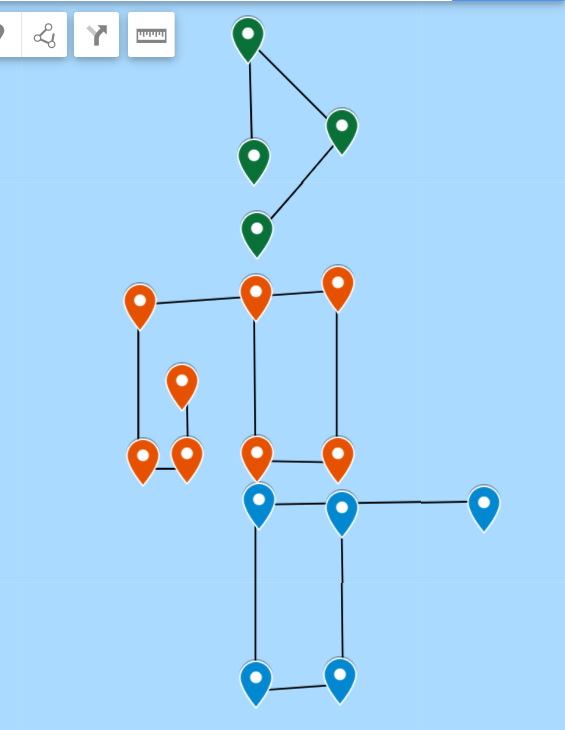

# Sous l'Océan

> Nous pensons avoir retrouvé la trace d'Eve Descartes. Nous avons reçu un fichier anonyme provenant d'un smartphone Android (probablement celui de son ravisseur). Retrouvez des informations dans son historique de position.
>
> Le flag est de la forme DGSESIEE{x} avec x une chaine de caractères

Le fichier fourni est le dump d'un téléphone. Avec une recherche rapide sur le mot `Location` (pour localisation), on trouve un tas de positions GPS.

Un extrait du fichier est:

```
Custom Location 1
		gps: Location[gps -47,1462046	30,9018186 hAcc=20 et=??? alt=0.0 vel=0.0 bear=0.0 vAcc=??? sAcc=??? bAcc=??? {Bundle[{satellites=0, maxCn0=0, meanCn0=0}]}]
		gps: Location[gps -47,1963297	30,9012294 hAcc=20 et=??? alt=0.0 vel=0.0 bear=0.0 vAcc=??? sAcc=??? bAcc=??? {Bundle[{satellites=0, maxCn0=0, meanCn0=0}]}]
		gps: Location[gps -47,1970164	30,8641039 hAcc=20 et=??? alt=0.0 vel=0.0 bear=0.0 vAcc=??? sAcc=??? bAcc=??? {Bundle[{satellites=0, maxCn0=0, meanCn0=0}]}]
		gps: Location[gps -47,1438013	30,8652827 hAcc=20 et=??? alt=0.0 vel=0.0 bear=0.0 vAcc=??? sAcc=??? bAcc=??? {Bundle[{satellites=0, maxCn0=0, meanCn0=0}]}]
		gps: Location[gps -47,1448313	30,9642508 hAcc=20 et=??? alt=0.0 vel=0.0 bear=0.0 vAcc=??? sAcc=??? bAcc=??? {Bundle[{satellites=0, maxCn0=0, meanCn0=0}]}]
	Custom Location 2
		gps: Location[gps -47,0820032	30,8641039 hAcc=20 et=??? alt=0.0 vel=0.0 bear=0.0 vAcc=??? sAcc=??? bAcc=??? {Bundle[{satellites=0, maxCn0=0, meanCn0=0}]}]
		gps: Location[gps -47,1300684	30,8643986 hAcc=20 et=??? alt=0.0 vel=0.0 bear=0.0 vAcc=??? sAcc=??? bAcc=??? {Bundle[{satellites=0, maxCn0=0, meanCn0=0}]}]
		gps: Location[gps -47,1304118	30,9006402 hAcc=20 et=??? alt=0.0 vel=0.0 bear=0.0 vAcc=??? sAcc=??? bAcc=??? {Bundle[{satellites=0, maxCn0=0, meanCn0=0}]}]
		gps: Location[gps -47,0789133	30,9003456 hAcc=20 et=??? alt=0.0 vel=0.0 bear=0.0 vAcc=??? sAcc=??? bAcc=??? {Bundle[{satellites=0, maxCn0=0, meanCn0=0}]}]
		gps: Location[gps -47,0847498	30,8131067 hAcc=20 et=??? alt=0.0 vel=0.0 bear=0.0 vAcc=??? sAcc=??? bAcc=??? {Bundle[{satellites=0, maxCn0=0, meanCn0=0}]}]
		gps: Location[gps -47,1307551	30,8148758 hAcc=20 et=??? alt=0.0 vel=0.0 bear=0.0 vAcc=??? sAcc=??? bAcc=??? {Bundle[{satellites=0, maxCn0=0, meanCn0=0}]}]
		gps: Location[gps -47,1304118	30,8340395 hAcc=20 et=??? alt=0.0 vel=0.0 bear=0.0 vAcc=??? sAcc=??? bAcc=??? {Bundle[{satellites=0, maxCn0=0, meanCn0=0}]}]
		gps: Location[gps -47,1084391	30,8319759 hAcc=20 et=??? alt=0.0 vel=0.0 bear=0.0 vAcc=??? sAcc=??? bAcc=??? {Bundle[{satellites=0, maxCn0=0, meanCn0=0}]}]
	Custom Location 3
```

En plaçant à la main dans Maps quelques coordonnées, on obtient l'image suivante dans l'océan Indien.



Ce qui semble former des formes pour l'instant non identifiées.

Sachant que les coordonnées GPS sont proches les une des autres, approximer les coordonnées GPS (sur une sphère) par un plan 2D semble raisonnable. J'effectue le tracé avec Python:

```python
import matplotlib.pyplot as plt

x = []
y = []
plt.figure()
with open("location.txt", "r") as f:
    for l in f:
        if "Custom Location" in l:
            plt.plot(x,y)
            x = []
            y = []
        else:
            print(l)
            data = l.split("[gps ")[1].split(" hAcc=")[0].replace("\t", " ").split(" ")
            x.append(float(data[0].replace(",", ".")))
            y.append(float(data[1].replace(",", ".")))
plt.plot(x,y)
plt.savefig("img.png")
```

J'obtiens alors l'image suivante, qui contient le flag.


Flag: `DGSESIEE{OC34N}`