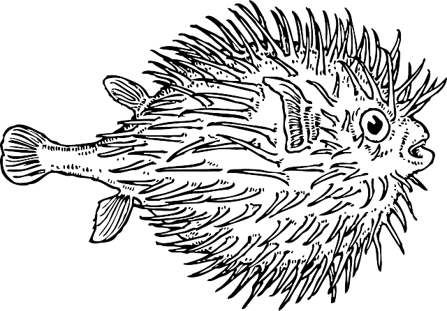

# Le Polyglotte

> Nous avons intercepté un fichier top secret émanant d'Evil Country, il est très certainement en rapport avec leur programme nucléaire. Personne n'arrive à lire son contenu.
>
> Pouvez-vous le faire pour nous ? Une archive était dans le même dossier, elle peut vous servir
>
> Le flag est de la forme : DGSESIEE{x} avec x un hash que vous trouverez

Inclus avec le challenge se trouve un fichier PDF et une archive ZIP protégée par mot de passe.

Le PDF ouvert donne le rendu suivant:


## Exploration

Comme tout challenge Forensics, je vérifie le type des fichiers avec `file`, les chaînes de caractères avec `strings` et les fichiers inclus avec `binwalk`.

Le PDF contient une mine d'informations. Le début du fichier est ce qui suit, le fin est par contre des bytes non déchiffrables.

```
<%PDF-1.2
<html>
<!DOCTYPE html>
<html>
	<head>
		<title>Flag</title>
		<meta charset="utf-8">
	</head>
	<body>
	<script>var flag = [91,48,93,97,97,57,51,56,97,49,54];</script>
<!--

2 0 obj
<< /Pages 4 0 R >>
endobj

3 0 obj
<< /Kids [5 0 R] /Type /Pages /Count 1 >>
endobj

4 0 obj
<< /Kids [6 0 R] /Type /Pages /Count 1 >>
endobj

5 0 obj
<< /Parent 3 0 R /MediaBox [0 0 612 792]
/Resources << /Font << /F1 <<
/BaseFont /Arial /Subtype /Type1 /Type /Font>>
>> >> /Contents 7 0 R /Type /Page >>
endobj

6 0 obj
<< /Parent 4 0 R /MediaBox [0 0 612 792]
/Resources << /Font << /F1 <<
/BaseFont /Times /Subtype /Type1 /Type /Font>>
>> >> /Contents [9 0 R 8 0 R] /Type /Page >>
endobj

7 0 obj
<< /Length 50 >>
stream
BT
 /F1 50 Tf
 10 400 Td
 0 0 0 rg
 <5b 31 5d 34 64 38 36 32 64 35 61> Tj
ET
endstream
endobj

8 0 obj
<< /Length 50 >>
stream
BT
 /F1 70 Tf
 150 700 Td
 255 255 255 rg
 (Top Secret) Tj
ET
endstream
endobj

9 0 obj
<< /Length 50 /MediaBox [0 0 20 20]
>>
stream
BT
 /F1 9 Tf
 30 600 Td
 1 0 0 700 0 0 Tm
 0 0 0 rg
 <43 65 20 64 6f 63 75 6d 65 6e 74 20 63 6f 6e 63 65 72 6e 65 20 6c 20 6f 70 65 72 61 74 69 6f 6e 20 73 6f 6c 65 69 6c 20 61 74 6f 6d 69 71 75 65 2e 0a 43 65 74 74 65 20 6f 70 65 72 61 74 69 6f 6e 20 65 73 74 20 73 74 72 69 63 74 65 6d 65 6e 74 20 63 6f 6e 66 69 64 65 6e 74 69 65 6c 6c 65 20 65 74 20 6e 65 20 64 6f 69 74 20 65 6e 20 61 75 63 75 6e 20 63 61 73 20 ea 74 72 65 20 64 65 76 6f 69 6c 65 65 2e 20 0a 4c 65 73 20 69 6e 66 6f 72 6d 61 74 69 6f 6e 73 20 73 75 72 20 6c 20 6f 70 65 72 61 74 69 6f 6e 20 73 6f 6e 74 20 64 69 73 73 65 6d 69 6e e9 65 73 20 64 61 6e 73 20 63 65 20 66 69 63 68 69 65 72 2e 0a 43 68 61 71 75 65 20 70 61 72 74 69 65 20 64 65 20 6c 20 69 6e 66 6f 72 6d 61 74 69 6f 6e 20 65 73 74 20 69 64 65 6e 74 69 66 69 65 65 20 70 61 72 20 75 6e 20 6e 6f 6d 62 72 65 20 70 61 72 20 65 78 20 3a 20 0a 5b 30 5d 61 65 37 62 63 61 38 65 20 63 6f 72 72 65 73 70 6f 6e 64 20 61 20 6c 61 20 70 72 65 6d 69 e8 72 65 20 70 61 72 74 69 65 20 64 65 20 6c 20 69 6e 66 6f 72 6d 61 74 69 6f 6e 20 71 75 20 69 6c 20 66 61 75 74 20 63 6f 6e 63 61 74 65 6e 65 72 20 61 75 20 72 65 73 74 65 2e> Tj
ET
endstream
endobj

11 0 obj
<< /Length 50 >>
stream
BT
 /F1 70 Tf
 150 700 Td
 255 255 255 rg
 (Top Secret) Tj
ET
endstream
endobj


trailer<</Root 2 0 R>>
<</Root<</Pages 3 0 R>>>>
--!>
		<script>for(i=0;i<flag.length;i++){flag[i] = flag[i]+4} alert(String.fromCharCode.apply(String, flag));</script>
	<body>
</html>
<!--
```

On voit une partie HTML avec un script javascript qui définit un flag. En utilisant [CyberChef](https://gchq.github.io/CyberChef/), on découvre la chaîne de caractères `[0]aa938a16`.

On remarque aussi une autre suite de chiffres en héxadécimal, qui se traduit par `[1]4d862d5a`.

Enfin, on voit une grande série de chiffres, qui se traduit par:

> Ce document concerne l operation soleil atomique.
>
> Cette operation est strictement confidentielle et ne doit en aucun cas être devoilee. 
>
> Les informations sur l operation sont disseminées dans ce fichier.
>
> Chaque partie de l information est identifiee par un nombre par ex : 
> [0]ae7bca8e correspond a la première partie de l information qu il faut concatener au reste.

On a donc déjà trouvé 2 parties du flag.

## Ouvrir le zip

Le reste du PDF ne semble pas donner plus d'informations. Je décide donc d'ouvrir le ZIP en brute forçant le mot de passe. J'utilise [JohnTheRipper](https://www.openwall.com/john/) avec la liste [rockyou.txt](https://github.com/brannondorsey/naive-hashcat/releases/download/data/rockyou.txt) pour ouvrir le ZIP avec les commandes suivantes:

```bash
zip2john secrets.zip > secret_john
john --wordlist=rockyou.txt secret_john
```

J'obtiens alors le mot de passe `finenuke`, ce qui me permet d'ouvrir le ZIP.

A l'intérieur, le fichier texte suivant:

```
Ange Albertini
key='\xce]`^+5w#\x96\xbbsa\x14\xa7\x0ei'
iv='\xc4\xa7\x1e\xa6\xc7\xe0\xfc\x82'
[3]4037402d4
```

Et l'image suivante:


On a trouvé un bout de flag, une clé, un iv. Mais il manque le morceau 2.

## Dernier morceau

Avec des recherches sur Google en combinant le titre du challenge et Ange Albertini, je tombe sur [cette présentation](https://fahrplan.events.ccc.de/congress/2014/Fahrplan/system/attachments/2562/original/Funky_File_Formats.pdf).

J'obtiens toutes les informations nécessaires sur les fichiers polyglottes. Effectivement, le fichier est à la fois un PDF, une page web, contient des données cachées...

La seule chose non testée et qui semble intéressante et d'encrypter ou décrypter le fichier, surtout qu'on a un IV et une clé.

J'ai mis un peu de temps à trouver, mais finalement le hint m'a aidé à trouver le [cipher Blowfish](https://en.wikipedia.org/wiki/Blowfish_(cipher)).

Encore une fois, CyberChef permet d'encrypter le fichier, et on obtient une image !


En analysant le fichier avec les techniques usuelles, on détecte un exécutable inclus dans l'image. On l'extrait avec `binwalk`, puis on l'analyse avec [Ghidra](https://ghidra-sre.org/).

Le code source est le suivant:

```c
undefined8 main(void)
{
  size_t sVar1;
  byte *__dest;
  long in_FS_OFFSET;
  char local_28 [24];
  long local_10;
  
  local_10 = *(long *)(in_FS_OFFSET + 0x28);
  puts("Operation Soleil Atomique");
  printf("Entrez le mot de passe : ");
  fgets(local_28,0x10,stdin);
  sVar1 = strlen(local_28);
  __dest = (byte *)malloc(sVar1 + 1);
  strcpy((char *)__dest,local_28);
  checkpassword(__dest);
  if (((((((__dest[1] ^ *__dest) == 0x69) && ((__dest[2] ^ __dest[1]) == 0x6f)) &&
        ((__dest[3] ^ __dest[2]) == 0x38)) &&
       (((__dest[4] ^ __dest[3]) == 0x56 && ((__dest[5] ^ __dest[4]) == 0x50)))) &&
      (((__dest[6] ^ __dest[5]) == 0x57 &&
       (((__dest[7] ^ __dest[6]) == 0x50 && ((__dest[8] ^ __dest[7]) == 0x56)))))) &&
     (((__dest[9] ^ __dest[8]) == 6 && (__dest[9] == 0x34)))) {
    puts("Bravo");
                    /* WARNING: Subroutine does not return */
    exit(0);
  }
  puts("Mauvais mot de passe");
  if (local_10 != *(long *)(in_FS_OFFSET + 0x28)) {
                    /* WARNING: Subroutine does not return */
    __stack_chk_fail();
  }
  return 0;
}
```

Le programme demande un mot de passe à l'utilisateur, effectue une transformation complexe pour vérifier le mot de passe, et finalement dit si le mot de passe est bon ou mauvais.

Plutôt que de reverse engineer la transformation, j'utilise [angr](https://angr.io/) qui permet de faire une exécution symbolique afin de trouver le bon mot de passe.

```python
#!/usr/bin/env python3
import angr, time, claripy

BINARY='./evil'
OUTFILE='out'
FLAG_LENGTH = 0x10

GOOD = b"Bravo"
BAD = b"Mauvais"

t=time.time()
proj = angr.Project(BINARY, auto_load_libs=False)
print(proj.arch)
print(proj.filename)
print("Entry: 0x%x" % proj.entry)

password = claripy.BVS("flag", 8*FLAG_LENGTH)
state = proj.factory.entry_state(args=[BINARY, OUTFILE], stdin=password)
simgr = proj.factory.simulation_manager(state)
simgr.explore(find=lambda s: GOOD in s.posix.dumps(1), avoid=lambda s: BAD in s.posix.dumps(1))

print(simgr.found[0].posix.dumps(0))
print(time.time() - t, "seconds")
```

En 4s, je trouve la partie manquante `[2]e3c4d24`.

Flag: `DGSESIEE{aa938a164d862d5ae3c4d244037402d4}`