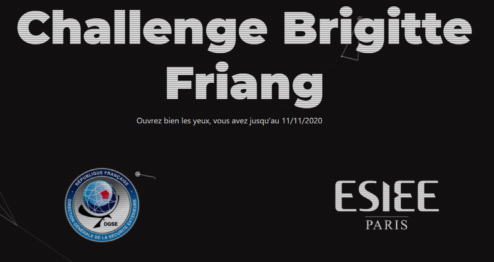
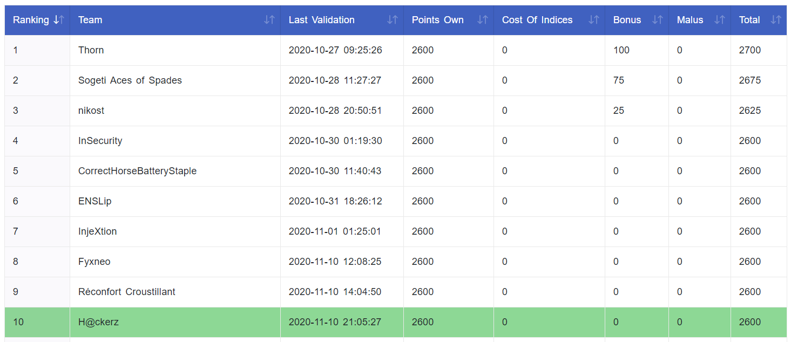
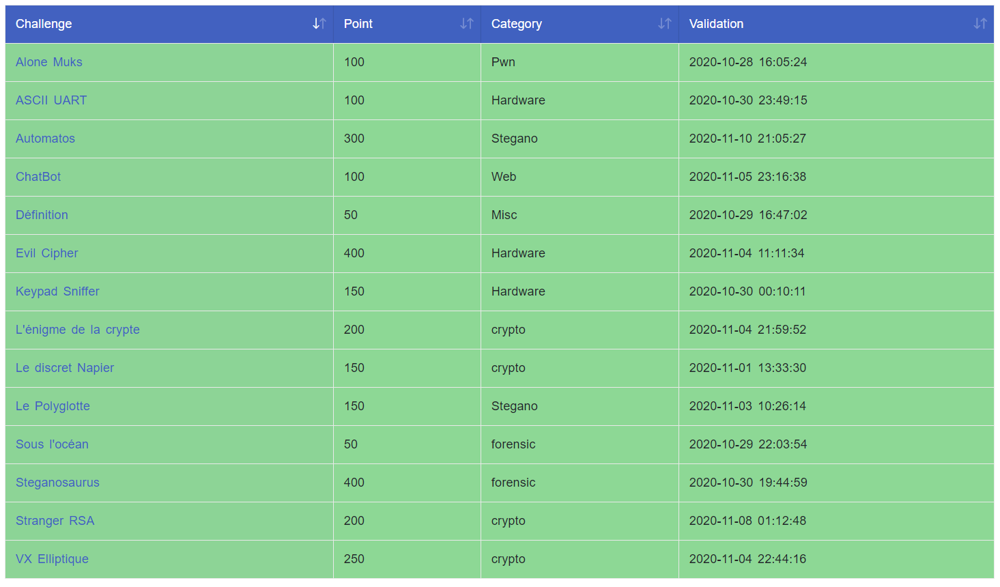

# Brigitte Friang

Challenge [Brigitte Friang](https://www.defense.gouv.fr/dgse/tout-le-site/operation-brigitte-friang-prets-pour-relever-le-defi) organisé par la DGSE (Direction Générale de la Sécurité Extérieure) et l'ESIEE Paris. 

## Présentation

Le challenge propose des épreuves pour tous niveaux, de lycéen à expert, sur différents domaines:
- cryptographie
- web
- algorithmique
- stéganographie
- électronique...

Le lien du challenge: https://www.challengecybersec.fr/

## Équipe

Nous sommes l'équipe H@ckerz, composée de deux membres:
- apoirrier (alexandre.poirrier@polytechnique.org)
- gsol (guillaume.solignac@epfl.ch)

Nous sommes arrivés 10e de la compétition avec un total de 2600 points, en finissant toutes les épreuves.

## Challenge

Le challenge est décomposé en 3 parties:
- [Échauffement](echauffement.md): une première partie qui permet d'accéder au chat;
- Chat: composé de quatre épreuves distinctes en [cryptographie](crypto.md), web, [algorithmique](algo.md) et forensics. Il suffit d'en résoudre une seule pour atteindre l'étape suivante;
- la plateforme de CTF en elle-même. Une fois la plateforme atteinte, on peut enregistrer son équipe et gagner des points en réussissant les différents challenges.

Les challenges de la plateforme de CTF sont les suivants:

| Challenge | Points | Catégorie |
|:-:|:-:|:-:|
| [Alone Musk](AloneMusk.md) | 100 | Pwn |
| [ASCII UART](ASCII_UART.md) | 100 | Hardware |
| [Automatos](Automatos.md) | 300 | Stegano |
| ChatBot | 100 | Web |
| Définition | 50 | Misc |
| Evil cipher | 400 | Hardware |
| Keypad Sniffer | 150 | Hardware |
| [L'énigme de la crypte](Crypte.md) | 200 | Crypto |
| Le discret Napier | 150 | Crypto |
| Le Polyglotte | 150 | Stegano |
| Sous l'océan | 50 | Forensics |
| Steganosaurus | 400 | Forensics |
| Stranger RSA | 200 | Crypto |
| VX Elliptique | 250 | Crypto |

