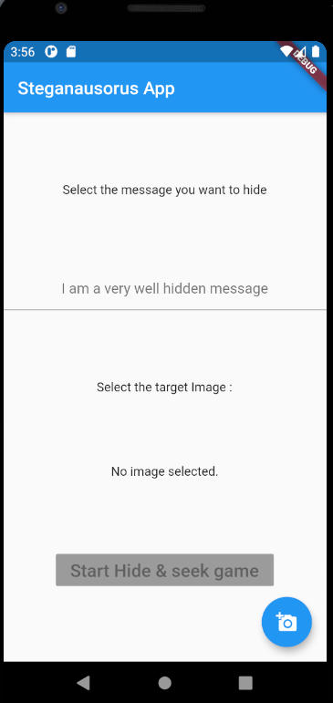
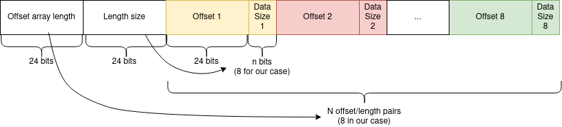

# Steganosaurus

>Nos agents ont trouvé dans le camion de livraison une clef USB. Nous vous transférons le filesystem de cette dernière et espérons que votre grande capacité de réflexion pemettra de révéler les secrets les plus sombres d'Evil Country !
> 
> Le flag est de la forme DGSEESIEE{x} avec x une chaine de caractères. (Attention au DGEESIEE, une erreur de typo s'est glissée dans le flag)

On nous fournit également un fichier, `message`.

## Découverte

`file` nous indique que le fichier `message` est une image msdos. On monte donc celle-ci (dans une machine virtuelle pour d'évidentes raisons de sécurité) à l'aide de la commande `sudo mount -t msdos -o loop message /mnt`.

Le contenu de l'archive est le suivant

```
message/
├── readme
├── stegan~1.apk
└── trash~~1/
    ├── files/
    |   └── flag.png
    └── info/
        └── flagpn~1.tra
```

`readme` contient le message suivant :

> Bonjour evilcollegue !
> Je te laisse ici une note d'avancement sur mes travaux !
> J'ai réussi à implémenter complétement l'algorithme que j'avais présenté au QG au sein d'une application.
> Je te joins également discrétement mes premiers résultats avec de vraies données sensibles ! Ils sont bons pour la corbeille mais ça n'est que le début !
> Je t'avertis, l'application souffre d'un serieux defaut de performance ! je m'en occuperai plus tard.
contente-toi de valider les résultats.
> Merci d'avance
>
> For the worst,
> 
> QASKAB

A partir de là, on se doute que l'apk contient l'application qui a servi à cacher les "données sensibles" dans la fichier `flag.png`.

## L'algo de stégano

Comme on est curieux, on ouvre l'apk grâce à l'émulateur d'Android Studio.



L'application propose donc de cacher un message dans une image. On va maintenant explorer l'apk pour savoir l'algorithme de stégano utilisé.

Pour cela, on utilise [Apktook](https://ibotpeaches.github.io/Apktool/), qui décompresse l'apk.

En fouillant dans les fichiers, on trouve des références à [flutter](https://flutter.dev/), qui a sûrement servi à développer l'application. 

[Ce post](https://medium.com/@rondalal54/reverse-engineering-flutter-apps-5d620bb105c0) explique comment désassembler du Flutter, en l'occurence, on utilise `strings` pour extraire le code de `kernel_blob.bin`... `strings kernel_blob.bin > ../../../code_kernel.dart`.

On obtient un fichier de 465 730 lignes qui contiennent globalement du code lisible. Pour trouver ce qui nous intéresse, on cherche la chaîne de caractère `Start Hide` qui correspond au bouton de l'application qui lance la stégano. 

On obtient (après *lintage*) cette fonction à comprendre :

```dart
Future<void> steggapp(File pImage, String pMessage) async {
  // Declaration
  String ImagePath;
  String binaryStringmessage;
  String binaryStringImage;
  String binaryStringData;
  Directory tempDir = await getTemporaryDirectory();
  tempPath = tempDir.path;
  print(tempPath);
  List<List<int>> DataList = List<List<int>>();
  // Initialisation
  // get the two binary string from parameters
  binaryStringmessage = MessageToBinaryString(pMessage);
  ImagePath = pImage.path;
  File image = new File(ImagePath);
  var decodedImage = await decodeImageFromList(image.readAsBytesSync());
  ByteData imgbyte = await decodedImage.toByteData();
  var imgintlist = imgbyte.buffer.asUint8List();
  A.Image aimage = A.Image.fromBytes(decodedImage.width, decodedImage.height,
                                     imgintlist, format
                                     : A.Format.rgba);
  A.Image resisedimage = A.copyResize(aimage, width : 1000);
  String RRGGBBString;
  String RedBinString;
  String BlueBinString;
  String GreenBinString;
  String PixelString;
  String MegaString;
  MegaString = "";
  for (int i = 0; i < resisedimage.length; i++) {
    RRGGBBString =
        resisedimage[i].toRadixString(2).padLeft(32, '0').substring(8);
    PixelString = RRGGBBString.substring(16, 24) +
                  RRGGBBString.substring(8, 16) + RRGGBBString.substring(0, 8);
    MegaString += PixelString;
  }
  int messaggelength = 0;
  String messagetohide = binaryStringmessage;
  String substringtoFind;
  substringtoFind = messagetohide.substring(0, 1);
  String Stringbuilttest = "";
  var offsetarray = new List();
  int offsettostore;
  int lengthtostore;
  int offset;
  String Megastringtosearch =
      MegaString.substring((MegaString.length / 4).round());
  // print("performing data calculation");
  while (messaggelength < binaryStringmessage.length) {
    offsettostore = Megastringtosearch.indexOf(substringtoFind);
    // print(Megastringtosearch.substring(offsettostore,offsettostore+substringtoFind.length));
    while (offsettostore != -1 &&
           substringtoFind.length <= messagetohide.length - 1) {
      lengthtostore = substringtoFind.length;
      offset = offsettostore;
      substringtoFind = messagetohide.substring(0, substringtoFind.length + 1);
      offsettostore = Megastringtosearch.indexOf(substringtoFind);
    }
    if (substringtoFind.length == messagetohide.length) {
      int lastoffsettostore = Megastringtosearch.indexOf(substringtoFind);
      if (lastoffsettostore == -1) {
        offsetarray.add([ offset, lengthtostore ]);
        offsetarray.add([ Megastringtosearch.indexOf(substringtoFind[-1]), 1 ]);
        Stringbuilttest += Megastringtosearch.substring(
            Megastringtosearch.indexOf(substringtoFind[-1]),
            (Megastringtosearch.indexOf(substringtoFind[-1]) + lengthtostore));
      } else {
        offsetarray.add([
          Megastringtosearch.indexOf(substringtoFind), substringtoFind.length
        ]);
        var lastitem = offsetarray.last;
        Stringbuilttest += Megastringtosearch.substring(
            Megastringtosearch.indexOf(substringtoFind),
            (offsettostore + substringtoFind.length));
      }
      messaggelength += substringtoFind.length;
    } else {
      messagetohide = messagetohide.substring(substringtoFind.length - 1);
      messaggelength += substringtoFind.length;
      Stringbuilttest +=
          Megastringtosearch.substring(offset, (offset + lengthtostore));
      offsetarray.add([ offset, lengthtostore ]);
      offsettostore = 0;
      lengthtostore = 1;
      offset = 0;
      substringtoFind = messagetohide.substring(0, 1);
    }
    int offsetdatasize = resisedimage.length * 8 * 3;
    int lenghtdatasize = binaryStringmessage.length;
    int lenghtsizebit = lenghtdatasize.toRadixString(2).length;
    ;
    int datasizebit = offsetdatasize.toRadixString(2).length;
    String stringtowrite = "";
    stringtowrite +=
        offsetarray.length.toRadixString(2).padLeft(datasizebit, '0') +
        lenghtsizebit.toRadixString(2).padLeft(datasizebit, '0');
    offsetarray.forEach((listofdata) {
      stringtowrite +=
          listofdata[0].toRadixString(2).padLeft(datasizebit, '0') +
          listofdata[1].toRadixString(2).padLeft(lenghtsizebit, '0');
    });
    int lengthofmodifiedstring = stringtowrite.length;
    List<int> pixelvalue = new List();
    int compteur = 0;
    int missingsize;
    String finaleImageString;
    finaleImageString =
        stringtowrite + MegaString.substring(stringtowrite.length);
    int limit;
    limit = stringtowrite.length;
    while (compteur < limit) {
      try {
        pixelvalue.add(int.parse(stringtowrite.substring(0, 8), radix : 2));
        stringtowrite = stringtowrite.substring(8);
        compteur += 8;
      }
      on RangeError {
        missingsize = 8 - stringtowrite.length;
        pixelvalue.add(int.parse(
            stringtowrite + finaleImageString.substring(
                                compteur + stringtowrite.length,
                                compteur + stringtowrite.length + missingsize),
            radix : 2));
        compteur += 8;
      }
    }
    A.Image imagetosave;
    int compteurpixel;
    imagetosave = resisedimage.clone();
    compteurpixel = 0;
    List<int> lastpixellist = new List();
    for (int iz = 0; iz < pixelvalue.length; iz += 3) {
      try {
        var testpixel = pixelvalue[iz + 2];
        imagetosave.data[compteurpixel] =
            A.getColor(pixelvalue[iz], pixelvalue[iz + 1], pixelvalue[iz + 2]);
        compteurpixel += 1;
      }
      on RangeError {
        pixelvalue = pixelvalue.sublist(iz);
        var basixpixellist = imagetosave.data[compteurpixel]
                                 .toRadixString(2)
                                 .padLeft(32, '0')
                                 .substring(8);
        int RedChannelint =
            int.parse(basixpixellist.substring(16, 24), radix : 2);
        int GreenChannelint =
            int.parse(basixpixellist.substring(16, 24), radix : 2);
        int BlueChannelint =
            int.parse(basixpixellist.substring(16, 24), radix : 2);
        List<int> originalpixelvalue =
            [ RedChannelint, GreenChannelint, BlueChannelint ];
        for (int ze = 0; ze <= 2; ze++) {
          if (ze > pixelvalue.length - 1) {
            lastpixellist.add(originalpixelvalue[ze]);
          } else {
            lastpixellist.add(pixelvalue[ze]);
          }
        }
        imagetosave.data[compteurpixel] =
            A.getColor(lastpixellist[0], lastpixellist[1], lastpixellist[2]);
      }
    }
    Directory documentD = await getExternalStorageDirectory();
    new File(documentD.path + '/thumbnail-test.png')
        ..writeAsBytesSync(A.encodePng(imagetosave));
    // binaryStringImage =ImageToBinary(pImage);
```

On comprend que l'algo fonctionne comme ceci :

- Il interprète tout en binaire, la string à cacher et l'image
- Il cherche la plus longue substring du message présente dans l'image (à partir du quart de l'image), et stocke son offset et sa longueur
- Il réitère cette étape à partir de la suite du message, et ce jusqu'à ce que tout le message soit ainsi encodé.
- Il écrit la liste des (offsets, longueurs) dans les premiers pixels de l'image.

En résumé, l'information est encodée sous cette forme :



On écrit un script pour extraire l'information :

```python
from PIL import Image
im = Image.open('flag.png')
im = im.convert('RGB')
pixels = list(im.getdata())
offsetdatasize = len(pixels) * 8 * 3 
datasizebit = len("{:b}".format(offsetdatasize)) #La taille de l'encodage de l'offset est déterminée par le nombre de bits dont on a besoin pour écrire le nombre total de pixels, ici c'est 24 bits.

region_search = int(offsetdatasize / 4) # La région de recherche des substrings commence ici selon le code
offsets_tup = [ #J'ai récupéré les offsets et les longueurs à la main en regardant la valeur des pixels
    [3, 149, 223],
    [63, 155, 98],
    [15, 103, 162],
    [0, 1, 158],
    [15, 222, 79],
    [30, 50, 28],
    [64, 4, 10],
    [0, 70, 220]]
lengths = [19 , 24, 26, 18, 22, 24, 22, 13]
offsets = []
for o in offsets_tup:
    offsets.append((o[0] << 16) + (o[1] << 8) + o[2] + region_search)

binary_string = ""
for i in range(len(offsets)):
    pixi = int(offsets[i] // 24) #Ici c'est un souci de représentation des pixels, on récupère le pixel qui correspond à l'offset donné en bits.
    pixo = offsets[i] % 24
    s = ""
    for p in pixels[pixi:pixi + 5]:
        for j in range(3):
            s += "{:08b}".format(p[j])
    binary_string += s[pixo:pixo+lengths[i]] #On récupère une string de longueur indiquée dans l'encodage

flag = ""
for i in range(len(tot)//8): #On convertit tout ça en utf-8
    flag += (chr(int(binary_string[i * 8: (i+1)*8], 2)))
print(flag)
```

Et on obtient le flag souhaité : `DGSEESIEE{FL4GISH3R3}` !