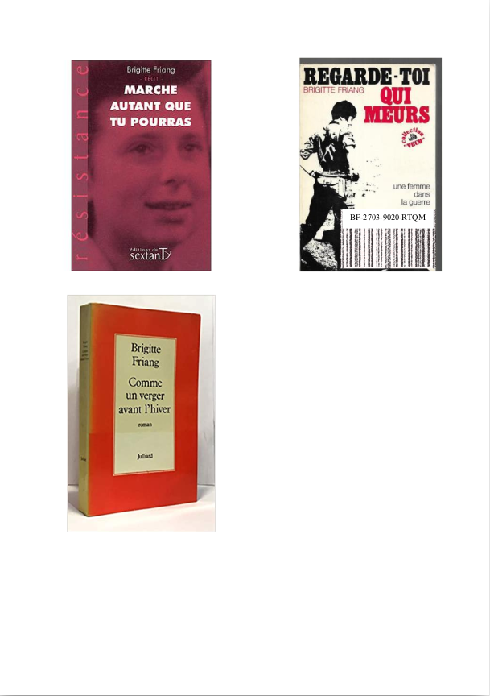

# VX Elliptique

> Nous avons intercepté 2 fichiers (VX_elliptique.pdf et livres_Friang.pdf) émis par un sous-marin d'Evil Gouv. La référence à Brigitte Friang ne peut être une coïncidence. Nous savons de source sure qu'Eve Descartes a été enlevée par Evil Gouv et est retenue dans un de leurs sous-marins dans l'océan Atlantique. Ce doit être elle qui a envoyé ces fichiers. Grâce à une de ses crises mathématiques, elle aura sûrement caché l'identification du sous-marin dans ces fichiers. Votre mission est de retrouver l'identification du sous-marin.
>
> Le flag est de la forme DGSESIEE{x} avec x le code d'identification

On nous fournit deux fichiers, `VX_elliptique.pdf` et `livres_Friang.pdf`.

Le premier contient des intructions, le deuxième étant protégé par un mot de passe.

## Une courbe elliptique

On nous donne :
- une courbe elliptique, `y ^ 2 = x ^ 3 + A * x ^ 2 + x [n]`,
- un point `P(x, y)` sur cette courbe, avec 
  - `x = 54387532345611522562080964454373961410727797296305781726528152669705763479709` 
  - `y = 14361142164866602439359111189873751719750924094051390005776268461061669568849`

- deux nombres `y1` et `y2` tels que :
  - `y1 = 43534902453791495272426381314470202206884068238768892013952523542894895251100`
  - `y2 = 30324056046686065827439799532301040739788176334375034006985657438931650257514`
  - Il existe `k1` (resp. `k2`) entier naturel tel que `[k1]P` (resp. `[k2]P`) ait pour coordonnées (`x1`, `y1`) (resp. (`x2`, `y2`))

> Le mot de passe du fichier `livres_Friang.pdf` est `z` tel que `z ≡ x1 [n]` et `z ≡ x2 [(n-1)/2]`.

## Résoudre l'énigme

La première étape est donc de trouver `x1` et `x2`. Pour ça, on se sert de [SageMath](https://www.sagemath.org/fr/) qui dispose de nombreuses constructions pour la cryptographie.

```python
n = 57896044618658097711785492504343953926634992332820282019728792003956564819949
C = Integers(n) #Le corps des Z/nZ. (n est premier)

x = C(54387532345611522562080964454373961410727797296305781726528152669705763479709)
y = C(14361142164866602439359111189873751719750924094051390005776268461061669568849)
y1 = 43534902453791495272426381314470202206884068238768892013952523542894895251100
y2 = 30324056046686065827439799532301040739788176334375034006985657438931650257514

A = (y ^ 2 - x ^ 3 - x) / (x ^ 2) # On trouve A simplement en utilisant x, y.

E = EllipticCurve(C, [0, A, 0, 1, 0]) #On définit la courbe sur Z/nZ avec son polynôme.

pol = E.defining_polynomial() #On récupère le polynôme de la courbe

x1s = pol(y=y1,z=1).univariate_polynomial().roots(multiplicities=False) # On résout le polynôme pour y1
print(x1s)

x2s = pol(y=y2,z=1).univariate_polynomial().roots(multiplicities=False) # On résout le polynôme pour y2
print(x2s)
```

On obtient 3 candidats pour `x1` et 1 candidat pour `x2`. On obtient les `z` possibles grâce à un simple [CRT](https://fr.wikipedia.org/wiki/Th%C3%A9or%C3%A8me_des_restes_chinois).

```python
x2 = x2s[0]
for x1 in x1s:
    z = CRT(int(x1), int(x2), int(n), int((n-1)/2))
    print(z)
```

Ce qui nous donne les trois mots de passe possibles :

> z1: 1626912004825687681266928944940137740110044614947501502667974700957265876831665835249437745227202257555252761324145945972681589648893511804029315415851794

> z2: 298866324658067043152535979487281689346418895898703530005178331141609468368515196383762924558049325643319211125756093104393630525207165166469723912137964

> z3: 669594744434241509260428824541316709656639804114134854927746139613649946258056910180935366203703863781306641125198724424226805412500527449207424152005314

Le premier nous permet d'ouvrir le fichier `livres_Friang.pdf`, qui ressemble à ceci :



En cherchant un peu, le code situé au dessus du code barre est le seul texte dans ce pdf. On teste le code DGSESIEE{BF-2703-9020-RTQM}, ce qui nous permet de valider le challenge !