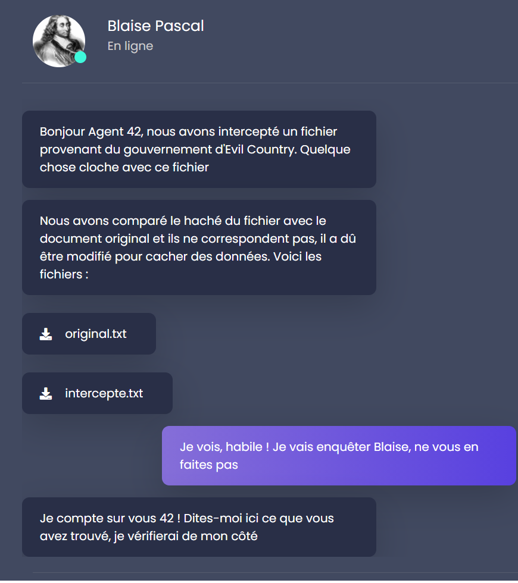
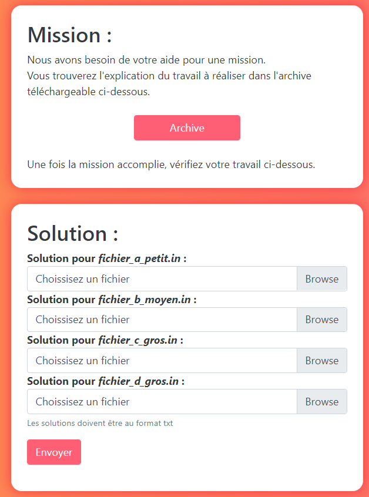
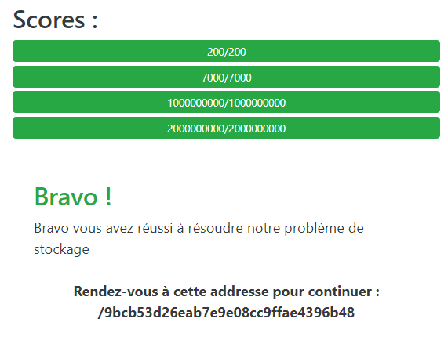
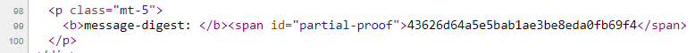
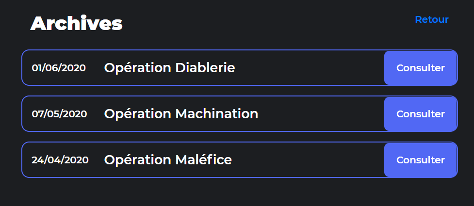
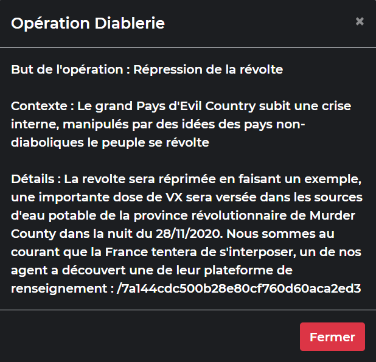

# Blaise Pascal - challenge d'algorithmique

Le challenge d'algorithmique est introduit par Blaise Pascal.



## Différence de fichiers

En utilisant `diff` afin de comparer les deux fichiers, nous remarquons que `intercepte.txt` contient plus de caractères que `original.txt`.

Le script Python suivant extrait les caractères supplémentaires:

```python
with open("original.txt", "r") as f:
    original = f.read()
with open("intercepte.txt", "r") as f:
    intercepte = f.read()

output = ""
i,j = 0,0
while j < len(intercepte):
    if original[i] == intercepte[j]:
        i += 1
        j += 1
    else:
        output += intercepte[j]
        j += 1

with open("output.txt", "w") as f:
    f.write(output)
```

Le fichier de sortie contient une chaîne de caractère débutant par `base64:`.

Une fois de plus, nous convertissons cette chaîne de caractères en base 64 en utilisant CyberChef. Nous obtenons l'image suivante:


Peut être le plus dur de tout le challenge algo est de deviner qu'il faut mettre en minuscules l'url trouvée sur cette image...

## Résoudre le problème du sac à dos

Une fois sur le site donné par l'image, on obtient un challenge d'algorithmique classique.



L'archive contient un PDF qui contient les instructions, ainsi que les 4 inputs dont il faut trouver les outputs, et un exemple.

Le fichier complet est [ici](resources/IMPORTANT.pdf).

En résumé, le challenge est comme suit: chaque fichier d'input contient une liste de N objets de différentes valeurs, ainsi qu'un entier M qui est la valeur à atteindre. Le but est de donner une liste d'objets à stocker dans l'entrepôt de manière à maximiser la valeur stockée sans qu'elle ne dépasse M. Chaque objet peut n'être stocké qu'au plus une fois.

Ce problème est un problème d'algorithmique connu. Il s'agit d'une variante du [problème du sac à dos](https://fr.wikipedia.org/wiki/Probl%C3%A8me_du_sac_%C3%A0_dos#Probl%C3%A8me_de_la_somme_de_sous-ensembles_ou_du_subset_sum).

Malheureusement, ce problème a une complexité trop grande dans le cas général: ou bien exponentiel (en `O(2^(N/2))`), ou bien en `O(MN)` avec de la programmation dynamique.

Sachant que dans le grand testset nous avons N = 3000 et M = 2000000000, un algorithme général ne va pas convenir, et on doit trouver un moyen de résoudre le problème pour ce testset particulier.

La solution que j'ai trouvée est la suivante:
1) je trouve une approximation de la solution optimale avec un algorithme glouton. J'obtiens alors une valeur `W` et une partition de mes objets (sélectionnés ou non).
2) puis j'essaie de trouver un objet sélectionné de valeur `x` et un objet non sélectionné de valeur `y` tel que `y - x = M - W`.

Cela fonctionne sur les deux plus gros testsets, et a donc une complexité linéaire `O(N)`.

Pour les deux plus petits testsets, j'utilise une programmation dynamique qui est de complexité acceptable pour la taille des testsets.

L'algorithme greedy:

```python
import numpy as np

s = input()
m = int(s.split(" ")[0])
n = int(s.split(" ")[1])
s = input()

objects = []
for c in s.split(" "):
    objects.append(int(c))

taken = []
not_taken = []

W = 0
for i in range(n):
    if W + objects[i] > m:
        not_taken.append(i)
    else:
        taken.append(i)
        W += objects[i]

ok = False
for a in not_taken:
    for j,b in enumerate(taken):
        if objects[a] - objects[b] == m - W:
            taken[j] = a
            ok = True
            break
    if ok:
        break

with open("sol_c.txt", "w") as f:
    f.write("{}\n".format(len(taken)))
    for a in taken:
        f.write("{} ".format(a))
```

L'algorithme programmation dynamique:

```python
import numpy as np

s = input()
m = int(s.split(" ")[0])
n = int(s.split(" ")[1])
s = input()

objects = []
for c in s.split(" "):
    objects.append(int(c))


value = {}
indices = {}

def compute(i,j):
    global value
    global indices
    if i==0 or j == 0:
        value[(i,j)] = 0
        indices[(i,j)] = []
        return
    if (i-1,j) not in value:
        compute(i-1,j)
    if objects[i-1] > j:
        value[(i,j)] = value[(i-1,j)]
        indices[(i,j)] = indices[(i-1,j)].copy()
    else:
        if (i-1,j-objects[i-1]) not in value:
            compute(i-1,j-objects[i-1])
        if value[(i-1,j)] > value[(i-1,j-objects[i-1])] + objects[i-1]:
            indices[(i,j)] = indices[(i-1,j)].copy()
            value[(i,j)] = value[(i-1,j)]
        else:
            indices[(i,j)] = indices[(i-1,j-objects[i-1])].copy()
            indices[(i,j)].append(i-1)
            value[(i,j)] = value[(i-1,j-objects[i-1])] + objects[i-1]

compute(n, m)

with open("sol_b.out", "w") as f:
    f.write("{}\n".format(len(indices[(n,m)])))
    for i in indices[(n,m)]:
        f.write(" ".format(i))
```

Puis on upload les solutions, ce qui nous mène à l'adresse suivante.



## Automatiser des requêtes GET

Le site web suivant est un blog qui contient de nombreux posts.


Comme décrit sur le site, la mission est de récupérer tous les posts, récupérer leur hash, concaténer le tout, le hasher et l'entrer sur le site. 

Sur le docker à droite se trouvent des exemples de posts. En cliquant sur l'un d'eux, on découvre leur URL de la forme https://challengecybersec.fr/9bcb53d26eab7e9e08cc9ffae4396b48/blog/post/X avec X le numéro du post.

On décrouvre rapidement qu'il y a 1000 posts. De plus, chaque post contient un hash:



L'idée est donc d'automatiser le processus de récupération des hashes pour construire la solution. Le script python suivant effectue le travail:

```python
import requests

url = "https://www.challengecybersec.fr/9bcb53d26eab7e9e08cc9ffae4396b48/blog/post/{}"

def send(i, name):
    r = requests.get(url.format(i))
    if r.status_code != 200:
        print("Status {} for request {}".format(r.status_code, i))
        return False
    h = r.text.split('<span id="partial-proof">')[1].split("</span>")[0]
    print(i, h)
    with open('algo3_{}.txt'.format(name), 'a') as f:
        f.write("{} {}\n".format(i, h))
    return True

def send100(n0):
    for i in range(n0,n0+100):
        send(i, str(n0))

from multiprocessing import Pool
from Crypto.Hash import MD5

if __name__ == "__main__":
    #p = Pool(10)
    #p.map(send100, [1 + 100*j for j in range(10)])
    
    m = MD5.new()
    for i in range(1,1000,100):
        with open('algo3_{}.txt'.format(i), 'r') as f:
            for l in f:
                m.update(l.split(' ')[1].strip().encode())
    print(m.hexdigest())
```

Finalement, on obtient l'URL du site suivant `/1410e53b7550c466c76fc7268a8160ae`.

## Vaincre l'authentification

Le site suivant nous acceuille avec un formulaire d'authentification.


En analysant le code source de la page, on obtient la partie HTML qui nous intéresse:

```html
<body>
        <div class="container h-100">
            <div class="row h-100 justify-content-center align-items-center">
                <form class="col-6">
                    <h2>EvilGouv Classified Archives</h2>
                    <p class="mt-4">Cette plateforme est strictement confidentielle et restreinte aux agents d'Evil Gouv</p>
                    <p id="out" class="mt-3"></p>
                    <div class="form-group mt-4">
                        <input type="text" class="form-control" id="inText" placeholder="Nom d'utilisateur" required>
                    </div>
                    <div class="form-group">
                        <input type="password" class="form-control" id="inPsswd" placeholder="Mot de passe" required>
                    </div>
                    <button id="submit" class="w-100 btn btn-custom mt-4" value="Se connecter" onclick="DisplayValidity('inText')">Se connecter</button>
                </form>
            </div>
        </div>
    </body>
    <script>
        function DisplayValidity(strIn) {
            var str = document.getElementById(strIn).value;
            if(_0x10dbec(str) == 0){
                document.getElementById("out").innerHTML = '<div class="alert alert-danger">Identifiants invalides</div>';
            }
            else{
                document.getElementById("out").innerHTML = '<div class="alert alert-success">Identifiants valides !</div>';
                document.location.href = window.location.href + "/" + str;
            }
        }
    </script>
```

Quand on clique sur `Se connecter`, la fonction `DisplayValidity` est appelée avec le nom d'utilisateur entré. Si ce nom d'utilisateur vérifie `_0x10dbec(str) != 0`, alors les identifiants sont valides et on est redirigés vers l'url entrée en nom d'utilisateur.

Reste donc à trouver une url qui valide la fonction `_0x10dbec`. On trouve sa référence dans un fichier javascript obfusqué:

```js
var _0x5f46=['\x37\x3c\x30\x6c\x3c\x6e\x69\x30\x33\x3c\x6c\x3c\x6c\x3c\x33\x3e\x35\x3c\x62\x60\x3e\x64\x6b\x3e\x6a\x3b\x33\x6e\x30\x3e\x3e\x6f\x39\x6e\x30\x60\x6e\x6b\x33\x39','\x39\x6f\x23\x6a\x7a\x51\x24\x3d\x57\x38\x73\x4e\x3e\x6e\x3f\x6b\x49\x58\x75\x49\x4d\x37\x73\x68\x36\x20\x57\x69\x6c\x62\x44\x50\x78\x60\x31\x26\x59\x46\x35\x7a','\x6c\x65\x6e\x67\x74\x68','\x73\x70\x6c\x69\x74','\x63\x68\x61\x72\x41\x74','\x6a\x6f\x69\x6e','\x64\x5b\x63\x6e\x3f\x6b\x2b\x71\x6a\x65\x29\x2f\x4e\x7c\x74\x2e\x77\x6b\x47\x72\x5d\x72\x4f\x2b\x6b\x39\x62\x3d\x32\x79\x2c\x7d\x40\x5a\x79\x62\x3a\x38\x70\x6c\x61\x32\x27\x36\x25\x64\x6e\x29','\x63\x68\x61\x72\x43\x6f\x64\x65\x41\x74','\x66\x72\x6f\x6d\x43\x68\x61\x72\x43\x6f\x64\x65'];var _0x19fd=function(_0x5f4656,_0x19fd1f){_0x5f4656=_0x5f4656-0x0;var _0x79ddde=_0x5f46[_0x5f4656];return _0x79ddde;};function _0x10dbec(_0x1975bf){var _0x1b7fa0=_0x19fd('\x30\x78\x30');var _0x4e7c63=0x0;var _0x6ae845=_0x4bf1ad(_0x53e54e(_0x1975bf));if(_0x6ae845==_0x1b7fa0){_0x4e7c63=0x1;}else{_0x4e7c63=0x0;}return _0x4e7c63;}function _0x44d925(){var _0x44809b=[0x2,0x15,0x0,0x22,0xb,0x9,0x17,0x1e,0xe,0x5,0x1d,0x4,0x18,0x16,0x8,0x14,0x1f,0x11,0x26,0x23,0xf,0x1,0xd,0x6,0xc,0x1a,0x19,0x1b,0x21,0xa,0x7,0x10,0x20,0x1c,0x3,0x13,0x25,0x24,0x12,0x27];return _0x44809b;}function _0x22f9d2(){var _0xb974a1=[0x0,0x15,0x0,0x22,0x4,0x9,0x17,0x1e,0xe,0x5,0x1d,0x4,0x18,0x16,0x8,0x14,0x1f,0x11,0x26,0x23,0xf,0x1,0xd,0x6,0xc,0x1a,0x19,0x1b,0x21,0xa,0x7,0x10,0x20,0x1c,0x3,0x13,0x25,0x24,0x12,0x27];return _0xb974a1;}function _0xdbb8b3(){var _0x22dcfa=[0x0,0x15,0x0,0x22,0x4,0x9,0x17,0x7,0xe,0x5,0x1d,0x4,0x18,0xd,0x8,0x14,0x1f,0x11,0x26,0x23,0xf,0x1,0xd,0x6,0xc,0x1a,0x19,0x1b,0x21,0xa,0x7,0x10,0x20,0x1c,0x3,0x13,0x25,0x24,0x12,0x27];return _0x22dcfa;}function _0x33903e(_0x3c3da1){var _0x334fb8=_0x44d925();var _0x1ef0fc=_0x19fd('\x30\x78\x31');var _0x242379=0x0;var _0x53fbc5=_0x1ef0fc[_0x19fd('\x30\x78\x32')];while(_0x3c3da1[_0x19fd('\x30\x78\x32')]<0x28){_0x3c3da1+=_0x1ef0fc[_0x242379++];if(_0x242379>=_0x53fbc5){_0x242379=0x0;}}var _0x2e4ee5=_0x3c3da1[_0x19fd('\x30\x78\x33')]('');for(_0x242379=0x0;_0x242379<_0x2e4ee5[_0x19fd('\x30\x78\x32')];_0x242379++){_0x2e4ee5[_0x334fb8[_0x242379]]=_0x3c3da1[_0x19fd('\x30\x78\x34')](_0x242379);}return _0x2e4ee5[_0x19fd('\x30\x78\x35')]('');}function _0x53e54e(_0x44511f){var _0x4d3936=_0x22f9d2();var _0x5414b5=_0x19fd('\x30\x78\x31');var _0x1f5864=0x0;var _0x564a67=_0x5414b5[_0x19fd('\x30\x78\x32')];while(_0x44511f[_0x19fd('\x30\x78\x32')]<0x28){_0x44511f+=_0x5414b5[_0x1f5864++];if(_0x1f5864>=_0x564a67){_0x1f5864=0x0;}}var _0x505f9e=_0x44511f['\x73\x70\x6c\x69\x74']('');for(_0x1f5864=0x0;_0x1f5864<_0x505f9e['\x6c\x65\x6e\x67\x74\x68'];_0x1f5864++){_0x505f9e[_0x4d3936[_0x1f5864]]=_0x44511f[_0x19fd('\x30\x78\x34')](_0x1f5864);}return _0x505f9e['\x6a\x6f\x69\x6e']('');}function _0x4bf1ad(_0x350d56){var _0xb038d9=_0x19fd('\x30\x78\x36');var _0x4b4483=_0x350d56[_0x19fd('\x30\x78\x33')]('');var _0x7d38d1=0x0;for(var _0x1c9024=0x0;_0x1c9024<_0x4b4483['\x6c\x65\x6e\x67\x74\x68'];_0x1c9024++){_0x7d38d1=_0x350d56[_0x19fd('\x30\x78\x37')](_0x1c9024)^_0xb038d9[_0x19fd('\x30\x78\x37')](_0x1c9024)&0xf;_0x4b4483[_0x1c9024]=String[_0x19fd('\x30\x78\x38')](_0x7d38d1);if(_0x7d38d1<0x20||_0x7d38d1>0x7e){}}return _0x4b4483[_0x19fd('\x30\x78\x35')]('');}
```

Première étape, inverser l'algorithme de vérification. J'utilise ce [deobfuscator](https://lelinhtinh.github.io/de4js/) pour rendre le Javascript lisible. Voici ce que j'obtiens:

```js
function _0x10dbec(_0x1975bf) {
    var _0x1b7fa0 = '7<0l<ni03<l<l<3>5<b`>dk>j;3n0>>o9n0`nk39';
    var _0x4e7c63 = 0;
    var _0x6ae845 = _0x4bf1ad(_0x53e54e(_0x1975bf));
    if (_0x6ae845 == _0x1b7fa0) {
        _0x4e7c63 = 1;
    } else {
        _0x4e7c63 = 0;
    }
    return _0x4e7c63;
}

function _0x44d925() {
    var _0x44809b = [2, 21, 0, 34, 11, 9, 23, 30, 14, 5, 29, 4, 24, 22, 8, 20, 31, 17, 38, 35, 15, 1, 13, 6, 12, 26, 25, 27, 33, 10, 7, 16, 32, 28, 3, 19, 37, 36, 18, 39];
    return _0x44809b;
}

function _0x22f9d2() {
    var _0xb974a1 = [0, 21, 0, 34, 4, 9, 23, 30, 14, 5, 29, 4, 24, 22, 8, 20, 31, 17, 38, 35, 15, 1, 13, 6, 12, 26, 25, 27, 33, 10, 7, 16, 32, 28, 3, 19, 37, 36, 18, 39];
    return _0xb974a1;
}

function _0xdbb8b3() {
    var _0x22dcfa = [0, 21, 0, 34, 4, 9, 23, 7, 14, 5, 29, 4, 24, 13, 8, 20, 31, 17, 38, 35, 15, 1, 13, 6, 12, 26, 25, 27, 33, 10, 7, 16, 32, 28, 3, 19, 37, 36, 18, 39];
    return _0x22dcfa;
}

function _0x33903e(_0x3c3da1) {
    var _0x334fb8 = _0x44d925();
    var _0x1ef0fc = '9o#jzQ$=W8sN>n?kIXuIM7sh6 WilbDPx`1&YF5z';
    var _0x242379 = 0;
    var _0x53fbc5 = _0x1ef0fc.length;
    while (_0x3c3da1.length < 40) {
        _0x3c3da1 += _0x1ef0fc[_0x242379++];
        if (_0x242379 >= _0x53fbc5) {
            _0x242379 = 0;
        }
    }
    var _0x2e4ee5 = _0x3c3da1.split('');
    for (_0x242379 = 0; _0x242379 < _0x2e4ee5.length; _0x242379++) {
        _0x2e4ee5[_0x334fb8[_0x242379]] = _0x3c3da1.charAt(_0x242379);
    }
    return _0x2e4ee5.join('');
}

function _0x53e54e(_0x44511f) {
    var _0x4d3936 = _0x22f9d2();
    var _0x5414b5 = '9o#jzQ$=W8sN>n?kIXuIM7sh6 WilbDPx`1&YF5z';
    var _0x1f5864 = 0;
    var _0x564a67 = _0x5414b5.length;
    while (_0x44511f.length < 40) {
        _0x44511f += _0x5414b5[_0x1f5864++];
        if (_0x1f5864 >= _0x564a67) {
            _0x1f5864 = 0;
        }
    }
    var _0x505f9e = _0x44511f['split']('');
    for (_0x1f5864 = 0; _0x1f5864 < _0x505f9e['length']; _0x1f5864++) {
        _0x505f9e[_0x4d3936[_0x1f5864]] = _0x44511f.charAt(_0x1f5864);
    }
    return _0x505f9e['join']('');
}

function _0x4bf1ad(_0x350d56) {
    var _0xb038d9 = "d[cn?k+qje)/N|t.wkGr]rO+k9b=2y,}@Zyb:8pla2'6%dn)";
    var _0x4b4483 = _0x350d56.split('');
    var _0x7d38d1 = 0;
    for (var _0x1c9024 = 0; _0x1c9024 < _0x4b4483['length']; _0x1c9024++) {
        _0x7d38d1 = _0x350d56.charCodeAt(_0x1c9024) ^ _0xb038d9.charCodeAt(_0x1c9024) & 15;
        _0x4b4483[_0x1c9024] = String.fromCharCode(_0x7d38d1);
        if (_0x7d38d1 < 32 || _0x7d38d1 > 126) {}
    }
    return _0x4b4483.join('');
}
```

Ce qui nous intéresse est la première fonction, `_0x10dbec`. On veut qu'elle retourne 1, ce qui se passe lorsque l'entrée donnée passée à travers deux fonctions (`_0x53e54e` puis `_0x4bf1ad` donne la chaîne de caractère stockée dans `_0x1b7fa0`). Inversons ces deux fonctions.

Pour plus de clarté, voici la fonction `_0x53e54e` où les variables sont renommées:

```js
function _0x53e54e(input_str) {
    var perm = _0x22f9d2();
    var cst_str = '9o#jzQ$=W8sN>n?kIXuIM7sh6 WilbDPx`1&YF5z';
    var i = 0;
    var n = cst_str.length;
    while (input_str.length < 40) {
        input_str += cst_str[i++];
        if (i >= n) {
            i = 0;
        }
    }
    var output = input_str['split']('');
    for (i = 0; i < output['length']; i++) {
        output[perm[i]] = input_str.charAt(i);
    }
    return output['join']('');
}
```

La fonction se décompose en deux parties. La première partie complète la chaîne de caractères d'input avec des valeurs de `cst_str`, de telle sorte que `input_str` fasse 40 caractères.
Puis `output` est défini en réordonnant les caractères de `input_str` selon le tableau défini par `_0x22f9d2`.

De même, la fonction `_0x4bf1ad` peut se réécrire comme suit:

```js
function _0x4bf1ad(input_str) {
    var cst_str = "d[cn?k+qje)/N|t.wkGr]rO+k9b=2y,}@Zyb:8pla2'6%dn)";
    var output = input_str.split('');
    var c = 0;
    for (var i = 0; i < output['length']; i++) {
        c = input_str.charCodeAt(i) ^ cst_str.charCodeAt(i) & 15;
        output[_0x1c9024] = String.fromCharCode(c);
        if (c < 32 || c > 126) {}
    }
    return output.join('');
}
```

De manière immédiate, nous remarquons que la fonction performe un XOR entre l'entrée et la chaîne de caractères constante.

Reste maintenant à inverser la fonction afin de trouver l'entrée correcte. La fonction `_0x4bf1ad` est involutive (son inverse est elle-même), donc on peut calculer `_0x4bf1ad(_0x1b7fa0)` grâce à la console. On obtient `373b3eb199e3b07027eb3fd5a21c272b9d9bdc35`. On cherche donc un antécédent de `373b3eb199e3b07027eb3fd5a21c272b9d9bdc35` par la fonction `_0x53e54e`.

L'inversion de la fonction `_0x53e54e` revient à inverser la tableau des indices, ce qui n'est pas très dur à faire. On obtient comme entrée `?f39?9527e73ad93b73b070bb12cde1292bbcde5` avec `?` qui peuvent être remplacés par n'importe quels caractères.

Tous les caractères donnent un mot de passe correct, mais une seule combinaison donne la bonne URL. On brute force la solution avec le script suivant:

```python
import requests

alphabet = "0123456789abcdef"

url = "https://www.challengecybersec.fr/1410e53b7550c466c76fc7268a8160ae/{}f39{}9527e73ad93b73b070bb12cde1292bbcde5"

for a in alphabet:
    for b in alphabet:
        r = requests.get(url.format(a,b))
        if r.status_code == 200:
            print(a,b)
            exit()
    print(a)
```

Ce qui nous mène finalement à la fin du challenge https://www.challengecybersec.fr/1410e53b7550c466c76fc7268a8160ae/5f3949527e73ad93b73b070bb12cde1292bbcde5


