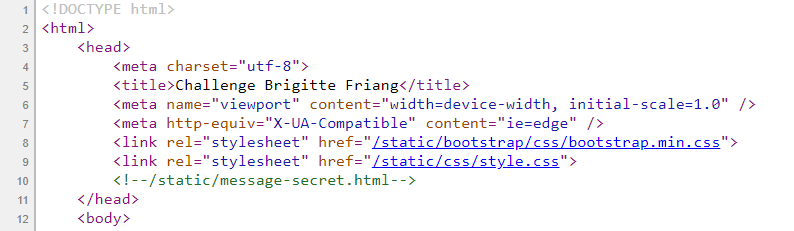
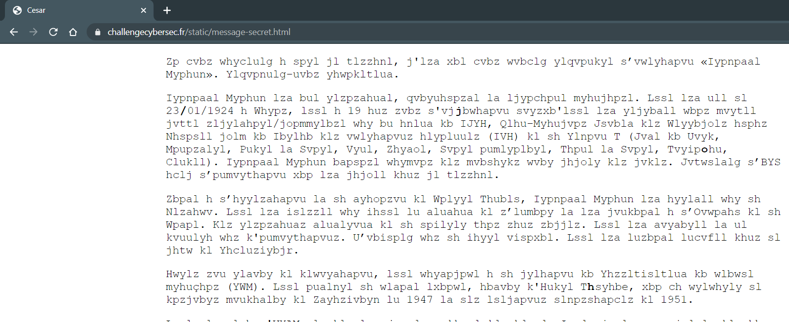

# Échauffement

Le point d'entrée est le site web https://challengecybersec.fr/


En inspectant le code source de la page, on remarque un commentaire dans le code html qui nous envoie vers /static/message-secret.html.



Une fois sur la page, on obtient un texte chiffré.



Comme le titre de la page est `Cesar`, on se doute que le texte est chiffré avec le code César. On peut le décoder en utilisant [Cyberchef](https://gchq.github.io/CyberChef/) et en regardant tous les décalages possibles (choisir l'option ROT13).

Le texte final est le suivant (obtenu avec un décalage 19):

```
Si vous parvenez a lire ce message, c'est que vous pouvez rejoindre l’operation «Brigitte Friang». Rejoignez-nous rapidement.

Brigitte Friang est une resistante, journaliste et ecrivaine francaise. Elle est nee le 23/01/1924 a Paris, elle a 19 ans sous l'occupation lorsqu'elle est recrutee puis formee comme secretaire/chiffreuse par un agent du BCRA, Jean-Francois Clouet des Perruches alias Galilee chef du Bureau des operations aeriennes (BOA) de la Region M (Cote du Nord, Finistere, Indre et Loire, Orne, Sarthe, Loire inferieure, Maine et Loire, Morbihan, Vendee). Brigitte Friang utilise parfois des foulards pour cacher des codes. Completez l’URL avec l’information qui est cachee dans ce message.

Suite a l’arrestation et la trahison de Pierre Manuel, Brigitte Friang est arretee par la Gestapo. Elle est blessee par balle en tentant de s’enfuir et est conduite a l’Hopital de la Pitie. Des resistants tenteront de la liberer mais sans succes. Elle est torturee et ne donnera pas d'informations. N’oubliez pas la barre oblique. Elle est ensuite envoyee dans le camp de Ravensbruck.

Apres son retour de deportation, elle participe a la creation du Rassemblement du peuple français (RPF). Elle integre la petite equipe, autour d'Andre Malraux, qui va preparer le discours fondateur de Strasbourg en 1947 et les elections legislatives de 1951.

Elle rentre a l'ORTF, et devient correspondante de guerre. Elle obtient son brevet de saut en parachute et accompagne des commandos de parachutistes en operation durant la guerre d’Indochine. Elle raconte son experience dans Les Fleurs du ciel (1955). D'autres agents sont sur le coup au moment ou je vous parle. Les meilleurs d'entre vous se donneront rendez-vous a l'European Cyberweek a Rennes pour une remise de prix. Resolvez le plus d'epreuves avant la fin de cette mission et tentez de gagner votre place parmi l'elite! Par la suite, elle couvre l’expedition de Suez, la guerre des Six Jours et la guerre du Viet Nam. Elle prend position en faveur d'une autonomie du journalisme dans le service public ce qui lui vaut d'etre licenciee de l'ORTF.

Elle ecrit plusieurs livres et temoigne de l'engagement des femmes dans la Resistance.
```

En plus de la biographie de Brigitte Friang, nous obtenons les informations suivantes extraites du texte:

```
Si vous parvenez a lire ce message, c'est que vous pouvez rejoindre l’operation «Brigitte Friang». Rejoignez-nous rapidement.
Completez l’URL avec l’information qui est cachee dans ce message.
N’oubliez pas la barre oblique.
D'autres agents sont sur le coup au moment ou je vous parle. Les meilleurs d'entre vous se donneront rendez-vous a l'European Cyberweek a Rennes pour une remise de prix. Resolvez le plus d'epreuves avant la fin de cette mission et tentez de gagner votre place parmi l'elite!
```

De plus, en regardant à nouveau le texte original, nous observons que certains caractères sont en gras: /joha.

En appliquant le même décalage que précédemment, nous obtenons /chat.

L'adresse de l'étape suivante est donc https://challengecybersec.fr/chat.