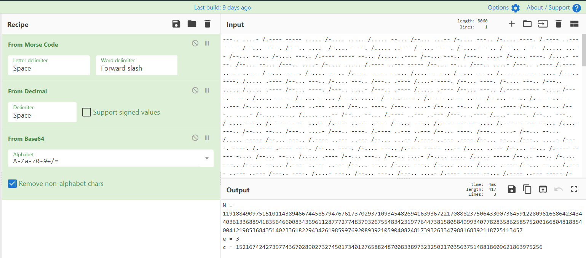

# Gotta Decrypt Them All

> You are stuck in another dimension while you were riding Solgaleo.
> You have Rotom-dex with you to contact your friends but he won't activate the GPS unless you can prove yourself to him. 
> He is going to give you a series of phrases that only you should be able to decrypt and you have a limited amount of time to do so.
> Can you decrypt them all?
> 
> nc crypto.chal.csaw.io 5001

We are given a series of plaintexts encrypted using the same scheme, which is a suite of encryptions and encodings.

## Solution

We're using [CyberChef](https://gchq.github.io/CyberChef/) to decrypt the first message. The magic tool allows us to discover the different encodings used: morse code, decimal encoding, base64.



After those encodings, we are greeted with an RSA instance, which has the following particularities: `N` is much bigger than `c` and `e=3`.
Therefore probably the `mod` part in the encryption scheme has not been used, and we can just compute the cube root of the ciphertext to retrieve the plaintext.

We automate all this using Python:

```python
from pwn import *
import morse
import base64
from Crypto.Util.number import *
import codecs


def find_cube_root(n):
    lo = 0
    hi = 1 << ((n.bit_length() + 2) // 3)
    while lo < hi:
        mid = (lo+hi)//2
        if mid**3 < n:
            lo = mid+1
        else:
            hi = mid
    return lo

sh = remote("crypto.chal.csaw.io", 5001)

def decode():
    sh.recvuntil("mean?")
    x = sh.recvline()
    x = sh.recvline().decode().strip().replace("/", " ")

    x = morse.decrypt(x)

    x = "".join([chr(int(c)) for c in x.split(" ")])

    x = base64.b64decode(x).decode()

    c = int(x.split("=")[3])
    x = long_to_bytes(find_cube_root(c)).decode()

    x = codecs.encode(x, 'rot_13')
    print(x)

    sh.sendline(x)
    print(sh.recvline().decode())

for i in range(6):
    decode()
sh.interactive()
```

Flag: `flag{We're_ALrEadY_0N_0uR_waY_7HE_j0UrnEY_57aR75_70day!}`