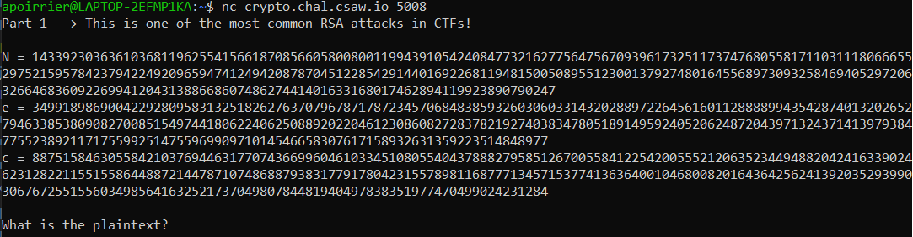
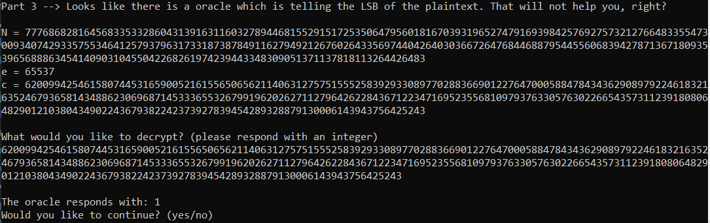

# RSA Pop Quiz

> Your crypto professor is back again!
> After having taught you some things about RSA, they have sprung another pop quiz.
> According to them, it is harder and longer.
> You should still be able to crack it, right?
> 
> nc crypto.chal.csaw.io 5008


We connect to the provided machine and are greeted with a RSA challenge.
In total, there are four challenges, we'll go through them in this write-up.



## Part 1: Wiener attack

> Part 1 --> This is one of the most common RSA attacks in CTFs!

We are given `N, e, c`.
What strikes me the most is the size of `e`: while usually it is small to speed up encoding, in this instance it was huge.

With a quick Google search, I found out about [Wiener's attack](https://en.wikipedia.org/wiki/Wiener%27s_attack).

Also found this [implementation by orisano](https://github.com/orisano/owiener) to solve the challenge:

```python
import owiener
from Crypto.Util.number import *
def decrypt(N,e,c):
    d = owiener.attack(e, N)
    ptxt = pow(c, d, N)
    return long_to_bytes(ptxt)
```

And we get the plaintext: `Wiener wiener chicken dinner`.

## Part 2: Sexy primes

> Part 2 --> Sexy primes were used to make the modulus!

We are given `N, e, c` with standard `e = 65537`.

Once again, a quick Google search tells us that [sexy primes](https://en.wikipedia.org/wiki/Sexy_prime) are prime numbers that differ from each other by 6.

Thus `N = pq = (x-3)(x+3) = q^2 -9` with `x = (p+q) / 2`.
So it suffices to compute the square root of `N+9` to factor N.

```python
from gmpy2 import isqrt
from Crypto.Util.number import *
def decrypt(N,e,c):
    x = isqrt(N+9)
    p = x+3
    q = x-3

    phi = (p-1)*(q-1)
    d = inverse(e, phi)
    ptxt = pow(c, d, N)
    return long_to_bytes(ptxt)
```

The plaintext: `Who came up with this math term anyway?`

## Part 3: LSB oracle

> Part 3 --> Looks like there is a oracle which is telling the LSB of the plaintext. That will not help you, right?

For this part we are given an oracle, which for a ciphertext c' provided, decrypts it and gives us the parity of the underlying plaintext.



Once again, a quick Google search gives us an explanation on [how to perform an LSB oracle attack](https://crypto.stackexchange.com/questions/11053/rsa-least-significant-bit-oracle-attack).
The idea is to exploit the malleability of RSA: given a plaintext `P` whose ciphertext is `C = P^e [p]`, if we multiply `C` by `2^e` we obtain `C' = (2P)^e [p]` which is the encryption of `2P`.

Now there are two possibilities:
- either `P < N/2` and in that case `2P` is even
- either `P >= N/2` and in that case `2P mod N = 2P - N` is odd (because `N` is odd).

Therefore giving `C*2^e` to the oracle tells us if `P < N/2` or not.
By iterating this with powers of 2 we can perform a binary search on the value of `P`, which takes `log N` queries (in our case that would be 1024).

Here is my code:
```python
from pwn import *
from Crypto.Util.number import *
def call_oracle(i):
    sh.recvuntil("What would you like to decrypt? (please respond with an integer)")
    s = (c * pow(1 << i, e, N))%N
    sh.sendline(str(s))
    sh.recvuntil("The oracle responds with:")
    answer = int(sh.recvline())
    sh.recvuntil("(yes/no)")
    sh.sendline("yes")
    return answer

def decrypt(N,e,c):
    min_ptxt = 0
    max_ptxt = N
    iteration = 1

    while max_ptxt - min_ptxt > 1:
        s = call_oracle(iteration)
        if s == 0:
            max_ptxt = (min_ptxt + max_ptxt) // 2
        else:
            min_ptxt = (min_ptxt + max_ptxt) // 2
        iteration += 1
    
    p0 = call_oracle(0)
    
    return long_to_bytes(2*(min_ptxt // 2) + p0)
```

This gives us the plaintext: `Totally did not mean to put an oracle there`

## Part 4: Half of private key leaked

> Part 4 --> Oops, looks like I leaked part of the private key. Hope that doesn't come back to bite me!

We are given `N,e,c`, but also half of the bits of the private key `d`.

```python
N = 53523840361634555386194280963037354859483052562632729769165675810505598288013743042261840228298328281117879194597931960331719813761349813439550320528957840853984882253591831299878826803732528820422024748635462285368477452443396385303789037849508296814149293490161268537717655238974601920328385850302145454603
e = 17
d0 = 7565211940302382757085839466022161502998205311979170860907363348501269960122056381413986075660980761708192565492543107573368278661828038009955653300334001
c = 16813454958619968329958450653219356153512497465481768932041821961901559219589723277365056005689134407783857864615764587035713860590569018998855924124639772933950875371098369482578820981648440616650740497497005156926851684229847492876569920477309654627525605446844507567016586790084728047537951205924718387751
d0bits = 512
nBits = 1024
```

This required more Google search on my part. I first found a [paper from Boneh, Durfee, Frankel](https://citeseerx.ist.psu.edu/viewdoc/download?doi=10.1.1.52.388&rep=rep1&type=pdf) which allow to recover the whole private key with only 25% of it, by exploiting Coppersmith's method to find solutions for bivariate polynomials.

This is quite complicated, and I instead used a method described by Upadhyay in section 4.3 of [this paper](https://www.ijser.org/researchpaper/Attack_on_RSA_Cryptosystem.pdf).

Those methods work fine because `e` is small.

The idea is the following: by definition of `e` and `d`, there exists an integer `k` such that `e*d - k*phi = 1`.
Since `d < phi`, we must have `0 <= k <= e`.

The main idea is to replace `phi` by `N`. Therefore we can compute `d' = (k*N+1)/e` and brute force the value of `d'` by iterating on `k` (this is possible as `k` is smaller than `e` and here `e=17` is small).

Results show that `|d - d'| <= 3*sqrt(N)`. But hopefully we know the LSB of `d`, so we can replace the in `d'` by the knowledge of `d`.
We brute force the remaining bits (this will be 4 bits given the value of N) that are above the known bits of `d` and below the `3*sqrt(N)` bound.

```python
def find_d(N,e,c,d0,d0bits=512):
    for k in range(1,e):
        # Approximate d using N instead of phi
        d = ((k * N + 1) // e)

        # Replace the LSB of d by the known value
        d ^= (d % (1 << d0bits))
        d ^= d0

        # Brute force the remaining 4 bits
        for i1 in range(2):
            for i2 in range(2):
                for i3 in range(2):
                    for i4 in range(2):
                        d ^= (i1 << 512)
                        d ^= (i2 << 513)
                        d ^= (i3 << 514)
                        d ^= (i4 << 515)

                        if pow(pow(2,e,N),d,N) == 2:
                            return d
```

We get the message: `I'll be careful next time to not leak the key`

Flag: `flag{l00K5_L1K3_y0u_H4v3_p4223D_7h3_D1ff1Cul7_r54_p0p_Kw12_w17H_fLy1N9_C0L0r2}`