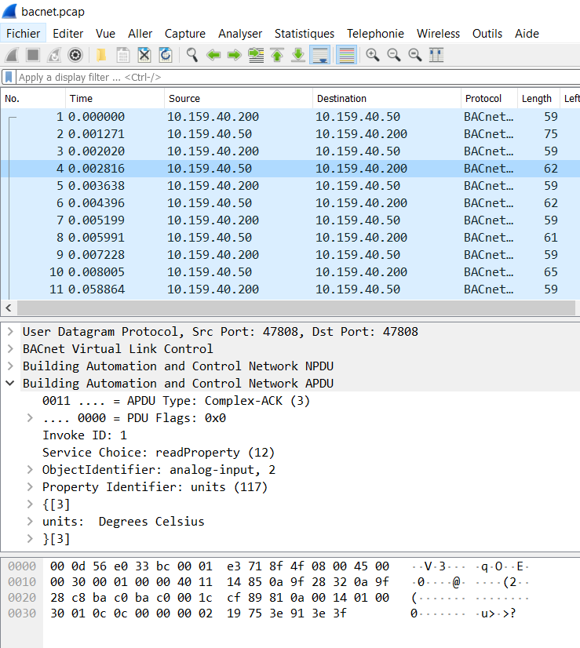

# A Pain in the BAC(net)

> Attached is a packet capture taken from a building management network.
> One of the analog sensors reported values way outside of its normal operating range.
> Can you determine the object name of this analog sensor? >
> 
> Flag Format: flag{Name-of-sensor}.
> For example if the object name of this analog sensor was "Sensor_Temp1", the flag would be flag{Sensor_Temp1}.
>
> (Note: because there are a limited number of sensors, we're only giving you two guesses for this challenge, so please check your input carefully.)

## Description

Let's open the pcap with Wireshark.



We see a number of packets in the BACnet protocol (Building Automation and Control Network). One machine with IP `10.159.40.200` queries several machines to get information, each packet represent one information. Informations are the object name, its state, if it is out-of-service, its value and the unit of this value.

The goal is to find a sensor with abnormal values, so we can parse this file, sort sensors by units and take the one that is abnormal.

## Solution

I'm using scapy to parse the pcap. Because no extension exists in the contrib scapy library for bacnet, I have parsed myself the packets.
In response packets, the property identifier is a 2-byte field and is followed by a `0x3e` byte, the actual data, and a `0x3f` byte.

The following Python code parses the pcap file, then sort all sensors by unit and find the faulty one.

```python
from scapy.all import *
import struct

machines = []
current = {}

for packet in rdpcap('bacnet.pcap'):
    if packet["IP"].src == "10.159.40.200":
        continue
    if bytes(packet)[56:58] == b"\x19\x4d":
        if "name" in current:
            machines.append(current)
        current = {}
        current["name"] = bytes(packet)[62:len(bytes(packet))-1]
    elif bytes(packet)[56:58] == b"\x19\x75":
        current["units"] = bytes(packet)[59:61]
    elif bytes(packet)[56:58] == b"\x19\x55":
        current["value"] = struct.unpack('>f', bytes(packet)[60:64])[0]

lists = {}
for m in machines:
    if "units" not in m:
        continue
    if m["units"] not in lists:
        lists[m["units"]] = []
    lists[m["units"]].append(m)

for x in lists:
    print(lists[x][0]["units"], end=" ")
    all_values = [m["value"] for m in lists[x]]
    print(min(all_values), max(all_values))

print(lists[b"\x91\x13"])
for m in lists[b"\x91\x13"]:
    if m["value"] >= 80000:
        print(m)
```

Flag: `flag{Sensor_12345}`