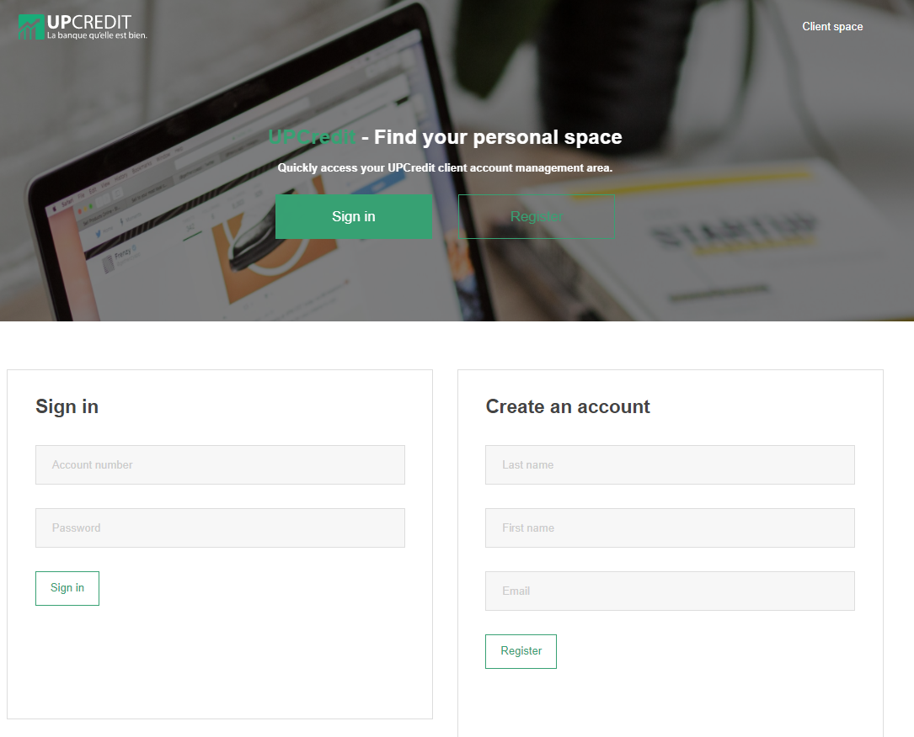
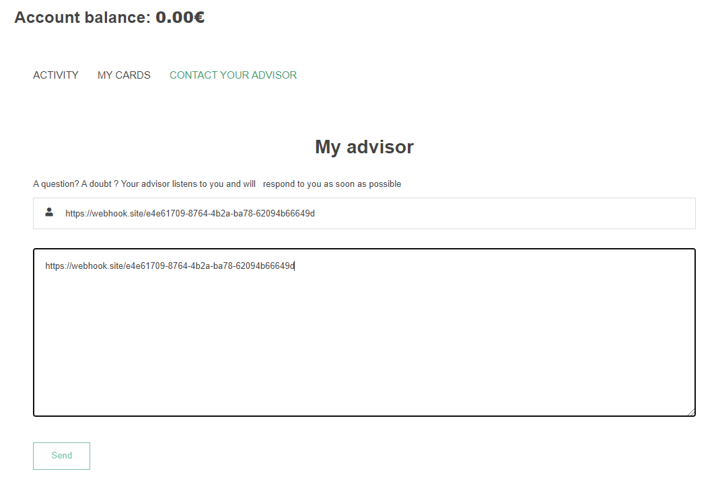
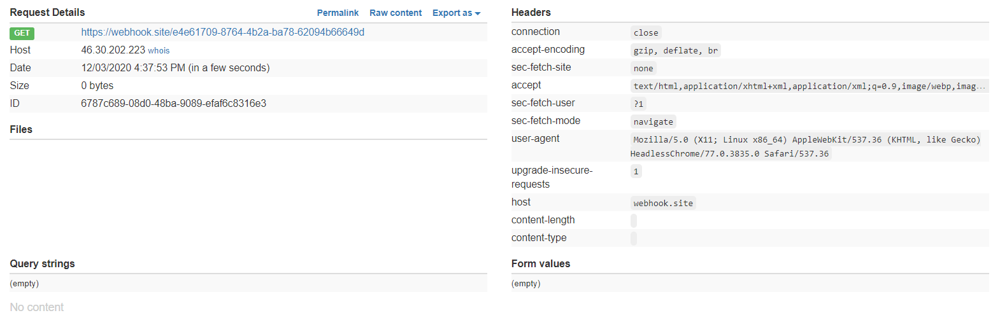
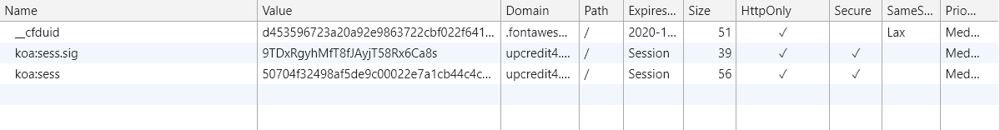
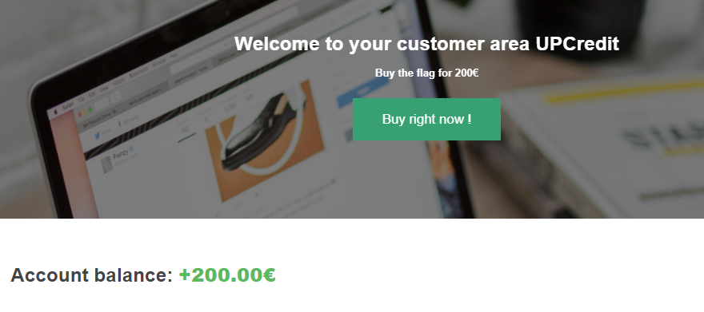

# UpCredit

> En tant qu’ingénieur expert en recherche de vulnérabilité nouvellement embauché à DGA MI, vous décidez de changer de banque.
> 
> La banque UpCredit est une banque 100% en ligne. Vous pouvez vous inscrire et gérer immédiatement votre compte !
> 
> Pour obtenir le flag, vous devrez dépenser 200€. Vous pouvez contacter votre conseiller à tout moment pour qu'il vous aide.

## Description

Le site web nous accueille avec une page web de connexion et inscription.



Créons donc un compte. On nous attribue un numéro de compte et un mot de passe, puis on peut effectuer deux actions:
- transférer de l'argent
- contacter son conseiller.

Malheureusement, on n'a pas d'argent et nous avons besoin de 200€.

Après avoir essayé de donner de mauvais paramètres à la fonction de transfert d'argent ou d'essayer de provoquer une race condition en utilisant deux comptes, je me suis concentré sur la fonction pour parler à son conseiller.

Malheureusement une injection XSS comme pour Internal Support n'a pas l'air de fonctionner. En revanche le conseiller clique sur les liens que je lui envoie, ce que j'ai pu tester avec un webhook:





Il ne reste plus qu'à lui envoyer un lien malveillant pour qu'il me donne des informations confidentielles.

## Solution

Une autre observation que j'ai faite est que si j'ouvre un nouvel onglet et que je me connecte au site, alors je suis directement connecté. Cela m'indique que les cookies ont une politique `SameSite=Lax` ou `SameSite=None`, ce qui est expliqué par [cette documentation](https://developer.mozilla.org/en-US/docs/Web/HTTP/Headers/Set-Cookie/SameSite).

En regardant les cookies, je remarque que le paramètre `SameSite` n'est pas spécifié, ce qui indique que les cookies sont `Lax` par défaut. Ainsi, le requête POST pour effectuer le transfert d'argent n'est pas censé marcher...



Mais en y regardant de plus près, le conseiller utilise une version non à jour de Chrome: la version 77, qu'on peut voir lorsqu'il clique sur le lien. Et dans cette version, la policy sera `SameSite=None`.

En hostant mon propre site, avec comme code source :

```html
<html>
<form action="http://upcredit4.chall.malicecyber.com/transfer" method="POST">
<input type="text" name="account" value="nH-B2-xb0" />
<input type="number" name="amount" value=200 />
</form>
 <script>
   document.forms[0].submit();
  </script>
</html>
```

qui effectue la bonne requête POST, j'obtiens finalement les 200€ sur mon compte.

A noter qu'il faut envoyer le site en http (et non https) au conseiller, ce qui m'a fait perdre de nombreuses heures à essayer de comprendre ce qui ne fonctionne pas...



Flag: `W1nG4rD1um\L3v1os444!`