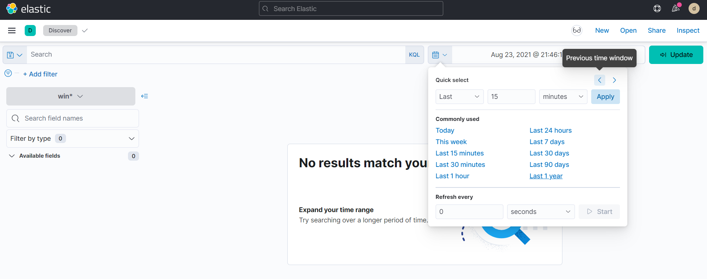
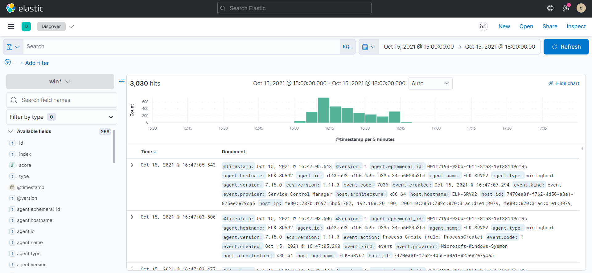
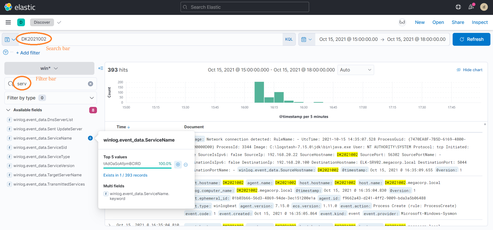

# MEGACORP

> L'entreprise MEGACORP, Organisme d'Importance Vitale a subi une attaque informatique.
>
> Plusieurs agents ont déjà tenté en vain d'identifier l'intrusion (infection initiale, mouvement latéral, machines compromises), le temps nous est compté, mais fort heureusement l'entreprise nous a fourni un accès à leurs systèmes de collecte de logs basé sur Kibana (Username : dghack ; Password : dghack2021).
>
> Nous comptons sur vous pour réussir là où les autres ont échoué au plus vite.
>
> http://kibana-tuazhu.inst.malicecyber.com/

This challenge is a forensics challenge in three parts, in each part we need to find some specific information about the attack.

First we can connect to the platform.
Click on `Analytics -> Discover` and then we are on the analysis page.

Nothing shows up: it is because by default only data from the last 15 minutes are displayed.

Change the date to find events.

We can now see the events at the correct date.

## Partie 1

> Pouvez-vous retrouver le sha256 du fichier ayant initié la compromission dans le domaine ?
>
> Le format du flag est : DGA{empreinte}.

(résolu par gsol)

## Partie 2

> Pouvez-vous retrouver le nom du service ayant permis d'effectuer un pivot vers la machine DK2021002 ?
>
> Le format du flag est : DGA{empreinte}.

In the search bar, I enter the string `DK2021002`. There are a lot of events, but we are looking for a service, so in the filter bar, I enter `ServiceName`.

Flag: `DGA{tAdOaSoAfpmBCIRD}`

## Partie 3

> Pouvez-vous retrouver le process GUID du programme ayant été utilisé pour la génération du golden ticket ?
>
> Le format du flag est : DGA{empreinte}.

I actually found this one by trying to find the first part of the challenge.

I stumbled upon the `mimikatz.exe` file (using `file.name` filter) which is apparently a malware, I copied the GUID of the process and it worked.

Flag: `DGA{0FEEC322-8FD0-6169-8600-000000001D00}`.
