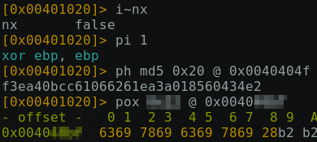

# Yet Another Ridiculous Acronym

> Sauras-tu écrire une signature qui détecte le bon binaire à partir des marquants extraits dans l'analyse ci-jointe ?



Attached is a compressed folder containing around 1000 binaries.

## Description

When I look at the binaries, I see that running them will print a flag.
The goal of this challenge is to find the correct binary given the information provided by the picture.

Thanks to the name of the picture (`r2.png`), I discovered this was `radare2`.
I had already guessed the meaning of the first 3 commands, but could not infer the meaning of the fourth without reading the `radare2` documentation.

Thus we need to find a binary which has the following characteristics:
- NX disabled
- `xor ebp, ebp` as instruction at `0x00401020`
- the MD5 hash of the 0x20 bytes at `0x0040404f` is `f3ea40bcc61066261ea3a018560434e2`
- there exists some data, which xored with a byte would yield the bytes `636978696369786928b2b2` (in hexadecimal).

## Solution

Given the challenge name and description, I believe we were expected to write a set of YARA rules to find the correct binary.

I don't know YARA and can do it very easily with Python, so this is what I did.

I will use the pwntools library.
First I create a list of potential candidates.
Those who pass the filter will go in `next_valids`.

Then for each criteria, I load each valid binary and test if the criteria matches.

```python
from pwn import *
import hashlib
from Crypto.Util.strxor import strxor

valids = list(range(1, 912))
next_valids = []

# NX disabled
for i in valids:
    candidate = ELF('samples/sample{}'.format(i), False)
    if not candidate.nx:
        next_valids.append(i)

valids = next_valids.copy()

print("Remaining after NX filter:", len(valids))

# First instruction is xor ebp, ebp, which is 1\xed in bytes
next_valids = []
for i in valids:
    candidate = ELF('samples/sample{}'.format(i), False)
    if candidate.read(0x401020, 2) == b'1\xed':
        next_valids.append(i)

valids = next_valids.copy()

print("Remaining after xor filter:", len(valids))

# Compute md5 and check
next_valids = []
for i in valids:
    candidate = ELF('samples/sample{}'.format(i), False)
    m = hashlib.md5()
    m.update(candidate.read(0x40404f, 0x20))
    if m.hexdigest() == "f3ea40bcc61066261ea3a018560434e2":
        next_valids.append(i)
valids = next_valids.copy()

print("Remaining after md5 filter:", len(valids))

# Execute the xor with all 255 possibilities and check if such a string exists
next_valids = []
for i in valids:
    candidate = ELF('samples/sample{}'.format(i), False)
    valid_string = b"\x63\x69\x78\x69\x63\x69\x78\x69\x28\xb2"
    for j in range(255):
        test_string = strxor(valid_string, bytes([j] * len(valid_string)))
        if len(list(candidate.search(test_string))) > 0:
            next_valids.append(i)
            break

valids = next_valids.copy()

print("Remaining after offset filter:", len(valids))
print(valids)
```

Only `sample256` matches, which gives me the flag.

Flag: `DGA{ca17ba40c5ae2eb3}`