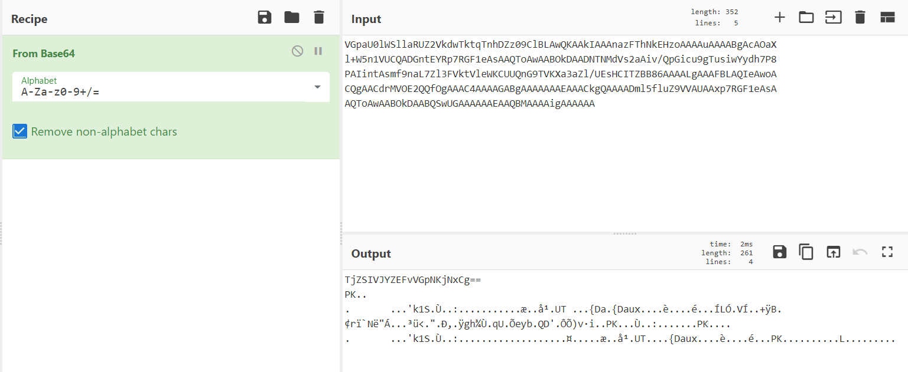

# PCAP 101

> Un flux TCP suspect nous a été fourni, pouvez-vous découvrir les données qui s'y cachent ?

## Description

I open the pcap file with Wireshark.
As I know I am looking for a TCP stream, I right click on the first one I find, `Follow -> TCP Stream`.

A lot of streams look the same, except the HTTP request `GET /zippassword` (stream 31) which has base64 data in it.

Here is what [CyberChef](https://gchq.github.io/CyberChef/) gives when I decode:



It looks like another base64 encoded string.
Moreover I recognise the PK which is the signature of zip files. 

## Solution

I extract the zip file using this script, which also writes the password for me:

```python
import base64

with open("zippassword", "r") as f:
    data = f.read()

decoded = base64.b64decode(data)
password = decoded.split(b"\n")[0]
with open("pcap.zip", "wb") as f:
    f.write(b"\n".join(decoded.split(b"\n")[1:]))
print(base64.b64decode(password))
```

Then I unzip it and recovers the flag.

Flag: `DGA{582158848efebaee4d501e98768b012f104cf03c}`