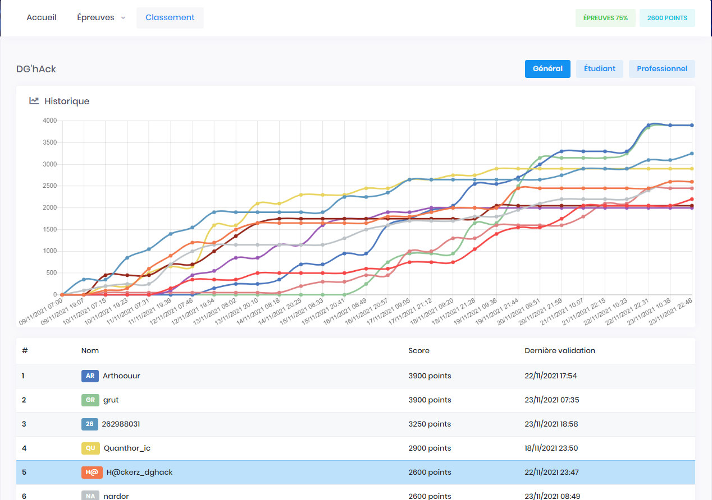

# DG'hAck 2021

Challenge [DG'hAck](https://www.dghack.fr/) organisé par la DGA (Direction Générale de l'Armement). 

## Équipe

Nous étions 3 sur cette compétition:
- [apoirrier](https://github.com/apoirrier)
- [Spyfox](https://github.com/leoHeidel)
- [gsol](guillaume.solignac@epfl.ch)

Nous sommes arrivés 5e (sur 1039 participants) avec 2600 points.

## Épreuves

| Épreuve | Points | Catégorie | Résolu par |
|:-------:|:------:|:---------:|:----------:|
| Goodies Lover | 100 | Stéganographie | - |
| [Yet Another Ridiculous Acronym](Détection/YARA.md) | 100 | Détection | apoirrier |
| [Crossroad](Reverse/Crossroad.md) | 100 | Reverse | apoirrier |
| [Escape from ELF](Reverse/Escape.md) | 150 | Reverse | apoirrier |
| Introspection | 150 | Reverse | - |
| [Clutter](Reverse/Clutter.md) | 300 | Reverse | apoirrier |
| [PCAP 101](Inforensique/PCAP.md) | 50 | Inforensique | apoirrier |
| XML is love, XML is life | 200 | Web | - |
| [OS-S_v1.17](Reverse/OSS117.md) | 100 | Reverse | apoirrier |
| [OS-S_v1.17 - étape 2](Reverse/OSS117.md#part-2) | 100 | Reverse | apoirrier |
| [OS-S_v1.17 - étape 3](Reverse/OSS117.md#part-3) | 150 | Reverse | apoirrier |
| OS-S_v1.17 - étape 4 | 300 | Reverse | - |
| InstaKiloGram | 200 | Web | - |
| [Crypto Be Crushed](Crypto/CBC.md) | 150 | Crypto | apoirrier |
| [Lost in C++](Dev/Lost.md) | 150 | Dev | apoirrier |
| PrettyVulnerability | 50 | Web | - |
| [Mascarade](Crypto/Mascarade.md) | 100 | Crypto | apoirrier & gsol |
| [Secure Multiplexed Transport Protocol](Exploit/SMTP.md) | 150 | Exploit | apoirrier |
| DGA Antivirus Service | 300 | Exploit | - |
| Ecole | 100 | Dev | gsol |
| [Secure FTP Over UDP 1](Dev/FTP.md) | 100 | Dev | apoirrier |
| [Secure FTP Over UDP 2](Dev/FTP.md) | 100 | Dev | apoirrier |
| [Secure FTP Over UDP 3](Dev/FTP.md) | 100 | Dev | apoirrier |
| MEGACORP 1 | 50 | Détection | gsol |
| [MEGACORP 2](Détection/MEGACORP.md#part-2) | 150 | Détection | apoirrier |
| [MEGACORP 3](Détection/MEGACORP.md#part-3) | 50 | Détection | apoirrier |
| [iDisk](Inforensique/iDisk.md) | 150 | Inforensique | apoirrier |
| Hash-sig | 200 | Cryptographie | spyfox |
