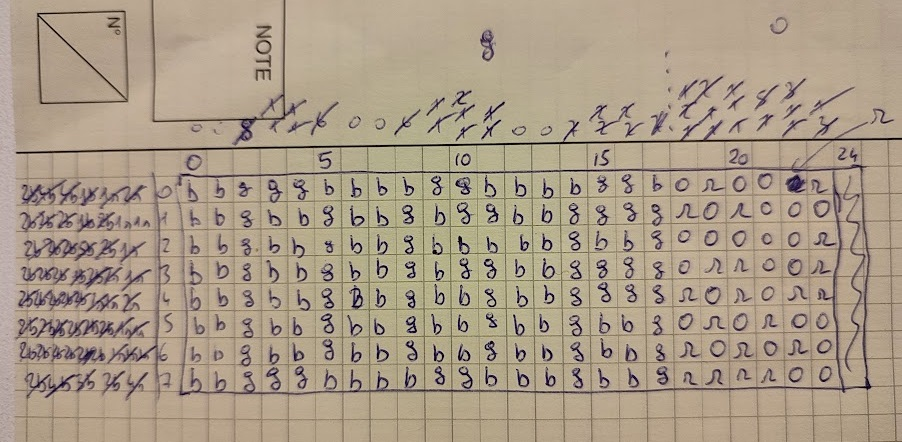

# Crossroad

> > Every crossroad in life has four options – quit, adapt, proceed, or accept, but quitting is a dead-end.
> 
> Un de vos collègues vous a envoyé un programme qu'il a développé et souhaite vous défier.
>
> Validez votre accès et fournissez-lui le flag.

## Description

Let's reverse the binary with Ghidra.
First I go to the `entry` function to know where the `main` is.
The first argument is the `main` function, so I rename it.

```c
void entry(undefined8 param_1,undefined8 param_2,undefined8 param_3)
{
  undefined8 in_stack_00000000;
  undefined auStack8 [8];
  
  __libc_start_main(main,in_stack_00000000,&stack0x00000008,FUN_00101720,FUN_00101780,param_3,
                    auStack8);
  do {
                    /* WARNING: Do nothing block with infinite loop */
  } while( true );
}
```

I also change the signature function for main.

```c

int main(int argc,char **argv)

{
  uint local_c;
  
  if (argc != 2) {
    printf("Usage: %s <input>\n",*argv);
    flag_valid = 0xff;
  }
  else {
    strcpy(&input_str,argv[1]);
  }
  local_c = (uint)(argc != 2);
  return (int)local_c;
}
```

So there isn't much happening here in the `main` function: it checks if I have provided exactly one argument.
If I have not, it does set the `flag_valid` global variable to `0xff`, and otherwise copies my argument into the global variable `input_str`.

So where is the flag check happening?

As it needs to happen after `main`, it probably happens in the `.fini` section.
In Ghidra, I indeed see the `_FINI_0` to `_FINI_4` functions.

By opening the program with `gdb`, I see that the functions are visited in decreasing order.

### _FINI_4

```c
void _FINI_4(void)

{
  if (DAT_00104200 != '\0') {
    return;
  }
  __cxa_finalize(PTR_LOOP_00104068);
  FUN_001010f0();
  DAT_00104200 = 1;
  return;
}
```

This function basically does nothing really interesting.

### _FINI_3

```c
void _FINI_3(void)
{
  ssize_t sVar1;
  byte c;
  int file;
  int j;
  int i;
  
  if (input_valid != -1) {
    file = open(&input_str,0);
    if (file < 0) {
                    /* WARNING: Subroutine does not return */
      exit(1);
    }
    for (i = 0; i < 8; i = i + 1) {
      for (j = 0; j < 0x18; j = j + 1) {
        sVar1 = read(file,&c,1);
        if (((sVar1 != 1) || ((char)c < '0')) || ('3' < (char)c)) {
                    /* WARNING: Subroutine does not return */
          exit(1);
        }
        (&string_from_file)[j + i * 0x18] = c ^ 0x30;
      }
      sVar1 = read(file,&c,1);
      if (sVar1 != 1) {
                    /* WARNING: Subroutine does not return */
        exit(1);
      }
    }
    close(file);
  }
  return;
}
```

Recall that `input_str` is a global variable containing our input.
So this function opens a file that was given as a parameter, and then reads its content.

The file needs to be composed of 8 lines, each line ending by a single character (in practice, any character is authorized as end of line, even if it is not technically a line break).

Then each line is composed of 0x18 characters that are digits between 0 and 3.

Those digits are extracted and converted to their integer value into an 8*0x18 array which I called `string_from_file`.

### _FINI_2

```c
void _FINI_2(void)
{
  long i;
  undefined8 *local_array;
  undefined8 local_1a8 [49];
  byte local_19;
  uint local_18;
  uint done;
  int k;
  uint j;
  
  local_array = local_1a8;
  for (i = 0x30; i != 0; i = i + -1) {
    *local_array = 0;
    local_array = local_array + 1;
  }
  if (input_valid != -1) {
    for (j = 0; j < 0x24; j = j + 1) {
      local_18 = (uint)(*(ushort *)(&DAT_00104080 + (long)(int)j * 4) & 0x3fff);
      local_19 = (byte)(&DAT_00104081)[(long)(int)j * 4] >> 6;
      done = 0;
      for (k = *(int *)((long)local_1a8 +
                       ((long)(int)(uint)((byte)(&DAT_00104081)[(long)(int)j * 4] >> 6) +
                       (long)(int)(uint)(*(ushort *)(&DAT_00104080 + (long)(int)j * 4) & 0x3fff) * 4
                       ) * 4); k < 8; k = k + 1) {
        if (local_19 == (&string_from_file)[(int)(local_18 + k * 0x18)]) {
          *(int *)((long)local_1a8 + ((long)(int)(uint)local_19 + (long)(int)local_18 * 4) * 4) =
               k + 1;
          done = done + 1;
        }
        else {
          if (0 < (int)done) break;
        }
      }
      if (done != (*(ushort *)(&DAT_00104082 + (long)(int)j * 4) & 0x3fff)) {
                    /* WARNING: Subroutine does not return */
        exit(1);
      }
    }
  }
  return;
}
```

This function is a little bit more complex.
This is where the first real checks occur.

First the function initializes an array of size 49 filled with zeroes.

Then there is a list of 0x24 rules (indexed by `j`).
Each rule is defined using 3 values:
- `local18` which is the byte at address `0x104080 + 4*j`
- `local19` which is the byte at address `0x104080 + 4*j + 1`
- `local20` which is the byte at address `0x104080 + 4*j + 2`

Basically, the rule checks if there are exactly `local20` consecutive cells in column `local18` of our input file that are equal to `local19`, starting after `local_1a8[local18*4+local19]`.

Indeed, see that evaluated cells are of the form `(&string_from_file)[(int)(local_18 + k * 0x18)]`, which means that they are on column `local_18`.

Similarly `local_1a8` is a 2D array with size `4 * 0x18` flattened in 1D. It holds the last index plus one of the last series found for a previous rule.

It took me time to come to that conclusion, but once I saw this I immediately thought of the Nonogram game, except it has four colors.

Thus I could see that the function `_FINI_1` is actually a check performed for the lines, and `_FINI_0` just transforms the nonogram board into the flag.

## Solution

I first thought at trying a program to solve it for me, but could not fine one which accepts different colors and an incomplete set of constraints.

I could have programmed one myself, but it was much easier to just draw it and solve it myself.

So I extracted with `gdb` the different values for the constraints, took a pen and paper to write them and solve it. 

Here you go for the manual solve (I converted color numbers to letters to avoid confusions):



which gives me the correct file:

```
332223333223333223010011
332332332322332222101000
332332332333332332000001
332332332322332222011001
332332332332332222101011
332332332332332332010100
332332332332332332101010
332223333223332332111100
```

I then just have to run the program to get the flag.

Flag: `DGA{P1CR0S5!}`