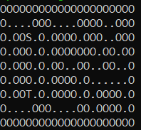

# Escape from ELF

> > A good traveller is one who knows how to travel with the mind.
>
> Un de vos collègues vous a envoyé un programme qu'il a développé et souhaite vous défier.
>
> Fournissez-lui les mots de passe les plus courts validant votre accès.

## Description

Let's decompile the binary with Ghidra.
As usual, I go to the `entry` function to know which is my `main` function (it is the first argument of `__libc_start_main`).
I rename it and give it its proper signature.

```c

int main(int argc,char **argv)

{
  long lVar1;
  undefined8 *puVar2;
  undefined8 buffer [32];
  ulonglong local_58 [3];
  undefined2 value_after_string_i;
  ulonglong arg_as_integer;
  undefined *addr_of_constant_string_i;
  uint n_args;
  int i;
  int valid;
  long sum_args;
  uint n_valid_args;
  
  n_args = 3;
  n_valid_args = 0;
  sum_args = 0;
  puVar2 = buffer;
  for (lVar1 = 0x20; lVar1 != 0; lVar1 = lVar1 + -1) {
    *puVar2 = 0;
    puVar2 = puVar2 + 1;
  }
  valid = -1;
  if ((1 < argc) && (argc - 1U <= n_args)) {
    for (i = 1; i < argc; i = i + 1) {
      addr_of_constant_string_i = (&PTR_DAT_00104400)[i + -1];
      value_after_string_i = *(undefined2 *)(addr_of_constant_string_i + 2);
      arg_as_integer = strtoull(argv[i],(char **)0x0,0x10);
      local_58[i + -1] = arg_as_integer;
      sum_args = sum_args + arg_as_integer;
      valid = check(&value_after_string_i,addr_of_constant_string_i,arg_as_integer);
      if (valid != 0) break;
      n_valid_args = n_valid_args + 1;
    }
  }
  if ((n_valid_args == n_args) && (sum_args == -0x7e78717b372c5354)) {
    sprintf((char *)buffer,"DGA{%lx_%lx_%lx!}",local_58[0],local_58[1],local_58[2]);
    printf("Congrats!\nHere is your flag: %s\n",buffer);
  }
  return valid;
}
```

From reading the `main` function, I understand that I need to enter 3 arguments.
Each argument is actually a 64 bits integer encoded as hexadecimal, which is extracted thanks to the `strtoull` function.

For each argument, I need to pass the challenge given by the `check` function and parametrized by data provided in `PTR_DAT_00104400` (it is a list of 3 pointers pointing to actual challenge data described below).

## The Challenge

```c
int check(undefined8 data1,undefined8 data2,undefined8 arg)
{
  undefined8 arg_;
  undefined8 data2_;
  undefined8 data1_;
  uint local_18;
  byte local_14;
  int i;
  int ret;
  
  data1_ = data1;
  data2_ = data2;
  arg_ = arg;
  ret = 1;
  i = 7;
  while( true ) {
    if (i < 0) {
      return ret;
    }
    local_18 = (uint)(*(byte *)((long)&arg_ + (long)i) >> 4);
    local_14 = *(byte *)((long)&arg_ + (long)i) & 0xf;
    ret = check2(data1_,data2_,&local_18);
    if (ret != 1) break;
    i = i + -1;
  }
  return ret;
}
```

In this function, `data1` and `data2` are the given challenge parameters, and `arg` is the integer I gave as a parameter.

What it does is the following.
For `i` ranging from 7 to 0, it extracts its i-th byte, and separates the 4 highest from the 4 lowest bits.
It is then passed to the `check2` function.

```c
undefined4 check2(short *data1,undefined *data2,int *arg_byte)
{
  char cVar1;
  char cVar2;
  short next;
  size_t len;
  int i;
  short offset;
  
  offset = 0;
  if (*arg_byte == 8) {
    offset = -*(short *)(data2 + 6);
  }
  else {
    if (*arg_byte == 2) {
      offset = *(short *)(data2 + 6);
    }
    else {
      if (*arg_byte == 6) {
        offset = 1;
      }
      else {
        if (*arg_byte == 4) {
          offset = -1;
        }
      }
    }
  }
  i = 0;
  while( true ) {
    if ((int)(uint)*(byte *)(arg_byte + 1) <= i) {
      return 1;
    }
    next = offset + *data1;
    cVar1 = data2[(long)(int)next + 8];
    len = strlen(data2 + 8);
    if ((len <= (ulong)(long)next) || (next < 0)) {
      *data1 = *(short *)(data2 + 2);
      return 0xffffffff;
    }
    cVar2 = xor(*data2,0x38);
    if (cVar1 == cVar2) {
      return 0xffffffff;
    }
    if (cVar1 == data2[4]) break;
    *data1 = next;
    i = i + 1;
  }
  *data1 = next;
  return 0;
}
```

`check2` first performs a conversion of the 4 highest bits of my argument byte.
There are only 5 possibilities:
- if it is 8 then `offset = -w` where `w = *(short*)(data2 + 6)`
- if it is 2 then `offset = w`
- if it is 6 then `offset = 1`
- if it is 4 then `offset = -1`
- otherwise it is 0.

This already looks like I'm moving in a 2 dimensional array. It even corresponds to the directions given by a keypad.

The following is a loop of size `steps` where `steps` is the number represented by the 4 lowest bits of my argument byte.
For every step, I advance in the direction chosen (represented by `offset`), with my position represented by `data1`.

I am actually moving in the `data2[8:]` array, where one character represents one cell.
If I go out of the array, I lose.
If I go to a cell such that `cell == data2[0] ^ 0x38`, then I also lose immediately.
I win if I find the cell with value `data2[4]`.

Thus this is actually a maze, and I can move through the maze by providing commands using the inputs.

One command is a byte `xy`, where `x` is the direction (2,4,6 or 8) and `y` is a number of cells to advance.

## Solution

I guess I could have solved the three mazes with a program, but as they are small and there are only 3 I solved them by hand.

To do so, I have created the following program to extract a maze and print it:

```python
from pwn import *

MAZES_ADDR = [0x4050, 0x4118, 0x4268]

def print_maze(m):
    elf = ELF("./dghack2021-escape", False)
    maze = MAZES_ADDR[m]
    size = elf.read(maze + 6, 1)[0]
    start = elf.read(maze + 2, 1)[0]
    win = elf.read(maze + 4, 1)
    lose = bytes([elf.read(maze, 1)[0] ^ 0x38])
    labyrinthe = elf.string(maze+8)
    labyrinthe = labyrinthe.replace(lose, b"O").replace(win, b"T").replace(bytes([labyrinthe[start]]), b".").decode()
    labyrinthe = labyrinthe[:start] + "S" + labyrinthe[start+1:]

    for i in range(len(labyrinthe) // size):
        for j in range(size):
            print(labyrinthe[i*size+j], end="")
        print()
```

For example the first maze, starting point is S and exit is T:



Flag: `DGA{612441_216a2242266629_81662462864c2242!}`