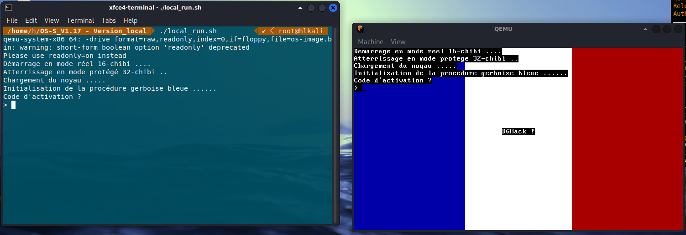
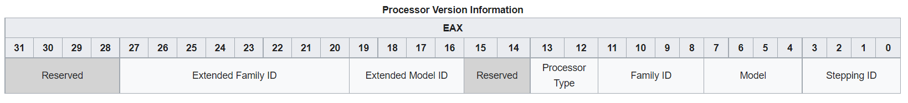

# OS-S_V1.17

> Ce challenge est un challenge à tiroir, à chaque étape vous pourrez valider un flag sous la forme DGA{XXX} dans l'étape correspondante.
>
> Vous devez passer le Tset pour acceder à cette machine
>
> Url: tcp://ossv117.chall.malicecyber.com:4993/

We get the following bash script to launch the disk (`os-image.bin`) that holds the flags as well as the disk.

```bash
#!/bin/bash

qemu-system-x86_64 \
    -snapshot \
    -drive format=raw,readonly,index=0,if=floppy,file=os-image.bin \
    -hdb flag_04.txt \
    -serial stdio
```

The program running on the server is the following:

```python
if __name__ == '__main__':
    signal.signal(signal.SIGALRM, sig_handler) 
    signal.alarm(120)

    proof_of_work()

    choise = input("Voulez-vous utiliser une configuration personnalisée pour le processeur ? [O/N] : ")

    if choise == "O":
        cpu = str(input("Configuration cpu: "))

        import string
        if not all([c in string.ascii_letters + string.digits + "," + "=" + '-' + '.' for c in cpu]):
            print("Caractères non autorisés.")
            exit()

    else:
        cpu = "Westmere"

    argv = ["/usr/bin/timeout", "120",
            "/usr/bin/qemu-system-x86_64",
            "-snapshot",
            "-display", "none",
            "-serial", "stdio",
            "-drive", "format=raw,readonly,index=0,if=floppy,file=os-image.bin",
            "-hdb", "flag_04.txt",
            "-cpu", cpu
            ]

    env = {}
    os.execve(argv[0], argv, env)
```

(the `sighandler` and `proof_of_work` functions are omitted for clarity).

## Description

The OS image seems to be a custom-made OS that we can launch with QEMU. We can also choose a CPU.

This is what I get when I launch the program.



I first tried to reverse the program statically but could not achieve it.

From my understanding, the program starts in 16-bit mode real, then takes the code and copies it on another part of the memory, and runs it in 32-bit protected mode.

To debug the program with gdb, launch the QEMU system with `-s -S` as additional parameters.
On another console, launch gdb and type `target remote localhost:1234` to connect to the process.

The actual start of the program will be at address 0x7c00 so I set a breakpoint there, and then advanced in the program using breakpoints (`b * address`) and continue (`c`).

To disassemble code, I'm using `x/20i address` or `x/20i $pc` to disassemble at the current address (you can replace 20 instructions to whatever value you want).

Going through the code functions by functions, waiting for messages to appear and trying to find the spot where I need to give my input, I understood the following.

```assembly
0x1552:	call   0x12e1
0x1557:	call   0x135f
0x155c:	call   0x1448
0x1561:	call   0x13d1
0x1566:	call   0x150f
0x156b:	jmp    0x1566
```

At address 0x1552, there is a call to 5 functions.
- I don't know what the first function does but it does not appear to be relevant.
- Function at 0x135f shows the first 3 lines of the first screen.
- Function at 0x1448 is for the first challenge.
- Function at 0x13d1 is for the second challenge.
- Function at 0x150f is for the third challenge (probably).

Let's now look at each challenge one by one.

## Part one

Function 0x1448 has the following code:

```assembly
; [REDACTED, it just prints the remaining lines]
0x1492:	push   0x50
0x1494:	push   rsi
0x1495:	call   0x1ce0
0x149a:	pop    rcx
0x149b:	pop    rbx
0x149c:	lea    ebx,[rbp-0x58]
0x149f:	push   rbx
0x14a0:	push   rsi
0x14a1:	mov    BYTE PTR [rbp-0x59],0x0
0x14a5:	call   0x1029
0x14aa:	add    esp,0xc
0x14ad:	push   0x4f
0x14af:	push   0x2be0
0x14b4:	push   rbx
0x14b5:	call   0x257c
0x14ba:	add    esp,0x10
0x14bd:	test   eax,eax
0x14bf:	je     0x14d3
```

There are 3 function calls: 
- function 0x1ce0 reads the input, 
- function 0x1029 transforms the input,
- function 0x257c compares the transformed input with some stored data.

If the password is not correct, the jump is not taken and we get an error message and the program stops.
I simulated to get the correct message by jumping to 0x14d3 (by typing `jump * 0x14d3` when I was on the `je` instruction), and the flag appears (a fake flag of course, the real one is on the remote).

So I need to understand how the string is transformed and then to reverse the function.

Here I have annotated the assembly, and put a summary of it for better understanding.

```assembly
; First the function prequel
0x1029:	push   rbp
0x102a:	mov    ebp,esp
0x102c:	push   rdi
0x102d:	push   rsi
0x102e:	push   rbx

; local variables definitions
0x102f:	xor    ebx,ebx                      ; i = 0
0x1031:	sub    esp,0x28
0x1034:	mov    esi,DWORD PTR [rbp+0x8]      ; my_input
0x1037:	mov    edi,DWORD PTR [rbp+0xc]      ; other
; other is an array given as parameter
; its initial content are actually unimportant

; rbp-0x1c = strlen(my_input)
0x103a:	push   rsi
0x103b:	call   0x236f
0x1040:	add    esp,0x10
0x1043:	mov    DWORD PTR [rbp-0x1c],eax

; main loop
; while i < strlen(my_input)
0x1046:	cmp    ebx,DWORD PTR [rbp-0x1c]
0x1049:	jg     0x10a2

    ; eax = i//3 and edx = i%3
    0x104b:	mov    eax,ebx
    0x104d:	mov    ecx,0x3
    0x1052:	cdq    
    0x1053:	idiv   ecx

    ; al = my_input[i]
    0x1055:	mov    al,BYTE PTR [rsi+rbx*1]

    ; ecx = &other[i]
    0x1058:	lea    ecx,[rdi+rbx*1]

    ; comparisons on i%3 that lead to the different ifs
    0x105b:	cmp    edx,0x1
    0x105e:	je     0x1072
    0x1060:	cmp    edx,0x2
    0x1063:	je     0x1087

    ; if i%3 == 0
        0x1065:	xor    eax,0x42
        0x1068:	mov    BYTE PTR [rdi+rbx*1],al ; other[i] = my_input[i] ^ 0x42
        0x106b:	push   rax
        0x106c:	push   rax
        0x106d:	movsx  eax,bl                   ; eax = i
        0x1070:	jmp    0x1095
    ; fi => jump to 0x1095

    ; elif i%3 == 1
        0x1072:	xor    al,BYTE PTR [rsi+rbx*1-0x1]
        0x1076:	mov    BYTE PTR [rdi+rbx*1],al ; other[i] = my_input[i] ^ my_input[i-1]
        0x1079:	movsx  eax,bl
        0x107c:	push   rdx
        0x107d:	push   rdx
        0x107e:	push   rax
        0x107f:	push   rcx
        0x1080:	call   0x1018 ; ror(other[i], i)
        0x1085:	jmp    0x109c
    ; fi => jump to 0x109c

    ; elif i%3 == 2
        0x1087:	xor    al,BYTE PTR [rsi+rbx*1-0x1]
        0x108b:	mov    BYTE PTR [rdi+rbx*1],al ; other[i] = my_input[i] ^ my_input[i-1]
        0x108e:	push   rax
        0x108f:	push   rax
        0x1090:	movsx  eax,BYTE PTR [rsi+rbx*1-0x1] ; eax = my_input[i-1]
    ; fi => just continue

    ; this part happens when i%3 == 0 or 2
    0x1095:	push   rax
    0x1096:	push   rcx
    0x1097:	call   0x1007             ; rol(other[i], eax)

    ; end of loop: add 1 to i and return above
    0x109c:	add    esp,0x10
    0x109f:	rex.XB jmp 0x1046
; end of loop

; function end
0x10a2:	lea    esp,[rbp-0xc]
0x10a5:	pop    rbx
0x10a6:	pop    rsi
0x10a7:	pop    rdi
0x10a8:	pop    rbp
0x10a9:	ret
```

To summarize, if I were to translate this function to pseudocode, I would get:

```python
for i in range(len(my_input)):
    if i%3 == 0:
        other[i] = my_input[i] ^ 0x42
        other[i] = rol(other[i], i)
    elif i%3 == 1:
        other[i] = my_input[i] ^ my_input[i-1]
        other[i] = ror(other[i], i)
    else:
        other[i] = my_input[i] ^ my_input[i-1]
        other[i] = rol(other[i], my_input[i-1])
```

where `rol` and `ror` are the standard functions to rotate bits (on 8 bits integers).

From the next function, I also get the array the transformed string (called `other` here) is compared to.

Reversing it is easy: I can construct the original string from the beginning character by character.
Here is the solving script:

```python
final = [0x14, 0x9c, 0xd, 0x89, 0x35, 0x53, 0xc8, 0x2e, 0xc4, 0x70, 0x95, 0xc0, 0xf2, 0x10, 0x3, 0x31, 0x4a, 0x3c, 0x89, 0xc9, 0xc2, 0x4c, 0xd, 0x88, 0x2d, 0x3, 0x34, 0x13, 0x5, 0x11, 0x4c, 0xa6, 0x51, 0x6e, 0x94, 0x27, 0xe2, 0x62, 0x59, 0x31, 0x41, 0x10, 0xd8, 0x8a, 0x44, 0xe4, 0x15, 0x42, 0x2d, 0x80, 0x93, 0x69, 0xa1, 0xaa, 0x89, 0x2, 0xa8, 0x5e, 0x3, 0x28, 0x43, 0xb8, 0x10, 0x98, 0x53, 0x4d, 0xb4, 0x63, 0x45, 0xc4, 0x4, 0xa8, 0x32, 0x88, 0x24, 0x89, 0x61, 0x69, 0x90]

retrieved_input = []

# Honteusement copié depuis https://gist.github.com/trietptm/5cd60ed6add5adad6a34098ce255949a
# Rotate left: 0b1001 --> 0b0011
rol = lambda val, r_bits, max_bits: \
    (val << r_bits%max_bits) & (2**max_bits-1) | \
    ((val & (2**max_bits-1)) >> (max_bits-(r_bits%max_bits)))
 
# Rotate right: 0b1001 --> 0b1100
ror = lambda val, r_bits, max_bits: \
    ((val & (2**max_bits-1)) >> r_bits%max_bits) | \
    (val << (max_bits-(r_bits%max_bits)) & (2**max_bits-1))
 
max_bits = 8

for i in range(len(final)):
    if i%3 == 0:
        v = ror(final[i], i, max_bits)
        retrieved_input.append(v ^ 0x42)
    elif i%3 == 1:
        v = rol(final[i], i, max_bits)
        retrieved_input.append(v ^ retrieved_input[i-1])
    elif i%3 == 2:
        v = ror(final[i], retrieved_input[i-1], max_bits)
        retrieved_input.append(v ^ retrieved_input[i-1])

print(bytes(retrieved_input))
```

The password: `Vous savez, moi je ne crois pas qu'il y ait de bon ou de mauvais mot de passe.`

Flag: `DGA{R0tat1on_d3_ch1bis}`

## Part 2

After the first part, a message writes itself on the screen:

> Verification de l'intégrité matérielle ..
>
> Intégrité matérielle compromise

No input is required, so I guess the second part of the challenge will be to choose the correct CPU.

Let's dive into the code.

```assembly
0x13d1:	push   rbp
0x13d2:	mov    ebp,esp
0x13d4:	sub    esp,0x10
0x13d7:	push   0x32
0x13d9:	push   0x279d
0x13de:	call   0x1b85
0x13e3:	pop    rdx
0x13e4:	pop    rcx
0x13e5:	push   0xc8
0x13ea:	push   0x277d
0x13ef:	call   0x1b85
0x13f4:	call   0x1290
0x13f9:	add    esp,0x10
0x13fc:	rex.W je 0x1411
```

Once again, the comparison for printing the second flag is a `je` instruction.
The flag is set in function `0x1290` whose code is:

```assembly
0x1290:	xor    eax,eax
0x1292:	cpuid  
0x1294:	cmp    ebx,0x42524142
0x129a:	jne    0x12d7
0x129c:	cmp    ecx,0x5255454c
0x12a2:	jne    0x12d7
0x12a4:	cmp    edx,0x4c49554f
0x12aa:	jne    0x12d7
0x12ac:	xor    eax,eax
0x12ae:	rex cpuid 
0x12b1:	cmp    eax,0x10673
0x12b6:	jne    0x12d7
0x12b8:	cmp    ebx,0x800
0x12be:	jne    0x12d7
0x12c0:	cmp    ecx,0x82882000
0x12c6:	jne    0x12d7
0x12c8:	cmp    edx,0x78be9fd
0x12ce:	jne    0x12d7
0x12d0:	mov    eax,0x1
0x12d5:	jmp    0x12dc
0x12d7:	mov    eax,0x0
0x12dc:	ret
```

The code is really easy to understand:
- first there is a call to `cpuid 0`, then registers need to be `ebx = 0x42524142, ecx = 0x5255454c, edx = 0x4c49554f`.
- then a call to `cpuid 1` is done and registers need to be `eax = 0x10673, ebx = 0x800, ecx = 0x82882000, edx = 0x78be9fd`.

According to [Wikipedia](https://en.wikipedia.org/wiki/CPUID):

> [CPUID called with eax=0] returns the CPU's manufacturer ID string – a twelve-character ASCII string stored in EBX, EDX, ECX (in that order).

When we convert the values we need to pick, it translates to `BARBOUILLEUR`.

I spent quite some time trying to figure out if such a vendor exists, then trying to understand if I can take a CPU and force change its vendor on qemu.

I finally found it: `vendor=BARBOUILLEUR`.

> [CPUID called with eax=1] returns the CPU's stepping, model, and family information in register EAX (also called the signature of a CPU), feature flags in registers EDX and ECX, and additional feature info in register EBX.



Given the value of `eax`, it means we need a stepping ID of 3, a model of 7, a family ID of 6 and extended model ID of 1.

Once again, the Wiki page helps us:

> The actual processor model is derived from the Model, Extended Model ID and Family ID fields. If the Family ID field is either 6 or 15, the model is equal to the sum of the Extended Model ID field shifted left by 4 bits and the Model field. Otherwise, the model is equal to the value of the Model field.

So we actually need to enter `stepping=3,model=23,family=6` to get the correct CPU signature.

When choosing a base processor of `Westmere` (which was the default chosen by the challenge), we already get the correct additional feature info, and also get all the necessary feature flags set.

This is a requirement as the authorized string for CPU (in `run.py`) do not authorize the `+` as a character, so we can only remove flags.

In the end, my chosen CPU is the following:

```
Westmere,vendor=BARBOUILLEUR,stepping=3,model=23,family=6,-sse3,-pclmulqdq,-ssse3,-sse4.2,-apic,-mtrr
```

Flag: `DGA{qemu_c_3st_qu4nd_m3m3_p4s_mal}`

## Part 3

Let's reverse the function for the third part:

```assembly
0x150f:	push   rbp
0x1510:	mov    ebp,esp
0x1512:	push   rbx
0x1513:	lea    ebx,[rbp-0x408]
0x1519:	sub    esp,0x410
0x151f:	push   0x28e7
0x1524:	call   0x1b58
0x1529:	mov    DWORD PTR [rsp],0x2896
0x1530:	call   0x1b58
0x1535:	pop    rax
0x1536:	pop    rdx
0x1537:	push   0x400
0x153c:	push   rbx
0x153d:	call   0x1ce0
0x1542:	call   rbx
0x1544:	mov    ebx,DWORD PTR [rbp-0x4]
0x1547:	add    esp,0x10
0x154a:	leave  
0x154b:	ret  
```

Some sentences are printed, then I can enter my input in function `0x1ce0`.

It is put in `rbx` and my input is then called: I can enter arbitrary shellcode.

My goal is thus to know to which function I want to jump.
To know that, I have extracted the program data in gdb with:

```bash
dump binary memory out.bin 0x1000 0x5000
```

And then I imported the binary in Ghidra.
By looking at the strings defined in the program, I easily find the addresses containing the two parts of the flag.

The following Python code retrieves the flag from the server:

```python
from pwn import *
from pow import solve_challenge

sh = remote("ossv117.chall.malicecyber.com", 4993)
print(sh.recvuntil(b"You can run the solver with:\n").decode())
challenge = sh.recvline().decode()
print(challenge)

proof_of_work = solve_challenge(challenge.split("solve ")[1])
print(proof_of_work)

print(sh.recvuntil(b"Solution?").decode())
sh.sendline(proof_of_work.encode())

print(sh.recvuntil(b"processeur ? [O/N] :").decode())
sh.sendline(b"O")

print(sh.recvuntil(b"Configuration cpu:").decode())
sh.sendline(b"Westmere,vendor=BARBOUILLEUR,stepping=3,model=23,family=6,-sse3,-pclmulqdq,-ssse3,-sse4.2,-apic,-mtrr")

print(sh.recvuntil(b"> ").decode())
sh.sendline(b"Vous savez, moi je ne crois pas qu'il y ait de bon ou de mauvais mot de passe.")

FIRST_PART = 0x21ad
SECOND_PART = 0x158d
code = """
xor eax, eax
mov ax,0x158d
jmp eax
"""

print(sh.recvuntil(b"> ").decode())
sh.sendline(asm(code))


sh.interactive()
```
Flag: `DGA{L3s_1nt3rupt1ons_c_3st_c00l}`