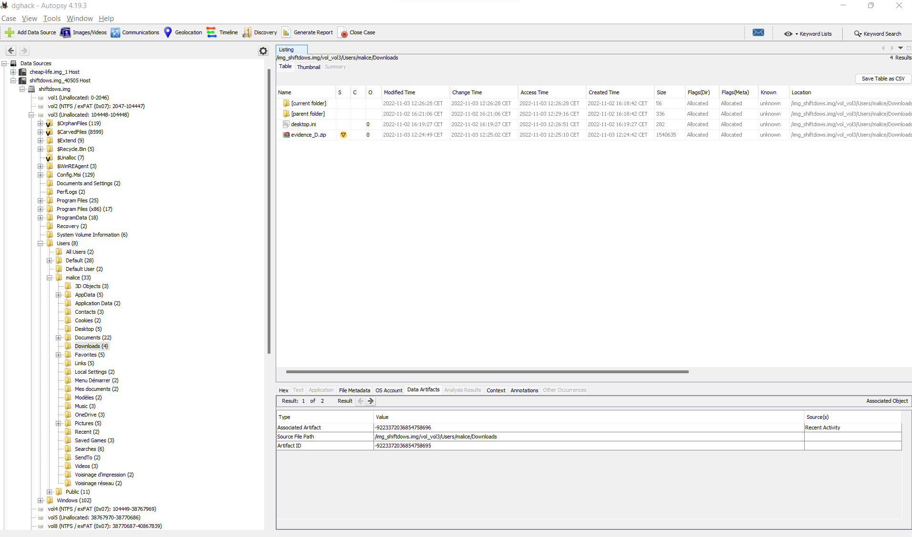

# Shiftdows

> En tant qu'auditeur de cyber-sécurité, vous intervenez en pleine cyber attaque. Un des ordinateurs de notre système d'information est actuellement compromis par un rançongiciel. En pleine gestion de crise, le support technique a supprimé tous les fichiers chiffrés par erreur. De plus, la sauvegarde est corrompue, nous n'arrivons pas à démarrer sur le système.
>
> Aidez nous à retrouver les informations sur les utilisateurs francophones.

## Description

On nous donne une image Windows à analyser, que j'ouvre avec Autopsy.

Dans le dossier `Users\malice\Downloads`, je trouve un fichier `evidence_D.zip`.



J'extrais les fichiers, il y a dans le zip un fichier texte qui nous indique qu'il s'agit d'une image, un fichier CSV qui liste les secteurs et le fichier système.

J'extrais tous les fichiers avec `binwalk evidence_D.001`.

Il y a de nombreux fichiers CSV extraits, je cherche le flag dans tous les fichiers extraits :

```bash
grep -r DGHACK _evidence_D.001.extracted/
```

Flag : `DGHACK{3XC31_11F3_83H1ND_MF7_3X7r4C710N}`