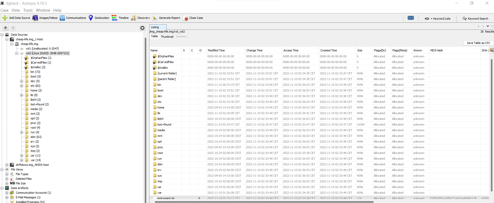

# Vivre pas cher

> Notre serveur a été piraté. C'est une évidence.
>
> Ils dévoilent notre code source sans arrêt, dès que nous le mettons à jour.
>
> Vous devez trouver l'origine de cette backdoor dès que possible.
>
> Annie Massion, Services postaux

## Trouver la backdoor

On nous donne une image disque à analyser.

J'ouvre l'image dans Autopsy, il s'agit d'une image d'un système Linux.



La description parle de code source dévoilé sans arrêt, il y a donc probablement un programme qui tourne régulièrement et qui envoie le code quand il est mis à jour.

Je regarde donc dans les cronjob aux emplacements `/etc/cron*` mais je ne trouve rien.

De même, `/home` et `/root` ne contiennent rien d'intéressant.

Il s'agit peut-être d'un service alors ? Je regarde `/etc/init.d` et `/etc/systemd`.

Gagné ! Je trouve le fichier suivant:

/etc/systemd/system/systembd.service
```
[Unit]
Description=backdoor
After=network.target

[Service]
User=root
Type=simple
ExecStart=/usr/sbin/groupdel start_backdoor
Restart=on-failure
RestartSec=10s

[Install]
WantedBy=multi-user.target
```

On voit que le service est une backdoor qui est exécutée par `root` et dont la commande est `/usr/sbin/groupdel start_backdoor`.

## Analyse du fichier

J'extraie donc l'exécutable `/usr/sbin/groupdel` et je l'ouvre avec Ghidra :

```c
undefined8 main(int param_1,long param_2)
{
  int iVar1;
  
  if (param_1 == 2) {
    iVar1 = strcmp(*(char **)(param_2 + 8),"start_backdoor");
    if (iVar1 == 0) {
      start_backdoor(0x2a);
    }
  }
  return 0;
}
```

La fonction `start_backdoor` n'est pas présente dans l'exécutable et est définie par une librairie.

Je cherche la librairie utilisée grâce à la commande `strings groupdel | grep .so`.

```bash
$ strings groupdel | grep .so
/lib64/ld-linux-x86-64.so.2
libc.so.6
/usr/lib/libsysd.so
__dso_handle
```

La librairie est donc `/usr/lib/libsysd.so`, je l'extraie et l'ouvre avec Ghidra :

```c
void start_backdoor(int param_1)
{
  if (param_1 == 0x31a4b3) {
    printf("debug");
    printf(
          "REdIQUNLe1N5c3RlbURJc0FGcmVuY2hFeHByZXNzaW9uQWJvdXRMaXZpbmdPdXRPZlJlc291cmNlZnVsbmVzc1dpd GhMaXR0bGVNb25leX0K"
          );
  }
  do {
    sleep(1);
    puts("Program running as intended.");
  } while( true );
}
```

Il s'agit du flag en base 64.

Flag : `DGHACK{SystemDIsAFrenchExpressionAboutLivingOutOfResourcefulnessWithLittleMoney}`