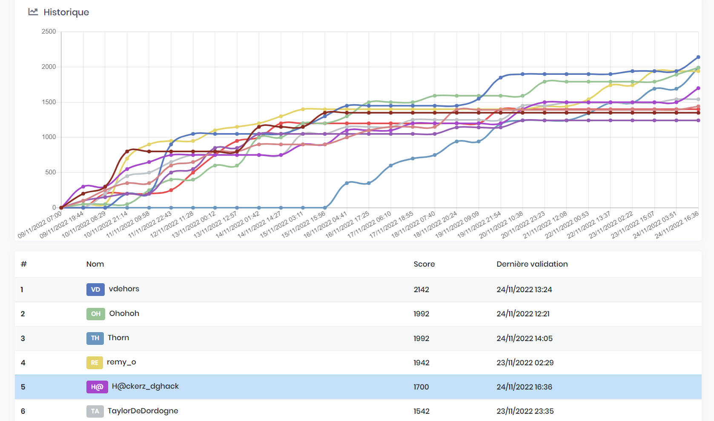

# DG'hAck 2022

Challenge [DG'hAck](https://www.dghack.fr/) organisé par la DGA (Direction Générale de l'Armement), compétition effectuée en solo.

Je suis arrivé 5e (sur 944 participants) avec 1700 points.

## Épreuves

| Épreuve | Points | Catégorie |
|:-------:|:------:|:---------:|
| [Coffre-fort Secret](Dev/Coffre.md) | 50 | dev |
| [ASM ère](Dev/ASM.md) | 200 | dev |
| Piratecraft | 50 | Détection |
| Curlify | 100 | Web |
| Un chasseur sachant chasser 1 | 50 | Web |
| Un chasseur sachant chasser 2 | 200 | Web |
| Wanna more features | 50 | Reverse/Crackme |
| [Unserial killer](Web/Unserial.md) | 200 | Web |
| Is it art | 42 | Stéganographie |
| [Sandchat](Systeme/Sandchat.md) | 200 | Système |
| Shadow4DGA 1 | 50 | Détection |
| Shadow4DGA 2 | 100 | Détection |
| Pas si chronophage | 100 | dev |
| [Hack Trick](Reverse/HackTrick.md) | 200 | Reverse |
| Cryptobvious | 50 | Crypto |
| Maillon faible | 100 | Crypto |
| RSSSA | 100 | Crypto |
| Pas un bon nom | 50 | Forensics |
| Ne jamais renoncer | 50 | Stéganographie |
| Vivre pas cher | 100 | Forensics |
| Ministry of catapult | 100 | Forensics |
| Shiftdows | 100 | Forensics |
| Buffoid | 200 | Exploit |