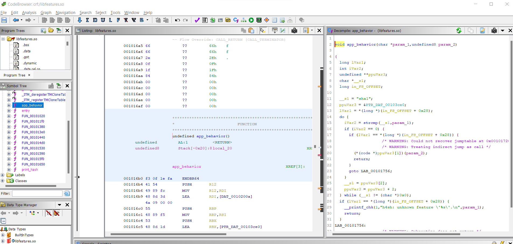
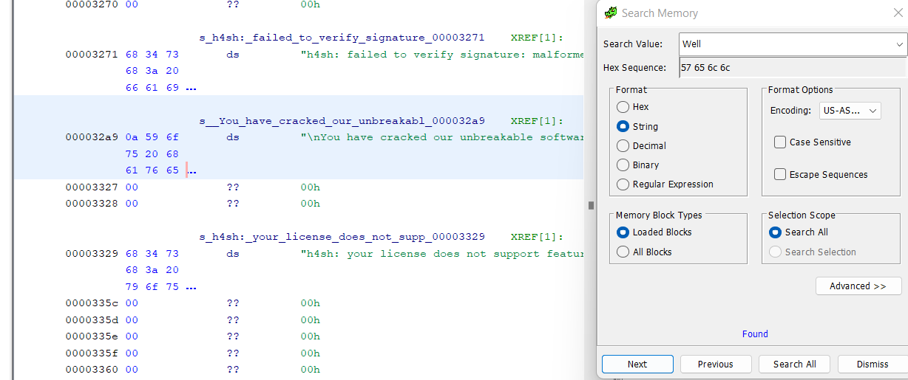
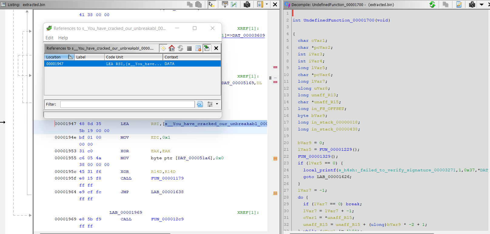

# Wanna more features?

> Nous utilisons un programme de hachage très avancé dans notre entreprise. Ce programme s'appelle H4SH.
>
> Vous le savez, nos opérations sont confidentielles.
>
> Nous avons réussi à obtenir une licence limitée mais ne pouvons pas obtenir la licence complète.
>
> Nous savons qu'il existe un prototype d'un nouvel algorithme de hachage très avancé dans le programme.
>
> Trouvez cette fonctionnalité. Trouvez un moyen de l'activer. Et essayez-la.
>
> Ce message ne s'auto-détruira pas.

## Description

On nous donne accès à un serveur.

J'ai passé un temps fou à trouver où se trouve le programme, qui finalement se trouve être dans le dossier `/opt/h4sh`.

Le dossier a la structure suivante :

```
h4sh
|-- bin
|   |-- start-H4SH.bin
|-- etc
|   |-- features.xml
|-- lib
|   |-- libfeatures.so
|   |-- libcrypto.so.1.1
|-- start-H4SH.sh
```

`start-H4SH.sh` est le code suivant :
```bash
#!/bin/sh

FEATURES_XML=./etc/features.xml
export FEATURES_XML

LD_LIBRARY_PATH=./lib
export LD_LIBRARY_PATH

exec ./bin/start-H4SH.bin "$@"
```

Il charge donc les librairies contenues dans `lib` et le fichier `features.xml`, puis lance `start-H4SH.bin`.

On peut lire le fichier `features` :
```xml
<product>
  <name>H4SH</name>
  <version>1.2.3</version>
  <vendor>Unbreakable Software</vendor>
  <features>
    <sha1>yes</sha1>
    <sha224>no</sha224>
    <sha256>yes</sha256>
    <sha384>no</sha384>
    <sha512>yes</sha512>
    <md4>no</md4>
    <md5>yes</md5>
  </features>
  <seal>gSP7PJk6MFAGK5hXMpKTlB+v0Awpq7P5+pHCNv7gwZ5Lp3WCnop0Z3iv+51mJ5hNfH3DBb/ENrGSHPB5IDlmBmgVQabaxSrDZqLMa5v9/95K0Chr1iSbrSzMZryD1d5DPQvSFY+304ehGkWbrLSjzCIcvvgU7Y1031PoF5mH9yA0S/SNumX+R+WzslkZTV2wDvkRpG94UeXYtofcMi7I8AMDcd6e0LOGxzxWQ7/ZPmvJiA3Y+2R9jKUkSk2bislc9PM1ubmd05xKEd9HXd08n9An6KAgbReFSzG4eNJoMzOWlWrArgdAIp15x3iwqK5YjvCg+LqhDEtovui6LJciHQ==</seal>
</product>
```

Il y a donc une signature qui garantit l'authenticité du fichier.

Malheureusement, on ne peut pas lire `start-H4SH.bin`, le fichier est seulement exécutable.
Le flag est probablement dedans.

La librairie `libcrypto.so.1.1` semble être une librairie standard, tandis que `libfeatures.so` contient deux fonctions : `app_behavior` et `print_hash`.



On apprend en regardant le code qu'il y a une fonctionnalité cachée : `sha10x256`.
Il faut probablement l'appeler pour avoir le flag.

Malheureusement, le flag est inclus dans le binaire principal et non dans la librairie.


## Solution

On sait qu'il est possible de fournir nos propres librairies en changeant `LD_LIBRARY_PATH`.

Je vois donc deux méthodes : la première est de comprendre comment la signature du fichier `features.xml` est vérifiée, et faire en sorte que la signature réussisse en changeant la fonction appelée pour la vérification.

Une autre méthode est d'extraire le code de `start-H4SH.bin` qui est chargé en mémoire lors de l'exécution.

Je pars plutôt sur la seconde méthode.
Pour ce faire, je réécris la fonction `app_behavior` qui est appelée par le programme.

Je crée donc un fichier `features.h`:
```c
void app_behavior(char* type, char* data);
void print_hash(int a, long b);
```

Et un fichier `features.c`:
```c
#include <stdio.h>
#include <stdlib.h>
#include <string.h>


void hexDump(void *addr, int len) 
{
    unsigned char *pc = (unsigned char*)addr;

    for (int i = 0; i < len; i++)
        printf("%02x", pc[i]);
    puts("");
}

void app_behavior(char* type, char* data) {
    int before = 0x1900;
    int after = 0x4000;
    int destination = 0x1918;
    void (*foo)(void) = (void (*)())(__builtin_return_address(0)-before+destination);
    foo();
}

// DGHACK{G00DLUCK74R1NG70UND34574ND7H1SFL4G1FY0UD0N75P34KL337}

void print_hash(int a, long b) {}
```

La méthode est que je récupère l'adresse de retour de la fonction `app_behavior` (qui est donc une instruction du programme `start-H4SH.bin`), puis j'écris sur la sortie standard les octets situés autour de cette adresse.

Je trouve les offsets en tâtonnant, en augmentant progressivement l'offset jusqu'à avoir une erreur de segmentation.

Je compile avec la commande :
```bash
gcc -o features.o -c features.c && gcc -shared -o libfeatures.so features.o -lm
```

Sur la machine cible, je peux alors créer un nouveau dossier avec ma librairie `libfeatures.so` et la librairie originale de cryptographie, puis lancer le programme.

Je cherche d'abord le flag avec `strings`.
Je ne trouve pas directement le flag, mais je trouve la chaîne de caractères `Just kidding ;-). Well done!`.

J'ouvre donc le binaire extrait avec Ghidra et cherche une référence vers cette chaîne.





Le code important :

```c
if (iVar3 == 0) {
    FUN_00001249(pcVar2,*(undefined8 *)(unaff_R13 + 0x10));
    iVar4 = FUN_000012d9(*(undefined8 *)(unaff_R13 + 8),s_sha10x256_00002ff8);
    if (iVar4 == 0) {
        lVar5 = 0;
        do {
        bVar9 = (&DAT_00003609)[lVar5];
        if (bVar9 != 0) {
            bVar9 = bVar9 ^ 0xcb;
        }
        (&DAT_00005169)[lVar5] = bVar9;
        lVar5 = lVar5 + 1;
        } while (lVar5 != 0x3d);
        DAT_000051a6 = 0;
        iVar3 = 0;
        FUN_00001179(1,s__You_have_cracked_our_unbreakabl_000032a9,&DAT_00005169);
    }
    goto LAB_000013c8;
}
```

Le flag est donc contenu dans la mémoire `DAT_00003609`, auquel il faut xor 0xcb.
Le code Python suivant permet d'afficher le flag:

```python
with open("extracted.bin", "rb") as f:
    data = f.read()

flag = "".join([chr(data[0x3609+i]^0xcb) for i in range(0x3d)])
print(flag)
```

Flag : `DGHACK{G00DLUCK74R1NG70UND34574ND7H1SFL4G1FY0UD0N75P34KL337}`.