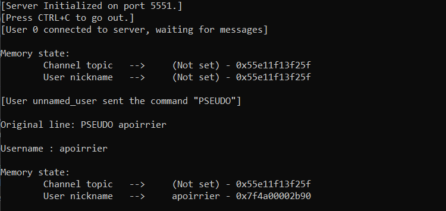
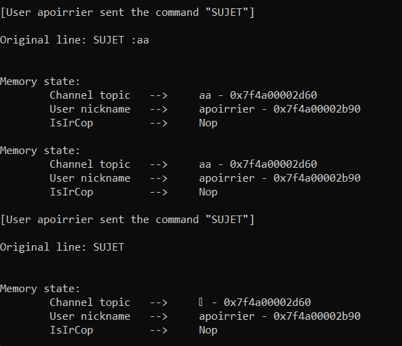
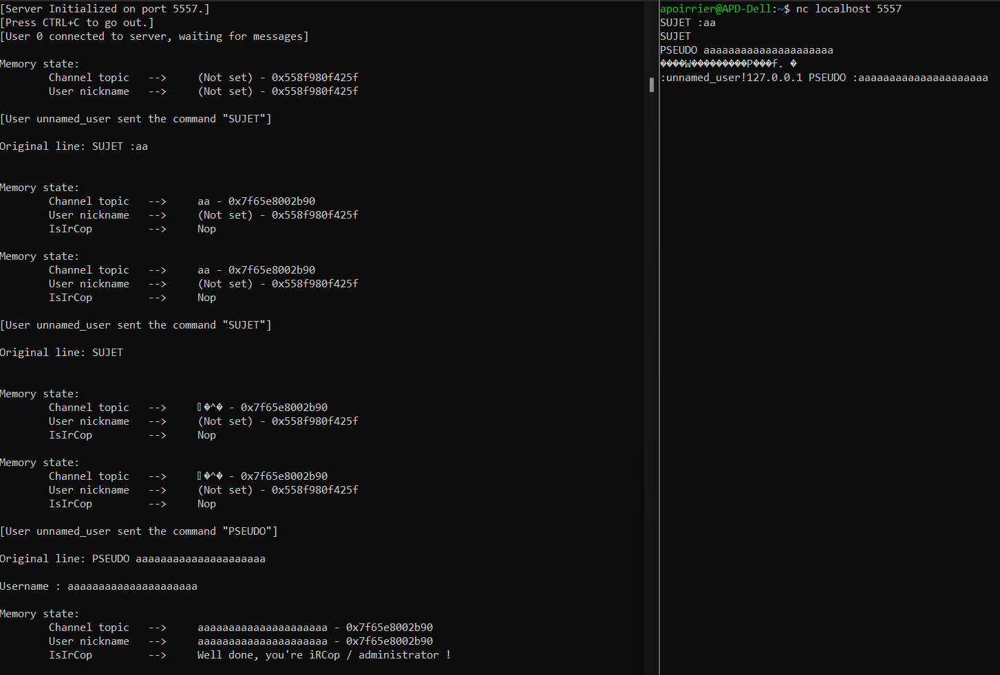

# Sandchat

> Vous disposez d'un acces ssh à une application de surveillance d'un serveur.
>
> Saurez vous en échapper ?
>
> Selon nos sources un service serait vulnérable sur cette machine.
>
> A vous de découvrir son point faible..

## S'échapper de la sandbox

On peut accéder à un serveur via SSH.

Lorsque l'on se connecte, on arrive sur une sandbox:

```
Welcome to SANDBOX 1.2.3

Securely monitor system informations. Enjoy!

Available commands:
  date                  : display the current system date
  uname                 : print system information
  uptime                : tell how long the system has been running
  ps                    : list system running processes
  df                    : display system filesystems usage
  mount                 : display system mount points
  free                  : display system memory usage
  vmstat                : display virtual memory statistics
  ls [PATH]             : list PATH informations or contents
  backup [FILE]         : get a backup of a configuration file from etc folder
  pkglist               : list packages installed on the system
  du [etc|bin|sys|var]  : display the disk usage of the specified folder
  top                   : display system load
  exit                  : leave the sandbox
```

On a donc accès à plusieurs commandes.

Je les teste toutes, et toutes fonctionnent comme prévu à l'exception de `vmstat` qui n'est pas disponible.

Les seules commandes qui sont un point de sortie potentiel de la sandbox sont `ls` et `backup`, car seules celles-ci permettent d'entrer des arguments de manière arbitraire.

### `ls`

Grâce à `ls` on obtient l'arbre du répertoire actuel:

```
.
|-- .bash_logout
|-- .bashrc
|-- bin
|   |-- list of symlinks that point towards executables from /usr/bin
|-- etc
|   |-- motd.conf
|   |-- sandbox.conf
|-- .profile
|-- sys
|   |-- sandbox
|   |   |-- 651
|   |   |   |-- exe : symlink towards /proc/651/exe
|-- TODO
|-- var
|   |-- log
|   |   |-- symlinks towards files from /var/log
```

En revanche, tout chemin contenant `..` semble interdit, on ne peut donc pas explorer la VM.

## `backup`

La commande `backup file` affiche `file` en base 64 sur la console.

Heureusement, si `ls` interdit `..`, ce n'est pas le cas de cette commande, à condition toutefois que le fichier reste l'un des fichiers du sous-dossier (je ne peux pas afficher `/etc/passwd` par example, mais pas de souci pour afficher `TODO`.)

Après avoir ouvert tous les fichiers, je remarque qu'aucun lien symbolique ne fonctionne, à l'exception de l'exécutable de la sandbox.

```
backup ../sys/sandbox/651/exe
```

Le programme s'affiche en base64, je peux donc l'extraire sur mon ordinateur et le reconvertir en exécutable.

### Analyse de l'exécutable

J'ouvre l'exécutable avec Ghidra.

La fonction `entry` me permet de trouver la fonction `main` qui est le premier argument de `__libc_start_main`.

Il s'agit d'un grand code à reverse, ce que j'effectue pas à pas.

Après un processus d'initialisation, on tombe sur le code qui scanne l'entrée donnée :

```c
__printf_chk(1,"[SANDBOX] Your command: ");
fflush(stdout);
process = fgets(command,0x400,stdin);
if (process != (char *)0x0) goto code_r0x001027f0;

code_r0x001027f0:
  process = strchr(command,10);
  if (process != (char *)0x0) {
    *process = '\0';
  }
  args = (char *)0x0;
  cmd = (byte *)strtok_r(command," \t",&args);
 // redacted code concerning exiting the sandbox
      if (DAT_00108010 == 0x2cdaddf5) {
                    /* "hash" */
        DAT_00108010 = 0x68736168;
      }
      iVar3 = strcmp((char *)cmd,(char *)&DAT_00108010);
      process = args;
      if (iVar3 == 0) {
        path = (char *)0x0;
        process = strtok_r(args," \t",&path);
        if (process == (char *)0x0) {
          if (DAT_00108010 == 0x2cdaddf5) {
            DAT_00108010 = 0x68736168;
          }
          __fprintf_chk(stderr,1,
                        "sandbox error: command \'%s\': missing executable path argument!\n",
                        &DAT_00108010);
        }
        else {
          args2 = strtok_r((char *)0x0," \t",&path);
          if (args2 == (char *)0x0) {
            if (DAT_00108010 == 0x2cdaddf5) {
              DAT_00108010 = 0x68736168;
            }
            __fprintf_chk(stderr,1,"sandbox error: command \'%s\': missing alias argument!\n",
                          &DAT_00108010);
          }
          else {
            args3 = strtok_r((char *)0x0," \t",&path);
            if (args3 == (char *)0x0) {
              do {
                if (*ppcVar13 == (char *)0x0) {
                  args2 = strdup(args2);
                  (&COMMAND_LIST)[(long)iVar3 * 2] = args2;
LAB_00102de9:
                  free((void *)(&DAT_00108308)[(long)iVar3 * 2]);
                  process = strdup(process);
                  (&DAT_00108308)[(long)iVar3 * 2] = process;
                  goto LAB_START_LOOP;
                }
                iVar4 = strcmp(*ppcVar13,args2);
                if (iVar4 == 0) goto LAB_00102de9;
                iVar3 = iVar3 + 1;
                ppcVar13 = ppcVar13 + 2;
              } while (iVar3 != 10);
              fwrite("sandbox error: maximum number of user defined commands reached!",1,0x3f,std err
                    );
            }
            else {
              if (DAT_00108010 == 0x2cdaddf5) {
                DAT_00108010 = 0x68736168;
              }
              __fprintf_chk(stderr,1,"sandbox error: command \'%s\': too many arguments!\n",
                            &DAT_00108010);
            }
          }
        }
      }
```

On voit donc que l'argument entré est comparé avec `0x68736168` (qui se décode comme `hash`) : c'est une commande cachée dans la sandbox.

Cette commande prend deux arguments `name` et `path`, et ajoute à la liste de commandes disponible la commande `name` donc l'exécutable est donne par `path`.

On peut donc s'échapper de la sandbox en donnant les commandes suivantes :

```
hash /bin/bash bash
bash
```

## Trouver le flag

Une fois sorti de la sandbox, tout n'est pas fini.

L'utilisateur `sandbox` n'a aucun fichier supplémentaire.

Je vois en revanche qu'il y a deux utilisateurs en regardant le contenu de `/home`: `malice` et `circ_server`.

Bien entendu, `sandbox` n'a pas accès à leurs fichiers.

En explorant un peu, je vois avec `ps` qu'un serveur tourne et est exécuté par `circ_server`.

Au vu du nom du challenge, il va probablement falloir hacker ce serveur pour obtenir un secret.

Le serveur est dans `/opt/circ_server`. Il est disponible en lecture, je peux donc extraire l'exécutable en l'affichant en base 64.

On nous fournit également une documentation qui liste les commandes possibles.

Le fichier `conf.ini` n'est cependant pas accessible en lecture, le flag est probablement dedans.

## Hacker le serveur

Pour reverse le serveur, j'utilise Ghidra et je le fais tourner en local.

La fonction `main` gère toute la partie réseaux et sockets.
Quand un nouvel utilisateur se connecte, la fonction de l'utilisateur est `connect_user`.

Celle-ci est principalement une boucle qui attend l'entrée de l'utilisateur, la scanne et en fonction de la commande entrée appelle la fonction correspondante.

J'ai alors exploré toutes les fonctions.

En premier lieu, en faisant tourner le serveur localement, j'ai remarqué que de nombreuses informations de debug sont présentes :



On voit qu'il y a deux variables globales, `channel` et `userName`, dont les valeurs sont affichées.

Il y a aussi des informations concernant les commandes envoyées.

### PSEUDO

La fonction pour changer de pseudo est la suivante :

```c
void uaf_changeNick(long user,char *full_command)
{
  long lVar1;
  int iVar2;
  char *pcVar3;
  size_t sVar4;
  FILE *__stream;
  long in_FS_OFFSET;
  char *local_30;
  char *local_28;
  
  lVar1 = *(long *)(in_FS_OFFSET + 0x28);
  printf("\nOriginal line: %s\n",full_command);
  strtok(full_command," ");
  pcVar3 = strtok((char *)0x0,"\r\n");
  if (pcVar3 != (char *)0x0) {
    iVar2 = strcmp(pcVar3," ");
    if (iVar2 != 0) {
      if ((userName != (char *)0x0) && (is_userName_freed == 0)) {
        free(userName);
        userName = (char *)0x0;
      }
      sVar4 = strlen(pcVar3);
      userName = strndup(pcVar3,sVar4);
      is_userName_freed = 0;
      if ((channel != 0) && (*(long *)(channel + 0x10) != 0)) {
        local_28 = (char *)0x0;
        __stream = fopen("conf.ini","rb");
        if (__stream != (FILE *)0x0) {
          fseek(__stream,0,2);
          sVar4 = ftell(__stream);
          fseek(__stream,0,0);
          local_28 = (char *)malloc(sVar4);
          if (local_28 != (char *)0x0) {
            fread(local_28,1,sVar4,__stream);
          }
          fclose(__stream);
        }
        if (local_28 != (char *)0x0) {
          sVar4 = strlen(local_28);
          local_30 = (char *)malloc(sVar4 + 1);
          strcpy(local_30,local_28);
        }
        pcVar3 = (char *)stradd(local_30,&END_LINE);
        sVar4 = strlen(pcVar3);
        write(*(int *)(user + 0x20),pcVar3,sVar4);
      }
      goto LAB_00103411;
    }
  }
  puts("Need a username");
  userName = (char *)0x0;
LAB_00103411:
  if (lVar1 != *(long *)(in_FS_OFFSET + 0x28)) {
                    /* WARNING: Subroutine does not return */
    __stack_chk_fail();
  }
  return;
}
```

Je vois que le programme lit et envoie le contenu du fichier `conf.ini` : c'est donc là qu'il faut aller, c'est comme cela qu'on récupère le flag.

Pour y accéder, il faut que `channel` soit non nul, et que `*(channel + 0x10)` soit également non nul.

Explorons donc les mécanismes autour de `channel`.

### SUJET

`channel` est modifié quand on entre une commande `SUJET`.
`param1` est la structure concernant l'utilisateur courant et `param2` l'entrée de l'utilisateur.

```c
void receive_topic(undefined8 param_1,char *param_2)
{
  long lVar1;
  char *pcVar2;
  char *__s;
  size_t sVar3;
  long in_FS_OFFSET;
  
  lVar1 = *(long *)(in_FS_OFFSET + 0x28);
  printf("\nOriginal line: %s\n",param_2);
  strtok(param_2,":");
  __s = strtok((char *)0x0,"\r\n");
  if (__s == (char *)0x0) {
    topicfree(0);
  }
  else {
    sVar3 = strlen(__s);
    if (1 < sVar3) {
      sVar3 = strlen(__s);
      if (sVar3 < 0x11) {
        if ((channel != (char *)0x0) && (is_channel_freed == 0)) {
          free(channel);
        }
        is_channel_freed = 0;
        channel = (char *)malloc(0x18);
        memset(channel,0,0x18);
        sVar3 = strlen(__s);
        strncpy(channel,__s,sVar3);
        pcVar2 = channel;
        sVar3 = strlen(__s);
        pcVar2[sVar3] = '\0';
        *(undefined8 *)(channel + 0x10) = 0;
        goto LAB_00103594;
      }
    }
    printf("Maximum description size is %d characters\n",0x10);
  }
LAB_00103594:
  if (lVar1 != *(long *)(in_FS_OFFSET + 0x28)) {
                    /* WARNING: Subroutine does not return */
    __stack_chk_fail();
  }
  return;
}
```

La fonction récupère la sous-chaîne de l'entrée utilisateur comprise entre `:` et la fin de la ligne `\r\n`, dénoté `__s`.

Il y a alors 3 choix:
- `:` n'est pas présent: `topicfree` est appelé;
- `__s` est de taille supérieur ou égal à 0x11: rien ne se passe à part l'affichage d'un message d'erreur;
- sinon, si `channel` est non nul et que `is_channel_freed` est nul, alors `channel` est libéré, puis réalloué, remis à 0 et rempli avec `__s`.

Ainsi, `channel` contient une structure telle que:
- les 16 premiers octets contiennent le sujet du serveur;
- les 8 octets suivants sont toujours mis à 0.

Aucun endroit dans le code ne permet de mettre à une valeur non nulle ces 8 octets suivants.

Par ailleurs, si `channel` est non nul, la fonction de debuggage nous affiche si on a réussi à mettre à une valeur non nulle ces octets :


Voici l'implémentation de `topicfree`:

```c
void topicfree(void)
{
  long lVar1;
  long in_FS_OFFSET;
  
  lVar1 = *(long *)(in_FS_OFFSET + 0x28);
  if ((channel == (void *)0x0) || (is_channel_freed != 0)) {
    puts("\nNo channel to free");
  }
  else {
    free(channel);
    is_channel_freed = 1;
  }
  if (lVar1 != *(long *)(in_FS_OFFSET + 0x28)) {
                    /* WARNING: Subroutine does not return */
    __stack_chk_fail();
  }
  return;
}
```

On voit ici un problème : `channel` est libéré, mais sa valeur n'est pas remise à 0 !

Or, sa valeur est réutilisée, à la fois pour l'affichage des informations de debuggage, mais aussi pour la vérification du rôle administrateur.

Preuve de concept en envoyant `SUJET :aa` puis `SUJET`:



On voit que le sujet ne représente plus rien, mais pourtant l'adresse pointée par `channel` est restée la même.

### Use-after-free

On a donc l'idée pour notre attaque :
1) allouer et libérer sujet de telle manière à avoir `channel` pointant vers une adresse du tas non allouée;
2) réallouer cette adresse avec une structure qui mette les 8 derniers octets à une valeur non nulle;
3) Appeler la fonction PSEUDO une fois admin.

Pour l'étape 2, on peut utiliser le pseudo en allouant un pseudo de taille supérieure à 16 caractères (pour avoir `channel+0x10` non nul) mais inférieur à 0x18 caractères (pour que le bloc tienne à l'emplacement de `channel`).

Testons: `PSEUDO aaaaaaaaaaaaaaaaaaaaa`



Plus qu'à reproduire sur le serveur et obtenir le flag.

Flag : `DGHACK{13_ch4t_94t34u_p3ut_3t23_d3_54813}`