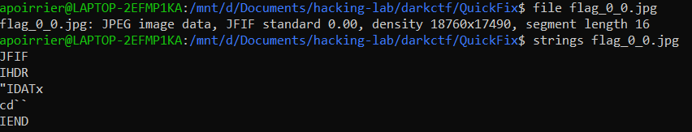
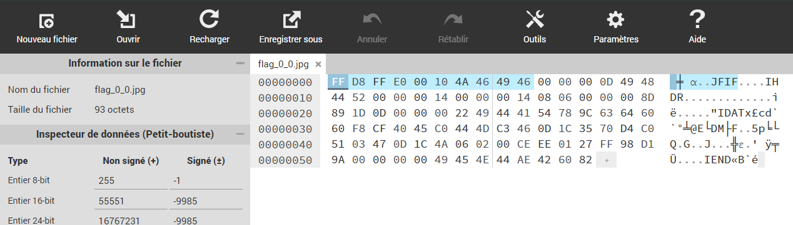
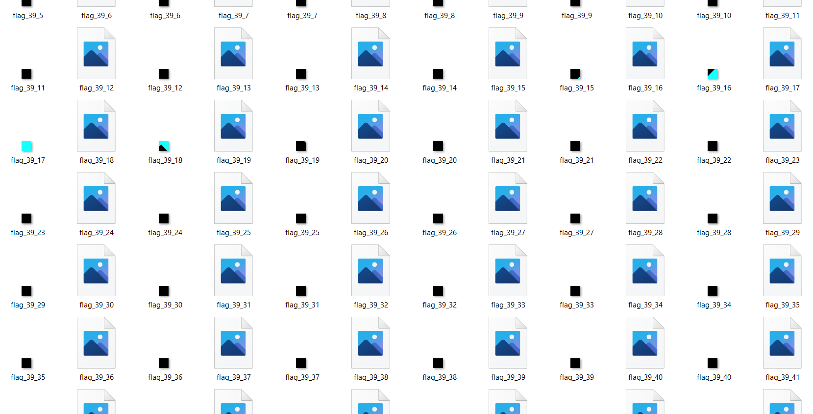
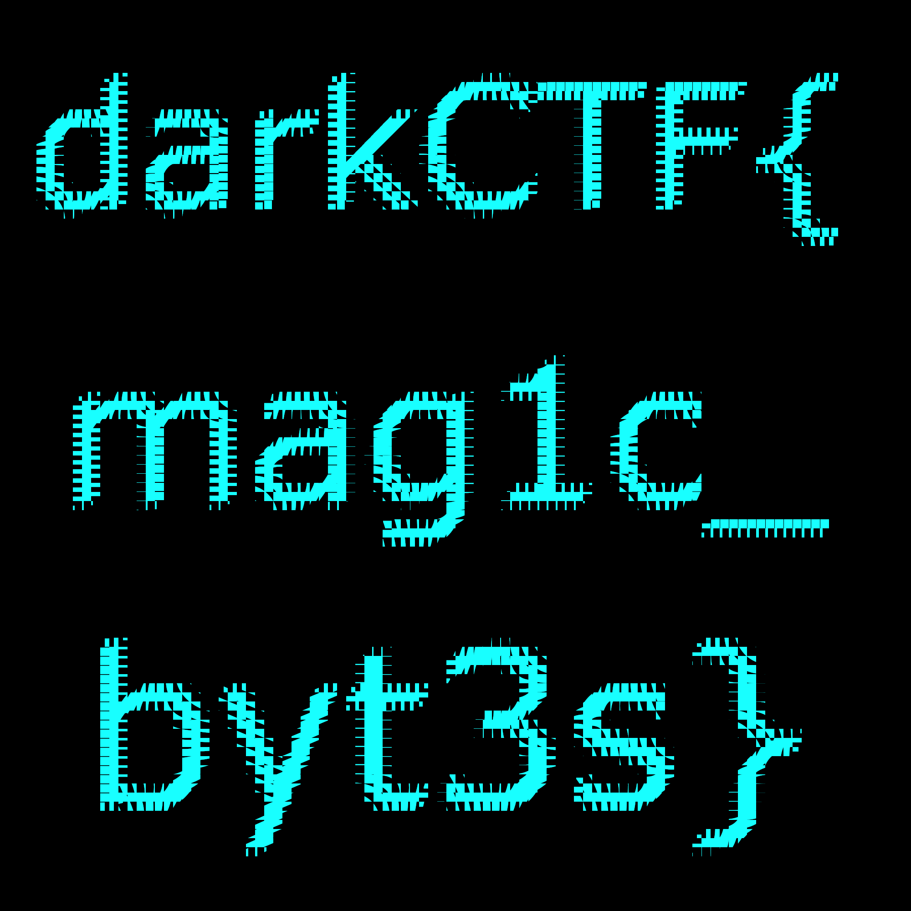

# Quick Fix

> Magic is in the air! Want a byte of it?

Attached is a huge zip file. We open it and extract 10000 broken jpg files.

## Description

From the description of the challenge, the magic numbers of the file are probably wrong. This is verified as we use `file` on one of them, as the density seems off. By using `strings` on the file, we see some `IHDR`, `IDAT` and `IEND` tag: this is probably a png image.



So let's open the file with [Hexed.it](https://hexed.it/). From the [PNG specification](https://www.w3.org/TR/PNG/#5PNG-file-signature), we know a PNG file begins with a signature `89 50 4E 47 0D 0A 1A 0A`. Then the next chunk starts, beginning with its size `00 00 00 0D` and its magic number `49 48 44 52`.

We see in the file the chunk, so let's just replace the first 10 bytes by the 8 bytes of a PNG header. 



This works and we now have a valid PNG image of size 20*20.

Now we observe images are called `flag_i_j.jpg` with `i,j` ranging between 0 and 99. The idea would probably to combine them to form a super image of size 2000*2000.

## Solution

First, we want to automatize the conversion from broken JPG to PNG. We do this with this Python function:

```python
def modify_file(filename):
    with open(filename, "rb") as f:
        with open(filename.replace("jpg", "png"), "wb") as g:
            image = f.read()
            
            image2 = bytes.fromhex("89504E470D0A1A0A")
            g.write(image2 + image[10:])
```

It opens the broken file, and on another file it concatenates the magic numbers of PNG header and the remainder of the image.

Using a loop we convert all images. By browsing a little bit, we remark most images are black, but some of them have a little bit of blue in it. Therefore we want to combine them.



This Python script does the combinaison:

```python
import numpy as np
from PIL import Image

data = np.zeros((2000,2000,4), dtype=np.uint8)

for i in range(100):
    for j in range(100):
        #modify_file("flag_{}_{}.jpg".format(i,j))
        im = Image.open("flag_{}_{}.png".format(i,j))
        array = np.array(im.getdata()).reshape(20,20,4)
        data[20*i:20*(i+1), 20*j:20*(j+1)] = array

img = Image.fromarray(data, 'RGBA')
img.save('flag.png')
```

Finally, we get a full image. By rotating it and performing some symmetry with any drawing software, we obtain the flag.



Flag: `darkCTF{mag1c_byt3s}`