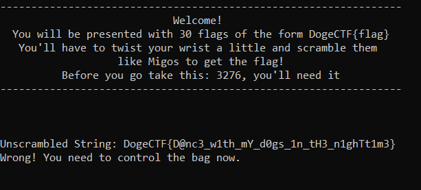

# In the Kitchen Wrist Twistin like it's Stir Fry

## Description

> I love a little strfry
> 
> nc ctf.umbccd.io 5100

## Solution

Let's connect to the server.


The challenge is then to scramble the given strings (there are 30 of them) in order to get the flag. For every string, we have less than one second to enter the scrambled string, and only one try... Therefore we need to guess fast the scrambled string. Fortunately, the strings to scramble remain the same across different runs and appear in the same order.

From the challenge name and description, we know the strings are scrambled using `strfry`. From the [documentation](http://man7.org/linux/man-pages/man3/strfry.3.html):

```
The strfry() function randomizes the contents of string by randomly swapping characters in the string. The result is an anagram of string.
```

So what we need to do is to call `strfry` on each input we are given. However we need to synchronize with the server's randomness.

I have tried to initialize the seed of `strfry` with `srand`, but without success (locally with a chosen seed I do not always produce the same result). Therefore I dive into the [code](https://code.woboq.org/userspace/glibc/string/strfry.c.html) of `strfry` to understand how pseudo randomness is produced.

```c
char *
strfry (char *string)
{
  static int init;
  static struct random_data rdata;
  if (!init)
    {
      static char state[32];
      rdata.state = NULL;
      __initstate_r (time ((time_t *) NULL) ^ getpid (),
                     state, sizeof (state), &rdata);
      init = 1;
    }
  size_t len = strlen (string);
  if (len > 0)
    for (size_t i = 0; i < len - 1; ++i)
      {
        int32_t j;
        __random_r (&rdata, &j);
        j = j % (len - i) + i;
        char c = string[i];
        string[i] = string[j];
        string[j] = c;
      }
  return string;
}
```

Here it is: the seed is `time(NULL) ^ getpid()`. Fortunately, the PID is given by the server (see image above). We only need to synchronize with the server's time. 

### Synchronize with the server

I modify the `strfry` function to provide my own seed.

```c
#include <string.h>
#include <stdlib.h>
#include <time.h>
#include <unistd.h>
#include <stdio.h>

char *
mystrfry (char *string, int seed)
{
  static int init;
  static struct random_data rdata;
  if (!init)
    {
      static char state[32];
      rdata.state = NULL;
      initstate_r (seed,
                     state, sizeof (state), &rdata);
      init = 1;
    }
  size_t len = strlen (string);
  if (len > 0)
    for (size_t i = 0; i < len - 1; ++i)
      {
        int32_t j;
        random_r (&rdata, &j);
        j = j % (len - i) + i;
        char c = string[i];
        string[i] = string[j];
        string[j] = c;
      }
  return string;
}

int main(int argc, char **argv) {
    char to_scramble[] = "DogeCTF{D@nc3_w1th_mY_d0gs_1n_tH3_n1ghTt1m3}";
    char buffer[512];
    char *buf = &buffer[0];
    int seed;

    seed = atoi(argv[1]);

    buf = mystrfry(to_scramble, seed);
    printf("%s\n", buf);
    
    return 0;
}
```

and a simple file to get local time: 

```c
#include <stdio.h>
#include <time.h>

int main() {
    printf("%ld\n", time(NULL));
    return 0;
}
```

And I compile it with `gcc -o strfry strfry.c` and `gcc -o time time.c`.

Then this Python script gives me the time difference between the server and my local machine (I assume the time difference will be smaller than 60s):

```python
from pwn import *
import os

for j in range(-60,60):
    sh = remote("ctf.umbccd.io", 5100)
    time = int(os.popen("./time").read())
    text = sh.recvuntil(",")
    seed = int(text[len(text)-6:len(text)-1])
    seed = (time + j) ^ seed
    print(text.decode())
    print("Offset: ", j)

    scrambled = os.popen("./strfry {}".format(seed)).read()
    print(scrambled)
    print(sh.recvuntil("}").decode())
    sh.sendline(scrambled)

    answer = sh.recvuntil(("Doge", "Wrong")).decode()
    if "Doge" in answer:
        print("Found it!")
        break
```

In this script, I connect to the server, retrieve the PID, and try to match my current time with the server's time, by initializing the seed with the forced server's time and giving the server the scrambled string. In case of success, then the time corresponds.

### Get the flag

Once I know the server's time, the exploit is quite straightforward. I connect to the server, retrieve the PID, then give it to my own `strfry` with the same seed as the server's. It outputs me scrambled strings for all the known strings, and this allow me to get one more string to scramble. I do this again 30 times until I get the flag.

Custom `strfry`:

```c
#include <string.h>
#include <stdlib.h>
#include <time.h>
#include <unistd.h>
#include <stdio.h>

#define OFFSET -1

char *
mystrfry (char *string, int pid)
{
  static int init;
  static struct random_data rdata;
  if (!init)
    {
      static char state[32];
      rdata.state = NULL;
      initstate_r ((time(NULL) + OFFSET) ^ pid,
                     state, sizeof (state), &rdata);
      init = 1;
    }
  size_t len = strlen (string);
  if (len > 0)
    for (size_t i = 0; i < len - 1; ++i)
      {
        int32_t j;
        random_r (&rdata, &j);
        j = j % (len - i) + i;
        char c = string[i];
        string[i] = string[j];
        string[j] = c;
      }
  return string;
}

int main(int argc, char **argv) {
    char buffer[512];
    char *buf = &buffer[0];
    char *buf2;
    int pid;
    size_t len = 0;

    pid = atoi(argv[1]);

    FILE *f = fopen("str_to_fry.txt", "r");
    while (getline(&buf, &len, f) != -1) {
        for(int i=0;i<strlen(buf);++i) {
            if(buf[i] == '\n')
                buf[i] = '\0';
        }
        buf2 = mystrfry(buf, pid);
        printf("%s\n", buf2);
    }
    fclose(f);

}
```

And the Python script:

```python
from pwn import *
import os

for j in range(30):
    sh = remote("ctf.umbccd.io", 5100)
    text = sh.recvuntil(",")
    pid = int(text[len(text)-6:len(text)-1])
    print(text.decode())

    scrambled = os.popen("./strfry {}".format(pid)).read().split("\n")
    print(scrambled)

    with open("str_to_fry.txt", "r") as f:
        original = f.read()

    f = open("str_to_fry.txt", "w")
    for i in range(len(scrambled)):
        text = sh.recvuntil((": ", "Wrong")).decode()
        print(text)
        if "Wrong" in text:
            f.close()
            print("Something went wrong")
            with open("str_to_fry.txt", "w") as g:
                g.write(original)
            exit(1)
        string = sh.recvuntil("}").decode()
        print(string)
        f.write(string + "\n")

        print(scrambled[i])

        sh.sendline(scrambled[i])
    if len(scrambled) == 30:
        sh.interactive()
```

Flag: `DawgCTF{3th0s_p@th0s_l0g0s_m1g0s}`