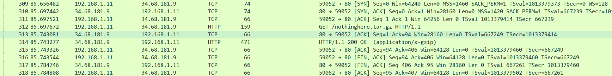
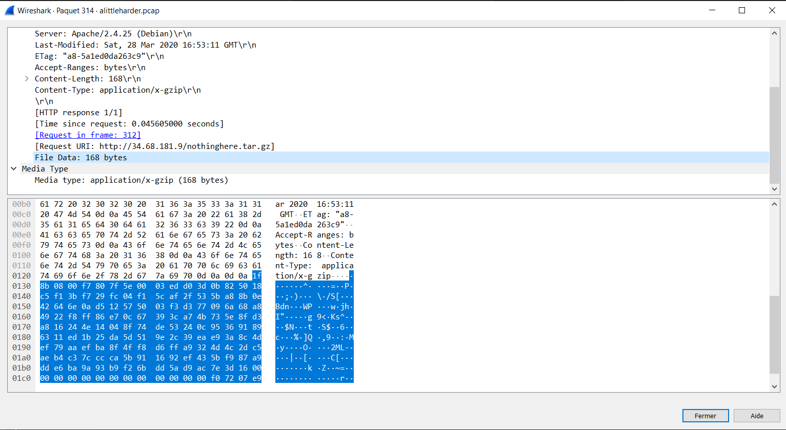

# Another PCAP

## Description

> The flag must be somewhere around here...

A `pcap` file is included.

## Solution

Let's open the capture with [Wireshark](https://www.wireshark.org/). We mostly see UDP traffic, so let's look at it: we select one random UDP packet, right click on it and select `Follow -> UDP Stream`. We browse the UDP streams by changing the stream number, but most streams are not understandable. 

Let's remove UDP streams by applying the filter `!udp`. By browsing, we see some HTTP streams. One of them catches our eyes as a GET request for a `tar` file is replied with an HTTP 200 answer.



Let's click on the reply, and look at the actual file data. 



By right clicking on `File Data`, we can select `Export packets bytes` and save this as a `.tar.gz` file. 

We can extract it with `tar xvf nothinghere.tar.gz` and a file `flag.txt` is extracted, containing:

```
RGF3Z0NURnszeHRyNGN0MW5nX2YxbDM1XzFzX2Z1bn0=
```

We recognize base64 and decode it with [asciitohex](https://www.asciitohex.com/).

Flag: `DawgCTF{3xtr4ct1ng_f1l35_1s_fun}`