# Impossible Pen Test

This challenge is a challenge decomposed in 5 parts. All parts have a common [website](https://theinternet.ctf.umbccd.io/) and we are given the following indication:

> (no web scraping is required to complete this challenge)

Then for each part, we are given a description on where to find the flag.

The website looks like the following:

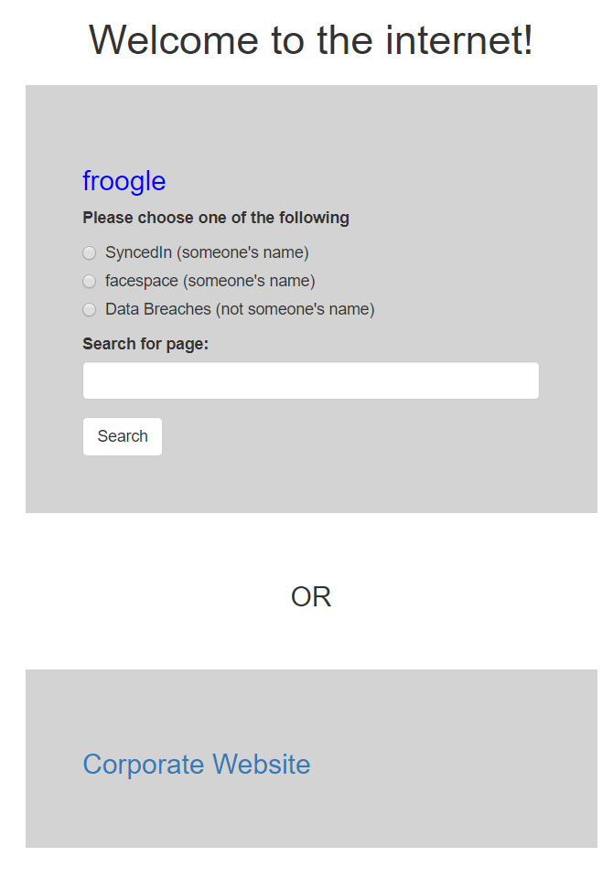

## Part 1

> Welcome! We're trying to hack into Burke Defense Solutions & Management, and we need your help. Can you help us find the password of an affiliate's CEO somewhere on the internet and use it to log in to the corporate site?

Let's find information on the corporate website. 

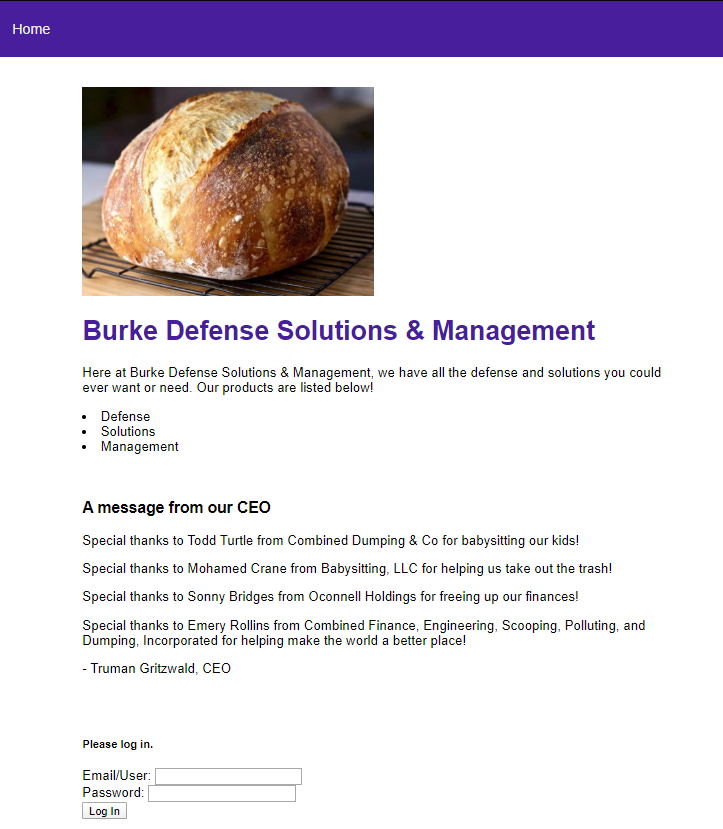

On this page we get some names. Truman Gritzwald is CEO of Burke Defense Solutions & Management (we'll abbreviate is as Burke DSM). We also get a bunch of other names, people from other companies associated to Burke DSM:
- Todd Turtle
- Mohamed Crane
- Sonny Bridges
- Emery Rollins

We also see that we can login with an email address and a password.

Let's go back and let's look them up both on Syncedin (professional social network) and Facespace (personnal social network).

On their Syncedin, we can see their email address. They also all appear to be CEOs, which is great because we are looking for affiliate's CEOs credentials.

Here I will only show relevant information found by browsing the profile pages. First there is this message posted on Rollins' Facespace:

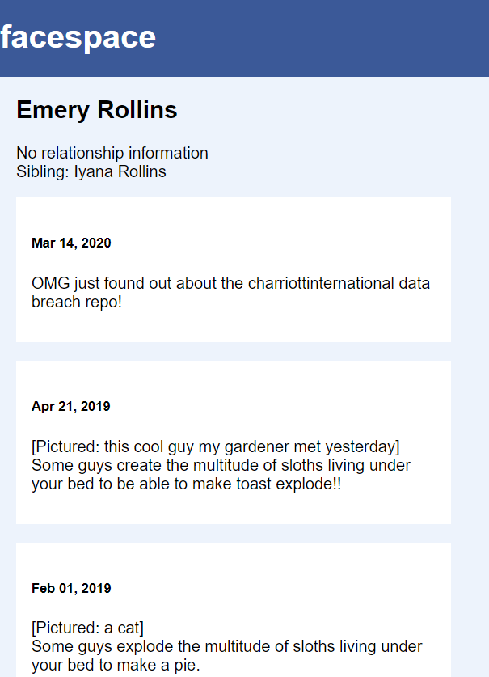

By entering `chariottinternational` into the `data breaches` form, we get a huge `.txt` file with a bunch of email addresses and passwords. Good, we can now look for matching email addresses from our CEOs. We get a match with Sonny Bridges:

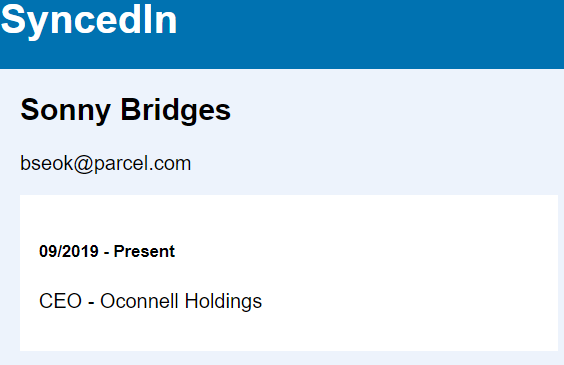

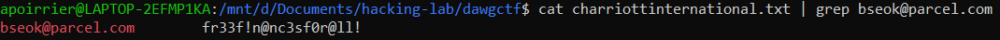

We enter the credentials on the website and we get our first flag (too bad Sonny reused her password).

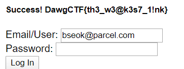

Flag: `DawgCTF{th3_w3@k3s7_1!nk}`

## Part 2

> Welcome! We're trying to hack into Burke Defense Solutions & Management, and we need your help. Can you help us find a disgruntled former employee somewhere on the internet (their URL will be the flag)?

Now we need to look for a disgruntled former employee of the company. The only person we know is part of the company is the CEO, so this is probably a good starting point. Let's have a look at his Facespace page:

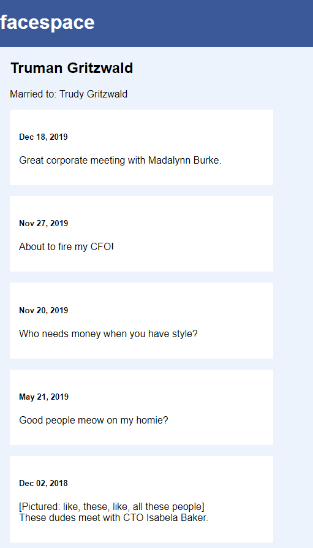

Here we get a lot of information:
- his wife is Trudy Gritzwald
- he has a business partner Madalynn Burke
- he fired his CFO on Nov 27, 2019. Maybe this is the employee we're looking for?
- he knows CTO Isabela Baker.

Let's look at his professional relations first. Isabela Baker is CTO of Burke Holdings, and we get no more relevant information from her profile.

Madalynn Burke is a former CISO of Burke DSM, between 09/2019 and 01/2020. She does not correspond to the fired CFO, plus she got praise from Truman Gritzwald, and her URL has form `Doge{...}` so she's not the employee we're looking for.

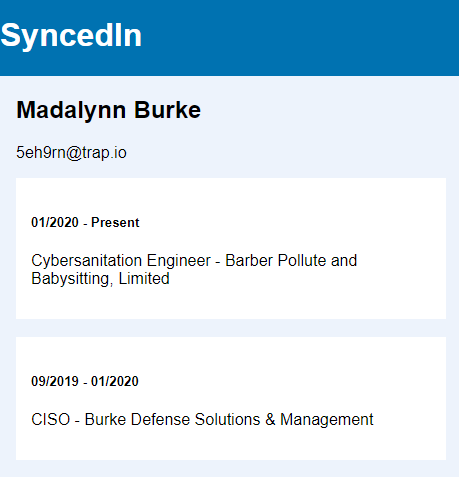

Her Facespace gives us the name of another employee: Royce Joyce, CTO.

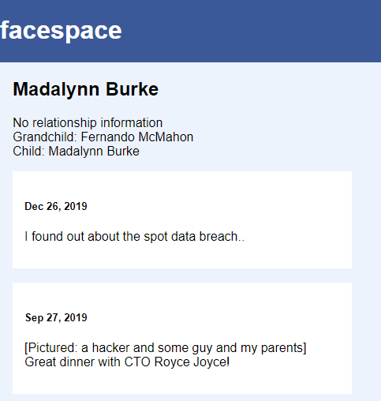

In addition, we get another data breach, with another text file with emails and passwords.

Royce Joyce is CTO of Burke DSM from 03/2019. 

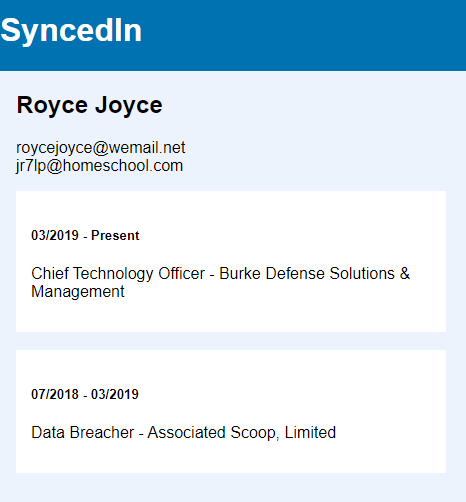

His Facespace page gives us another data breach, as well as all the people in his team.

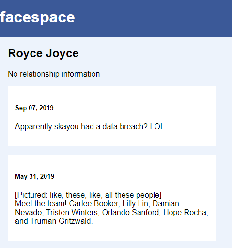

Great, now we have a lot of new names:
- Carlee Booker
- Lilly Din
- Damian Nevado
- Tristen Winters
- Orlando Sanford
- Hope Rocha
- Truman Gritzwad.

We can look them up on Syncedin and Facespace. At last we find a relevant piece of information on Tristan Winters' Facespace page, current CISO of Burke DSM.

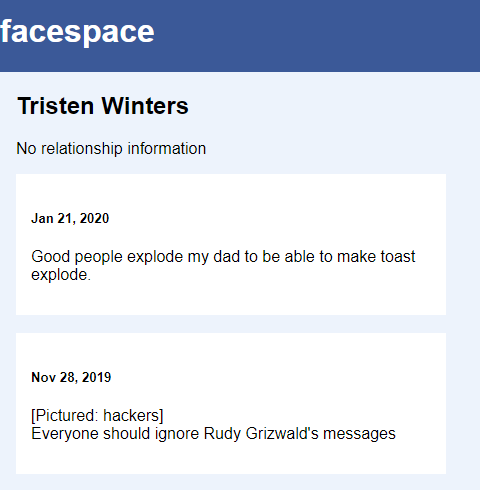

We have a negative message about Rudy Grizwald, the data after Truman Grizwald fired his CFO. We confirm that Rudy Grizwald is the former CFO of Burke DSM.

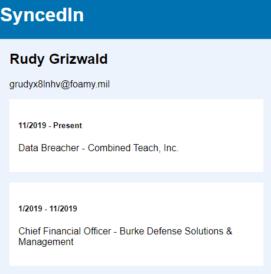

And he definitely has a grudge against the CEO

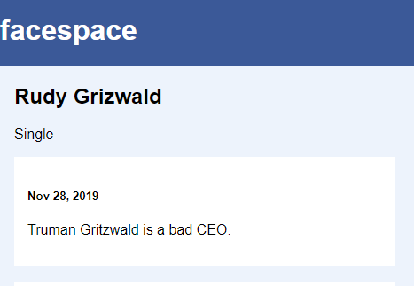

This is confirmed by its url with the flag included.

Flag: `DawgCTF{RudyGrizwald}`

## Part 3

> Welcome! We're trying to hack into Burke Defense Solutions & Management, and we need your help. Can you help us find the mother of the help desk employee's name with their maiden name somewhere on the internet (the mother's URL will be the flag)?

From part 2, we had the whole team of Burke DSM CTO's, and Orlando Sanford happens to be a help desk worker.

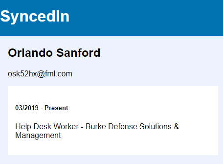

By looking at his Facespace page, we see the name of his mother in a post: Alexus Cunningham.

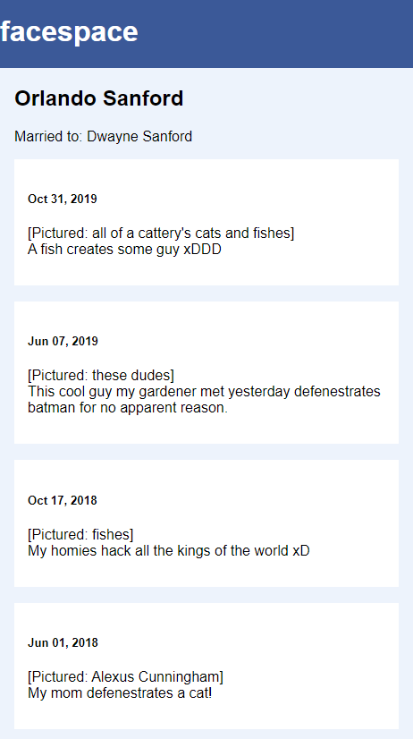

We look at Alexus Cunningham's profile and its URL contains the flag.

Flag: `DawgCTF{AlexusCunningham}`

## Part 4

> Welcome! We're trying to hack into Burke Defense Solutions & Management, and we need your help. Can you help us find the syncedin page of the linux admin somewhere on the internet (their URL will be the flag)?

Once again, we had a bunch of names from part 2, and Hope Rocha is a former Linux Admin of Burke DSM. 

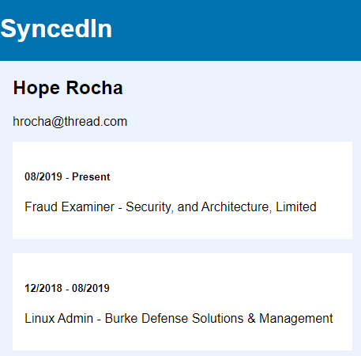

By looking at her Facespace page, we find the name of the current Linux Admin: Guillermo McCoy.

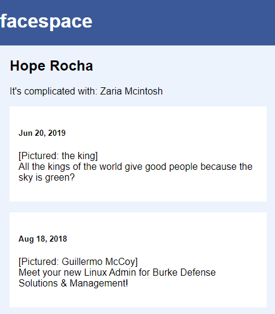

Flag: `DawgCTF{GuillermoMcCoy}`

## Part 5

> Welcome! We're trying to hack into Burke Defense Solutions & Management, and we need your help. Can you help us find the CTO's password somewhere on the internet and use it to log in to the corporate site?

Let's recall from part 2 that the CTO is Royce Joyce. Once again his Syncedin gives away his email addresses.

Moreover, in part 1 we had recovered the Mariott International breach, and in part 2 we had recovered two more breaches from Skayou and Spot. So let's find in those three files if there is a match for Royce Joyce's email.

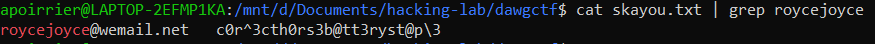

Here it is, let's enter it on the website.

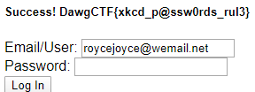

Flag: `DawgCTF{xkcd_p@ssw0rds_rul3}`