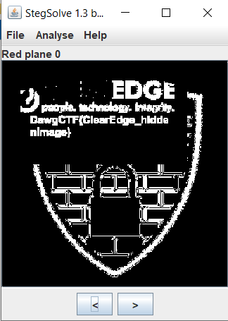

# UMBC Cyber Defense - can it be breached?

## Description

> Is the shield for keeping things in or keeping things out?
> 
> https://clearedge.ctf.umbccd.io/

## Solution

This website is used for finding 4 different flags. This part focuses on the flag hidden in the image representing a shield.

Let's download the image and give it to [StegSolve](https://github.com/zardus/ctf-tools/blob/master/stegsolve/install). By browsing the different color planes, we see the flag.

Flag: `DawgCTF{ClearEdge_hiddenImage}`