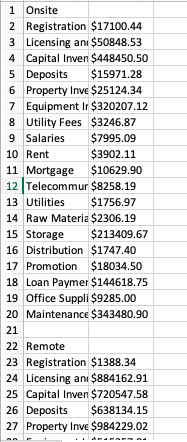

# Benford's Law Firm, LLC

## Description

> Someone's faking their finances. Can you figure out which file has fake financial data?

A zip is joined.

## Solution

We unzip the file and this gives us hundreds of CSV files, with each a different flag as their name. They look like this



I find that there is no mathematical relations between the numbers. So I try to see if the title might be a hint, and yes, Benford's Law is a statistics law (https://en.wikipedia.org/wiki/Benford%27s_law). It says that the first digit of a series of integers follows Benford's Law, and for example `1`is more common than `2`. And this can be used to detect falsified data, which will not follow the law.

So my script is as follows. For each CSV file, I get all of the numbers, and extract their first digits. I then calculate the frequency of each number. I then compare it to the fraquency expected by Benford's law using chi square method. The falsified data is the one that is farthest from the law.

```python
import numpy as np
from scipy import stats
from os import listdir

files = listdir('/path/to/csvs')

result = {}

for file in files:

    filename = '/path/to/csvs' + file

    data =[]
    with open(filename, 'r') as f:
        for l in f:
            try:
                data.append(int("".join(filter(str.isdigit, l.split(',')[1]))[0]))  # get the first digit of each line
            except Exception:
                continue

    found = [data.count(c)/len(data) for c in range(1, 10)]  # found frequency in the file

    expected = [0.301030, 0.176091, 0.124939, 0.096910, 0.079181, 0.066947, 0.057992, 0.051153, 0.045757]  # Expected frequency by Benford's law

    chisq, p= stats.chisquare(found, f_exp=expected)  # Calculate statistical difference

    result[filename] = chisq

for k in sorted(result, key=result.get):
    print(k, result[k])  # Print filename with their difference from the law, sorted so the one in bottom is the falsified
```

The last line printed is `DawgCTF{L3g@lly_D1s7ribu73d_St@t1st1c5_641}.csv 0.6609641030990201`. This one has a chi square twice as big the other files.

Flag: `DawgCTF{L3g@lly_D1s7ribu73d_St@t1st1c5_641}`