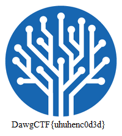

# Me Me

## Description

> You, you want to solve this?

Attached is a file without extension named `enc`.

## Solution

`file enc` tells us the file is simple ASCII text. Let's have a look at it with `cat enc`.

```
egin 664 uhuh
B5!.1PT*&@H````-24A$4@```,@```#?"`8```"SBYR]`````7-21T(`KLX<
Z0````1G04U!``"QCPO\804````)<$A9<P``$G0``!)T`=YF'W@``#DV241!
(a lot of similar lines)
!U5?Q<J1(TWD`LF1PP>Y0'+D\$$ND!PY?)`+)$<.'^0"R9'# file.

Let's look in detail at the specification. To encode a text from ASCII to uuencode:
- group bytes 3 by 3
- convert them to binary (24 bits)
- split those 24 bits into 4 groups of 6 bits each
- add 32 to each value
- output the ASCII of those numbers.

So 4 characters in uuencode correspond to 3 ASCII characters. Moreover, a line in uuencode is formatted as follow:

```
<length><formatted string><newline>
```

with `<length>` being a single character representing the length of the ASCII string, encoded as uuencode. 

In our file, each line except the last one is 60 charachters long, which corresponds to 45 ASCII characters. This corresponds to character `M` in ASCII (`45 + 32` is the ASCII code of `M`).

So we just need to add an M to each line of our file. We do this with a Python script, and then we manually change the first and last line (begin and end). 

Finally, we decode the file using Python:

```python
import uu
uu.decode('enc_filled', 'enc_decoded')
```

By using `file` on `enc_decoded`, we see this is a PNG file.



Flag: `DawgCTF{uhuhenc0d3d}`