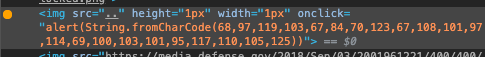

# Tracking

## Description

> What's that pixel tracking?
> 
> https://clearedge.ctf.umbccd.io/

## Solution

Looking at the Explorer, I see that there is an alert activated on click on one pixel. I click on the pixel to display the alert.

We could also just execute the jasascript, but clicking on one pixel it more fun!

Flag: `DawgCTF{ClearEdge_uni}`