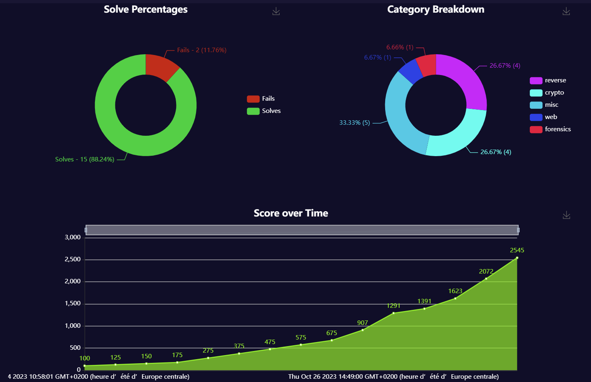

# ECW 2023

Challenge de qualification pour l'[European Cyber Week (ECW)](https://www.dghack.fr/).
Compétition effectuée en solo.
N'ayant découvert la compétition que les derniers jours, je n'ai pas eu le temps de tenter tous les challenges.

## Épreuves résolues

| Épreuve | Points | Catégorie |
|:-------:|:------:|:---------:|
| Jigsaw 1 to 3 | 75 | Misc |
| Fly Away | 100 | Misc |
| Babel | 100 | Misc |
| [DumpCyber](Forensics/DumpCyber.md) | 100 | Forensics |
| [Moth](Reverse/Moth.md) | 100 | Reverse |
| [Spaceships](Reverse/Spaceships.md) | 232 | Reverse |
| InteractiveReverse | 384 | Reverse |
| Kaleidoscope | 473 | Reverse |
| Madara | 100 | Web |
| Random_key | 100 | Crypto |
| BMPaaS | 100 | Crypto |
| CryptoFlow | 232 | Crypto |
| Straightline | 449 | Crypto |