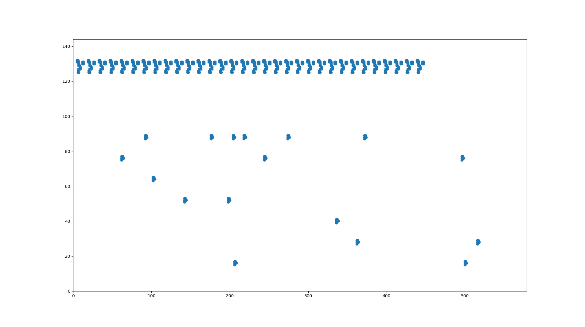
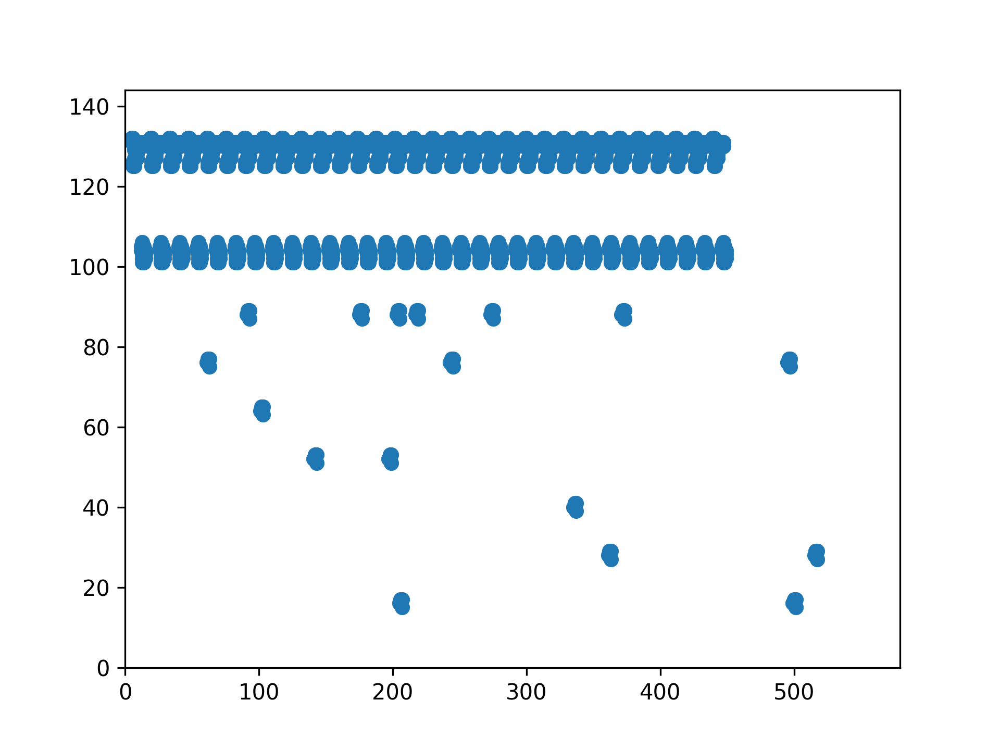

# Spaceships

> Everything that lives is designed to end.
>
> Attention all units: we have detected a rogue AI within one of our simulations. The machine possesses advanced capabilities and is rapidly adapting to our tactics. We need you to engage with the enemy and neutralize the threat using any means necessary. Prepare to deploy your most skilled operators on the battlefield. Remember, we are the last hope for humanity — failure is not an option.

## Description

We are given a binary to reverse. Let's open it with Ghidra.

As usual, I find the `main` function as the first argument of `__libc_start_main`, called in `entry`.
Here is the decompiled code for `main`:

```c
undefined8 main(int argc,char **argv)
{
  size_t sVar1;
  ulong uVar2;
  undefined8 uVar3;
  
  if ((argc == 2) && (sVar1 = strlen(argv[1]), sVar1 == 8)) {
    uVar2 = strtoul(argv[1],(char **)0x0,0x10);
    uVar3 = verify((uint)uVar2);
    if ((int)uVar3 != 0) {
      printf("Well done, you have successfully neutralized the enemy. Here is your flag: ECW{%08X}\ n"
             ,uVar2 & 0xffffffff);
      return 0;
    }
    puts("The enemy has managed to break through our systems... It\'s over...");
    return 1;
  }
  return 1;
}
```

We give the input on the command line, and it should be an integer written in hexadecimal, on four bytes.

Then, the function `verify` is called, and if it returns a non zero value, we have found the correct input.

Once again, I tried to give the program to `angr`, but without success, so I reversed the program manually.

## The verification function

The code for the verification function is quite straightforward:

```c
undefined8 verify(uint input)
{
  int iVar1;
  undefined8 ret;
  char local_15;
  int i;
  int j;
  int k;
  
  for (i = 0; i < 0x20; i = i + 1) {
    if ((input >> (0x1fU - (char)i & 0x1f) & 1) != 0) {
      init_array(&CHAR_00h_00104020,100,i * 0xe + 10);
    }
  }
  for (j = 0; j < 300; j = j + 1) {
    local_15 = iterate();
  }
  if (local_15 == '\0') {
    ret = 0;
  }
  else {
    for (k = 0; k < 0x20; k = k + 1) {
      iVar1 = FUN_0010134d(&CHAR_00h_00104020,0x7d,k * 0xe + 5,0x106910);
      if (iVar1 == 0) {
        return 0;
      }
    }
    ret = 1;
  }
  return ret;
}
```

I won't put the `init_array` function here, but what I understood from it is it fills `CHAR_00h_00104020` with pre-defined values.
The function is called depending on every bit of the input.

Then, the `iterate` function is called 300 times, and the last call to this function needs to return a non zero value.

### What does `iterate` do?

The function `iterate` is the following:

```c
undefined iterate(void)
{
  char cVar1;
  char cVar2;
  char local_ret;
  undefined ret;
  int n;
  int i;
  int delta_n;
  int delta_i;
  
  ret = 1;
  memcpy(&DAT_00106940,&CHAR_00h_00104020,0x28c8);
  n = 1;
  do {
    if (0x242 < n) {
      memcpy(&CHAR_00h_00104020,&DAT_00106940,0x28c8);
      return ret;
    }
    for (i = 1; i < 0x8f; i = i + 1) {
      cVar1 = get(&CHAR_00h_00104020,i,n);
      local_ret = '\0';
      for (delta_n = -1; delta_n < 2; delta_n = delta_n + 1) {
        for (delta_i = -1; delta_i < 2; delta_i = delta_i + 1) {
          if ((delta_i != 0) || (delta_n != 0)) {
            cVar2 = get(&CHAR_00h_00104020,delta_i + i,n + delta_n);
            local_ret = local_ret + cVar2;
          }
        }
      }
      if (cVar1 == '\0') {
        if (local_ret == '\x03') {
          if ((((i == 1) || (n == 1)) || (i == 0x8e)) || (n == 0x242)) {
            puts("Unexpected emergency... ordering the squadron to fall back at once");
                    /* WARNING: Subroutine does not return */
            exit(1);
          }
          set(&DAT_00106940,i,n);
          ret = 0;
        }
      }
      else if ((local_ret < '\x02') || ('\x03' < local_ret)) {
        set(&DAT_00106940,i,n);
        ret = 0;
      }
    }
    n = n + 1;
  } while( true );
}
```

Basically, it first makes a copy of `CHAR_00h_00104020` into another array, updates this array depending on the values.
I recognized the [game of life](https://en.wikipedia.org/wiki/Conway%27s_Game_of_Life), but it is not really necessary to understand the actual rules.

The function returns 1 only if the game is stationary (every cell is constant).

Thus, I tried to understand how the input changes the state of the system.

## Printing the game of life

To do so, I decided to visualize the board, with and without input.

To do so, I ran the program with `gdb`, examined the memory to get the contents of `CHAR_00h_00104020`, and be able to print it.

The following code extracts the contents of `CHAR_00h_00104020` from memory inside the first `iterate` function.

```python
from pwn import *

p = process("gdb ./spaceships", shell=True)

def gdb_interact(command):
    p.recvuntil(b"(gdb) ")
    p.sendline(command.encode())

gdb_interact("b * 0x00005555555554dc") # breakpoint at the return of the get function, which reads the cells.
gdb_interact("r ffffffff") # running the program, ffffffff means all ships, 00000000 means no ship.


matrix = [[0 for y in range(0x244)] for x in range(0x90)]

with open("spaceships.txt", "w") as f:
    for y in range(1,0x243):
        for x in range(1,0x8f):
            gdb_interact("p $eax")
            recvd = p.recvline().decode().strip()
            matrix[x][y] = int(recvd.split("= ")[1])
            f.write(f"{matrix[x][y]}")
            gdb_interact("c")
        f.write(f"\n")
```

With that, I have saved the initial array, both with and without ships.

I can print it with the following code:
```python
import matplotlib.pyplot as plt

def save_state(state, s):
    X = []
    Y = []
    for y in range(1,0x243):
        for x in range(1,0x8f):
            if state[x][y]:
                X.append(x)
                Y.append(y)
    plt.figure()
    plt.ylim((0,0x90))
    plt.xlim((0,0x243))
    plt.scatter(Y,X)
    plt.savefig(f"spaceships{s}.png", dpi=300)
```

Which gives me the following figures, first without spaceship, then with spaceships:





### Simulation

I reprogrammed the simulation in Python to print the state at diverse stages.

```python
def iterate(state):
    old_state = [[state[x][y] for y in range(0x244)] for x in range(0x90)]
    for y in range(1,0x243):
        for x in range(1,0x8f):
            neighbours = 0
            for deltay in range(-1,2):
                for deltax in range(-1,2):
                    if deltax != 0 or deltay != 0:
                        neighbours += old_state[x+deltax][y+deltay]
            if old_state[x][y] == 0 and neighbours == 3:
                state[x][y] = 1
            elif old_state[x][y] == 1 and (neighbours < 2 or neighbours > 3):
                state[x][y] = 0

for s in range(300):
    iterate(state)
    if s % 10 == 0:
        save_state(state, s)
```

This gives me the following animation:


So I see that some ships created by the input destroy enemy ships. The goal is to destroy all enemy ships, but without deploying too much ships. By looking at the animation, I can manually find which ships are needed, which gives me the flag.

Flag: `ECW{BADCE115}`