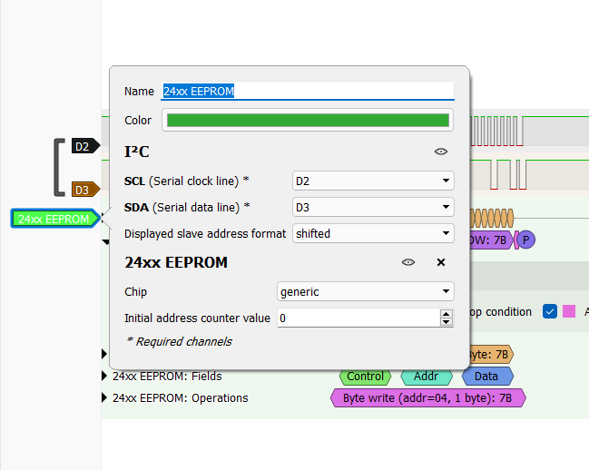

# I2CyouToo

> Un ami vous affirme qu'une EEPROM de 1024 bits branchée à son Arduino est une solution extrêmement sécurisée pour stocker ses secrets, vu que le protocole utilisé est "obfusqué" et "bas niveau" selon ses dires, "pas comme l'USB qui est hotplug et qu'on peut brancher directement sur n'importe quel OS !".
>
> Voulant le confronter à ses inepties, vous sortez votre analyseur logique pour sniffer la communication entre l'Arduino et l'EEPROM lorsqu'il tape son secret. Pourrez-vous remonter à ce dernier avec vos logiciels Sigrok et gtkwave ?

Attached is a .vcd file.

## Solution

With the title, we get a hint that we receive an I2C communication in an EEPROM.

I open the given file with [PulseView](https://sigrok.org/wiki/PulseView) (which is based on sigrok).

In the software, choose `Import Value Change Data Dump`.

Then add a protocol decoder I²C, and select 24xx EEPROM.



Right click on Operations: export all operations for this row.
We now have a file like this:

```
50149125-50451750 24xx EEPROM: Operations: Byte write (addr=00, 1 byte): 46
51491187-51793812 24xx EEPROM: Operations: Byte write (addr=01, 1 byte): 43
52833812-53136437 24xx EEPROM: Operations: Byte write (addr=02, 1 byte): 53
...
```

We can extract last bytes to get the flag.

Flag: `FCSC{MY-PRECIOUS-PLEASE-STAY-SECRET!}`