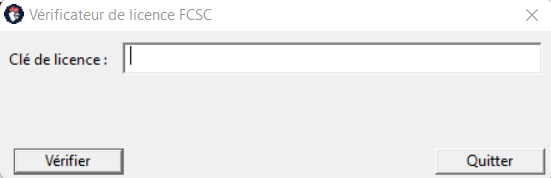
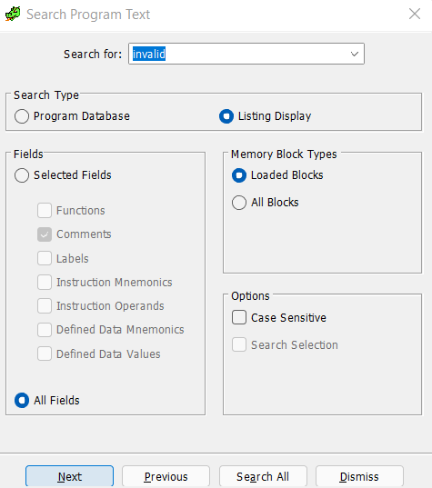
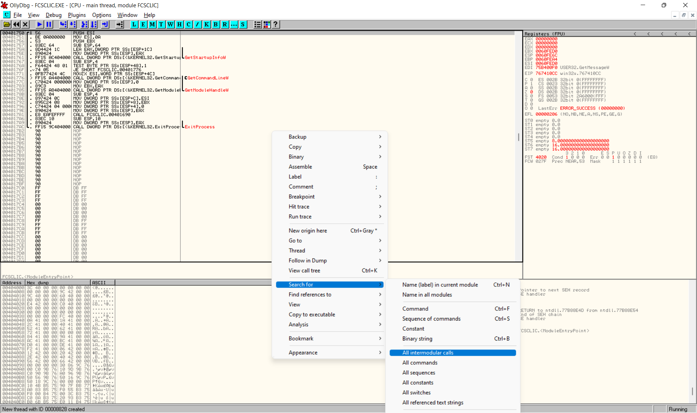
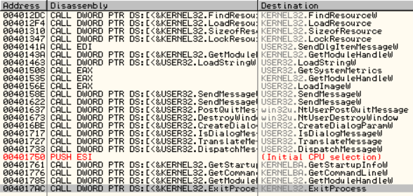
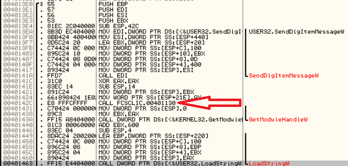

# Iconic License

> Pour pouvoir continuer à participer au FCSC il faut acheter une licence au prix modique de 1 Gogol€. Pourrez-vous trouver une licence valide ?

We are given a .exe file.

## Reverse engineering

Let's reverse the file with [Ghidra](https://ghidra-sre.org/).

As it is a Windows executable, I am using [OllyDbg](https://www.ollydbg.de/) for debugging it.

When I launch the program, I am greeted with the following screen asking me for the license.



### Finding the check input function

I can input some string, click `Vérifier` and a message appears "Clé de licence invalide". I look for it in Ghidra by doing `Search -> Program Text`.



I find the string, but there is no reference in the code calling to it.
Moreover, it is listed as a ressource string, so probably there is a Windows syscall loading the resource.

Let's try to find the resource loading. In OllyDbg, I open the program and right click on the code panel and choose `Search For -> All intermodular calls` to find when the invalid message is displayed.




Here it is: `LoadStringW`. Let's double click on it.



That's it, we see what we are looking for: our function at address 0x401130 is probably our checking function.

It is already tagged in Ghidra as a function so we can immediately see its dissasembled code.

### Reversing the function

Helped with OllyDbg to see which variable holds my input, I could rename some variables in the Ghidra disassembled code for readability.

The code first performs some checks on the input:

```c
do {
    local_30 = uVar8;
    uVar8 = local_30 + 1;
} while (my_input[local_30 + 1] != 0);
if (5 < local_30 + 1) {
    // Rest of the code
}
return false;
```

Above was the first check: my input needs to be more than 5 characters long.

```c
uVar8 = 0x26;
local_48 = 0;
puVar9 = my_input;
do {
    if (uVar8 != uVar2 - 0x20) {
        uVar2 = (uint)*puVar9;
        break;
    }
    puVar9 = puVar9 + 1;
    uVar2 = (uint)*puVar9;
    uVar8 = (uint)(ushort)L"#3#["[local_48];
    if (L"#3#["[local_48] == L'\0') {
        uVar8 = 0;
        break;
    }
    bVar10 = local_48 != 3;
    local_48 = local_48 + 1;
} while (bVar10 && *puVar9 != 0);
if ((uVar2 - 0x20 == uVar8) && (my_input[local_30] == 0x7d)) {
    // Rest of the code
}
return false;
```

Using the debugger, I was able to see the memory held into the `L"#3#["` buffer.
This portion of code basically checks that the input starts with `FCSC{` and ends with `}`.

We now get to the really interesting portion of the code:

```c

bool __cdecl FUN_00401130(ushort *my_input)

{
my_input_len = my_input_len - 5;
my_input = my_input + 5;
uVar8 = FUN_00401000((short **)&my_input,&my_input_len,0);
uVar2 = FUN_00401000((short **)&my_input,&my_input_len,0);
uVar3 = FUN_00401000((short **)&my_input,&my_input_len,0);
uVar4 = FUN_00401000((short **)&my_input,&my_input_len,0);
uVar5 = FUN_00401000((short **)&my_input,&my_input_len,1);
local_2c = uVar8 & 0xffffff | uVar2 << 0x18;
uStack40 = (undefined2)(uVar2 >> 8);
uStack38 = (undefined)uVar3;
uStack37 = (undefined)(uVar3 >> 8);
uStack36 = (undefined)(uVar3 >> 0x10);
uStack35 = (undefined)uVar4;
uStack34 = (undefined2)(uVar4 >> 8);
uStack32 = (undefined)uVar5;
uStack31 = (undefined2)(uVar5 >> 8);
bStack29 = (char)(uVar4 >> 0x18) * '\x02' | (byte)(((int)uVar3 >> 0x18) << 2) |
            (byte)(uVar5 >> 0x18) | (byte)(((int)uVar2 >> 0x18) << 3) |
            (byte)(((int)uVar8 >> 0x18) << 4) | (byte)(uVar8 << 5);
hResInfo = FindResourceW((HMODULE)0x0,(LPCWSTR)0x64,(LPCWSTR)0xe);
hResData = LoadResource((HMODULE)0x0,hResInfo);
DVar6 = SizeofResource((HMODULE)0x0,hResInfo);
if (0xf < DVar6) {
    pvVar7 = LockResource(hResData);
    uVar11 = psllw(0x8abc348ae21e167a,5);
    puVar1 = (ulonglong *)((DVar6 - 0x10) + (int)pvVar7);
    uVar11 = uVar11 ^ 0x8abc348ae21e167a ^ puVar1[1] ^
            CONCAT17(bStack29,CONCAT25(uStack31,CONCAT14(uStack32,CONCAT22(uStack34,CONCAT 11(
                                            uStack35,uStack36))))) |
            *puVar1 ^ uVar11 ^ 0x8abc348ae21e167a ^
            CONCAT17(uStack37,CONCAT16(uStack38,CONCAT24(uStack40,local_2c)));
    return ((uint)uVar11 | (uint)(uVar11 >> 0x20) |
            (int)uVar8 >> 0x1b |
            (int)uVar3 >> 0x1d | (int)uVar5 >> 0x1f | (int)uVar4 >> 0x1e | (int)uVar2 >> 0x1c  |
            local_30 << 5) == 0;
}
return false;
```

This code looks quite complex, but there are basically 2 phases:
- one phase when the function `FUN_00401000` is called 5 times
- the second phase when the outputs from those functions are combined to see if the flag is correct.

#### Reversing the helper function

Let's reverse the `FUN_00401000` function.

```c
uint __cdecl FUN_00401000(short **my_input,uint *my_input_len,int is_last)
{
  // local variables declarations

  if ((my_input != (short **)0x0) && (psVar5 = *my_input, psVar5 != (short *)0x0)) {
    uVar9 = (is_last == 0) + 5;
    uVar3 = *my_input_len;
    if (uVar9 <= uVar3) {
      sVar2 = *psVar5;
      psVar1 = psVar5 + 5;
      uVar8 = 0;
      do {
        uVar4 = sVar2 - 0x30;
        if ((short)uVar4 < 0) {
          return 0xffffffff;
        }
        if ((9 < (short)uVar4) && (uVar4 = sVar2 - 0x37, (short)uVar4 < 10)) {
          return 0xffffffff;
        }
        if (0x23 < (short)uVar4) {
          uVar4 = uVar4 - 0x20;
          if (0x23 < (short)uVar4) {
            return 0xffffffff;
          }
          if (uVar4 < 10) {
            return 0xffffffff;
          }
        }
        if ((short)uVar4 < 0x1f) {
          if (uVar4 == 0x1e) {
            return 0xffffffff;
          }
          if ((short)uVar4 < 0x19) {
            uVar7 = 0;
            if (uVar4 != 0x18) {
              if ((short)uVar4 < 0x16) {
                uVar7 = 1;
                if (uVar4 != 0x15) {
                  if ((short)uVar4 < 0x13) {
                    uVar7 = 1;
                    if (uVar4 != 0x12) {
                      uVar7 = (int)(short)uVar4;
                    }
                  }
                  else {
                    uVar7 = (uint)(ushort)(uVar4 - 1);
                  }
                }
              }
              else {
                uVar7 = (uint)(ushort)(uVar4 - 2);
              }
            }
            goto LAB_0040106d;
          }
          uVar8 = uVar8 << 5 | (uint)(ushort)(uVar4 - 3);
        }
        else {
          uVar7 = (uint)(ushort)(uVar4 - 4);
LAB_0040106d:
          uVar8 = uVar8 << 5 | uVar7;
        }
        if (psVar5 + 1 == psVar1) {
          psVar6 = psVar5 + 1;
          if ((is_last == 0) && (psVar6 = psVar5 + 2, *psVar1 != 0x2d)) {
            return 0xffffffff;
          }
          *my_input = psVar6;
          *my_input_len = uVar3 - uVar9;
          return uVar8;
        }
        psVar5 = psVar5 + 1;
        sVar2 = *psVar5;
      } while( true );
    }
  }
  return 0xffffffff;
}
```

First there is a check assessing that there are at least 6 characters left (5 if `is_last` is true).
Then for every character, the code checks that the character is either a number or a letter, convert it to uppercase if it is a lowercase.
It then converts the ASCII code into its position in the string `0123456789ABCDEFGHIJKLMNOPQRSTUVWXYZ` (meaning 0 is encoded as 0, 7 as 7, A as 0xa, G as 0x10, ...).

Finally, the 5 first characters are accumulated into `uVar8` in some way. The 6th character needs to be a dash.

What we learned here is that:
- our licence code is of the form `FCSC{XXXXX-XXXXX-XXXXX-XXXXX-XXXXX}` where `X` are alphanumeric characters.
- the check function converts each group of 5 characters into an integer.

I converted the C conversion function into Python for later usage:

```python
def compute_next(c):
    ret = 0
    for i in range(5):
        if c[i] < 0x1f:
            if c[i] == 0x1e:
                print("ERROR U")
                exit()
            if c[i] < 0x19:
                uvar2 = 0
                if c[i] != 0x18:
                    if c[i] < 0x16:
                        uvar2 = 1
                        if c[i] != 0x15:
                            if c[i] < 0x13:
                                uvar2 = 1
                                if c[i] != 0x12:
                                    uvar2 = c[i]
                            else:
                                uvar2 = c[i] - 1
                    else:
                        uvar2 = c[i] - 2
                ret = ret << 5 | uvar2
            else:
                ret = ret << 5 | (c[i] - 3)
        else:
            uvar2 = c[i] - 4
            ret = ret << 5 | uvar2
    return ret
```

#### Combining the results from the function

After calling the helper function 5 times, the results are put on the stack.

Let's call `a` the integer retrieved for the first group of 5 characters, `b` for the second, etc.

We also write `a = (a3 | a2 | a1 | a0)` with `ai` the i-th byte of `a`.

Then in the stack, `local_2c` will be the array:

```
local_2c = (e2 | e1 | e0 | d2 | d1 | d0 | ... | a2 | a1 | a0)
```

Basically, the important part of the return statement is that `uVar11` needs to be 0.

Moreover, `uVar11` is computed as:

```
uVar11 = psllw(0x8abc348ae21e167a,5) ^ 0x8abc348ae21e167a ^ puVar1[1] ^ concat1 | psllw(0x8abc348ae21e167a,5) ^ 0x8abc348ae21e167a ^ puVar1[0] ^ concat0
```

We need `uVar11` to be 0, so both members of the OR need to be 0.

Using Olly, we can retrieve the constant values of `puVar1`.
Use F2 to introduce a breakpoint, F8 to advance without entering functions (F7 to enter functions).
Also, here I needed to right click on the register window to see MMX registers.

The concat numbers are formed as follows:

```
concat1 = (D | e2 | e1 | e0 | d2 | d1 | d0 | c2)
concat2 = (c1 | c0 | b2 | b1 | b0 | a2 | a1 | a0)
```

with bit 0 if D being bit 0 of a3, bit 1 being bit 0 of b3, ...

## Finding the flag

Knowing this, I can now extract the target values:

```python
uvar8 = 0x5780914043C0CF40 # psllw(0x8abc348ae21e167a,5)
zerox = 0x8abc348ae21e167a
puVar = [0x8DB02AEC536F789E, 0x5E1D444098023476]

print(hex(uvar8 ^ zerox ^ puVar[0]))
print(hex(uvar8 ^ zerox ^ puVar[1]))
```

This yields to me that I need to find:

```python
a = 0xb1a1a4
b = 0x8f26f2
c = 0x4c508c
d = 0x139dced
e = 0x121e18a
```

I finally brute force the helper function to get the correct groups of 5 characters:

```python
import itertools
alphabet = "0123456789ABCDEFGHIJKLMNOPQRSTUVWXYZ"

def to_string(t):
    return "".join([alphabet[x] for x in t])

for a in itertools.product(list(range(len(alphabet))), repeat=5):
    if 0x1e in a:
        continue
    s = compute_next(a)
    if s == 0xb1a1a4 or s == 0x8f26f2 or s == 0x4c508c or s == 0x139dced or s == 0x121e18e:
        print(hex(s), to_string(a))
```

Flag: `FCSC{B38D4-8Y9QJ-4RM4C-KKQ7D-J3RCA}`