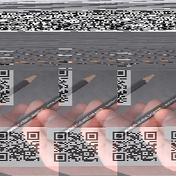

# Satan's Jigsaw

## Description

> Oh no! I dropped my pixels on the floor and they're all muddled up! It's going to take me years to sort all 90,000 of these again :(

Attached is a huge zip file which take ~ 30 min to decompress...

## Solution

In the zip file, there are 90,000 images named `n.jpg` with `n` being a random number. Every image contains only 1 pixel. By opening a few of them, we see that they have different colors. As the title hints for a jigsaw, let's reconstruct a 300x300 image with all those pixels in the order given by their file name.

```python
from PIL import Image
import os
import numpy as np

docs = os.listdir("jigsaw/chall")
doc_ints = [int(x.split(".")[0]) for x in docs]
doc_ints.sort()

i = 0
j = 0
image = [[None for k in range(300)] for l in range(300)]
for d in doc_ints:
    image[i][j] = Image.open("jigsaw/chall/{}.jpg".format(d)).load()[0,0]
    j += 1
    if j == 300:
        i += 1
        j = 0

image = np.array(image, dtype=np.uint8)

new_image = Image.fromarray(image)
new_image.save("jigsaw.png")
```

Yeah we get back an image that makes sense!



We scan the QR code and get back our flag.

Flag: `rtcp{d1d-you_d0_7his_by_h4nd?}`
